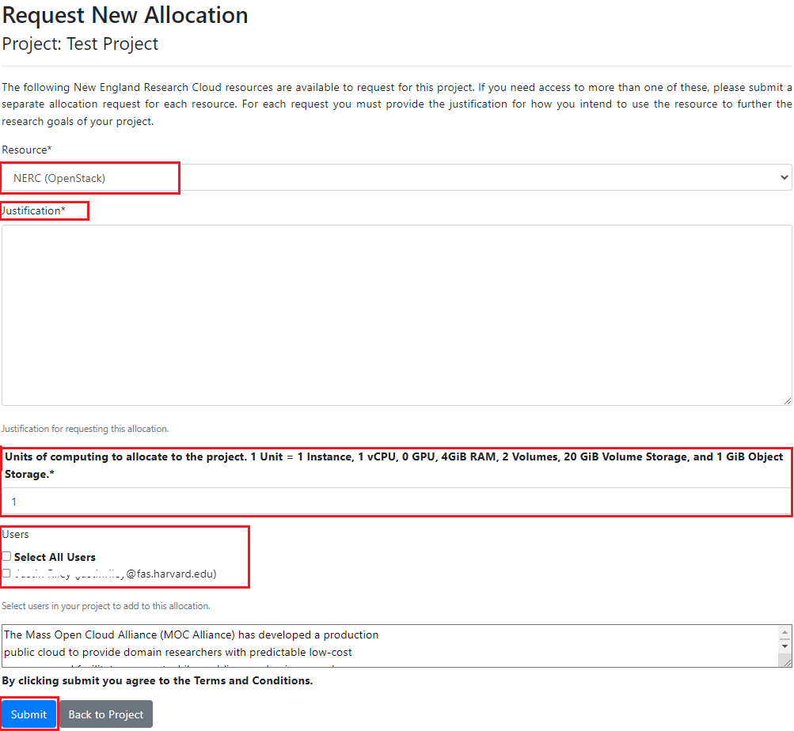
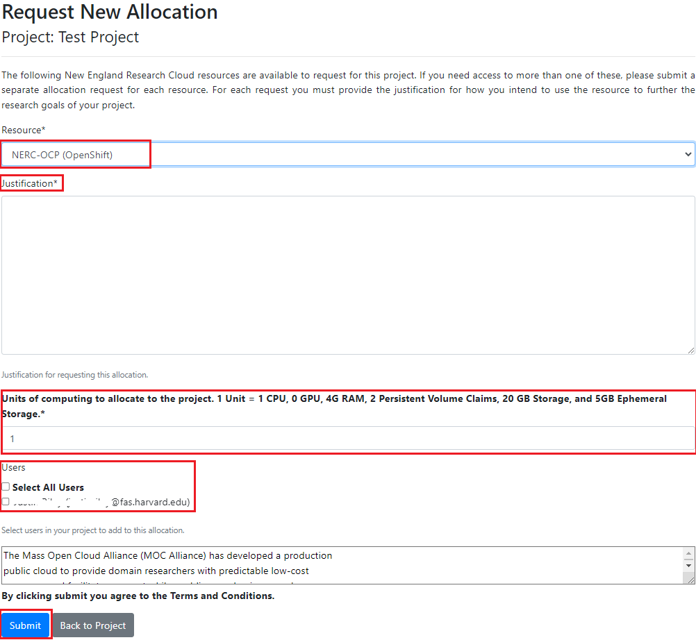

# Adding a new Resource Allocation to the project

If one resource allocation is not sufficient for a project, PI or project managers
can request for another allocation(s) by clicking on the "Request Resource Allocation"
button on the Allocations section of the project details. This will show the page
where all existing users for the project will be listed on the bottom of the request
form. PIs can select desired user(s) to request the resource allocations to be
available on NERC's OpenStack or OpenShift projects.

## Adding a new Resource Allocation to your OpenStack project

## Adding a new Resource Allocation to your OpenShift project

---
