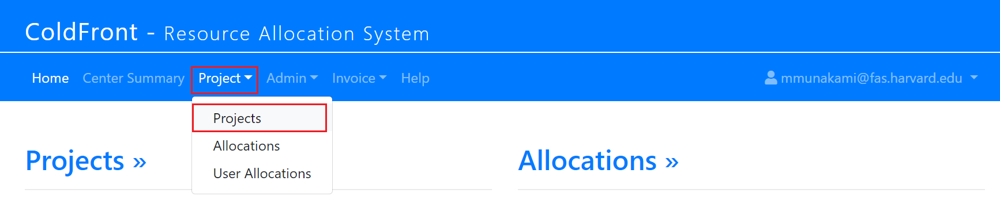
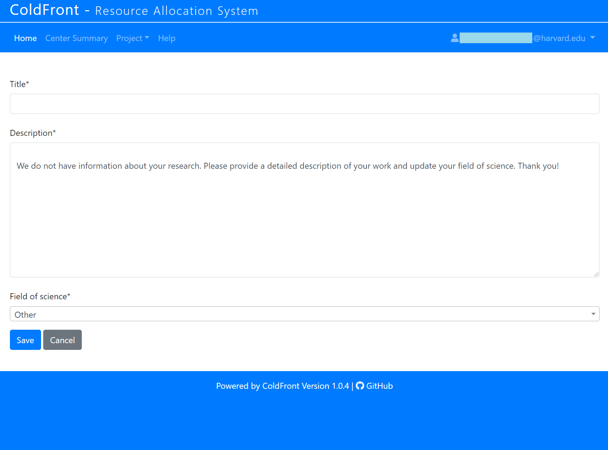

# A New Project Creation Process

## What PIs need to fill in order to request a Project?

Once logged in to NERC's ColdFront, PIs can choose Projects sub-menu located under
the Project menu.

Clicking on the "Add a project" button will show the interface below:

!!! danger "Very Important: Project Title Length Limitation"

    Please ensure that the project title is both concise and does not exceed a
    length of **63 characters**.

PIs need to specify an appropriate title (**less than 63 characters**), description
of their research work that will be performed on the NERC (in one or two paragraphs),
the field(s) of science or research domain(s), and then click the "Save" button.
Once saved successfully, PIs effectively become the "manager" of the project, and
are free to add or remove users and also request resource allocation(s) to any Projects
for which they are the PI. PIs are permitted to add users to their group, request
new allocations, renew expiring allocations, and provide information such as
publications and grant data. PIs can maintain all their research information under
one project or, if they require, they can separate the work into multiple projects.

---
