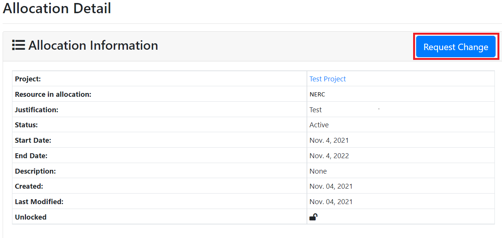
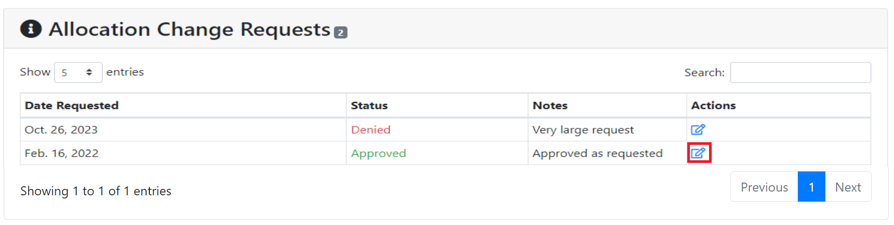
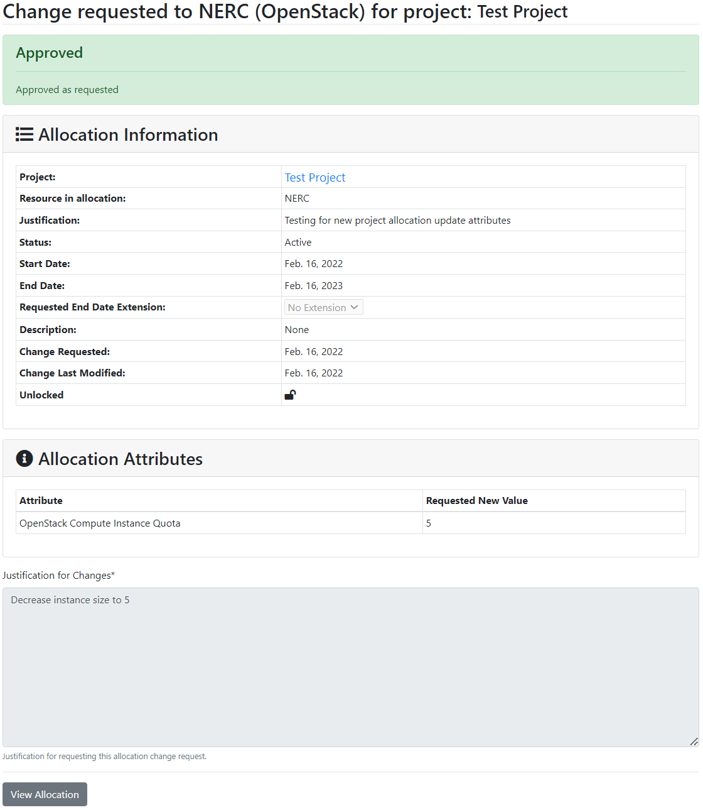
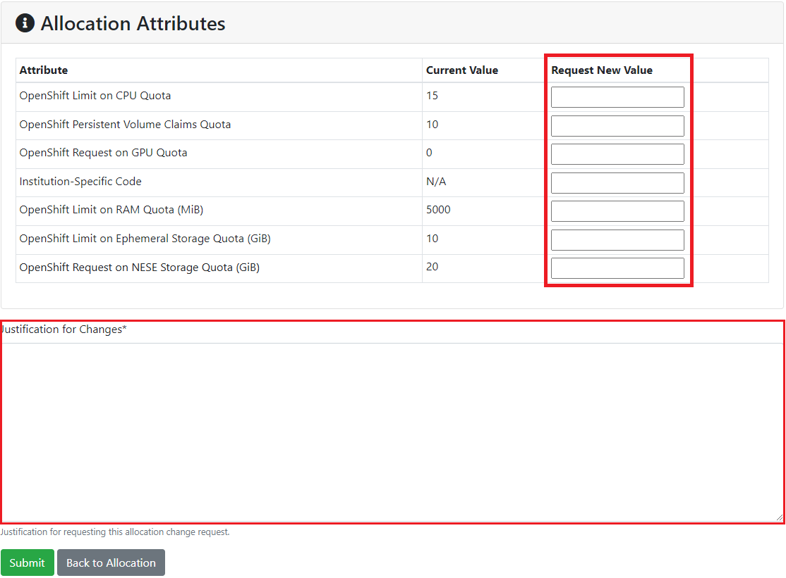
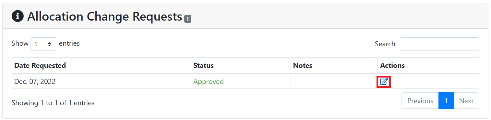
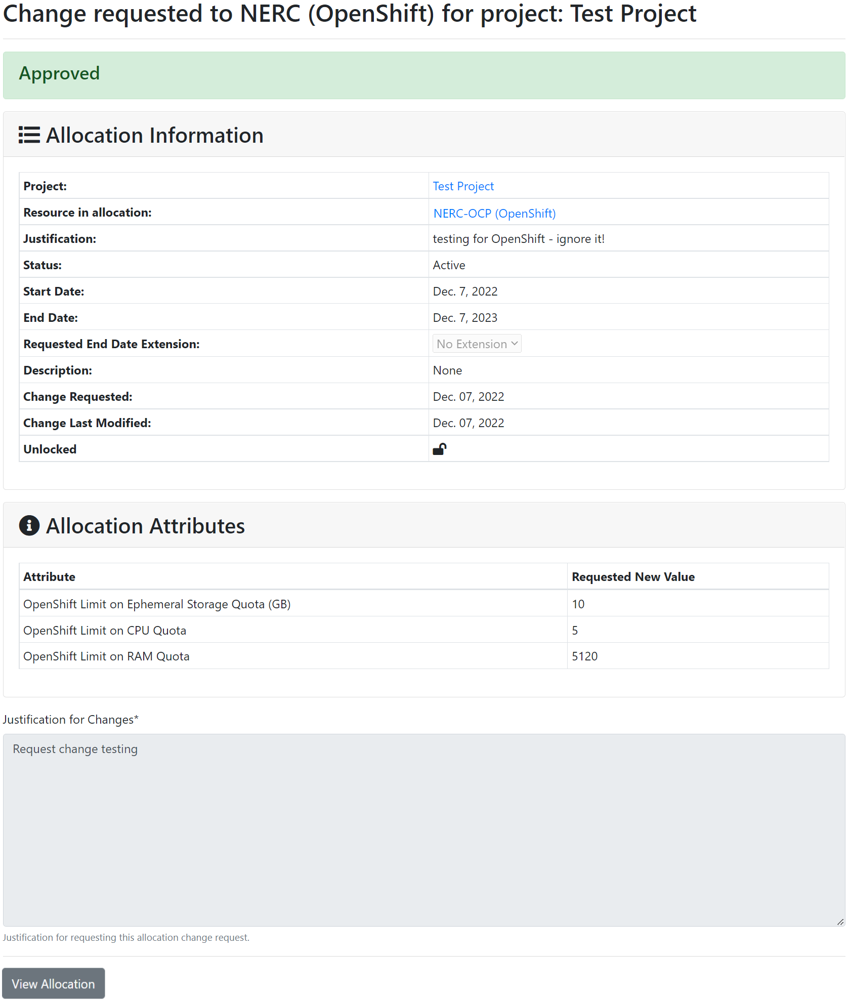

# Request change to Resource Allocation to an existing project

If past resource allocation is not sufficient for an existing project, PIs or project
managers can request a change by clicking "Request Change" button on project
resource allocation detail page as show below:

## Request Change Resource Allocation Attributes for OpenStack Project

This will bring up the detailed Quota attributes for that project as shown below:

!!! warning "Important: Requested/Approved Allocated OpenStack Storage Quota & Cost"

    For **NERC (OpenStack)** resource types, the **Storage quotas** are controlled
    by the values of the "OpenStack Volume Quota (GiB)" and "OpenStack Swift Quota
    (GiB)" quota attributes. The **Storage cost** is determined by [your requested
    and approved allocation values](allocation-details.md#pi-and-manager-allocation-view-of-openstack-resource-allocation)
    for these quota attributes. If you have common questions or need more information,
    refer to our [Billing FAQs](../../get-started/cost-billing/billing-faqs.md)
    for comprehensive answers.

PI or project managers can provide a new value for the individual quota attributes,
and give justification for the requested changes so that the NERC admin can review
the change request and approve or deny based on justification and quota change request.
Then submitting the change request, this will notify the NERC admin about it. Please
wait untill the NERC admin approves/ deny the change request to see the change on
your resource allocation for the selected project.

!!! tip "Important Information"

    PI or project managers can put the new values on the textboxes for **ONLY**
    quota attributes they want to change others they can be left **blank** so those
    quotas will not get changed!

    To use GPU resources on your VM, you need to specify the number of GPUs in the
    "OpenStack GPU Quota" attribute. Additionally, ensure that your other quota
    attributes, namely "OpenStack Compute vCPU Quota" and "OpenStack Compute RAM
    Quota (MiB)" have sufficient resources to meet the **vCPU** and **RAM** requirements
    for one of the GPU tier-based flavors. Refer to the [GPU Tier documentation](../../openstack/create-and-connect-to-the-VM/flavors.md#3-gpu-tier)
    for specific requirements and further details on the flavors available for GPU
    usage.

### Allocation Change Requests for OpenStack Project

Once the request is processed by the NERC admin, any user can view that request
change trails for the project by looking at the "Allocation Change Requests"
section that looks like below:

Any user can click on Action button to view the details about the change request.
This will show more details about the change request as shown below:

### How to Use GPU Resources in your OpenStack Project

!!! tip "Comparison Between CPU and GPU"

    To learn more about the key differences between CPUs and GPUs, please [read this](../../openstack/create-and-connect-to-the-VM/flavors.md#comparison-between-cpu-and-gpu).

A GPU instance is launched in the [same way](../../openstack/create-and-connect-to-the-VM/launch-a-VM.md)
as any other compute instance, with a few considerations to keep in mind:

1.  When launching a GPU based instance, be sure to select one of the
    [GPU Tier](../../openstack/create-and-connect-to-the-VM/flavors.md#3-gpu-tier)
    based flavor.

2.  You need to have sufficient resource quota to launch the desired flavor. Always
    ensure you know which GPU-based flavor you want to use, then submit an
    [allocation change request](#request-change-resource-allocation-attributes-for-openstack-project)
    to adjust your current allocation to fit the flavor's resource requirements.

    !!! tip "Resource Required for Launching a VM with "NVIDIA A100 SXM4 40GB" Flavor."

        Based on the [GPU Tier documentation](../../openstack/create-and-connect-to-the-VM/flavors.md#i-nvidia-a100-sxm4-40gb),
        NERC provides two variations of NVIDIA A100 SXM4 40GB flavors:

        1. **`gpu-su-a100sxm4.1`**: Includes 1 NVIDIA A100 GPU
        2. **`gpu-su-a100sxm4.2`**: Includes 2 NVIDIA A100 GPUs

        You should select the flavor that best fits your resource needs and ensure your
        OpenStack quotas are appropriately configured for the chosen flavor. To use
        a GPU-based VM flavor, choose the one that best fits your resource needs and
        make sure your OpenStack quotas meet the required specifications:

        - For the **`gpu-su-a100sxm4.1`** flavor:
            - **vCPU**: 32
            - **RAM (GiB)**: 240

        - For the **`gpu-su-a100sxm4.2`** flavor:
            - **vCPU**: 64
            - **RAM (GiB)**: 480

        Ensure that your OpenStack resource quotas are configured as follows:

        - **OpenStack GPU Quota**: Meets or exceeds the number of GPUs required by the
          chosen flavor.
        - **OpenStack Compute vCPU Quota**: Meets or exceeds the vCPU requirement.
        - **OpenStack Compute RAM Quota (MiB)**: Meets or exceeds the RAM requirement.

        Properly configure these quotas to successfully launch a VM with the selected
        "gpu-su-a100sxm4" flavor.

3.  We recommend using [ubuntu-22.04-x86_64](../../openstack/create-and-connect-to-the-VM/images.md#nerc-images-list)
    as the image for your GPU-based instance because we have tested the NVIDIA driver
    with this image and obtained good results. That said, it is possible to run a
    variety of other images as well.

## Request Change Resource Allocation Attributes for OpenShift Project

!!! warning "Important: Requested/Approved Allocated OpenShift Storage Quota & Cost"

    For **NERC-OCP (OpenShift)** resource types, the **Storage quotas** are controlled
    by the values of the "OpenShift Request on Storage Quota (GiB)" and "OpenShift
    Limit on Ephemeral Storage Quota (GiB)" quota attributes. The **Storage cost**
    is determined by [your requested and approved allocation values](allocation-details.md#pi-and-manager-allocation-view-of-openshift-resource-allocation)
    for these quota attributes.

PI or project managers can provide a new value for the individual quota attributes,
and give justification for the requested changes so that the NERC admin can review
the change request and approve or deny based on justification and quota change request.
Then submitting the change request, this will notify the NERC admin about it. Please
wait untill the NERC admin approves/ deny the change request to see the change on
your resource allocation for the selected project.

!!! tip "Important Information"

    PI or project managers can put the new values on the textboxes for **ONLY**
    quota attributes they want to change others they can be left **blank** so those
    quotas will not get changed!

    In order to use GPU resources on your pod, you must specify the number of GPUs
    you want to use in the "OpenShift Request on GPU Quota" attribute.

### Allocation Change Requests for OpenShift Project

Once the request is processed by the NERC admin, any user can view that request
change trails for the project by looking at the "Allocation Change Requests"
section that looks like below:

Any user can click on Action button to view the details about the change request.
This will show more details about the change request as shown below:

### How to Use GPU Resources in your OpenShift Project

!!! tip "Comparison Between CPU and GPU"

    To learn more about the key differences between CPUs and GPUs, please [read this](../../openstack/create-and-connect-to-the-VM/flavors.md#comparison-between-cpu-and-gpu).

For OpenShift pods, we can specify different types of GPUs. Since OpenShift is not
based on flavors, we can customize the resources as needed at the pod level while
still utilizing GPU resources.

You can read about how to specify a pod to use a GPU [here](../../openshift/applications/scaling-and-performance-guide.md#how-to-specify-pod-to-use-gpu).

Also, you will be able to select a different GPU device for your workload, as
explained [here](../../openshift/applications/scaling-and-performance-guide.md#how-to-select-a-different-gpu-device).

---
