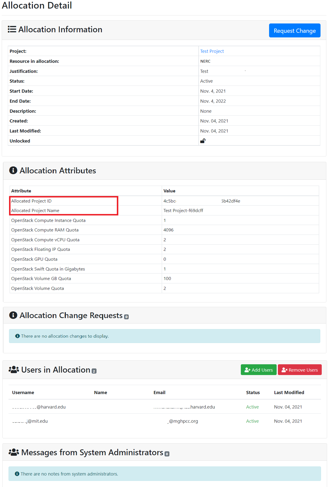
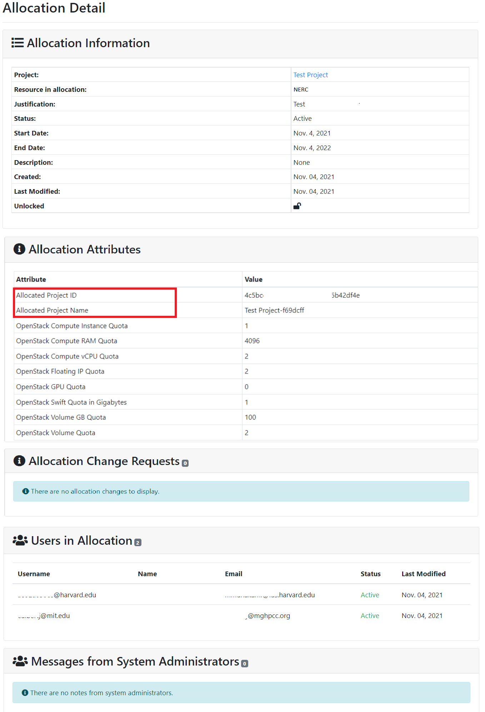
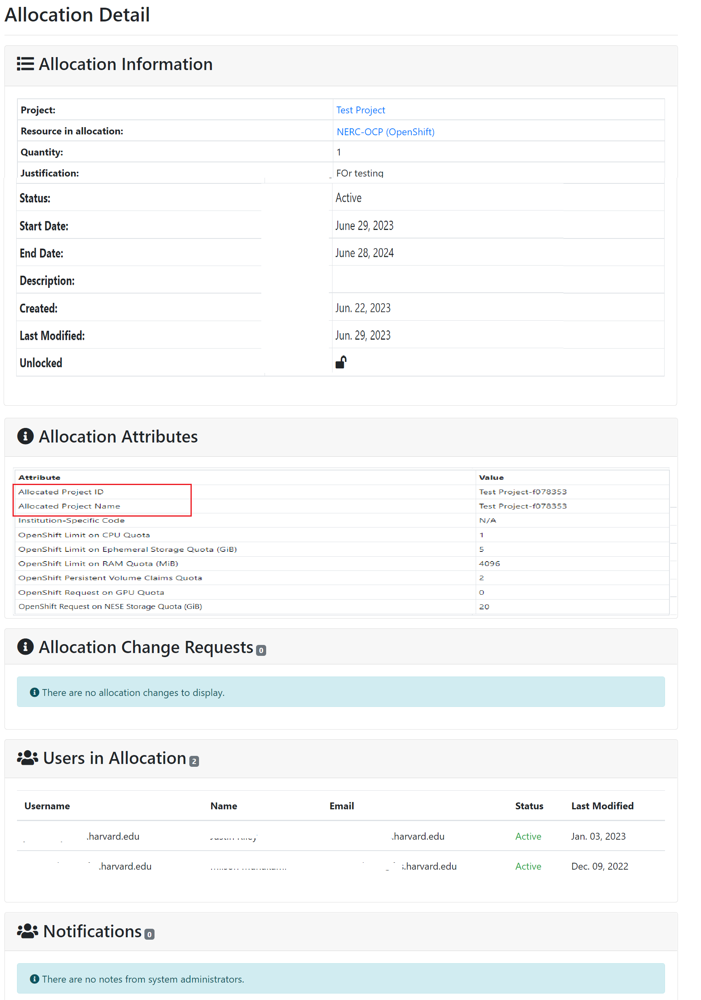

# Allocation details

Access to ColdFront's allocations details is based on [user roles](manage-users-to-a-project.md#user-roles).
PIs and managers see the same allocation details as users, and can also add
project users to the allocation, if they're not already on it, and remove users
from an allocation.

## How to View Resource Allocation Details in the Project

A single project can have multiple allocations. To view details about a specific
resource allocation, click on any of the available allocations in the Allocations
section of the project details. Here, you can view the Resource Type, information
about your Allocated Project, status, End Date of the allocation, and Actions
button or any pending actions as shown below:

Clicking the Action icon for the corresponding allocation will open a page
displaying detailed information about that allocation.

## How to find ID of the Resource Allocation

After clicking the Action button for the corresponding allocation, you will be
redirected to a new allocation detail page. The web browser will display the URL
in the following format:

    https://coldfront.mss.mghpcc.org/allocation/<Allocation_ID>/

To find the ID of the resource allocation, observe the URL and note the
`<Allocation_ID>` part. For example, in the URL `https://coldfront.mss.mghpcc.org/allocation/1/`,
the resource **Allocation ID** is 1.

## PI and Manager View

PIs and managers can view important details of the project and underlying
allocations. It shows all allocations including start and end dates, creation
and last modified dates, users on the allocation and public allocation attributes.
PIs and managers can add or remove users from allocations.

### PI and Manager Allocation View of OpenStack Resource Allocation

### PI and Manager Allocation View of OpenShift Resource Allocation

## General User View

General Users who are not PIs or Managers on a project see a read-only view of the
allocation details. If a user is on a project but not a particular allocation, they
will not be able to see the allocation in the Project view nor will they be able
to access the Allocation detail page.

### General User View of OpenStack Resource Allocation

### General User View of OpenShift Resource Allocation

---
