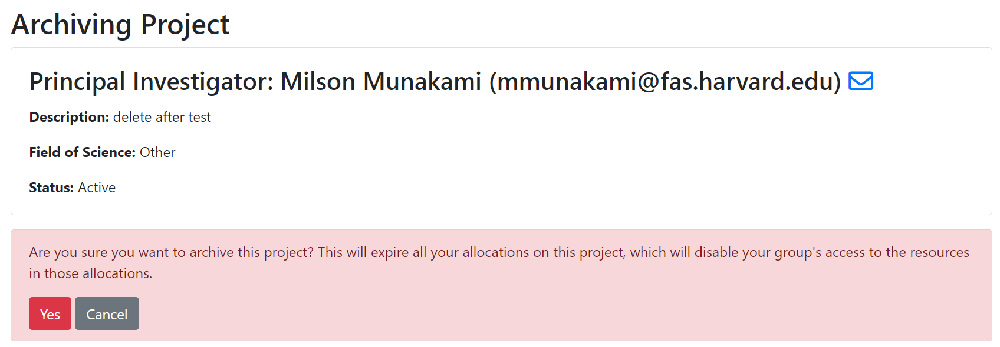

# Archiving an Existing Project

Only a **PI** can archive [their ColdFront project(s)](https://coldfront.mss.mghpcc.org/project/)
by accessing [NERC's ColdFront interface](https://coldfront.mss.mghpcc.org/).

!!! danger "Important Note: "
    If you archive a project then this will expire all your allocations on that
    project, which will disable your group's access to the resources in those
    allocations. Also, you cannot make any changes to archived projects.
    

Once archived it is no longer visible on [your projects list](https://coldfront.mss.mghpcc.org/project/).
All archived projects will be listed under 
by clicking "View archived projects" button as shown below:

All your archived projects are displayed here:

---
