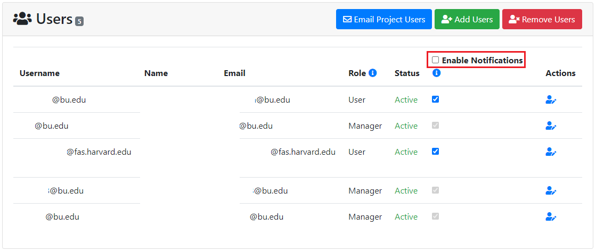

# Managing Users in the Project

A user can only view projects they are on. PIs or managers can add or remove users
from their respective projects by navigating to the Users section of the project.

Once we click on the "Add Users" button, it will show us the following search interface:

!!! info "Searching multiple users at once!"
    If you want to simultaneously search for multiple users in the system, you
    can input multiple usernames **separated by space or newline**, as shown below:
    
    **NOTE:** This will return a list of all users matching those provided usernames
    only if they exist.

They can search for any users in the system that are not already part of the project
by providing exact matched username or partial text of other multiple fields. The
search results show details about the user account such as email address, username,
first name, last name etc. as shown below:

!!! warning "Delegating user as 'Manager'"
    When adding a user to your project you can optionally designate them as a
    "Manager" by selecting their role using the drop down next to their email.
    Read more about user roles
    [here](#user-roles).

Thus, found user(s) can be selected and assigned directly to the available resource
allocation(s) on the given project using this interface. While adding the users,
their Role also can be selected from the dropdown options as either User or Manager.
Once confirmed with selection of user(s) their roles and allocations, click on the
"Add Selected Users to Project" button.

Removing Users from the Project is straightforward by just clicking on the
"Remove Users" button. Then it shows the following interface:

PI or project managers can select the user(s) and then click on the "Remove Selected
Users From Project" button.

## User Roles

Access to ColdFront is role based so users see a read-only view of the allocation
details for any allocations they are on. PIs see the same allocation details as general
users and can also add project users to the allocation if they're not already on
it. Even on the first time, PIs add any user to the project as the User role. Later
PI or project managers can delegate users on their project to the 'manager' role.
This allows multiple managers on the same project. This provides the user with the
same access and abilities as the PI. A "Manager" is a user who has the same
permissions as the PI to add/remove users, request/renew allocations,
add/remove project info such as grants, publications, and research output.
Managers may also complete the annual project review.

!!! info "What can a PI do that a manager can't?"
    The only tasks a PI can do that a manager can't is create a new project or
    archive any existing project(s). All other project-related actions that a PI
    can perform can also be accomplished by any one of the managers assigned to
    that project.

General User Accounts are not able to create/update projects and request Resource
Allocations. Instead, these accounts must be associated with a Project that has
Resources. General User accounts that are associated with a Project have access
to view their project details and use all the resources associated with the Project
on NERC.

General Users (not PIs or Managers) can turn off email notifications at the project
level. PIs also have the 'manager' status on a project. Managers can't turn off their
notifications. This ensures they continue to get allocation expiration notification
emails.

### Delegating User to Manager Role

You can also modify a [users role](#user-roles) of existing project users at any
time by clicking on the Edit button next to the user's name.

To change a user's role to 'manager' click on the edit icon next to the user's name
on the Project Detail page:

Then toggle the "Role" from User to Manager:

!!! warning "Very Important"
    Make sure to click the "Update" button to save the change.

    This delegation of "Manager" role can be done when adding a user to your project.
    You can optionally designate them as a "Manager" by selecting their role using
    the drop down next to their email as described [here](#adding-and-removing-user-from-the-project).

## Notifications

All users on a project will receive notifications about allocations including
reminders of upcoming expiration dates and status changes. Users may uncheck
the box next to their username to turn off notifications. Managers and PIs on
the project are not able to turn off notifications.

---
