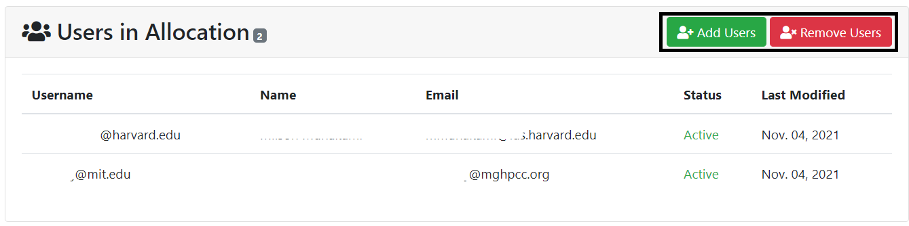

# Adding and removing project Users to project Resource Allocation

Any available users who were not added previously on a given project can be added
to resource allocation by clicking on the "Add Users" button, as shown below:

Once Clicked it will show the following interface where PIs can select the available
user(s) on the checkboxes and click on the "Add Selected Users to Allocation" button.

!!! warning "Very Important"

    The desired user must already be on the project to be added to the allocation.

Removing Users from the Resource Allocation is straightforward by just clicking on
the "Remove Users" button. Then it shows the following interface:

PI or project managers can select the user(s) on the checkboxes and then click on
the "Remove Selected Users From Project" button.

---
