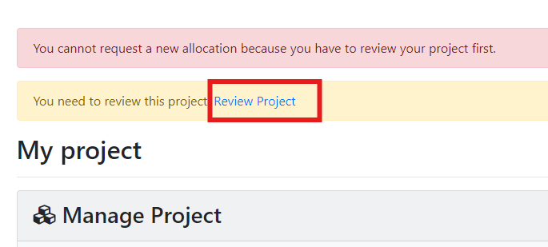
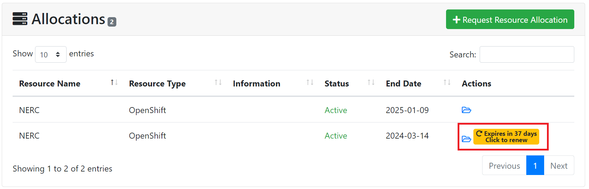
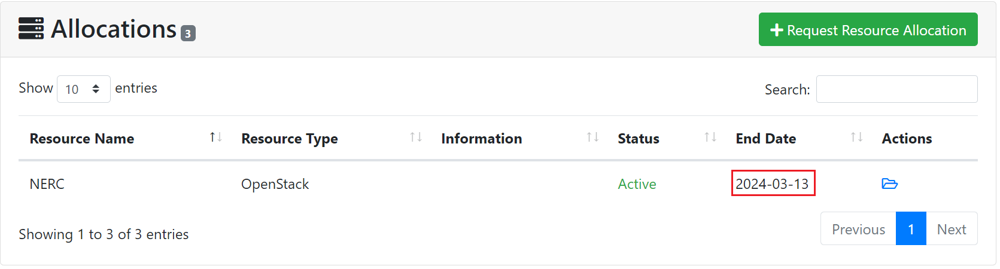

# Project and Individual Allocation Annual Review Process

## Project Annual Review Process

NERC's ColdFront allows annual project reviews for NERC admins by mandating PIs
to assess and update their projects. With the Project Review feature activated,
each project undergoes a mandatory review every 365 days. During this process,
PIs update project details, confirm project members, and input publications,
grants, and research outcomes from the preceding year.

!!! danger "Required Project Review"

    The PI or any manager(s) of a project must complete the project review once
    every 365 days. ColdFront does not send notifications to PIs when project reviews
    are due. Instead, when the PI or Manager(s) of a project views their project
    they will find the notification that the project review is due. Additionally,
    when the project review is pending, PIs or Project Manager(s) cannot request
    new allocations or renew expiring allocations or change request to update the
    allocated allocation attributes' values. This is to enforce PIs need to
    review their projects annually. The PI or any managers on the project are
    able to complete the project review process.

### Project Reviews by PIs or Project Manager(s)

When a PI or any Project Manager(s) of a project logs into NERC's ColdFront web
console and their project review is due, they will see a banner next to the
project name on the home page:

If they try to request a new allocation or renew an expiring allocation or change
request to update the allocated allocation attributes' values, they will get an
error message:

### Project Review Steps

When they click on the "Review Project" link they're presented with the requirements
and a description of why we're asking for this update:

The links in each step direct them to different parts of their Project Detail page.
This review page lists the dates when grants and publications were last updated.
If there are no grant or publications or at least one of them hasn't been udpated
in the last year, we ask for a reason they're not updating the project information.
This helps encourage PIs to provide updates if they have them. If not, they
provide a reason and this is displayed for the NERC admins as part of the review
process.

Once the project review page is completed, the PI is redirected to the project
detail page and they see the status change to "project review pending".

## Allocation Renewals

When the requested allocation is approved, it must have an expiration date - which
is normally 365 days or 1 year from the date it is approved. Automated emails are
triggered to all users on an allocation when the expiration date is 60 days away,
30 days, 7 days, and then expired, unless the user turns off notifications on the
project.

!!! danger "Very Important: Urgent Allocation Renewal is Required Before Expiration"

    If the allocation renewal isn't processed prior to the original allocation
    expiration date by the PI or Manager, the allocation will expire and the
    allocation users will get a notification email letting them know the allocation
    has expired!

    

    Currently, a project will continue to be able to utilize **expired** allocations.
    So this will continue to incur **costs** for you.

Allocation renewals may not require any additions or changes to the allocation
attributes from the PI or Manager. By default, if the PI or Manager clicks on
the 'Activate' button as shown below:

Then it will prompt for confirmation and allow the admin to review and submit the
activation request by clicking on 'Submit' button as shown below:

Emails are sent to all allocation users letting them know the renewal request has
been submitted.

Then the allocation status will change to "Renewal Requested" as shown below:

Once the renewal request is reviewed and approved by NERC admins, it will change
into "Active" status and the expiration date is set to another 365 days as shown
below:

Then an automated email notification will be sent to the PI and all users on the
allocation that have enabled email notifications.

## Cost Associated with Expired Allocations

Currently, a project will continue to be able to utilize **expired** allocations.
So this will continue to incur **costs** for you. In the future, we plan to change
this behavior so expired allocations will result in its associated VMs/pods not
to start and possibly having associated active VMs/pods to cease running.

---
