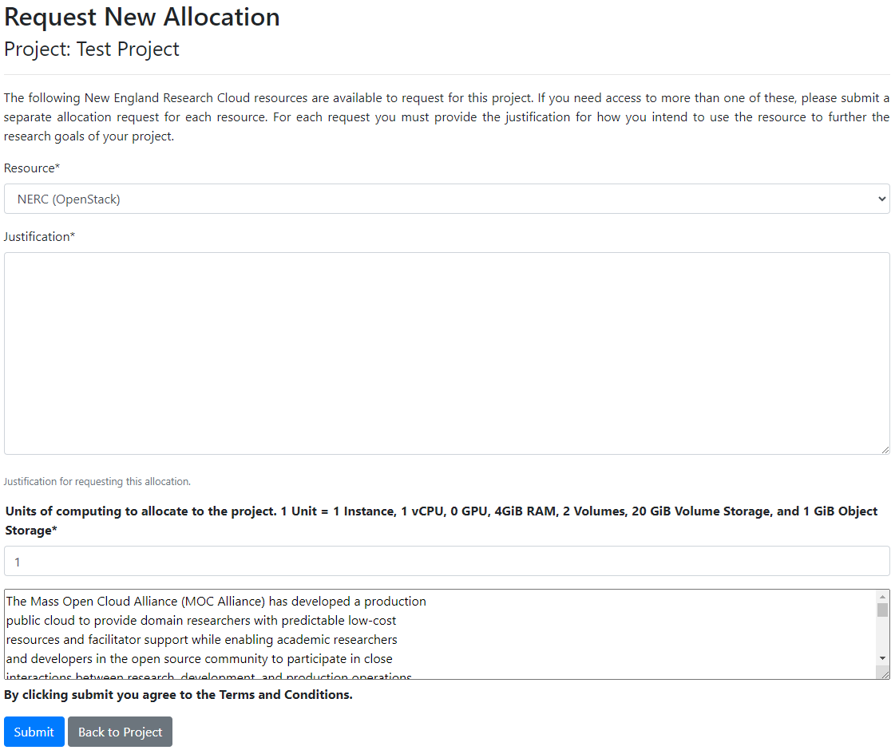
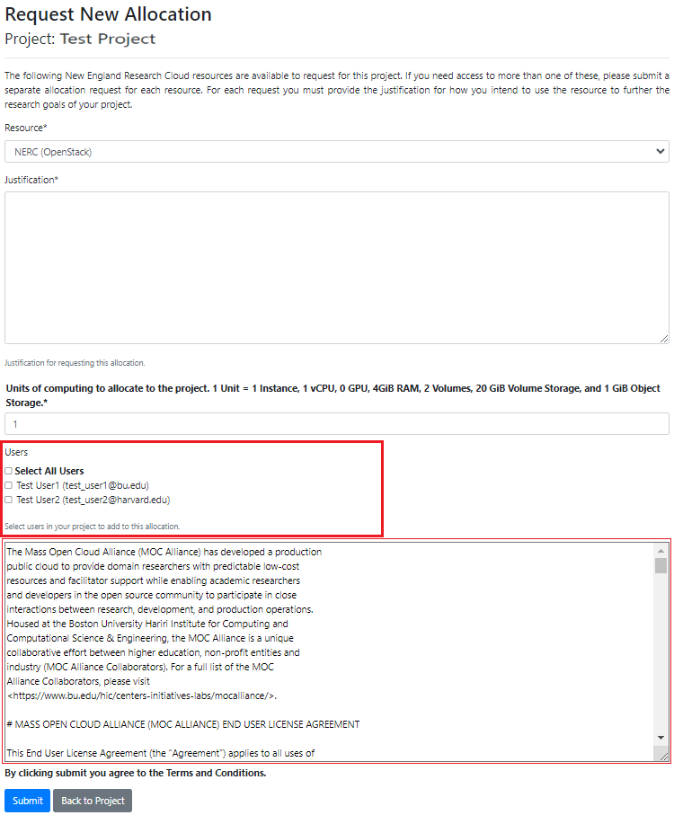
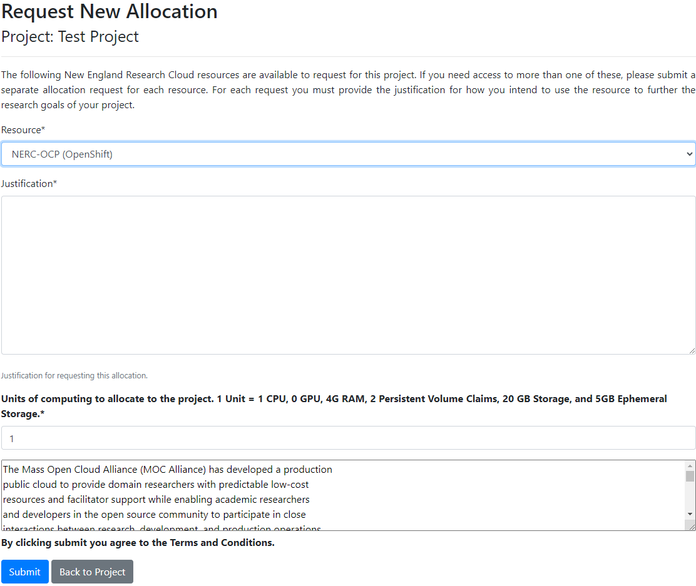
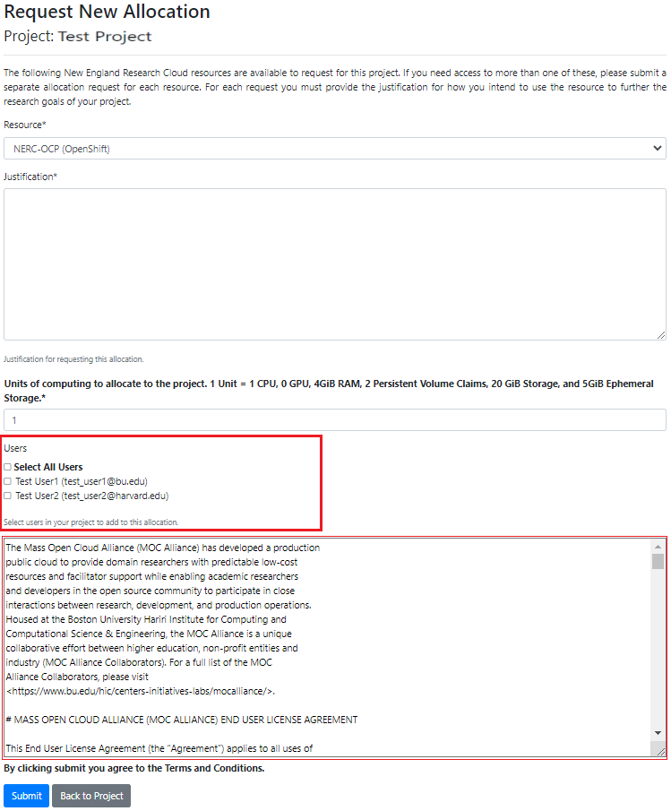

# How to request a new Resource Allocation

On the Project Detail page the project PI/manager(s) can request an allocation
by clicking the "Request Resource Allocation" button as shown below:

On the shown page, you will be able to choose either *OpenStack Resource Allocation*
or *OpenShift Resource Allocation* by specifying either **NERC (OpenStack)** or
**NERC-OCP (OpenShift)** in the **Resource** dropdown option. **Note:** The
first option i.e. **NERC (OpenStack)**, is selected by default.

## Request A New OpenStack Resource Allocation for an OpenStack Project

If users have already been added to the project as
[described here](manage-users-to-a-project.md), the **Users** selection section
will be displayed as shown below:

In this section, the project PI/manager(s) can choose user(s) from the project
to be included in this allocation before clicking the "Submit" button.

!!! tip "Read the End User License Agreement Before Submission"
    You should read the shown End User License Agreement (the "Agreement").
    By clicking the "Submit" button, you agree to the Terms and Conditions.

!!! warning "Important: Requested/Approved Allocated OpenStack Storage Quota & Cost"
    Ensure you choose **NERC (OpenStack)** in the Resource option and specify your
    anticipated computing units. Each allocation, whether requested or approved,
    will be billed based on the **pay-as-you-go** model. The exception is for
    **Storage quotas**, where the cost is determined by [your requested and approved
    allocation values](allocation-details.md#pi-and-manager-allocation-view-of-openstack-resource-allocation)
    to reserve storage from the total NESE storage pool. For **NERC (OpenStack)**
    Resource Allocations, storage quotas are specified by the "OpenStack Volume
    GiB Quota" and "OpenStack Swift Quota in Gigabytes" allocation attributes. If
    you have common questions or need more information, refer to our
    [Billing FAQs](../../get-started/cost-billing/billing-faqs.md) for comprehensive
    answers. Keep in mind that you can easily scale and expand your current resource
    allocations within your project by following [this documentation](allocation-change-request.md#request-change-resource-allocation-attributes-for-openstack-project)
    later on.

### Resource Allocation Quotas for OpenStack Project

The amount of quota to start out a resource allocation after approval, can be
specified using an integer field in the resource allocation request form as shown
above. The provided unit value is computed as PI or project managers request
resource quota. The basic unit of computational resources is defined in terms of
integer value that corresponds to multiple OpenStack resource quotas. For example,
1 Unit corresponds to:

| Resource Name         | Quota Amount x Unit                   |
| :-------------------: | :-----------------------------------: |
| `Instances`           | 1                                     |
| `vCPUs`               | 1                                     |
| `GPU`                 | 0                                     |
| `RAM(MiB)`             | 4096                                  |
| `Volumes`             | 2                                     |
| `Volume Storage(GiB)`  | 20                                    |
| `Object Storage(GB)`  | 1                                     |

!!! info "Information"
    By default, **2 OpenStack Floating IPs**, **10 Volume Snapshots** and **10 Security
    Groups** are provided to each approved project regardless of units of requested
    quota units.

## Request A New OpenShift Resource Allocation for an OpenShift project

If users have already been added to the project as
[described here](manage-users-to-a-project.md), the **Users** selection section
will be displayed as shown below:

In this section, the project PI/manager(s) can choose user(s) from the project
to be included in this allocation before clicking the "Submit" button.

!!! tip "Read the End User License Agreement Before Submission"
    You should read the shown End User License Agreement (the "Agreement").
    By clicking the "Submit" button, you agree to the Terms and Conditions.

### Resource Allocation Quotas for OpenShift Project

The amount of quota to start out a resource allocation after approval, can be
specified using an integer field in the resource allocation request form as shown
above. The provided unit value is computed as PI or project managers request
resource quota. The basic unit of computational resources is defined in terms of
integer value that corresponds to multiple OpenShift resource quotas. For example,
1 Unit corresponds to:

| Resource Name         | Quota Amount x Unit                   |
| :-------------------: | :-----------------------------------: |
| `vCPUs`               | 1                                     |
| `GPU`                 | 0                                     |
| `RAM(MiB)`            | 4096                                  |
| `Persistent Volume Claims (PVC)` | 2                          |
| `Storage(GiB)`        | 20                                    |
| `Ephemeral Storage(GiB)` | 5                                  |

!!! warning "Important: Requested/Approved Allocated OpenShift Storage Quota & Cost"
    Ensure you choose **NERC-OCP (OpenShift)** in the Resource option (**Always Remember:**
    the first option, i.e. **NERC (OpenStack)** is selected by default!) and specify
    your anticipated computing units. Each allocation, whether requested or approved,
    will be billed based on the **pay-as-you-go** model. The exception is for
    **Storage quotas**, where the cost is determined by
    [your requested and approved allocation values](allocation-details.md#pi-and-manager-allocation-view-of-openshift-resource-allocation)
    to reserve storage from the total NESE storage pool. For **NERC-OCP (OpenShift)**
    Resource Allocations, storage quotas are specified by the "OpenShift Request
    on Storage Quota (GiB)" and "OpenShift Limit on Ephemeral Storage Quota (GiB)"
    allocation attributes. If you have common questions or need more information,
    refer to our [Billing FAQs](../../get-started/cost-billing/billing-faqs.md)
    for comprehensive answers. Keep in mind that you can easily scale and expand
    your current resource allocations within your project by following
    [this documentation](allocation-change-request.md#request-change-resource-allocation-attributes-for-openshift-project)
    later on.

---
