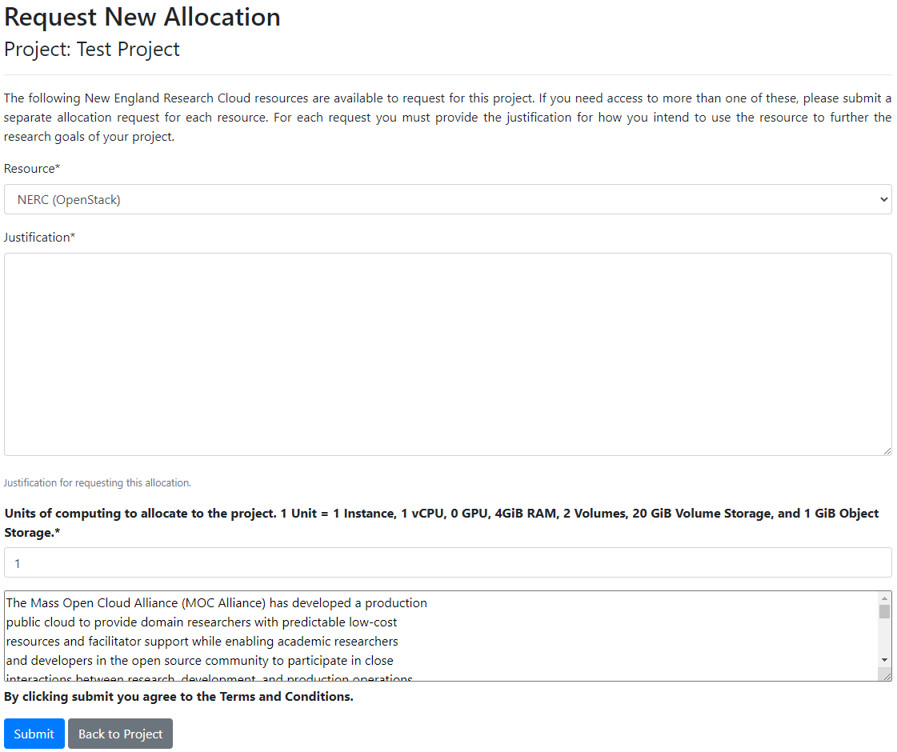

# How to request a new Resource Allocation

On the Project Detail page the project PI/manager(s) can request an allocation
by clicking the "Request Resource Allocation" button as shown below:

## Request A New OpenStack Resource Allocation for an OpenStack Project

!!! warning "Important: Requested/Approved Allocated OpenStack Storage Quota & Cost"
    Ensure to choose **NERC (OpenStack)** in the Resource option and specify your
    anticipated computing units. Each allocation, whether requested or approved,
    will be billed for the associated costs based on the **pay-as-you-go** model.
    The exception is the **Storage quotas**, specifically the "OpenStack Volume
    GB Quota" where the cost is determined by the requested and approved allocation
    values to reserve storage from the total NESE storage pool. If you have common
    questions or need more information, refer to our
    [Billing FAQs](../../get-started/cost-billing/billing-faqs.md) for comprehensive
    answers. Keep in mind that you can easily scale and expand your current resource
    allocations within your project by following this [this documentation](allocation-change-request.md#request-change-resource-allocation-attributes-for-openstack-project)
    later on.

### Resource Allocation Quotas for OpenStack Project

The amount of quota to start out a resource allocation after approval, can be
specified using an integer field in the resource allocation request form as shown
above. The provided unit value is computed as PI or project managers request
resource quota. The basic unit of computational resources is defined in terms of
integer value that corresponds to multiple OpenStack resource quotas. For example,
1 Unit corresponds to:

| Resource Name         | Quota Amount x Unit                   |
| :-------------------: | :-----------------------------------: |
| `Instances`           | 1                                     |
| `vCPUs`               | 1                                     |
| `GPU`                 | 0                                     |
| `RAM(MB)`             | 4096                                  |
| `Volumes`             | 2                                     |
| `Volume Storage(GB)`  | 20                                    |
| `Object Storage(GB)`  | 1                                     |

!!! info "Information"
    By default, **2 OpenStack Floating IPs**, **10 Volume Snapshots** and **10 Security
    Groups** are provided to each approved project regardless of units of requested
    quota units.

## Request A New OpenShift Resource Allocation for an OpenShift project

### Resource Allocation Quotas for OpenShift Project

The amount of quota to start out a resource allocation after approval, can be
specified using an integer field in the resource allocation request form as shown
above. The provided unit value is computed as PI or project managers request
resource quota. The basic unit of computational resources is defined in terms of
integer value that corresponds to multiple OpenShift resource quotas. For example,
1 Unit corresponds to:

| Resource Name         | Quota Amount x Unit                   |
| :-------------------: | :-----------------------------------: |
| `vCPUs`               | 1                                     |
| `GPU`                 | 0                                     |
| `RAM(MB)`                 | 4096                                  |
| `Persistent Volume Claims (PVC)`             | 2                                     |
| `Storage(GB)`  | 20                                  |
| `Ephemeral Storage(GB)`  | 5                                     |

!!! warning "Important: Requested/Approved Allocated OpenShift Storage Quota & Cost"
    Ensure to choose **NERC-OCP (OpenShift)** in the Resource option (**Always Remember:**
    the first option i.e. **NERC (OpenStack)** is selected by default!) and specify
    your anticipated computing units. Each allocation, whether requested or approved,
    will be billed for the associated costs based on the **pay-as-you-go** model.
    The exception is the **Storage quotas**, specifically the "OpenShift Request
    on Storage Quota (GB)" where the cost is determined by the requested and
    approved allocation values to reserve storage from the total NESE storage pool.
    If you have common questions or need more information, refer to our
    [Billing FAQs](../../get-started/cost-billing/billing-faqs.md) for comprehensive
    answers. Keep in mind that you can easily scale and expand your current
    resource allocations within your project by following this [this documentation](allocation-change-request.md#request-change-resource-allocation-attributes-for-openshift-project)
    later on.

---
