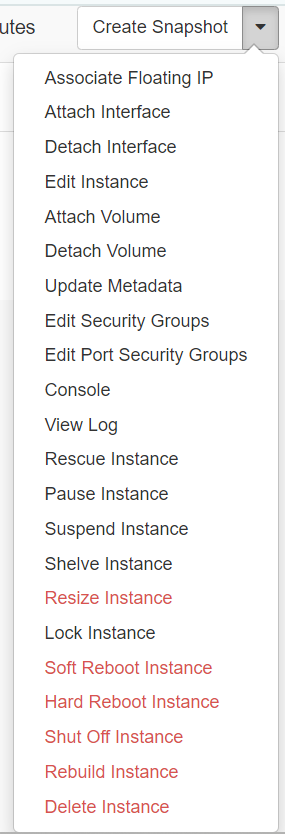
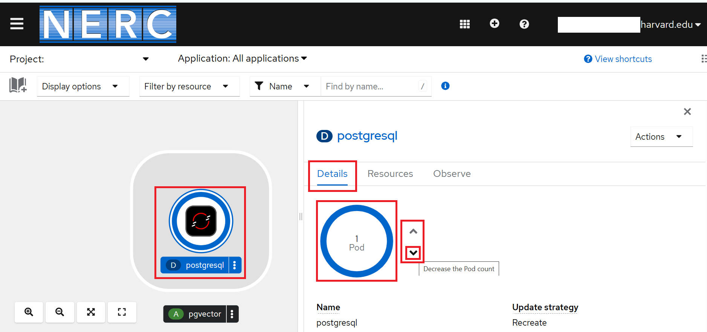
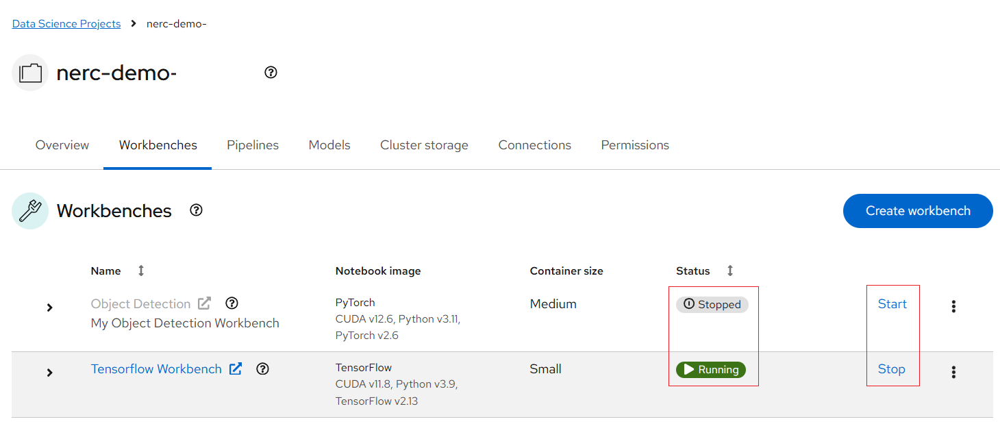

# How does NERC pricing work?

!!! question "As a new PI using NERC for the first time, am I entitled to any credits?"

    As a **new PI** using NERC for the first time, you might wonder if you get any
    credits. Yes, you'll receive up to **$1000** for **the first month only**. But
    remember, this credit **can not** be used in **the following months**. Also,
    it **does not apply** to **GPU resource usage**.

NERC offers you a **pay-as-you-go** approach for pricing for our cloud infrastructure
offerings (Tiers of Service), including Infrastructure-as-a-Service (IaaS) – Red
Hat OpenStack and Platform-as-a-Service (PaaS) – Red Hat OpenShift. The exception
is the **Storage quotas** on NERC Storage Tiers, where the cost is determined by
[your requested and approved allocation values](../allocation/allocation-details.md#pi-and-manager-view)
to reserve storage from the total NESE storage pool. For **NERC (OpenStack)**
Resource Allocations, storage quotas are specified by the "OpenStack Volume Quota
(GiB)" and "OpenStack Swift Quota (GiB)" allocation attributes. Whereas for
**NERC-OCP (OpenShift)** Resource Allocations, storage quotas are specified by the
"OpenShift Request on NESE Storage Quota (GiB)" and "OpenShift Limit on Ephemeral
Storage Quota (GiB)" allocation attributes. If you have common questions or need
more information, refer to our [Billing FAQs](billing-faqs.md) for comprehensive
answers. NERC offers a flexible cost model where an institution (with a per-project
breakdown) is billed solely for the duration of the specific services required.
Access is based on project-approved resource quotas, eliminating runaway usage
and charges. There are no obligations of long-term contracts or complicated licensing
agreements. Each institution will enter a lightweight MOU with MGHPCC that defines
the services and billing model.

## Calculations

### Service Units (SUs)
<!-- markdownlint-disable MD052 -->
| Name         | GPU | vCPU | RAM (GiB) | Current Price |
| ------------ | ---- | ---- | --------- | ------------- |
| H100 GPU     | {{su_info_dict["GPUH100"]["GPUs"]}}    | {{su_info_dict["GPUH100"]["vCPUs"]}}   | {{su_info_dict["GPUH100"]["RAM"]}}       | ${{su_info_dict["GPUH100"]["rate"]}}        |
| A100sxm4 GPU | {{su_info_dict["GPUA100SXM4"]["GPUs"]}}    | {{su_info_dict["GPUA100SXM4"]["vCPUs"]}}   | {{su_info_dict["GPUA100SXM4"]["RAM"]}}       | ${{su_info_dict["GPUA100SXM4"]["rate"]}}        |
| A100 GPU     | {{su_info_dict["GPUA100"]["GPUs"]}}    | {{su_info_dict["GPUA100"]["vCPUs"]}}   | {{su_info_dict["GPUA100"]["RAM"]}}       | ${{su_info_dict["GPUA100"]["rate"]}}        |
| V100 GPU     | {{su_info_dict["GPUV100"]["GPUs"]}}    | {{su_info_dict["GPUV100"]["vCPUs"]}}   | {{su_info_dict["GPUV100"]["RAM"]}}       | ${{su_info_dict["GPUV100"]["rate"]}}        |
| K80 GPU      | {{su_info_dict["GPUK80"]["GPUs"]}}    | {{su_info_dict["GPUK80"]["vCPUs"]}}   | {{su_info_dict["GPUK80"]["RAM"]}}       | ${{su_info_dict["GPUK80"]["rate"]}}        |
| CPU          | {{su_info_dict["CPU"]["GPUs"]}}    | {{su_info_dict["CPU"]["vCPUs"]}}   | {{su_info_dict["CPU"]["RAM"]}}       | ${{su_info_dict["CPU"]["rate"]}}        |
<!-- markdownlint-enable MD052 -->

!!! info "Now Available on NERC: NVIDIA H100 GPUs"

    The cutting-edge NVIDIA H100 80GB GPUs are now available for use with:

    🔹 **NERC Red Hat OpenShift AI (RHOAI)** via JupyterLab workbenches

    🔹 **NERC OpenShift - based Containers**

    To get started, read our latest [announcement](https://nerc.mghpcc.org/nvidia-h100-gpus-on-nerc/).

## Breakdown

### CPU/GPU SUs

Service Units (SUs) can only be purchased as a whole unit. We will charge for
Pods (summed up by Project) and VMs on a per-hour basis for any portion of an
hour they are used, and any VM "flavor"/Pod reservation is charged as a multiplier
of the base SU for the maximum resource they reserve.

<!-- markdownlint-disable MD052 -->
**GPU SU Example**:

-   A Project or VM with:

    `1 A100 GPU, 24 vCPUs, 95MiB RAM, 199.2hrs`

-   Will be charged:

    `1 A100 GPU SUs x 200hrs (199.2 rounded up) x ${{su_info_dict["GPUA100"]["rate"]}}`

    `${{ "{:,.2f}".format(su_info_dict["GPUA100"]["rate"] * 200) }}`

**OpenStack CPU SU Example**:

-   A Project or VM with:

    `3 vCPU, 20 GiB RAM, 720hrs (24hr x 30days)`

-   Will be charged:

    `5 CPU SUs due to the extra RAM (20GiB vs. 12GiB(3 x 4GiB)) x 720hrs x ${{su_info_dict["CPU"]["rate"]}}`

    `${{ "{:,.2f}".format(su_info_dict["CPU"]["rate"] * 5 * 720) }}`
<!-- markdownlint-enable MD052 -->

!!! warning "Are VMs invoiced even when shut down?"

    Yes, VMs incur charges as long as they are utilizing resources. Proactively
    managing your VMs helps optimize usage and reduce unnecessary costs. To avoid
    being billed for unused resources (i.e., **GPU, vCPU, RAM**), you can release
    the underlying compute resources in one of the following two ways:

    1. **By Shelving the VM**:

       Shelving temporarily shuts down the VM and releases all its compute resources
       (i.e., GPU, vCPU, RAM), while preserving the disk and metadata. This allows
       you to resume the VM later without needing to reconfigure it. It's a cost-effective
       (**Recommended**) option if you plan to use the VM again in the future.

    2. **By Deleting the VM**:

       [Deleting the VM](../../openstack/management/vm-management.md#delete-instance)
       permanently removes it along with all associated resources, including compute,
       storage, and network allocations. Choose this option if the VM is no longer
       needed, as it fully eliminates any future charges.

       It is advisable to [create a snapshot](../../openstack/management/vm-management.md#create-snapshot)
       of your VM prior to deletion to ensure you have a backup of your data and
       configurations. We strongly recommend [detaching any additional volumes](../../openstack/persistent-storage/detach-a-volume.md)
       from your instance before creating any snapshots.

    **Please note:**  
    The **storage cost** is determined by your [requested and approved allocation values](../allocation/allocation-details.md#pi-and-manager-view)
    for the storage quotas defined under "OpenStack Volume Quota (GiB)" and
    "OpenStack Swift Quota (GiB)" in your **NERC (OpenStack)** Resource Allocations.

    Even if you have deleted all volumes, snapshots, and object storage buckets and
    objects in your OpenStack project, it's essential to adjust the approved storage
    values for your NERC (OpenStack) allocation to zero (0). Otherwise, charges will
    continue to apply based on the approved storage quota.

    You can easily scale or reduce your current resource allocations within your
    project. Follow [this guide](../allocation/allocation-change-request.md#request-change-resource-allocation-attributes-for-openstack-project)
    to request changes using NERC's ColdFront interface.

    For common questions or additional information, please refer to our
    [Billing FAQs](../../get-started/cost-billing/billing-faqs.md).

**OpenShift CPU SU Example**:

-   Project with 3 Pods with:

    i. `1 vCPU, 3 GiB RAM, 720hrs (24hr*30days)`

    ii. `0.1 vCPU, 8 GiB RAM, 720hrs (24hr*30days)`

    iii. `2 vCPU, 4 GiB RAM, 720hrs (24hr*30days)`

<!-- markdownlint-disable MD052 MD013 -->
-   Project Will be charged:

    `RoundUP(Sum(`

    `1 CPU SUs due to first pod * 720hrs * ${{su_info_dict["CPU"]["rate"]}}`

    `2 CPU SUs due to extra RAM (8GiB vs 0.4GiB(0.1*4GiB)) * 720hrs * ${{su_info_dict["CPU"]["rate"]}}`

    `2 CPU SUs due to more CPU (2vCPU vs 1vCPU(4GiB/4)) * 720hrs * ${{su_info_dict["CPU"]["rate"]}}`

    `))`

    `=RoundUP(Sum(720(1+2+2)))*{{su_info_dict["CPU"]["rate"]}}`

    `${{ "{:,.2f}".format(su_info_dict["CPU"]["rate"] * 720 * (1 + 2 + 2)) }}`
<!-- markdownlint-enable MD052 MD013 -->

!!! note "How to calculate cost for all running OpenShift pods?"

    If you prefer a function for the OpenShift pods here it is:

    `Project SU HR count = RoundUP(SUM(Pod1 SU hour count + Pod2 SU hr count +
    ...))`

OpenShift Pods are summed up to the project level so that fractions of CPU/RAM
that some pods use will not get overcharged. There will be a split between CPU and
GPU pods, as GPU pods cannot currently share resources with CPU pods.

### Storage

<!-- markdownlint-disable MD052 MD013 -->
Storage is charged separately at a rate of **${{su_info_dict["NESE Storage GB Rate"]["rate"]}} TiB/hr**
<!-- markdownlint-enable MD052 MD013 -->
OpenStack volumes remain provisioned until they are deleted. VM's reserve
volumes, and you can also create extra volumes yourself. In OpenShift pods, storage
is only provisioned while it is active, and in persistent volumes, storage remains
provisioned until it is deleted.

!!! danger "Very Important: Requested/Approved Allocated Storage Quota and Cost"

    The **Storage cost** is determined by
    [your requested and approved allocation values](../allocation/allocation-details.md#pi-and-manager-view).
    Once approved, these **Storage quotas** will need to be reserved from the
    total NESE storage pool for both **NERC (OpenStack)** and **NERC-OCP (OpenShift)**
    resources. For **NERC (OpenStack)** Resource Allocations, storage quotas are
    specified by the "OpenStack Volume Quota (GiB)" and "OpenStack Swift Quota
    (GiB)" allocation attributes. Whereas for **NERC-OCP (OpenShift)** Resource
    Allocations, storage quotas are specified by the "OpenShift Request on Storage
    Quota (GiB)" and "OpenShift Limit on Ephemeral Storage Quota (GiB)" allocation
    attributes.

    Even if you have deleted all volumes, snapshots, and object storage buckets and
    objects in your OpenStack and OpenShift projects. It is very essential to
    adjust the approved values for your NERC (OpenStack) and NERC-OCP (OpenShift)
    resource allocations to zero (0) otherwise you will still be incurring a charge
    for the approved storage as explained in [Billing FAQs](billing-faqs.md).

    Keep in mind that you can easily scale and expand your current resource
    allocations within your project. Follow [this guide](../allocation/allocation-change-request.md#request-change-resource-allocation-attributes-for-openstack-project)
    on how to use NERC's ColdFront to reduce your **Storage quotas** for NERC (OpenStack)
    allocations and [this guide](../allocation/allocation-change-request.md#request-change-resource-allocation-attributes-for-openshift-project)
    for NERC-OCP (OpenShift) allocations.

<!-- markdownlint-disable MD052 MD013 -->
**Storage Example 1**:

-   Volume or VM with:

    `500GiB for 699.2hrs`

-   Will be charged:

    `.5 Storage TiB SU (.5 TiB x 700hrs) x ${{su_info_dict["NESE Storage GB Rate"]["rate"]}} TiB/hr`

    `${{ "{:,.2f}".format(su_info_dict["NESE Storage GB Rate"]["rate"] * 700 / 2) }}`

**Storage Example 2**:

-   Volume or VM with:

    `10TiB for 720hrs (24hr x 30days)`

-   Will be charged:

    `10 Storage TiB SU (10TiB x 720 hrs) x ${{su_info_dict["NESE Storage GB Rate"]["rate"]}} TiB/hr`

    `${{ "{:,.2f}".format(su_info_dict["NESE Storage GB Rate"]["rate"] * 10 * 720) }}`
<!-- markdownlint-enable MD052 MD013 -->

Storage includes all types of storage Object, Block, Ephemeral & Image.

### High-Level Function

To provide a more practical way to calculate your usage, here is a function of
how the calculation works for OpenShift and OpenStack.

1.  **OpenStack** = (Resource (vCPU/RAM/GPU) assigned to VM flavor converted to
    number of equivalent SUs) \* (time VM has been running), rounded up to a whole
    hour + Extra storage.

    !!! info "NERC's OpenStack Flavor List"

        You can find the most up-to-date information on the current NERC's OpenStack
        flavors with corresponding SUs by referring to [this page](../../openstack/create-and-connect-to-the-VM/flavors.md).

2.  **OpenShift** = (Resource (vCPU/RAM) requested by Pod converted to the number
    of SU) \* (time Pod was running), summed up to project level rounded up to the
    whole hour.

## How to Pay?

To ensure a comprehensive understanding of the billing process and payment options
for NERC offerings, we advise PIs/Managers to [visit individual pages designated
for each institution](billing-process-for-my-institution.md). These pages provide
detailed information specific to each organization's policies and procedures
regarding their billing. By exploring these dedicated pages, you can gain insights
into the preferred payment methods, invoicing cycles, breakdowns of cost components,
and any available discounts or offers. Understanding the institution's unique
approach to billing ensures accurate planning, effective financial management,
and a transparent relationship with us.

If you have any some common questions or need further information, see our
[Billing FAQs](billing-faqs.md) for comprehensive answers.

## SU Conservation - How to Save Cost?

With SUs being the primary metric for resource consumption, it's crucial to actively
manage your workloads when they're not in use.

Below are practical ways to conserve SUs across different NERC services:

### NERC OpenStack

Once you're logged in to [NERC's Horizon dashboard](https://stack.nerc.mghpcc.org).

Navigate: Project -> Compute -> Instances.

After launching an instance (On the left side bar, click on
_Project -> Compute -> Instances_), several options are available under the
Actions menu located on the right hand side of your screen as shown here:



**Shelve your VM when not in use**:

!!! info "Only Available From Next Billing Cycle"

    We will implement the invoicing piece of this feature as of the June 2025
    Invoicing cycle.

In [NERC OpenStack](../../openstack/index.md), if your VM does not need to run
continuously, you can **shelve** it to free up consumed resources such as vCPUs,
RAM, and disk. This action releases all allocated resources while preserving the
VM's state and metadata.

- Click _Action -> Shelve Instance_.

- Releases all computing resources (i.e., **GPU, vCPU, RAM**), while preserving
  the disk and metadata.

- We strongly recommend detaching volumes before shelving.

- Status will change to `Shelved Offloaded`.

You can later **unshelve** the VM without needing to recreate it - allowing you
to reduce costs without losing any progress.

- To unshelve the instance, click _Action -> Unshelve Instance_.

For more details on *shelving a VM*, see the explanation [here](../../openstack/management/vm-management.md#instance-management-actions).

### NERC OpenShift

**Scale your pods to 0 replicas**:

In [NERC OpenShift](../../openshift/index.md), if your application or job is idle,
you can scale its pod replica count to **0**. This effectively frees up compute
resources (i.e., **GPU, vCPU, and RAM**) while retaining the configuration, metadata,
environment settings, and persistent volume claims (PVCs) for future use.

#### Using Web Console

1. Go to the [NERC's OpenShift Web Console](https://console.apps.shift.nerc.mghpcc.org).

2. In the **Navigation Menu**, navigate to the **Workloads** -> **Topology** menu.

3. Click the pod or application you want to scale to see the _Overview_ panel to
    the right.

4. In the **Details** tab (usually the *default* tab when you open the deployment):

5. Look for the Pod count or Replicas section.

6. Use the up/down arrows next to the number to adjust the replica count.

7. Set it to **0** by clicking down arrow as shown below:

    

8. OpenShift will automatically scale down the pods to 0.

When you need to run your application again, you can scale up the pod count or
replicas to reclaim the necessary resources.

#### Using the OpenShift `oc` CLI

##### Prerequisite

-   Install and configure the **OpenShift CLI (oc)**, see [How to Setup the
    OpenShift CLI Tools](../../openshift/logging-in/setup-the-openshift-cli.md)
    for more information.

    !!! info "Information"

        Some users may have access to multiple projects. Run the following command to
        switch to a specific project space: `oc project <your-project-namespace>`.

    Please confirm the correct project is being selected by running `oc project`,
    as shown below:

        oc project
        Using project "<your_openshift_project_where_pod_deployed>" on server "https://api.shift.nerc.mghpcc.org:6443".

If your application or job is idle, you can scale your pod's replica count to
**0** by running the following `oc` command:

```sh
oc scale deployment <your-deployment> --replicas=0
```

When you need to run your application again, you can scale up the pod count or
replicas to reclaim the necessary resources by running:

```sh
oc scale deployment <your-deployment> --replicas=1
```

### NERC RHOAI

**Toggle the Workbench to "Stopped"**:

In [NERC Red Hat OpenShift AI (RHOAI)](../../openshift-ai/index.md), workbench
environments can be toggled between `Running` and `Stopped` states.

1. Go to the [NERC's OpenShift Web Console](https://console.apps.shift.nerc.mghpcc.org).

2. After logging in to the NERC OpenShift console, access the NERC's Red Hat OpenShift
AI dashboard by clicking the application launcher icon (the black-and-white
icon that looks like a grid), located on the header.

3. When you've completed a workload such as model development or experimentation
using the [Data Science Project (DSP)](../../openshift-ai/data-science-project/using-projects-the-rhoai.md)
**Workbench**, you can stop the compute resources used by the workbench
by clicking `Stop`, next to the **Status** column for the workbench. Then the
status of the workbench change from `Running` to `Stopped`, as shown below:

    

    This action immediately releases the compute resources allocated to the notebook
    environment within the Workbench setup.

    To restart your workbench, click `Start` next to the **Status** column for the
    workbench. The status will change from **Stopped** to `Starting` while the
    server initializes, and then to `Running` once the workbench has successfully
    started.

---
