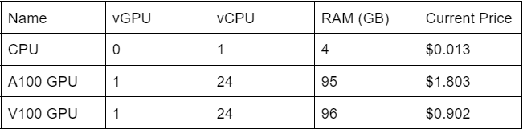

# How does NERC pricing work?

NERC offers you a **pay-as-you-go** approach for pricing for our cloud infrastructure
offerings (Tiers of Service), including Infrastructure-as-a-Service (IaaS) – Red
Hat OpenStack, Platform-as-a-Service (PaaS) – Red Hat OpenShift and NERC Storage
Tiers. NERC offers a flexible cost model where an institution (with a per-project
breakdown) is billed solely for the duration of the specific services required.
Access is based on project-approved resource quotas, eliminating runaway usage and
charges.  There are no obligations of long-term contracts or complicated licensing
agreements.  Each institution will enter a lightweight MOU with MGHPCC that defines
the services and billing model.

## Calculations

### Service Units (SU)

## Breakdown

### CPU/GPU SU

Service Units can only be purchased as a whole unit. We will charge for Pods and
VMs on a per hour basis, for any portion of an hour they are used, and any VM
“flavor”/Pod reservation is charged as a multiplier of the base SU for the maximum
resource they reserve.

**GPU SU Example:**

- A Pod or VM with:

    `1 A100 GPU, 24 vCPUs, 95MB RAM, 199.2hrs`

- Will be charged:

    `1 A100 GPU SUs x 200hrs (199.2 rounded up) x $1.803`

    `$360.60`

**CPU Example:**

- A Pod or VM with:

    `3 vCPU, 20 GB RAM, 720hrs (24hr x 30days)`

- Will be charged:

    `5 CPU SUs due to the extra RAM (20GB vs 12GB(3 x 4GB)) x 720hrs x $0.013`

    `$46.80`

OpenShift Pods are summed up to the project level so that fractions of CPU/RAM
that some pods use will not get overcharged. This will be split between CPU and
GPU pods as GPU pods cannot currently share resources with CPU pods.

### Storage

Storage is charged separately at a rate of $0.009 TB/hr or $9.00E-12 KB/hr at a
granularity of KB/hr. For ease of reporting, storage SUs are shown in GB but calculated
in KB. OpenStack volumes remain provisioned until they are deleted. VM’s reserve
volumes, and you can also create extra volumes yourself. In OpenShift pods, storage
is only provisioned while it is active, and in persistent volumes, storage remains
provisioned until it is deleted.

Storage includes all types of storage Object, Block, Ephemeral & Image.

!!! note "Please note"
    After issuing the *shutoff* command to an OpenStack VM, it will not use CPU or
    RAM but will continue to use storage. Any extra *Images* you create will also
    use storage.

### High Level Function

For those who visualize better when they can use a function to think about how
something works, here is a function of how the calculation works for OpenShift
and OpenStack.

1. **OpenStack** = (Resource (vCPU/RAM) assigned to VM flavor converted to number
of SU) * (time VM has been running), rounded up to whole hour + Extra storage

    !!! info "NERC's OpenStack Flavor List"
        You can find the most up-to-date information on the current NERC's OpenStack
        flavors with corresponding SUs by referring to [this page](../../openstack/create-and-connect-to-the-VM/flavors.md).

2. **OpenShift** = (Resource (vCPU/RAM) requested by Pod converted to number of
SU) * (time Pod was running), rounded up to whole hour

## How to Pay?

To ensure a comprehensive understanding of the billing process and payment options
for NERC offerings, we advise PIs/Managers to [visit individual pages designated
for each institution](billing-process-for-my-institution.md). These pages provide
detailed information specific to each organization's policies and procedures
regarding their billing. By exploring these dedicated pages, you can gain insights
into the preferred payment methods, invoicing cycles, breakdowns of cost components,
and any available discounts or offers. Understanding the institution's unique
approach to billing ensures accurate planning, effective financial management,
and a transparent relationship with us.

If you have any some common questions or need further information, see our
[Billing FAQs](billing-faqs.md) for comprehensive answers.

---
