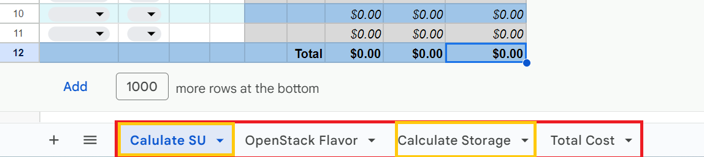

# NERC Pricing Calculator

The NERC Pricing Calculator is a google excel based tool for estimating the cost
of utilizing various NERC resources in different NERC service offerings. It offers
a user-friendly interface, allowing users to input their requirements and customize
configurations to generate accurate and tailored cost estimates for optimal
budgeting and resource allocation.

Start your estimate with no commitment, and explore NERC services and pricing for
your research needs by using [this online tool](https://docs.google.com/spreadsheets/d/187bQgz3eB3W9OL7x9rrgaJ2pi7u85xMJvUJbnKzzBQM/edit#gid=0).

!!! info "How to use the NERC Pricing Calculator?"

    Please note that you must **make a copy** of this tool before estimating any
    costs. Once copied, you can update the resource-type columns in your own
    working sheet, and the tool will automatically calculate your potential
    **Service Units (SU)**, **rates**, and **costs per hour, month, and year**.

    The tool contains **five sheets** at the bottom, as shown below:

    

    If you want to estimate costs based on the available
    **[NERC OpenStack flavors](../../openstack/create-and-connect-to-the-VM/flavors.md)**
    (which define the compute, memory, and storage capacity for your dedicated
    instances), you can select and use the **second sheet** titled
    "**OpenStack Flavor**".

    For estimating the **[NERC OpenShift](../../openshift/applications/scaling-and-performance-guide.md#compute-resources)**
    resource usage, use the **first sheet** titled "**OpenShift SU**" and enter
    the pod-specific resource requests in each row. If your application scales
    to multiple pods, add a separate row for each replica.

    For the **Storage** cost calculation, use the **third sheet** titled
    "**Calculate Storage**".

    For the **[BareMetal](pricing-for-bare-metal-machines.md)** cost estimation,
    use the **fourth sheet** titled "**BM SU**".

    Finally, the combined overall cost will be displayed on the **last sheet** titled
    "**Total Cost**".

For more information about how NERC pricing works, see
[How does NERC pricing work](how-pricing-works.md) and
to know more about billing process for your own institution, see
[Billing Process for My Institution](billing-process-for-my-institution.md).

---
