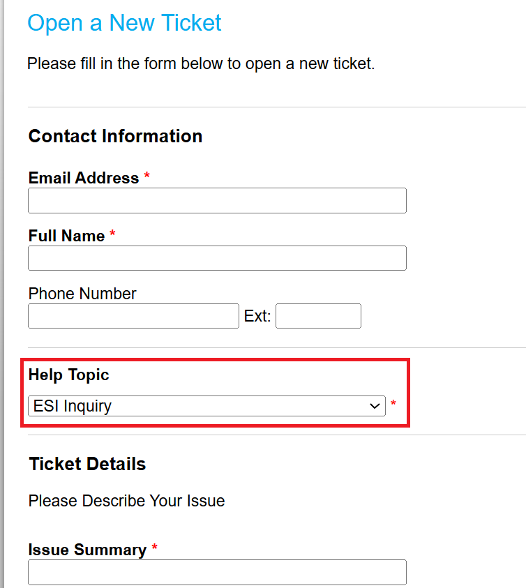

# Pricing for Bare Metal (BM) Machines on NERC

## Bare Metal Machines

!!! warning "Very Important Disclosures Regarding Pricing"

    All prices listed on this page are **introductory** and subject to change
    without notice. Please stay informed by reviewing this page regularly or
    contacting us by emailing us at [help@esi.mghpcc.org](mailto:help@esi.mghpcc.org?subject=New%20User%20Query)
    or, by submitting a new ticket at [the NERC's Support Ticketing System](https://mghpcc.supportsystem.com/open.php)
    by selecting "**ESI Inquiry**" as the *Help Topic* option as shown below:

    

Bare metal instances pricing is currently available as a limited offering.

## Bare Metal Pricing Calculations

<!-- markdownlint-disable MD052 -->
| Name             | vGPU | vCPU | RAM (GiB) | Current Price |
|------------------|------|------|-----------|---------------|
| H100 GPU         | {{su_info_dict["BM GPUH100"]["vGPUs"]}}    | {{su_info_dict["BM GPUH100"]["vCPUs"]}}   | {{su_info_dict["BM GPUH100"]["RAM"]}}       | ${{su_info_dict["BM GPUH100"]["rate"]}}        |
| A100sxm4 GPU     | {{su_info_dict["BM GPUA100SXM4"]["vGPUs"]}}    | {{su_info_dict["BM GPUA100SXM4"]["vCPUs"]}}   | {{su_info_dict["BM GPUA100SXM4"]["RAM"]}}       | ${{su_info_dict["BM GPUA100SXM4"]["rate"]}}        |
| FC830            | {{su_info_dict["BM FC830"]["vGPUs"]}}    | {{su_info_dict["BM FC830"]["vCPUs"]}}   | {{su_info_dict["BM FC830"]["RAM"]}}       | ${{su_info_dict["BM FC830"]["rate"]}}        |
| FC430            | {{su_info_dict["BM FC430"]["vGPUs"]}}    | {{su_info_dict["BM FC430"]["vCPUs"]}}   | {{su_info_dict["BM FC430"]["RAM"]}}       | ${{su_info_dict["BM FC430"]["rate"]}}        |
<!-- markdownlint-enable MD052 -->

!!! info "How to request Bare Metal Machines?"

    Interested parties who wish to explore this option are encouraged to send
    detailed requests, including:

    - Intended Use Case

    - Expected Workload

    - Funding Resource (Optional)

    This information will help us evaluate the demand and feasibility of expanding
    bare metal offerings in the future.

    For inquiries or to submit your request, please contact us to discuss it
    by emailing us at [help@esi.mghpcc.org](mailto:help@esi.mghpcc.org?subject=New%20User%20Query)
    or, by submitting a new ticket at [the NERC's Support Ticketing System](https://mghpcc.supportsystem.com/open.php)
    by selecting "**ESI Inquiry**" as the *Help Topic* option.

## BM SU Example

-   A Project with: **1 H100, 1 A100SXM4, 2 FC830s, and 3 FC430s**

    `1 H100 Server, 720hrs (24hr*30days)`

    `1 A100SXM4 Server, 720hrs (24hr*30days)`

    `2 FC830 Servers, 720hrs (24hr*30days)`

    `3 FC430 Servers, 720hrs (24hr*30days)`

-   Will be charged:

<!-- markdownlint-disable MD052 -->
    
    
    
    
    

    1 H100 SU * 720hrs * $24.16 = ${{ "{:,.2f}".format(h100_cost) }}

    1 A100SXM4 * 720hrs * $8.312 = ${{  "{:,.2f}".format(a100sxm_cost)}}

    2 FC830 SU * 720hrs * $3.97 = ${{ "{:,.2f}".format(fc830_cost) }}

    3 FC430 SU * 720hrs * $0.75 = ${{ "{:,.2f}".format(fc430_cost) }}

**Total charge** = ${{ "{:,.2f}".format(cost_sum) }}
<!-- markdownlint-enable MD052 -->

---
