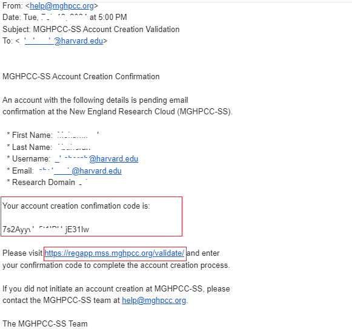
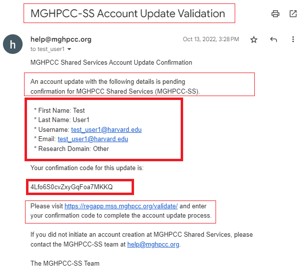
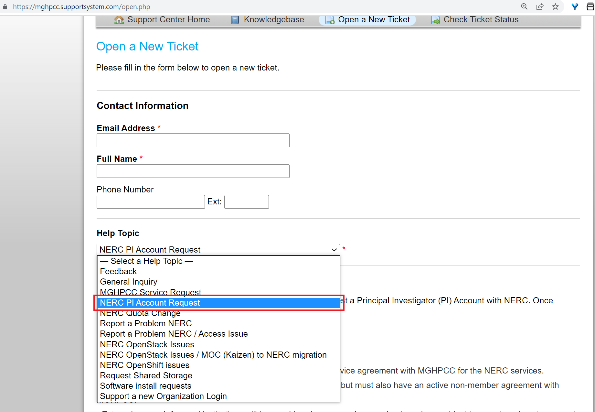

# User Account Types

NERC offers two types of user accounts: a **Principal Investigator (PI) Account**
and a **General User Account**. All General Users must be assigned to their project
by an active NERC PI or by one of the delegated project manager(s), as
[described here](allocation/manage-users-to-a-project.md). Then, those project
users can be added to the resource allocation during a new allocation request or
at a later time.

!!! question "Principal Investigator Eligibility Information"

    - MGHPCC consortium members, whereby they enter into an service agreement with
    MGHPCC for the NERC services.

    - Non-members of MGHPCC can also be PIs of NERC Services, but must also have
    an active non-member agreement with MGHPCC.

    - External research focused institutions will be considered on a case-by-case
    basis and are subject to an external customer cost structure.

A PI account can request allocations of NERC resources, grant access to other
general users enabling them to log into NERC's computational project space, and
delegate its responsibilities to other collaborators from the same institutions
or elsewhere as managers using [NERC's ColdFront interface](https://coldfront.mss.mghpcc.org/),
as [described here](allocation/manage-users-to-a-project.md#user-roles).

## Getting Started

Any faculty, staff, student, and external collaborator must request a user account
through the [MGHPCC Shared Services (MGHPCC-SS) Account Portal](https://regapp.mss.mghpcc.org/),
also known as **"RegApp"**. This is a web-based, single point-of-entry to the NERC
system that displays a user welcome page. The welcome page of the account
registration site displays instructions on how to register a General User
account on NERC, as shown in the image below:

There are two options: either register for a new account or manage an existing
one. If you are new to NERC and want to register as a new MGHPCC-SS user, click
on the "Register for an Account" button. This will redirect you to a new web page
which shows details about how to register for a new MGHPCC-SS user account. NERC
uses **CILogon** that supports login either using your Institutional Identity
Provider (IdP).

Clicking the "Begin MGHPCC-SS Account Creation Process" button will initiate the
account creation process. You will be redirected to a site managed by CILogon
where you will select your institutional or commercial identity provider, as
shown below:

Once selected, you will be redirected to your institutional or commercial identity
provider, where you will log in, as shown here:

After a successful log on, your browser will be redirected back to the MGHPCC-SS
Registration Page and ask for a review and confirmation of creating your account
with fetched information to complete the account creation process.

!!! warning "Very Important"

    If you don't click the "Create MGHPCC-SS Account" button, your account will
    not be created! So, this is a very important step. Review your information
    carefully and then click on the "Create MGHPCC-SS Account" button to save
    your information. Please review the information, make any corrections that
    you need and fill in any blank/ missing fields such as "Research Domain". Please
    read the **End User Level Agreement (EULA)** and accept the terms by checking
    the checkbox in this form.

Once you have reviewed and verified that all your user information in this form
is correct, only then click the "Create MGHPCC-SS Account" button. This will
automatically send an email to your email address with a link to validate and
confirm your account information.

Once you receive an "MGHPCC-SS Account Creation Validation" email, review your
user account information to ensure it is correct. Then, click on the provided
validation web link and enter the unique account creation **Confirmation Code**
provided in the email as shown below:

Once validated, you need to ensure that your user account is created and valid
by viewing the following page:

!!! question "Important Note"

    If you have an institutional identity, it's preferable to use that identity
    to create your MGHPCC-SS account. Institutional identities are vetted by identity
    management teams and provide a higher level of confidence to resource owners
    when granting access to resources. You can only link one university account
    to an MGHPCC-SS account; if you have multiple university accounts, you will
    only be able to link one of those accounts to your MGHPCC-SS account. If, at
    a later date, you want to change which account is connected to your MGHPCC-SS
    identity, you can do so by contacting [help@mghpcc.org](mailto:help@mghpcc.org?subject=MGHPCC-SS%20User%20Account%Help).

## How to update and modify your MGHPCC-SS account information?

1. Log in to the [RegApp](https://regapp.mss.mghpcc.org/) using your MGHPCC-SS account.

2. Click on "Manage Your MGHPCC-SS Account" button as shown below:

    

3. Review your currently saved account information, make any necessary corrections
   or updates to fields, and then click on the "Update MGHPCC-SS Account" button.

4. This will send an email to verify your updated account information, so please
   check your email address.

5. Confirm and validate the new account details by clicking the provided validation
   web link and entering the unique **Confirmation Code** provided in the email
   as shown below:

    

## How to request a Principal Investigator (PI) Account?

The process for requesting and obtaining a **PI Account** is relatively simple.
You can fill out [this NERC Principal Investigator (PI) Account Request form](https://nerc.mghpcc.org/pi-account-request/)
to initiate the process.

**Alternatively,** users can request a Principal Investigator (PI) user account
by submitting a new ticket at [the NERC's Support Ticketing System](https://mghpcc.supportsystem.com/open.php)
under the "NERC PI Account Request" option in the **Help Topic** dropdown menu,
as shown in the image below:

!!! info "Information"

    Once your PI user request is reviewed and approved by the NERC's admin, you
    will receive an email confirmation from NERC's support system, i.e.,
    [help@nerc.mghpcc.org](mailto:help@nerc.mghpcc.org?subject=NERC%20MOU%20Question).
    Then, you can access [NERC's ColdFront resource allocation management portal](https://coldfront.mss.mghpcc.org/)
    using the PI user role, as [described here](allocation/coldfront.md#how-to-get-access-to-nercs-coldfront).

---
