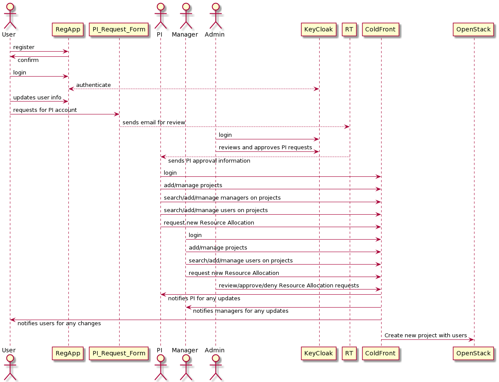
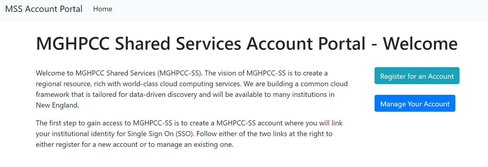
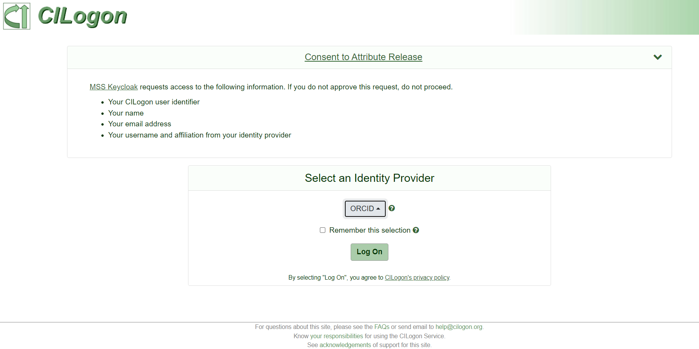
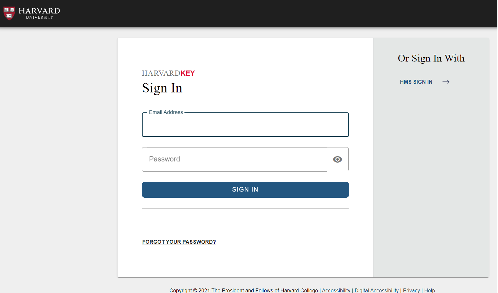
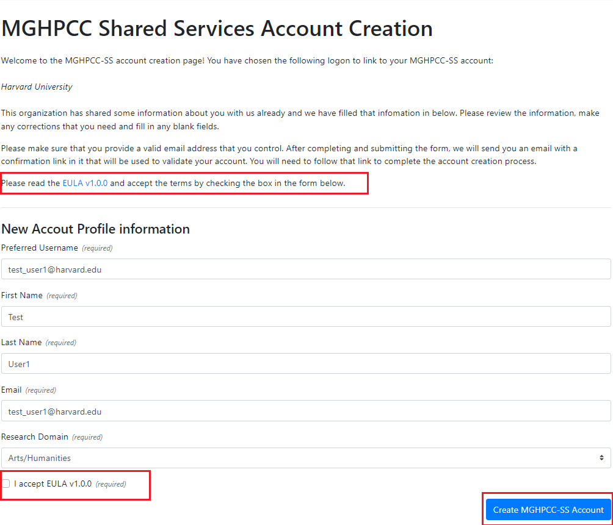
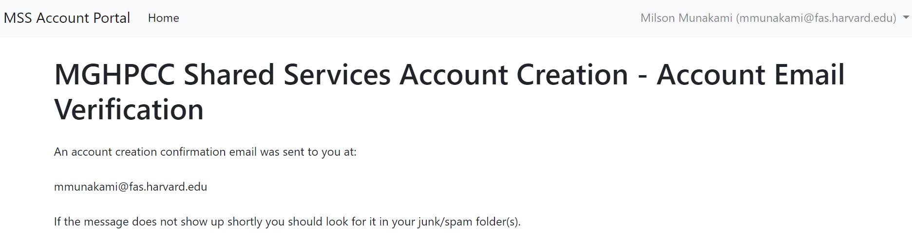
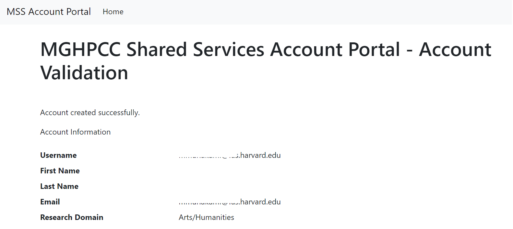

# Overview

NERC’s Research allocations are available to faculty members and researchers, including
postdoctoral researchers and students, at a U.S. based institution in New England.
In order to get access to resources provided by NERC’s computational infrastructure,
you must first register and obtain a user account.

The overall user flow can be summarized using the following sequence diagram:

## User Accounts

NERC offers two types of user accounts: a **Principal Investigator (PI) Account**
and a **General User Account**. All General Users must be sponsored by a PI with
an active NERC PI account. All university faculty and staff researchers eligible
to be a grant PI are eligible to obtain a NERC account by completing a PI Account
Request.

If you are unsure whether you qualify for an NERC PI account, see Principal Investigator
Eligibility for information about the NERC’s policy concerning PI eligibility. PI
accounts are able to request Resource Allocations. A PI account enables a user to
log into NERC's computational project space; apply for allocations of NERC resources
and grant access to other users; and delegate responsibilities to other collaborators
from the same institutions or elsewhere as managers using
[NERC’s ColdFront interface](https://coldfront.mss.mghpcc.org/).

## Getting Started

Any faculty, staff, student, and external collaborator must request an user account
through the [MGHPCC Shared Services (MGHPCC-SS) Account Portal](https://regapp.mss.mghpcc.org/)
This is a web-based, single point-of-entry to the NERC system that displays a user
welcome page. The welcome page of the account registration site displays instructions
on how to register a General User account on NERC, which are shown in the image below:

There are two options: either register for a new account or to manage an existing
one. If you are new to NERC and want to register as a new MGHPCC-SS user, click
on the "Register for an Account" button. This will redirect you to a new web page
which shows details about how to register for a new MGHPCC-SS user account. NERC
uses **CILogon** that supports login either using your Institutional Identity
Provider (IdP).

Clicking the "Begin MGHPCC-SS Account Creation Process" button will initiate the
account creation process. You will be redirected to a site managed by CILogon where
you will select your institutional or commercial identity provider as shown below:

Once selected, you will be redirected to your institutional or commercial identity
provider where you will login as shown here:

At the completion of that logon, your browser will be redirected to the MGHPCC-SS
Account Management site where you will complete your MGHPCC-SS account creation process.

After successful logon, your browser will redirect back to the MGHPCC-SS Registration
Page and ask for review and confirmation of creating your account with fetched information
to complete the account creation process.

!!!warning "Very Important"
    If you don't click the "Create MGHPCC-SS Account" button, your account will not
    be created! So this is a very important step, to review and also click on the
    "Create MGHPCC-SS Account" button to save your information.

You can make any corrections that you need and fill in any blank fields i.e. "Research
Domain" and then click the "Create MGHPCC-SS Account" button. This will automatically
send an email to your email address with a link to validate and confirm your account
information.

Once you get an email and click on the provided validation web link, you will make
sure that your user account is created and valid by viewing the following page:

!!!question "Help"
    If you have an institutional identity, it's preferable that you use that identity
    to create your MGHPCC-SS account. Institutional identities are vetted by identity
    management teams and provide a higher level of confidence to resource owners
    when granting access to resources. You can only link one university account to
    a MGHPCC-SS account; if you have multiple university accounts you will only be
    able to link one of those accounts to your MGHPCC-SS account. If at a later date,
    you want to change which account is connected to your MGHPCC-SS identity you
    can by contacting [help@nese.mghpcc.org](mailto:help@nese.mghpcc.org?subject=NERC%20User%20Account%Help).

## How to update and modify your MGHPCC-SS account information?

1. Login your MGHPCC-SS account

2. Click on "Manage Your MGHPCC-SS Account" button

3. Review your currently saved account information, change any fields that require
correction or updates and then click on the "Update MGHPCC-SS Account" button.

4. This will send an email to verify your updated account information so check your
email address.

5. Confirm and validate the new account details by verifying them by clicking the
provided link on your email.

## How to request a Principal Investigator (PI) Account?

The process for requesting and obtaining **PI Account** is relatively simple by
filling out [this NERC Principal Investigator (PI) Account Request form](https://docs.google.com/forms/d/e/1FAIpQLSdscMlm3TQR09sl7P-0n4oN1uzpd7YikqDubEYF2QDLVz6djA/viewform?pli=1&fbzx=-8227359805748438031).

!!!info "Information"
    So, once your PI user request is reviewed and approved by NERC's administration
    staff. You are going to get into NERC using the PI user role.
