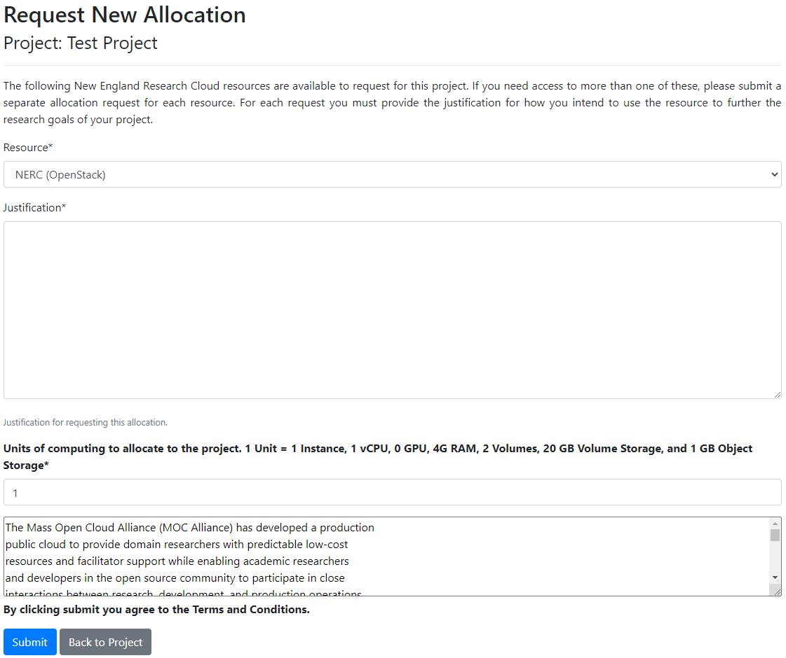
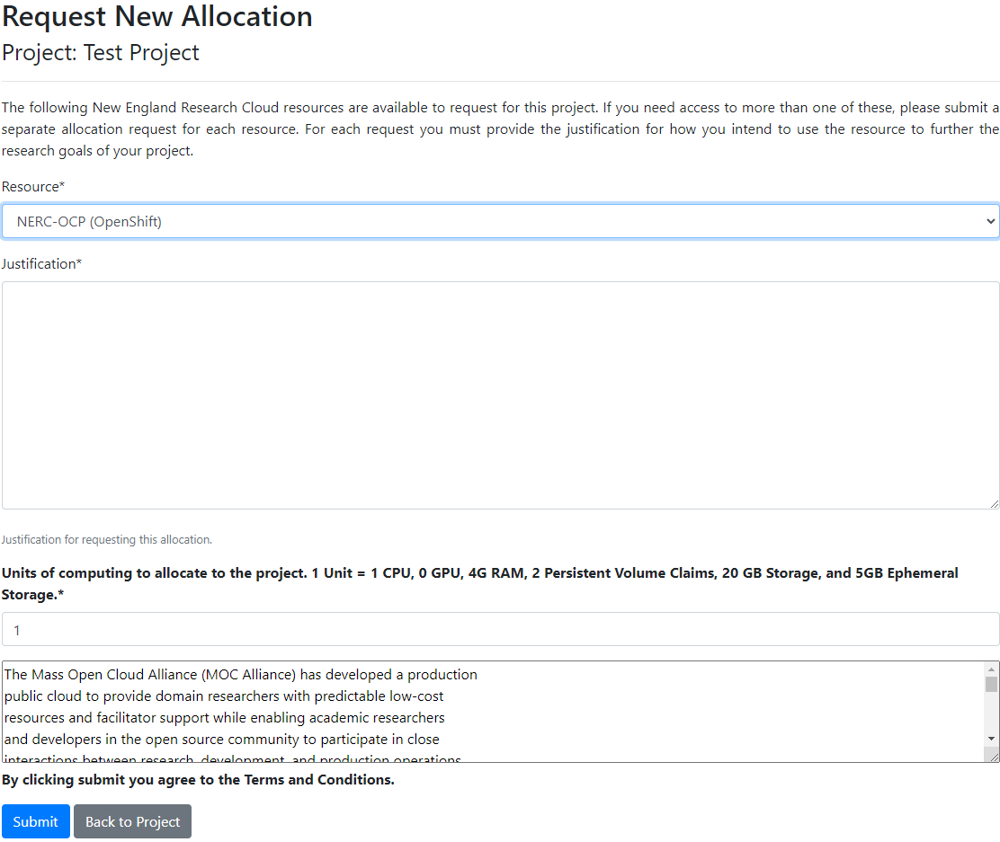
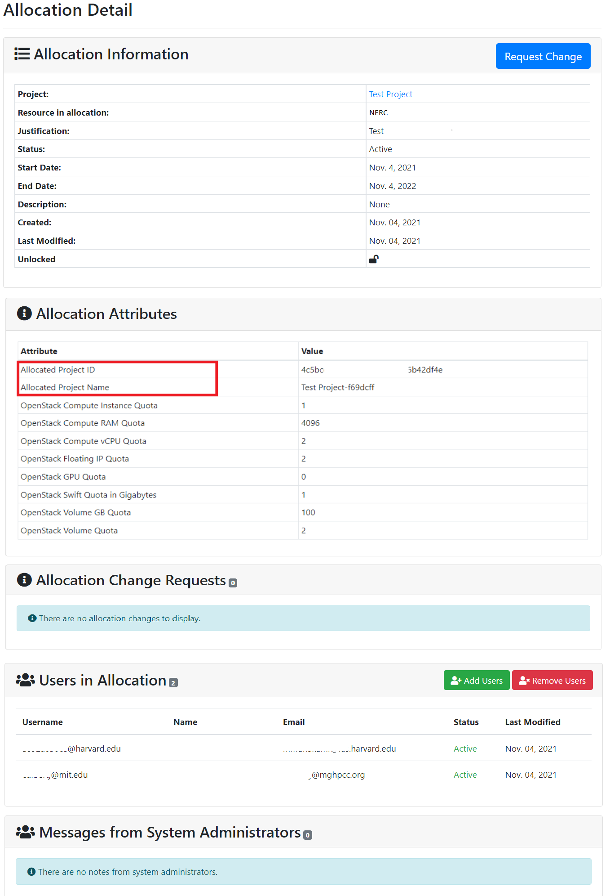
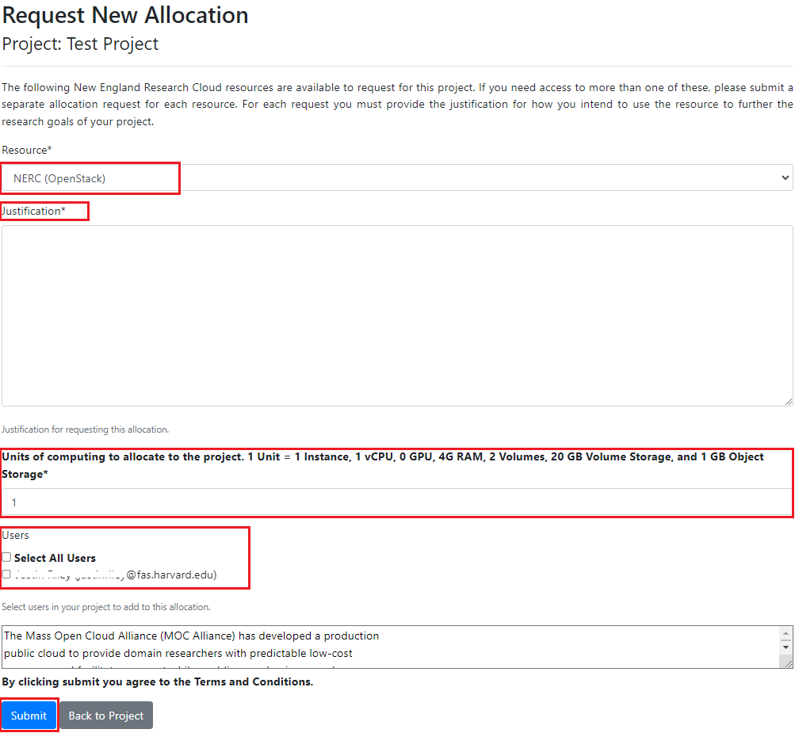
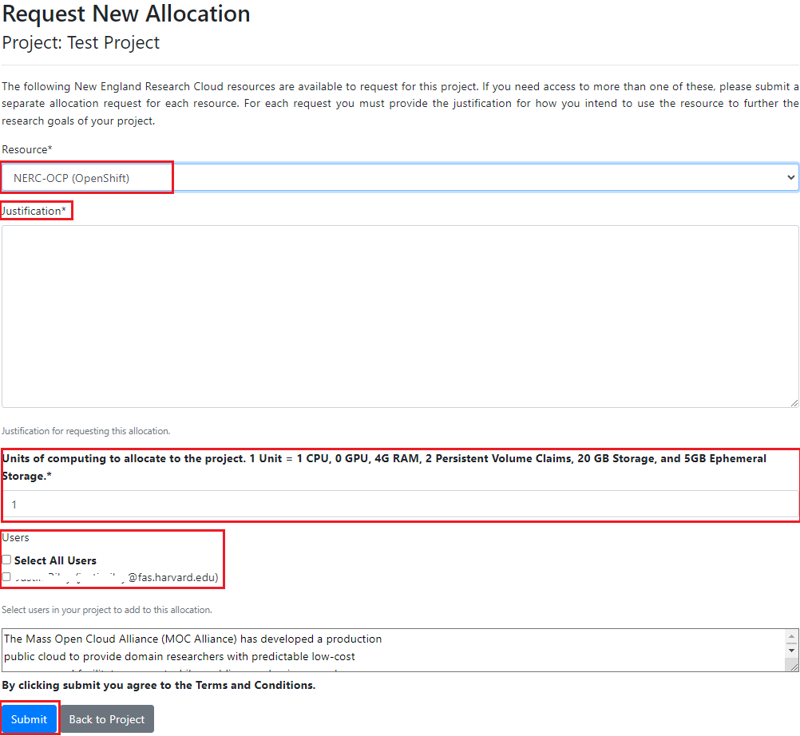
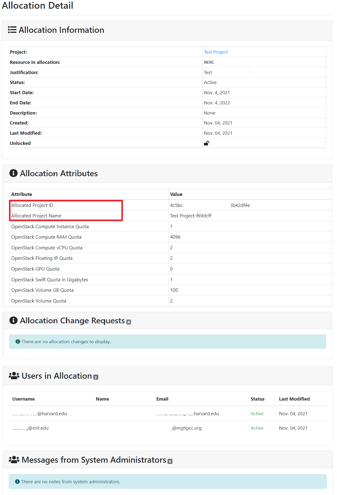
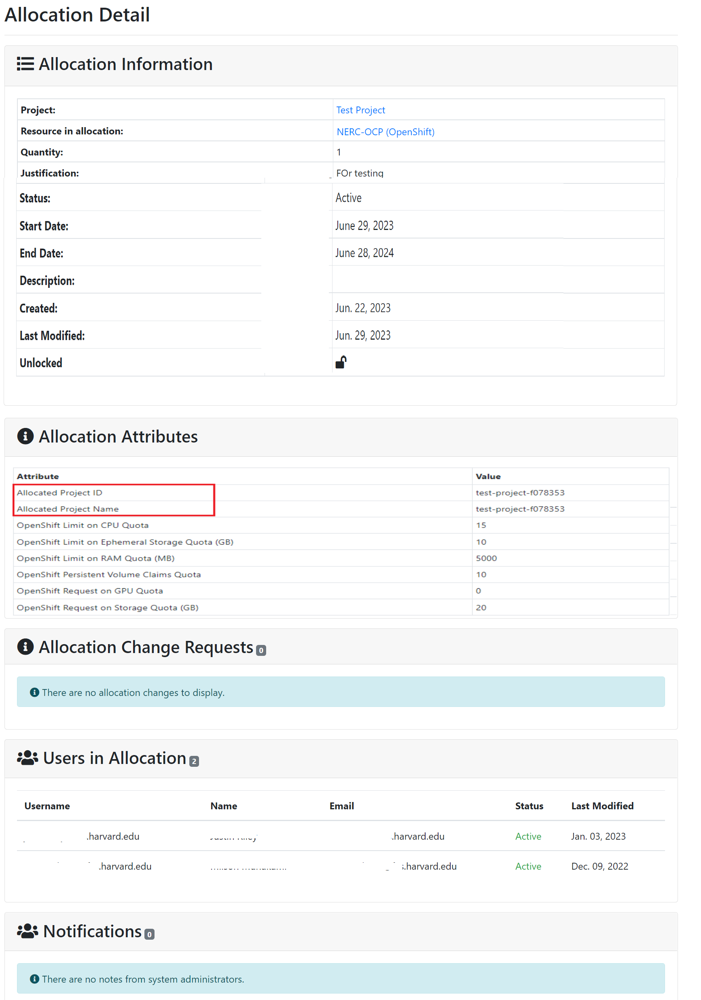

# What is NERC's ColdFront?

NERC uses [NERC’s ColdFront interface](https://coldfront.mss.mghpcc.org/), an
open source resource allocation management system called
[ColdFront](https://github.com/ubccr/coldfront) to provide a single point-of-entry
for administration, reporting, and measuring scientific impact of NERC resources
for PI.

## How to get access to NERC's ColdFront

General Users who are not PIs or Managers on a project see a read-only view of the
NERC's ColdFront.

Whereas, once a PI Account request is granted, the PI will receive an email confirming
the request approval and how to connect NERC’s ColdFront.

PI or project managers can use NERC's ColdFront as a self-service web-portal to do
the following tasks:

- Add or manage or archive projects

- Request allocations that fall under projects to NERC’s resources such as clusters,
cloud resources, servers, storage, and software licenses

- Add/remove user access to/from allocated resources who is a member of the project
without requiring system administrator interaction

- Elevate selected users to 'manager' status, allowing them to handle some of the
PI asks such as request new resource allocations, add/remove users to/from resource
allocations, add project data such as grants and publications

- Monitor resource utilization such as storage and cloud usage

- Receive email notifications for expiring/renewing access to resources as well as
notifications when allocations change status - i.e. activated, expired, denied

- Provide information such as grants, publications, and other reportable data for
periodic review by center director to demonstrate need for the resources

## How to login to NERC's ColdFront?

[NERC’s ColdFront interface](https://coldfront.mss.mghpcc.org/) provides user with
login page as shown here:

Please click on "**Log In**" button. Then, it will show the login interface as
shown below:

You need to click on "**Log in via OpenID Connect**" button. This will redirect you
to CILogon welcome pagewhere you can select your appropriate Identity Provider as
shown below:

Once successful, you will be redirected to the ColdFront's main dashboard as shown
below:

## What PIs need to fill in order to request a Project?

Once logged in to NERC’s ColdFront, PIs can choose Projects sub-menu located under
the Project menu.

On clicking the "Add a project" button will show interface like below:

!!! danger "Project Title Length Limitation"
    Please ensure that the project title is both concise and does not exceed a
    length of 63 characters.

PIs need to specify an appropriate title (**less than 63 characters**), description
of their research work that will be performed on the NERC (in one or two paragraphs),
the field(s) of science or research domain(s), and then click the "Save" button.
Once saved successfully, PIs effectively become the "manager" of the project, and
are free to add or remove users and also request resource allocation(s) to any Projects
for which they are the PI. PIs are permitted to add users to their group, request
new allocations, renew expiring allocations, and provide information such as
publications and grant data. PIs can maintain all their research information under
one project or, if they require, they can separate the work into multiple projects.

## How to request a new Resource Allocation

### Request A New OpenStack Resource Allocation for OpenStack Project

!!! warning "Very Important"
    Make sure to select **NERC (OpenStack)** on Resource option and specify
    your expected Units of computing. Be mindful, you can extend your current resource
    allocations on your current project later on by following [this documentation](#request-change-resource-allocation-attributes-for-openstack-project).

#### Resource Allocation Quotas for OpenStack Project

The amount of quota to start out a resource allocation after approval, can be
specified using an integer field in the resource allocation request form as shown
above. The provided unit value is computed as PI or project managers request
resource quota. The basic unit of computational resources is defined in terms of
integer value that corresponds to multiple OpenStack resource quotas. For example,
1 Unit corresponds to:

| Resource Name         | Quota Amount x Unit                   |
| :-------------------: | :-----------------------------------: |
| `Instances`           | 1                                     |
| `vCPUs`               | 1                                     |
| `GPU`                 | 0                                     |
| `RAM(MB)`                 | 4096                                  |
| `Volumes`             | 2                                     |
| `Volume Storage(GB)`  | 20                                  |
| `Object Storage(GB)`  | 1                                     |

!!! info "Information"
    By default, **2 OpenStack Floating IPs**, **10 Volume Snapshots** and **10 Security
    Groups** are provided to each approved projects regardless of units of requested
    quota units.

### Request A New OpenShift Resource Allocation for OpenShift project

#### Resource Allocation Quotas for OpenShift Project

The amount of quota to start out a resource allocation after approval, can be
specified using an integer field in the resource allocation request form as shown
above. The provided unit value is computed as PI or project managers request
resource quota. The basic unit of computational resources is defined in terms of
integer value that corresponds to multiple OpenShift resource quotas. For example,
1 Unit corresponds to:

| Resource Name         | Quota Amount x Unit                   |
| :-------------------: | :-----------------------------------: |
| `vCPUs`               | 1                                     |
| `GPU`                 | 0                                     |
| `RAM(MB)`                 | 4096                                  |
| `Persistent Volume Claims (PVC)`             | 2                                     |
| `Storage(GB)`  | 20                                  |
| `Ephemeral Storage(GB)`  | 5                                     |

!!! warning "Very Important"
    Make sure to select **NERC-OCP (OpenShift)** on Resource option(Remember: the
    first option i.e. **NERC (OpenStack)** is selected by default!) and specify
    your expected Units of computing. Be mindful, you can extend your current resource
    allocations on your current project later on by following [this documentation](#request-change-resource-allocation-attributes-for-openshift-project).

## Adding and removing User from the Project

A user can only view projects they are on. PIs or managers can add or remove users
from their respective projects by navigating to the Users section of the project.

Once we click on the "Add Users" button, it will shows the following search interface:

They can search for any users in the system that are not already part of the project
by providing exact matched username or partial text of other multiple fields. The
search results show details about the user account such as email address, username,
first name, last name etc. as shown below:

!!! warning "Delegating user as 'Manager'"
    When adding a user to your project you can optionally designate them as a
    "Manager" by selecting their role using the drop down next to their email.
    Read more about user roles
    [here](#user-roles).

Thus, found user(s) can be selected and assigned directly to the available resource
allocation(s) on the given project using this interface. While adding the users,
their Role also can be selected from the dropdown options as either User or Manager.
Once confirmed with selection of user(s) their roles and allocations, click on the
"Add Selected Users to Project" button.

Removing Users from the Project is straightforward by just clicking on the
"Remove Users" button. Then it shows the following interface:

PI or project managers can select the user(s) and then click on the "Remove Selected
Users From Project" button.

## Notifications

All users on a project will receive notifications about allocations including
reminders of upcoming expiration dates and status changes. Users may uncheck
the box next to their username to turn off notifications. Managers and PIs on
the project are not able to turn off notifications.

## User Roles

Access to ColdFront is role based so users see a read-only view of the allocation
details for any allocations they are on. PIs see the same allocation details as general
users and can also add project users to the allocation if they're not already on
it. Even on the first time, PIs add any user to the project as the User role. Later
PI or project managers can delegate users on their project to the 'manager' role.
This allows multiple managers on the same project. This provides the user with the
same access and abilities as the PI. The only things a PI can do that a manager can't,
is create a new project or archive a project. All other project related tasks that
a PI can do, a manager on that project can accomplish as well. A "Manager" is a user
who has the same permissions as the PI to add/remove users, request/renew allocations,
add/remove project info such as grants, publications, and research output.
Managers may also complete the annual project review.

General User Accounts are not able to create/update projects and request Resource
Allocations. Instead, these accounts must be associated with a Project that has
Resources. General User accounts that are associated with a Project have access
to view their project details and use all the resources associated with the Project
on NERC.

General Users (not PIs or Managers) can turn off email notifications at the project
level. PIs also have the 'manager' status on a project. Managers can't turn off their
notifications. This ensures they continue to get allocation expiration notification
emails.

## Delegating User to Manager Role

You can also modify a users role at any time by clicking on the Edit button next
to the user's name.

To change a user's role to 'manager' click on the edit icon next to the user's name
on the Project Detail page:

Then toggle the "Role" from User to Manager:

!!! warning "Very Important"
    Make sure to click the "Update" button to save the change.

    This delegation of "Manager" role can be done when adding a user to your project.
    You can optionally designate them as a "Manager" by selecting their role using
    the drop down next to their email as described [here](#adding-and-removing-user-from-the-project).

## PI and Manager Allocation View

PIs and managers can view important details of the allocation including start and
end dates, creation and last modified dates, users on the allocation and public
allocation attributes. PIs and managers can add or remove users from allocations.

### PI and Manager Allocation View of OpenStack Resource Allocation

### PI and Manager Allocation View of OpenShift Resource Allocation

## Adding and removing project Users to project Resource Allocation

Any available users on a given project can be added to resource allocation by
clicking on the "Add Users" button as shown below:

Once Clicked it will show the following interface where PIs can select the available
user(s) on the checkboxes and click on the "Add Selected Users to Allocation" button.

!!! warning "Very Important"
    The desired user must already be on the project to be added to the allocation.

Removing Users from the Resource Allocation is straightforward by just clicking on
the "Remove Users" button. Then it shows the following interface:

PI or project managers can select the user(s) on the checkboxes and then click on
the "Remove Selected Users From Project" button.

## Request change to Resource Allocation to an existing project

If past resource allocation is not sufficient for an existing project, PIs or project
managers can request for change by clicking "Request Change" button on project
resource allocation detail page as show below:

This will bring up the detailed Quota attributes for that project as shown below:

### Request Change Resource Allocation Attributes for OpenStack Project

### Request Change Resource Allocation Attributes for OpenShift Project

PI or project managers can provide a new value for the individual quota attributes,
and give justification for the requested changes so that the NERC admin can review
the change request and approve or deny based on justification and quota change request.
Then submitting the change request, this will notify the NERC admin about it. Please
wait untill the NERC admin approves/ deny the change request to see the change on
your resource allocation for the selected project.

!!! info "Information"
    PI or project managers can put the new values on the textboxes for **ONLY** quota
    attributes they want to change others they can **left blank** so that will not
    get changed!

Once the request is processed by the NERC admin, any user can view that request change
trails for the project by looking at the "Allocation Change Requests" section that
looks like below:

### Allocation Change Requests for OpenStack Project

Any user can click on Action button to view the details about the change request.
This will show more details about the change request like below:

### Allocation Change Requests for OpenShift Project

Any user can click on Action button to view the details about the change request.
This will show more details about the change request like below:

## Adding a new Resource Allocation to the project

If one resource allocation is not sufficient for a project, PI or project managers
can request for another allocation(s) by clicking on the "Request Resource Allocation"
button on the Allocations section of the project details. This will show the page
where all existing users for the project will be listed on the bottom of the request
form. PIs can select all or only desired user(s) to request the resource allocations
to be available on NERC's OpenStack or OpenShift projects.

### Adding a new Resource Allocation to your OpenStack project

### Adding a new Resource Allocation to your OpenShift project

## General User View

General Users who are not PIs or Managers on a project see a read-only view of the
allocation details. If a user is on a project but not a particular allocation, they
will not be able to see the allocation in the Project view nor will they be able
to access the Allocation detail page.

### General User View of OpenStack Resource Allocation

### General User View of OpenShift Resource Allocation

## Allocation Renewals

When the requested allocation is approved, it must have an expiration date - which
is normally 365 days or 1 year from the date it is approved. Automated emails are
triggered to all users on an allocation when the expiration date is 60 days away,
30 days, 7 days, and then expired, unless the user turns off notifications on the
project.

!!! danger "Very Important"
    If the allocation renewal isn't processed prior to the original allocation
    expiration date by the PI or Manager, the allocation will expire and the
    allocation users will get a notification email letting them know the allocation
    has expired!

Allocation renewals may not require any additions or changes to the allocation
attributes from the PI or Manager. By default, if the PI or Manager clicks on
the 'Activate' button as shown below:

Then it will prompt for confirmation and allow the admin to review and submit the
activation request by clicking on 'Submit' button as shown below:

Emails are sent to all allocation users letting them know the renewal request has
been submitted.

Then the allocation status will change to "Renewal Requested" as shown below:

Once the renewal request is reviewed and approved by NERC admins, it will change
into "Active" status and the expiration date is set to another 365 days as shown
below:

Then an automated email notification will be sent to the PI and all users on the
allocation that have enabled email notifications.

---
