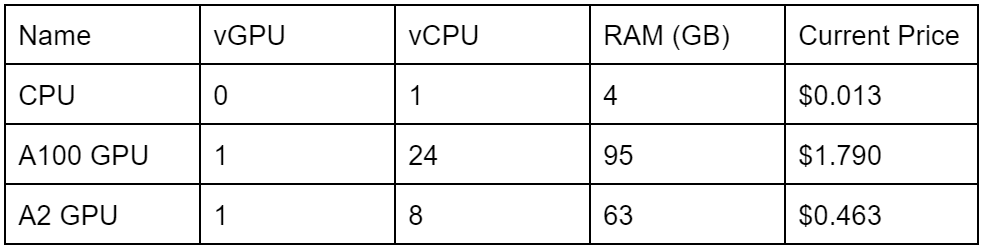

# How does NERC pricing work?

NERC offers you a **pay-as-you-go** approach for pricing for our cloud infrastructure
offerings (Tiers of Service), including Infrastructure-as-a-Service (IaaS) - OpenStack,
Platform-as-a-Service (PaaS) - OpenShift and NERC Storage Tiers. NERC offers a flexible
cost model where users are billed solely for the specific services you require,
for the duration of their usage based on users approved resource quotas, without
any obligations of long-term contracts or complicated licensing agreements.

## Calculations

### Service Units (SU)

## Breakdown

### CPU/GPU SU

Service Units can only be purchased as a whole unit. We will charge for Pods and
VMs on a per hour basis, for any portion of an hour they are used, and any VM
"flavor"/Pod reservation is charged as a multiplier of the base SU for the maximum
resource they reserve.

**GPU SU Example:**
    - A Pod or VM with:
        - 1 A100 GPU + 48 vCPUs + 192MB RAM
    - Will be charged
        - 2 A100 GPU SUs due to the extra vCPUs (48 vs 24)

**CPU Example:**
    - A Pod or VM with:
        - 3 vCPU + 20 GB RAM
    - Will be charged
        - 5 CPU SUs due to the extra RAM (20GB vs 12GB(3*4GB))

OpenShift Pods are summed up to the project level so that fractions of CPU/RAM
that some pods use will not get overcharged. This will be split between CPU and
GPU pods as GPU pods cannot currently share resources with CPU pods.

### Storage

Storage is charged separately at a rate of $0.009 TB/hr or $9.00E-12 KB/hr at a
granularity of KB/hr. For ease of display, storage SUs are shown in GB but calculated
in KB. OpenStack Volumes count until they are deleted. VM’s reserve volumes and
you can also create extra volumes yourself. In OpenShift Pods only hold on to storage
while they are active and Persistent Volumes hold onto storage until they are deleted.

Storage includes all types of storage Object, Block, Ephemeral & Image.

!!! note "Please note"
    A Shutoff OpenStack VM will not use CPU or RAM but it will continue to use storage.

    Any extra Images you create will also use storage.

### High Level Function

For those who visualize better when they can use a function to think about how
something works, here is a function of how the calculation works for OpenShift
and OpenStack.

1. **OpenStack** = (Resource (vCPU/RAM) assigned to VM flavor converted to number
of SU) * (time VM has been running), rounded up to whole hour + Extra storage

    !!! info "NERC's OpenStack Flavor List"
        You can find the most up-to-date information on the current NERC's OpenStack
        flavor by referring to [this page](../openstack/create-and-connect-to-the-VM/flavors.md).

2. **OpenShift** = (Resource (vCPU/RAM) requested by Pod converted to  number of
SU) * (time Pod was running), rounded up to whole hour

## Format

### Combined Data CSV

This is the format of the csv that we will gather from ColdFront, Keycloak, OpenShift,
and OpenStack so that we can calculate the [**Monthly Invoicing Data**](#monthly-invoicing-data-csv).

### Monthly Invoicing Data CSV

This is the format of the data we wish to send to the Invoicing software so that
it provides all the information they need to invoice an institution and allow that
institution to properly allocate costs to their PIs, and for their PIs to properly
track what projects are costing them what. SU Type is broken into 4 types (CPU,
100 GPU, A2 GPU, and Storage). SU Hours represents GB hrs for Storage and Resource
Hours grouped as described in the [**SU section**](#service-units-su).

## Frequently Asked Questions

???+ question "1. Are we only billing when the VM/Pod is on?"

    Yes

??? question "2. Will OpenStack & OpenShift show on one bill?"

    Yes

??? question "3. Do servers and CPUs currently exhibit diverse core-to-memory ratios?"

    a. No Answer yet

    b. Most likely will require new flavors

        i. Keep in mind that missing flavors makes some historical data hard to
        gather properly, reason not to delete ColdFront flavors as long as they
        are still in use by any VM/Pod

??? question "4. What happens when a Flavor is expanded during the month?"

    a. Flavors cannot be expanded

    b. You can create snapshot and a new VM/Instance with that snapshot but that
    will be a new instance with a  new flavor

??? question "5. How are we charging for Bare Metal Machines?"

    Not charging yet

??? question "6. Is storage charged separately?"

    Yes, but on the same bill

??? question "7. How can we determine the requested GPU type for a Pod in OpenShift?"

    Labels, which means we need to add meaningful labels to help differentiate

??? question "8. Can we even choose between different types of GPU in OpenShift?"

    Yes, based on labels

??? question "9. For OpenShift where can we get ephemeral storage information?"

    Looking into it

??? question "10. Do we charge for storage attached to shut off instances?"

    Yes

??? question "11. Storage billing: ColdFront requests or OpenStack/Shift usage?"

    a. Yes

    b. We would bill for increases when requests are fulfilled and for decreases
    when requests are placed

    For example:

        1. I request an increase in storage, the request is approved and processed.
        At this point we start billing.

        2. I request a decrease in storage the billing for that storage stops, then
        at some point the request is processed.

    c. At a future time we should be prepared to bill on OpenStack/Shift usage

??? question "12. How to bill on fractions of a CPU/RAM SU in OpenShift?"

    OpenShift has the concept of millicpu or millicore which allows a Pod to spin
    up with a fraction of a vCPU. You can also assign as much or little RAM as you
    wish to a Pod.

    For example: A Pod could be created with 49MiB and 10m or .01 vCPU

    a. Sum up to the Project Level and round up SUs

        i. Is it the case that for GPU SUs as long as they are running they are
        eating up ¼ or ⅛ of a system no matter howmany vCPUs or memory they use?

---
