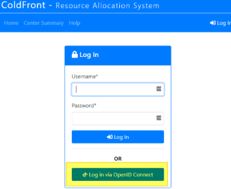
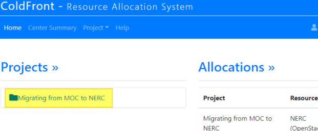
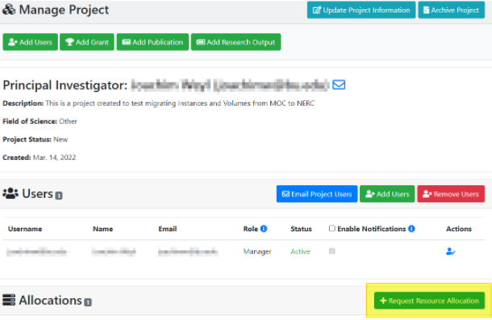
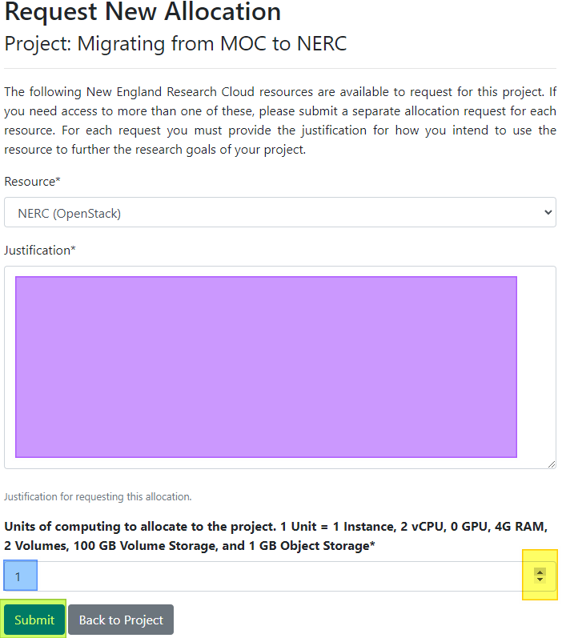
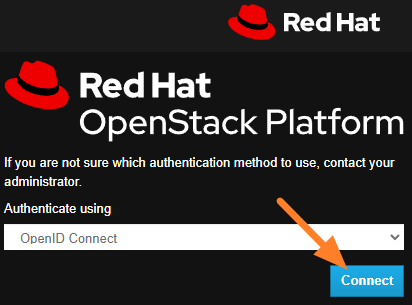
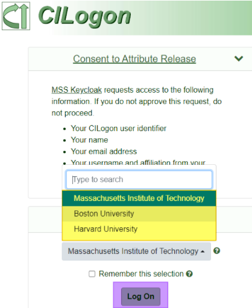
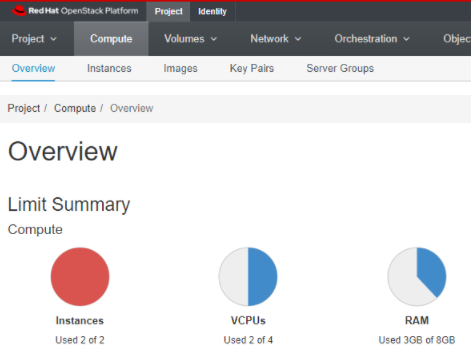

# Creating NERC Project and Networks

This process includes some waiting for emails and approvals. It is advised to
start this process and then move to [step
2](../Step2/)
and continue with these steps once you recieve approval.

## Account Creation & Quota Request

1. Register for your new NERC account
[here](https://regapp.mss.mghpcc.org/reglanding/).

    1. Wait for an approval email.

1. Register to be a PI for a NERC account
[here](https://docs.google.com/forms/d/e/1FAIpQLSdscMlm3TQR09sl7P-0n4oN1uzpd7YikqDubEYF2QDLVz6djA/viewform?pli=1&fbzx=-8227359805748438031).

    1. Wait for an approval email.

1. Request the quota necessary for all of your MOC Projects to be added
to NERC [here](https://coldfront.mss.mghpcc.org/user/login)
(link also in PI approval email).

    

    1. Log in with your institution login by clicking on
    **Log in via OpenID Connect** (highlighted in yellow above).

        

    1. Under Projects>> Click on the name of your project
    (highlighted in yellow above).

        

    1. Scroll down until you see **Request Resource Allocation**
    (highlighted in yellow above) and click on it.

        

    1. Fill out the Justification (highlighted in purple above) for
    the quota allocation.

    1. Using your “MOC Instance information” table you gathered from your MOC
    project calculate the total number of Instances, VCPUs, RAM and use your
    “MOC Volume Information” table to calculate Disk space you will need.

    1. Using the up and down arrows (highlighted in yellow above) or by
    entering the number manually select the multiple of 1 Instance, 2 vCPUs, 0
    GPUs, 4GB RAM, 2 Volumes and 100GB Disk and 1GB Object Storage that you
    will need.

        1. For example if I need 2 instances 2 vCPUs, 3GB RAM, 3 Volumes and
        30GB of storage I would type in 2 or click the up arrow once to select
        2 units.

    1. Click **Submit** (highlighted in green above).

1. Wait for your allocation approval email.

## Setup

### Login to the Dashboard

1. Log into the
[NERC OpenStack Dashboard](https://stack.nerc.mghpcc.org/dashboard)
using your OpenID Connect password.

    

    1. Click **Connect**.

        

    1. Select your institution from the drop down (highlighted in yellow
    above).

    1. Click **Log On** (highlighted in purple).

    1. Follow your institution's log on instructions.

### Setup NERC Network

1. You are then brought to the Project>Compute>Overview location of
the Dashboard.

    

    1. This will look very familiar as the MOC and NERC Dashboard are quite
    similar.

    1. Follow the instructions
    [here](https://nerc-project.github.io/nerc-docs/openstack/advanced-openstack-topics/setting-up-a-network/set-up-a-private-network/)
    to set up your network/s (you may also use the default_network
    if you wish).

        1. The networks don't have to exactly match the MOC. You only need the
        networks for creating your new instances (and accessing them once we
        complete the migration).

    1. Follow the instructions
    [here](https://nerc-project.github.io/nerc-docs/openstack/advanced-openstack-topics/setting-up-a-network/create-a-router/)
    to set up your router/s (you may also use the default_router if you wish).

    1. Follow the instructions
    [here](https://nerc-project.github.io/nerc-docs/openstack/access-and-security/security-groups/)
    to set up your Security Group/s.

        1. This is where you can use your “MOC Security Group Information”
        table to create similar Security Groups to the ones you had in the MOC.

    1. Follow the instructions
    [here](https://nerc-project.github.io/nerc-docs/openstack/access-and-security/create-a-key-pair/)
    to set up your SSH Key-pair/s.

---
