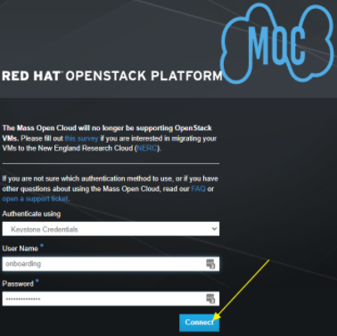
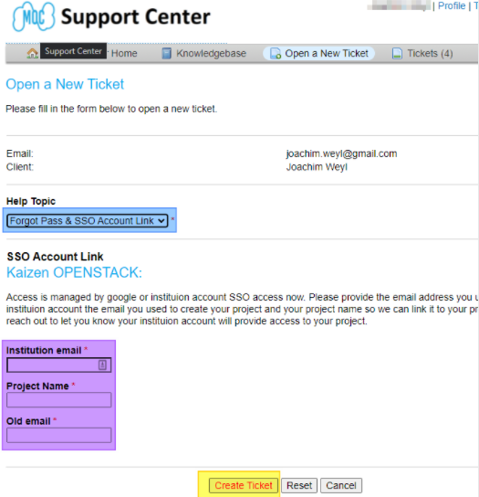
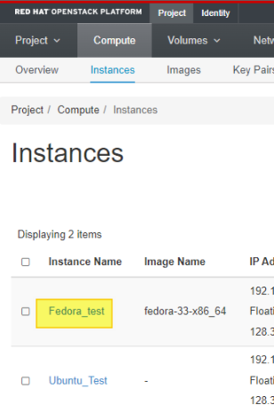
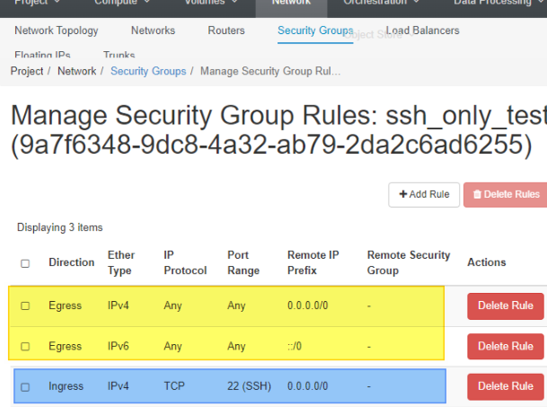

# Identify Volumes, Instances & Security Groups on the MOC that need to be Migrated to the NERC

Please read the instructions in their entirety before proceeding.
Allow yourself enough time to complete them.

Volume Snapshots will not be migrated.
If you have a Snapshot you wish to backup please "Create Volume" from it first.

## Confirm Access and Login to MOC Dashboard

1. Go to the [MOC Dashboard](http://kaizen.massopen.cloud).

### SSO / Google Login

1. If you have SSO through your Institution or google select
   _Institution Account_ from the dropdown.

    

2. Click **Connect**.

3. Click on University Logins (highlighted in yellow below)
   if you are using SSO with your Institution.

    

    1. Follow your Institution's login steps after that, and skip to
       [Gathering MOC information for the
       Migration](#gathering-moc-information-for-the-migration).

4. Click Google (highlighted in purple above) if your SSO
   is through Google.

    1. Follow standard Google login steps to get in this
       way, and skip to [Gathering MOC information for the
       Migration](#gathering-moc-information-for-the-migration).

### Keystone Credentials

1. If you have a standard login and password leave the dropdown
   as Keystone Credentials.

    

2. Enter your User Name.

3. Enter your Password.

4. Click Connect.

### Don't know your login?

1. If you do not know your login information please create a
   Password Reset [ticket](https://osticket.massopen.cloud/).

    

2. Click Open a New Ticket (highlighted in yellow above).

    

3. Click the dropdown and select Forgot Pass & SSO Account
   Link (highlighted in blue above).

4. In the text field (highlighted in purple above) provide
   the Institution email, project you are working on and the email
   address you used to create the account.

5. Click **Create Ticket** (highlighted in yellow above) and
   wait for the pinwheel.

6. You will receive an email to let you know that the MOC support
   staff will get back to you.

## Gathering MOC information for the Migration

1. You are then brought to the Project>Compute>Overview location of the
   Dashboard.

    

### Create Tables to hold your information

Create 3 tables of all of your Instances, your Volumes and Security Groups,
for example, if you have 2 instances, 3 volumes and 2 Security Groups like the
samples below your lists might look like this:

#### MOC Instance Information Table

| Instance Name | MOC VCPUs | MOC Disk | MOC RAM | MOC UUID                             |
| ------------- | --------- | -------- | ------- | ------------------------------------ |
| Fedora_test   | 1         | 10GB     | 1GB     | 16a1bfc2-8c90-4361-8c13-64ab40bb6207 |
| Ubuntu_Test   | 1         | 10GB     | 2GB     | 6a40079a-59f7-407c-9e66-23bc5b749a95 |
| total         | 2         | 20GB     | 3GB     |                                      |

#### MOC Volume Information Table

| MOC Volume Name                      | MOC Disk | MOC Attached To | Bootable | MOC UUID                             | NERC Volume Name |
| ------------------------------------ | -------- | --------------- | -------- | ------------------------------------ | ---------------- |
| Fedora                               | 10GiB    | Fedora_test     | Yes      | ea45c20b-434a-4c41-8bc6-f48256fc76a8 |                  |
| 9c73295d-fdfa-4544-b8b8-a876cc0a1e86 | 10GiB    | Ubuntu_Test     | Yes      | 9c73295d-fdfa-4544-b8b8-a876cc0a1e86 |                  |
| Snapshot of Fed_Test                 | 10GiB    | Fedora_test     | No       | ea45c20b-434a-4c41-8bc6-f48256fc76a8 |                  |
| total                                | 30GiB    |                 |          |                                      |                  |

#### MOC Security Group Information Table

| Security Group Name | Direction | Ether Type | IP Protocol | Port Range | Remote IP Prefix |
| ------------------- | --------- | ---------- | ----------- | ---------- | ---------------- |
| ssh_only_test       | Ingress   | IPv4       | TCP         | 22         | 0.0.0.0/0        |
| ping_only_test      | Ingress   | IPv4       | ICMP        | Any        | 0.0.0.0/0        |

### Gather the Instance Information

Gather the Instance UUIDs (of only the instances that you need to migrate
to the NERC).

1. Click
   [Instances](https://kaizen.massopen.cloud/dashboard/project/instances/)
   (highlighted in pink in image above)

    

2. Click the Instance Name (highlighted in Yellow above) of the first
   instance you would like to gather data on.

    

3. Locate the ID row (highlighted in green above) and copy and save the ID
   (highlighted in purple above).

    1. This is the UUID of your first Instance.

4. Locate the RAM, VCPUs & Disk rows (highlighted in yellow) and copy and
   save the associated values (highlighted in pink).

5. Repeat this [section](#gather-the-instance-information) for each
   Instance you have.

### Gather the Volume Information

Gather the Volume UUIDs (of only the volumes that you need to migrate
to the NERC).

1. Click Volumes dropdown.

2. Select [Volumes](https://kaizen.massopen.cloud/dashboard/project/volumes/)
   (highlighted in purple above).

    

3. Click the Volume Name (highlighted in yellow above) of the first
   volume you would like to gather data on.

    1. The name might be the same as the ID (highlighted in blue above).

        

4. Locate the ID row (highlighted in green above) and copy and save the ID
   (highlighted in purple above).

    1. This is the UUID of your first Volume.

5. Locate the Size row (highlighted in yellow above) and copy and save
   the Volume size (highlighted in pink above).

6. Locate the Bootable row (highlighted in gray above) and copy and save
   the Volume size (highlighted in red above).

7. Locate the Attached To row (highlighted in blue above) and copy and save
   the Instance this Volume is attached to (highlighted in orange above).

    1. If the volume is not attached to an image it will state
       "Not attached".

8. Repeat this [section](#gather-the-volume-information) for each Volume
   you have.

### Gather your Security Group Information

If you already have all of your Security Group information outside of the
OpenStack Dashboard skip to the section.

Gather the Security Group information (of only the security groups that you
need to migrate to the NERC).

1. Click Network dropdown

2. Click
   [Security](https://kaizen.massopen.cloud/dashboard/project/security_groups/)
   Groups (highlighted in yellow above).

    

3. Click **Manage Rules** (highlighted in yellow above) of the first
   Security Group you would like to gather data on.

    

4. Ignore the first 2 lines (highlighted in yellow above).

5. Write down the important information for all lines after (highlighted in
   blue above).

    1. Direction, Ether Type, IP Protocol, Port Range, Remote IP Prefix,
       Remote Security Group.

6. Repeat this [section](#gather-your-security-group-information)
   for each security group you have.

---
