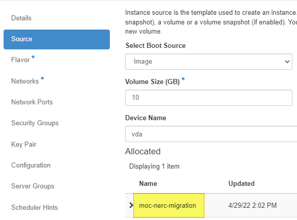
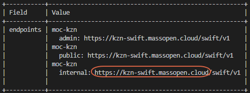

# Steps to Migrate Volumes from MOC to NERC

## Create a spreadsheet to track the values you will need

1. The values you will want to keep track of are.

    | Label              | Value                                 |
    | ------------------ | ------------------------------------- |
    | MOCAccess          |                                       |
    | MOCSecret          |                                       |
    | NERCAccess         |                                       |
    | NERCSecret         |                                       |
    | MOCEndPoint        | `https://kzn-swift.massopen.cloud`    |
    | NERCEndPoint       | `https://stack.nerc.mghpcc.org:13808` |
    | MinIOVolume        |                                       |
    | MOCVolumeBackupID  |                                       |
    | ContainerName      |                                       |
    | NERCVolumeBackupID |                                       |
    | NERCVolumeName     |                                       |

2. It is also helpful to have a text editor open so that you can insert
   the values from the spreadsheet into the commands that need to be run.

## Create a New MOC Mirror to NERC Instance

1. Follow the instructions
   [here](https://docs.massopen.cloud/en/latest/openstack/launch-a-vm.html)
   to set up your instance.

    

    1. When selecting the Image please select **moc-nerc-migration**
       (highlighted in yellow above).

    2. Once the Instance is _Running_ move onto the next step

2. Name your new instance something you will remember, `MirrorMOC2NERC`
   for example.

3. Assign a Floating IP to your new instance. If you need assistance please
   review the Floating IP steps [here][floatingip].

    [floatingip]: https://docs.massopen.cloud/en/latest/openstack/assign-a-floating-ip.html

    1. Your floating IPs will not be the same as the ones you had in the
       MOC. Please claim new floating IPs to use.

4. SSH into the MirrorMOC2NERC Instance. The user to use for login is `centos`.
   If you have any trouble please review the SSH steps [here][sshmoc].

[sshmoc]: https://docs.massopen.cloud/en/latest/openstack/ssh-to-cloud-vm.html

## Setup Application Credentials

### Gather MOC Application Credentials

1. Follow the instructions [here][appcred] to create your Application
   Credentials.

    [appcred]: https://docs.massopen.cloud/en/latest/openstack/application-credentials.html

    1. Make sure to save the `clouds.yaml` as `clouds_MOC.yaml`.

### Gathering NERC Application Credentials

1. Follow the instructions under the header _Command Line setup_
   [here][cli] to create your Application Credentials.

    [cli]: https://nerc-project.github.io/nerc-docs/openstack/openstack-cli/openstack-CLI/

    1. Make sure to save the `clouds.yaml` as `clouds_NERC.yaml`.

### Combine the two clouds.yaml files

1. Make a copy of `clouds_MOC.yaml` and save as `clouds.yaml`

2. Open `clouds.yaml` in a text editor of your choice.

    

    1. Change the `openstack` (highlighted in yellow above) value to `moc`
       (highlighted in yellow two images below).

3. Open `clouds_NERC.yaml` in a text editor of your choice.

    

    1. Change the `openstack` (highlighted in yellow above) value to `nerc`
       (highlighted in green below).

    2. Highlight and copy everything from nerc to the end of the line that
       starts with auth_type

        

    3. Paste the copied text into `clouds.yaml` below the line that starts
       with auth_type. Your new `clouds.yaml` will look similar to the image
       above.

4. For further instructions on `clouds.yaml` files go
   [Here](https://docs.massopen.cloud/en/latest/openstack/clouds.yaml.html).

### Moving Application Credentials to VM

1.  SSH into the VM created at the top of this page for example `MirrorMOC2NERC`.

2.  Create the openstack config folder and empty `clouds.yaml` file.

        mkdir -p ~/.config/openstack
        cd ~/.config/openstack
        touch clouds.yaml

3.  Open the `clouds.yaml` file in your favorite text editor.
    (vi is preinstalled).

4.  Copy the entire text inside the `clouds.yaml` file on your local computer.

5.  Paste the contents of the local `clouds.yaml` file into the `clouds.yaml`
    on the VM.

6.  Save and exit your VM text editor.

## Confirm the Instances are Shut Down

1. Confirm the instances are Shut Down. This is a very important step
   because we will be using the force modifier when we make our backup. The
   volume can become corrupted if the Instance is not in a Shut Down state.

2. Log into the Instance page of the
   [MOC Dashboard](https://kaizen.massopen.cloud/dashboard/project/instances/)

    

3. Check the _Power State_ of all of the instances you plan to migrate volumes
   from are set to _Shut Down_ (highlighted in yellow in image above).

    1. If they are not please do so from the _Actions_ Column.

        

        1. Click the drop down arrow under actions.

        2. Select _Shut Off Instance_ (blue arrow pointing to it in image
           above).

## Backup and Move Volume Data from MOC to NERC

1. SSH into the VM created at the top of this page. For steps on how to do
   this please see instructions [here][vmcon].

[vmcon]: https://nerc-project.github.io/nerc-docs/openstack/create-and-connect-to-the-VM/ssh-to-the-VM/

### Create EC2 credentials in MOC & NERC

1.  Generate credentials for Kaizen with the command below.

        openstack --os-cloud moc ec2 credentials create

    

    1. Copy the `access` (circled in red above) and `secret` (circled in blue
       above) values into your table as `<MOCAccess>` and `<MOCSecret>`.

2.  Generate credentials for the NERC with the command below.

        openstack --os-cloud nerc ec2 credentials create

    

    1. Copy the `access` (circled in red above) and `secret` (circled in blue
       above) values into your table as as `<NERCAccess>`
       and `<NERCSecret>`.

### Find Object Store Endpoints

1.  Look up information on the `object-store` service in MOC with the command
    below.

        openstack --os-cloud moc catalog show object-store -c endpoints

    

    1. If the value is different than `https://kzn-swift.massopen.cloud` copy
       the base URL for this service (circled in red above).

2.  Look up information on the `object-store` service in NERC with the command
    below.

        openstack --os-cloud nerc catalog show object-store -c endpoints

    

    1. If the value is different than `https://stack.nerc.mghpcc.org:13808`
       copy the base URL for this service (circled in red above).

### Configure minio client aliases

1.  Create a MinIO alias for MOC using the base URL of the "public"
    interface of the object-store service `<MOCEndPoint>` and the EC2 access key
    (ex. `<MOCAccess>`) & secret key (ex. `<MOCSecret>`) from your table.

        $ mc alias set moc https://kzn-swift.massopen.cloud <MOCAccess> <MOCSecret>
        mc: Configuration written to `/home/centos/.mc/config.json`. Please update your access credentials.
         mc: Successfully created `/home/centos/.mc/share`.
        mc: Initialized share uploads `/home/centos/.mc/share/uploads.json` file.
        mc: Initialized share downloads `/home/centos/.mc/share/downloads.json` file.
        Added `moc` successfully.

2.  Create a MinIO alias for NERC using the base URL of the "public"
    interface of the object-store service `<NERCEndPoint>` and the EC2 access key
    (ex. `<NERCAccess>`) & secret key (ex. `<NERCSecret>`) from your table.

        $ mc alias set nerc https://stack.nerc.mghpcc.org:13808 <NERCAccess> <NERCSecret>
        Added `nerc` successfully.

### Backup MOC Volumes

1.  Locate the desired Volume UUID from the table you created in
    [Step 2 Gathering MOC Information](./Step2.md#moc-volume-information-table).

2.  Add the first Volume ID from your table to the code below in the
    `<MOCVolumeID>` field and create a Container Name to replace the
    `<ContainerName>` field. Container Name should be easy to remember as well
    as unique so include your name. Maybe something like `thomasa-backups`.

        openstack --os-cloud moc volume backup create --force --container <ContainerName> <MOCVolumeID>
        +-------+---------------------+
        | Field | Value               |
        +-------+---------------------+
        | id    | <MOCVolumeBackupID> |
        | name  | None                |

    1. Copy down your `<MOCVolumeBackupID>` to your table.

3.  Wait for the backup to become available. You can run the command below to
    check on the status. If your volume is 25 or larger this might be a good time
    to go get a warm beverage or lunch.

        openstack --os-cloud moc volume backup list
        +---------------------+------+-------------+-----------+------+
        | ID                  | Name | Description | Status    | Size |
        +---------------------+------+-------------+-----------+------+
        | <MOCVolumeBackupID> | None | None        | creating  |   10 |
        ...
        openstack --os-cloud moc volume backup list
        +---------------------+------+-------------+-----------+------+
        | ID                  | Name | Description | Status    | Size |
        +---------------------+------+-------------+-----------+------+
        | <MOCVolumeBackupID> | None | None        | available |   10 |

### Gather MinIO Volume data

1.  Get the volume information for future commands. Use the same
    `<ContainerName>` from when you created the volume backup. It is worth
    noting that this value shares the ID number with the VolumeID.

        $ mc ls moc/<ContainerName>
        [2022-04-29 09:35:16 EDT]     0B <MinIOVolume>/

### Create a Container on NERC

1.  Create the NERC container that we will send the volume to. Use
    the same `<ContainerName>` from when you created the volume backup.

        $ mc mb nerc/<ContainerName>
        Bucket created successfully `nerc/<ContainerName>`.

### Mirror the Volume from MOC to NERC

1.  Using the volume label from MinIO `<MinIOVolume>` and the `<ContainerName>`
    for the command below you will kick off the move of your volume. This takes
    around 30 sec per GB of data in your volume.

        $ mc mirror moc/<ContainerName>/<MinIOVolume> nerc/<ContainerName>/<MinIOVolume>
        ...123a30e_sha256file:  2.61GB / 2.61GB [=========...=========] 42.15Mib/s 1m3s

### Copy the Backup Record from MOC to NERC

1.  Now that we've copied the backup _data_ into the NERC environment, we need
    to register the backup with the NERC backup service. We do this by copying
    metadata from MOC. You will need the original `<MOCVolumeBackupID>` you used
    to create the original Backup.

        openstack --os-cloud moc volume backup record export -f value <MOCVolumeBackupID> > record.txt

2.  Next we will import the record into NERC.

        openstack --os-cloud nerc volume backup record import -f value $(cat record.txt)
        <NERCVolumeBackupID>
        None

    1. Copy `<NERCVolumeBackupID>` value into your table.

### Create an Empty Volume on NERC to Receive the Backup

1.  Create a volume in the NERC environment to receive the backup. This must be
    the same size or larger than the original volume which can be changed by
    modifying the `<size>` field. Remove the "--bootable" flag if you are not
    creating a bootable volume. The `<NERCVolumeName>` field can be any name you
    want, I would suggest something that will help you keep track of what instance
    you want to attach it to. Make sure to fill in the table you created in
    [Step 2](./Step2.md#moc-volume-information-table)with the `<NERCVolumeName>`
    value in the `NERC Volume Name` column.

        openstack --os-cloud nerc volume create --bootable --size <size> <NERCVolumeName>
        +---------------------+----------------+
        | Field               | Value          |
        +---------------------+----------------+
        | attachments         | []             |
        | availability_zone   | nova           |
        ...
        | id                  | <NERCVolumeID> |
        ...
        | size                | <size>         |
        +---------------------+----------------+

### Restore the Backup

1.  Restore the Backup to the Volume you just created.

        openstack --os-cloud nerc volume backup restore <NERCVolumeBackupID> <NERCVolumeName>

2.  Wait for the volume to shift from `restoring-backup` to `available`.

        openstack --os-cloud nerc volume list
        +----------------+------------+------------------+------+-------------+
        | ID             | Name       | Status           | Size | Attached to |
        +----------------+------------+------------------+------+-------------+
        | <NERCVolumeID> | MOC Volume | restoring-backup |    3 | Migration   |
        openstack --os-cloud nerc volume list
        +----------------+------------+-----------+------+-------------+
        | ID             | Name       | Status    | Size | Attached to |
        +----------------+------------+-----------+------+-------------+
        | <NERCVolumeID> | MOC Volume | available |    3 | Migration   |

3.  Repeat these [Backup and Move Volume
    Data](#backup-and-move-volume-data-from-moc-to-nerc)
    steps for each volume you need to migrate.

## Create NERC Instances Using MOC Volumes

1. If you have volumes that need to be attached to an instance please follow
   the next steps.

2. Follow the instructions [here][launchvm] to set up your instance/s.

    [launchvm]: https://nerc-project.github.io/nerc-docs/openstack/create-and-connect-to-the-VM/launch-a-VM/

    1. Instead of using an Image for your Boot Source you will use a Volume
       (orange arrow in image below).

        

    2. Select the `<NERCVolumeName>` you created in step [Create an Empty
       Volume on NERC to Recieve the
       Backup](#create-an-empty-volume-on-nerc-to-receive-the-backup)

    3. The Flavor will be important as this decides how much vCPUs, RAM,
       and Disk this instance will consume of your total.

        1. If for some reason the earlier approved resource quota is not
           sufficient you can request further quota by following
           [these steps](https://nerc-project.github.io/nerc-docs/get-started/allocation/allocation-change-request/).

3. Repeat [this section](#create-nerc-instances-using-moc-volumes)
   for each instance you need to create.

---
