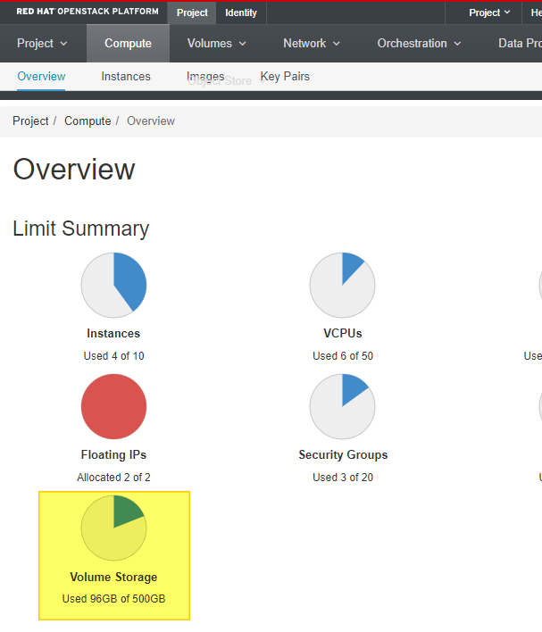
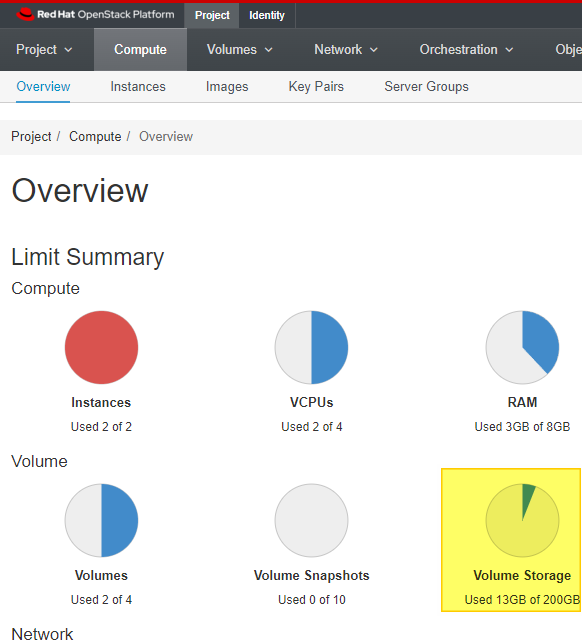

# Remove Volume Backups to Conserve Storage

If you find yourself low on Volume Storage please follow the steps below to
remove your old Volume Backups. If you are very low on space you can do this
every time you finish copying a new volume to the NERC. If on the other hand
you have plety of remaining space feel free to leave all of your Volume
Backups as they are.

1. SSH into the [MirrorMOC2NERC Instance][sshmirror]. The user to use for
   login is `centos`. If you have any trouble please review the SSH steps
   [here][sshmoc].

[sshmirror]: https://nerc-project.github.io/nerc-docs/migration-moc-to-nerc/Step3/#create-a-new-moc-mirror-to-nerc-instance
[sshmoc]: https://docs.massopen.cloud/en/latest/openstack/ssh-to-cloud-vm.html

## Check Remaining MOC Volume Storage

1. Log into the [MOC Dashboard][mocdash] and go to Project > Compute >
   Overview.

    [mocdash]: https://kaizen.massopen.cloud/dashboard/project/

    

2. Look at the Volume Storage meter (highlighted in yellow in image above).

## Delete MOC Volume Backups

1.  Gather a list of current MOC Volume Backups with the command below.

        openstack --os-cloud moc volume backup list
        +---------------------+------+-------------+-----------+------+
        | ID                  | Name | Description | Status    | Size |
        +---------------------+------+-------------+-----------+------+
        | <MOCVolumeBackupID> | None | None        | available |   10 |

2.  Only remove Volume Backups you are sure have been moved to the NERC.
    with the command below you can delete Volume Backups.

        openstack --os-cloud moc volume backup delete <MOCVolumeBackupID>

3.  Repeat the [MOC Volume Backup](#delete-moc-volume-backups) section for
    all MOC Volume Backups you wish to remove.

## Delete MOC Container `<ContainerName>`

Remove the Container created i.e. `<ContainerName>` on MOC side with a unique name
during migration. Replace the `<ContainerName>` field with your own container name
created during migration process:

    openstack --os-cloud moc container delete --recursive <ContainerName>

Verify the `<ContainerName>` is removed from MOC:

    openstack --os-cloud moc container list

## Check Remaining NERC Volume Storage

1. Log into the [NERC Dashboard][nercdash] and go to Project > Compute >
   Overview.

    [nercdash]: https://stack.nerc.mghpcc.org/dashboard

    

2. Look at the Volume Storage meter (highlighted in yellow in image above).

## Delete NERC Volume Backups

1.  Gather a list of current NERC Volume Backups with the command below.

        openstack --os-cloud nerc volume backup list
        +---------------------+------+-------------+-----------+------+
        | ID                  | Name | Description | Status    | Size |
        +---------------------+------+-------------+-----------+------+
        | <MOCVolumeBackupID> | None | None        | available |   3  |

2.  Only remove Volume Backups you are sure have been migrated to NERC Volumes.
    Keep in mind that you might not have named the volume the same as on the MOC
    so check your table from [Step 2](./Step2.md#moc-volume-information-table) to
    confirm. You can confirm what Volumes you have on NERC with the following command.

        openstack --os-cloud nerc volume list
        +----------------+------------------+--------+------+----------------------------------+
        | ID             | Name             | Status | Size | Attached to                      |
        +----------------+------------------+--------+------+----------------------------------+
        | <NERCVolumeID> | <NERCVolumeName> | in-use |    3 | Attached to MOC2NERC on /dev/vda |

3.  To remove volume backups please use the command below.

        openstack --os-cloud nerc volume backup delete <MOCVolumeBackupID>

4.  Repeat the [NERC Volume Backup](#delete-nerc-volume-backups) section for
    all NERC Volume Backups you wish to remove.

## Delete NERC Container `<ContainerName>`

Remove the Container created i.e. `<ContainerName>` on NERC side with a unique name
during migration to mirror the Volume from MOC to NERC. Replace the `<ContainerName>`
field with your own container name created during migration process:

    openstack --os-cloud nerc container delete --recursive <ContainerName>

Verify the `<ContainerName>` is removed from NERC:

    openstack --os-cloud nerc container list

---
