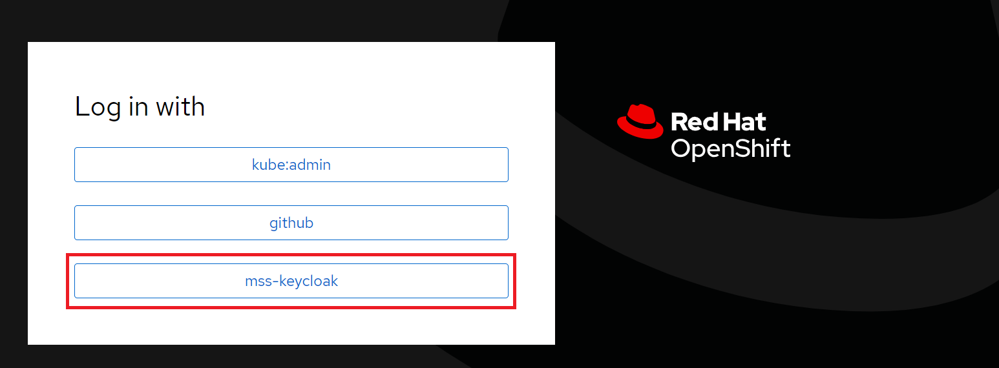
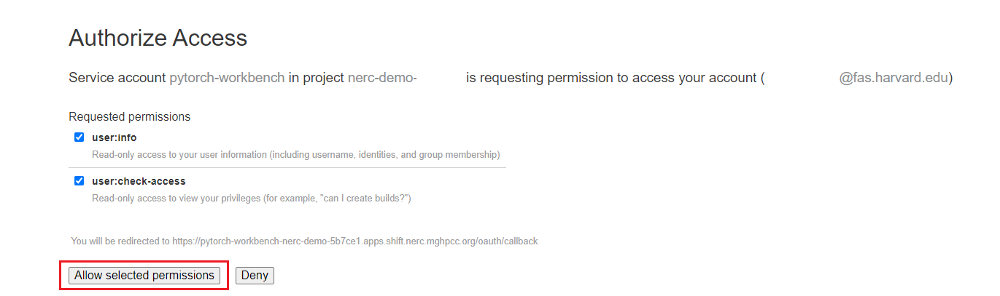
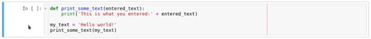
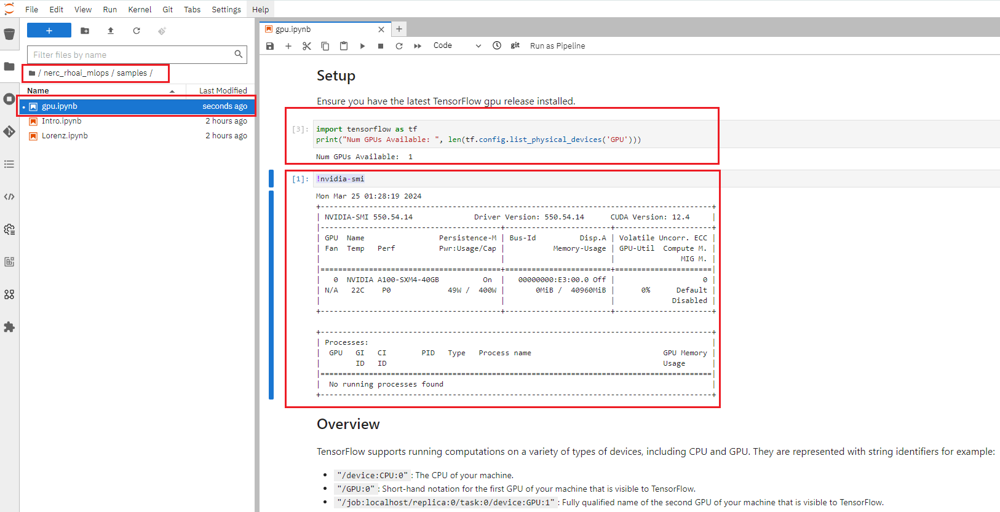

# Explore the JupyterLab Environment

When your workbench is ready, the state will change to *Running* and you can select
"Open" to go to your environment:

!!! tip "How can I start or stop a Workbench?"
    You can use this toggle to easily *start/stop* this environment later on.

Make sure you are selecting "**mss-keycloak**" once shown:

Authorize the requested permissions if needed:

This will initiate your [JupyterLab](https://jupyterlab.readthedocs.io/en/stable/)
environment based on the Jupyter Image you have selected. JupyterLab offers an
shared interactive integrated development environment.

Once you successfully authenticate you should see the NERC RHOAI JupyterLab Web
Interface as shown below:

It's pretty empty right now, though. So the first thing we will do is add content
into this environment by using Git.

## Clone a Git repository

You can clone a Git repository in JupyterLab through the left-hand **toolbar** or the
**Git** menu option in the main menu as shown below:

Let's clone a repository using the left-hand toolbar. Click on the **Git** icon,
shown in below:

Then click on **Clone a Repository** as shown below:

Enter the git repository URL, which points to the end-to-end ML workflows demo
project i.e. [https://github.com/nerc-project/nerc_rhoai_mlops](https://github.com/nerc-project/nerc_rhoai_mlops).

Then click **Clone** button as shown below:

!!! info "What is MLOps?"
    Machine learning operations (MLOps) are a set of practices that automate and
    simplify machine learning (ML) workflows and deployments. 

Cloning takes a few seconds, after which you can double-click and navigate to the
newly-created folder that contains your cloned Git repository.

## Exploring the Example NERC MLOps Project

You will be able to find the newly-created folder named `nerc_rhoai_mlops` based
on the Git repository name, as shown below:

### Working with notebooks

#### What's a notebook?

A notebook is an environment where you have cells that can display formatted text,
or code.

This is an empty cell:

And a cell where we have entered some Python code:

- Code cells contain Python code that can be run interactively. It means that you
can modify the code, then run it, but only for this cell, not for the whole
content of the notebook! The code will not run on your computer or in the browser,
but directly in the environment you are connected to NERC RHOAI.

- To run a code cell, you simply select it (select the cell, or on the left side
of it), and select the Run/Play button from the toolbar (you can also press
`CTRL+Enter` to run a cell, or `Shift+Enter` to run the cell and automatically
select the following one).

The Run button on the toolbar:

As you will see, you then get the result of the code that was run in that cell
(if the code produces some output), as well as information on when this particular
cell has been run.

When you save a notebook, the code as well as all the results are saved! So you
can always reopen it to look at the results without having to run all the program
again, while still having access to the code that produced this content.

!!! note "More about Notebook"
    Notebooks are so named because they are just like a physical Notebook. It is
    exactly like if you were taking notes about your experiments (which you will
    do), along with the code itself, including any parameters you set. You see
    the output of the experiment inline (this is the result from a cell once it
    is run), along with all the notes you want to take (to do that, you can
    switch the cell type from the menu from `Code` to `Markup`).

### Sample Jupyter Notebook files

In your Jupyter environment, you can navigate and select any Jupyter notebook
files by double-clicking them in the file explorer on the left side. Double-click
the notebook file to launch it. This action will open another tab in the content
section of the environment, on the right.

Here, you can find three primary starter notebooks for setting up the intelligent
application: `01_sandbox.ipynb`, `02_model_training_basics.ipynb`, and `03_remote_inference.ipynb`
within the root folder path of `nerc_rhoai_mlops`.

You can click and run `01_sandbox.ipynb` to verify the setup JupyterLab environment
can run python codes properly.

Also, you can find the "samples" folder within the root folder path of `nerc_rhoai_mlops`.
For learning purposes, double-click on the "samples" folder under the newly-created
folder named `nerc_rhoai_mlops`. Within the "samples" folder, you'll find some starter
Jupyter notebook files: `Intro.ipynb`, `Lorenz.ipynb`, and `gpu.ipynb`. These files
can be used to test basic JupyterLab functionalities. You can explore them at
your own pace by running each of them individually. Please feel free to experiment,
run the different cells, add some more code. You can do what you want - it is your
environment, and there is no risk of breaking anything or impacting other users.
This environment isolation is also a great advantage brought by NERC RHOAI.

!!! tip "How to get access to the NERC RHOAI Dashboard from JupyterLab Environment?"
    If you had closed the NERC RHOAI dashboard, you can access it from your currently
    opened JupyterLab IDE by clicking on *File -> Hub Control Panel* as shown below:

    

#### Testing for GPU Code

As we have setup the workbench specifing the desired **Number of GPUs**: "1", we
will be able to test GPU based code running `gpu.ipynb` notebook file as shown below:

### Training a model

Within the root folder path of `nerc_rhoai_mlops`, find a sample Jupyter notebook
file `02_model_training_basics.ipynb` that demonstrates how to train a model within
the NERC RHOAI. To run it you need to double click it and execute the "Run" button
to run all notebook cells at once. This is used to train your model for "Basic
classification of clothing images" by importing the publicly available
[Fashion MNIST dataset](https://github.com/zalandoresearch/fashion-mnist) and using
TensorFlow. This process will take some time to complete. At the end, it will
generate and save the model `my-model.keras` within the root folder path of
`nerc_rhoai_mlops`.

!!! info "The Machine Learning Model File Hosted on NERC OpenStack Object Bucket."
    The model we are going to use is an object detection model that is able to
    isolate and recognize T-shirts, bottles, and hats in pictures. Although the
    process is globally the same one as what we have seen in the
    [previous section](#training-a-model), this model has already been trained as
    it takes a few hours with the help of a GPU to do it. If you want to know
    more about this training process, you can have a look [here](https://github.com/rh-aiservices-bu/yolov5-transfer-learning).
    
    The resulting model has been saved in the [**ONNX**](https://onnx.ai/) format,
    an open standard for machine learning interoperability, which is one we can
    use with OpenVINO and RHOAI model serving. The model has been stored and is
    available for download in NERC OpenStack Object Storage container as [described
    here](model-serving-in-the-rhoai.md#create-a-data-connection).

---
