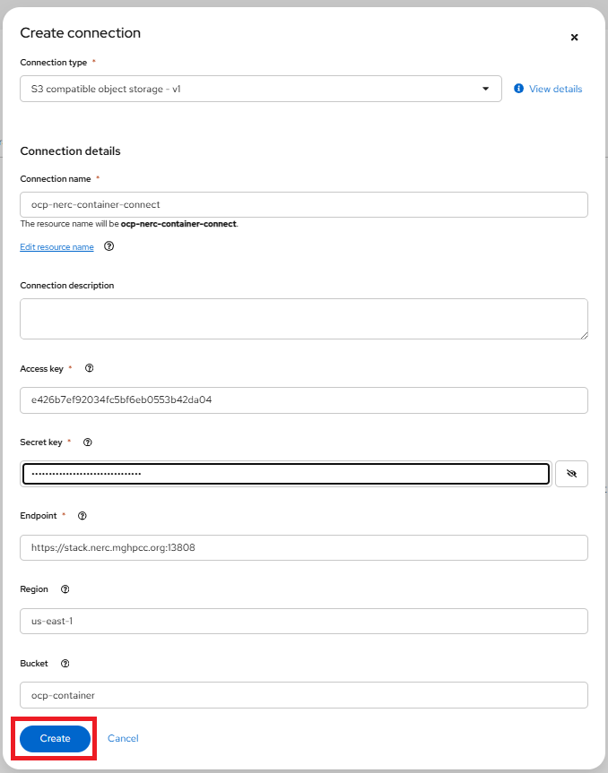

# Model Serving in the NERC RHOAI

**Prerequisites**:

To run a **model server** and **deploy a model** on it, you need to have:

- Select the correct data science project and create workbench, see [Populate
the data science project](using-projects-the-rhoai.md#populate-the-data-science-project)
for more information.

## Create a data connection

Once we have our workbench and cluster storage set up, we can add data connections.
Click the "Add data connection" button to open the data connection configuration
window as shown below:

Data connections are configurations for remote data location. Within this window,
enter the information about the S3-compatible object bucket where the model is stored.
Enter the following information:

- **Name**: The name you want to give to the data connection.

- **AWS_ACCESS_KEY_ID**: The access key to the bucket.

- **AWS_SECRET_ACCESS_KEY**: The secret for the access key.

- **AWS_S3_ENDPOINT**: The endpoint to connect to the storage.

- **AWS_DEFAULT_REGION**: The region to connect to the storage.

- **AWS_S3_BUCKET**: The name of the bucket.

**NOTE**: However, you are not required to use the S3 service from Amazon Web
Services (AWS). Any S3-compatible storage is supported.

For our example project, let's name it "ocp-nerc-container-connect", we'll select
the "us-east-1" as **AWS_DEFAULT_REGION**, choose "ocp-container" as **AWS_S3_BUCKET**.
The API Access EC2 credentials can be downloaded and accessed from the NERC OpenStack
Project as [described here](../../openstack/persistent-storage/object-storage.md#configuring-the-aws-cli).
This credential file contains information regarding **AWS_ACCESS_KEY_ID**,
**AWS_SECRET_ACCESS_KEY**, and **AWS_S3_ENDPOINT**.

**NOTE**: If you are using AWS S3 bucket then **AWS_S3_ENDPOINT** needs to be set
as "https://s3.amazonaws.com/".

!!! note "How to store & connect to the model file in the object storage bucket?"
    The model file(s) should have been saved into an S3-compatible object storage
    bucket (NERC OpenStack Container or AWS S3) for which you must have the connection
    information, such as location and credentials. You can create a bucket on your
    active project at the NERC OpenStack Project by following the instructions in
    [this guide](../../openstack/persistent-storage/object-storage.md).

    The API Access EC2 credentials can be downloaded and accessed from the NERC
    OpenStack Project as [described here](../../openstack/persistent-storage/object-storage.md#configuring-the-aws-cli).

    For our example project, we are creating a bucket named "ocp-container" in
    one of our NERC OpenStack project's object storage. Inside this bucket, we
    have added a folder or directory called "coolstore-model", where we will
    store the model file in **ONNX** format, as shown here:

    

    **ONNX**: An open standard for machine learning interoperability.

After completing the required fields, click **Add data connection**. You should
now see the data connection displayed in the main project window as shown below:

## Create a model server

After creating the data connection, you can add your model server. Select
**Add server** as shown below:

In the pop-up window that appears, depicted as shown below, you can specify the
following details:

- **Model server name**

- **Serving runtime**: either "OpenVINO Model Server" or "OpenVINO Model Server
(Supports GPUs)"

- **Number of model server replicas**: This is the number of instances of the
model server engine that you want to deploy. You can scale it up as needed,
depending on the number of requests you will receive.

- **Model server size**: This is the amount of resources, CPU, and RAM that will
be allocated to your server. Select the appropriate configuration for size and
the complexity of your model.

- **Model route**: Check this box if you want the serving endpoint (the model serving
API) to be accessible outside of the OpenShift cluster through an external route.

- **Token authorization**: Check this box if you want to secure or restrict access
to the model by forcing requests to provide an authorization token.

After adding and selecting options within the **Add model server** pop-up
window, click **Add** to create the model server.

For our example project, let's name the **Model server** as "coolstore-modelserver".
We'll select the **OpenVINO Model Server** in **Serving runtime**. Leave **replicas**
to "1", **size** to "Small". At this point, *don't check*
**Make model available via an external route** as shown below:

!!! info "NERC RHOAI supported Model Server Runtimes"
    NERC RHOAI integrates the [Intel's OpenVINO Model Server](https://docs.openvino.ai/latest/ovms_what_is_openvino_model_server.html)
    runtime, a high-performance system for serving models, optimized for deployment
    on Intel architectures. Also, NERC RHOAI offers OpenVINO Model Server serving
    runtime that supports GPUs.

Once you've configured your model server, you can deploy your model by clicking
on "Deploy model" located on the right side of the running model server. Alternatively,
you can also do this from the main RHOAI dashboard's "Model Serving" menu item as
shown below:

If you wish to view details for the model server, click on the link corresponding
to the Model Server's Name. You can also modify a model server configuration by
clicking on the three dots on the right side, and selecting **Edit model server**.
This will bring back the same configuration page we used earlier. This menu also
have option for you to **delete the model server**.

## Deploy the model

To add a model to be served, click the **Deploy model** button. Doing so will
initiate the Deploy model pop-up window as shown below:

Enter the following information for your new model:

- **Model Name**: The name you want to give to your model (e.g., "coolstore").

- **Model framework (name - version)**: The framework used to save this model.
At this time, OpenVINO IR or ONNX or Tensorflow are supported.

- **Model location**: Select the data connection that you created to store the
model. Alternatively, you can create another data connection directly from this
menu.

- **Folder path**: If your model is not located at the root of the bucket of your
data connection, you must enter the path to the folder it is in.

For our example project, let's name the **Model** as "coolstore", select
"onnx - 1" for the framework, select the Data location you created before for the
Model location, and enter "coolstore-model" as the folder path for the model
(without leading /).

When you are ready to deploy your model, select the **Deploy** button.

When you return to the Deployed models page, you will see your newly deployed model.
You should click on the **1** on the Deployed models tab to see details. When the
model has finished deploying, the status icon will be a green checkmark indicating
the model deployment is complete as shown below:

The model is now accessible through the API endpoint of the model server. The
information about the endpoint is different, depending on how you configured the
model server.

If you did not expose the model externally through a route, click on the Internal
Service link in the Inference endpoint section. A popup will display the address
for the gRPC and the REST URLs for the inference endpoints as shown below:

**Notes:**

- The REST URL displayed is only the base address of the endpoint. You must
append `/v2/models/name-of-your-model/infer` to it to have the full address.
Example: `http://modelmesh-serving.model-serving:8008/v2/models/coolstore/infer`

- The full documentation of the API (REST and gRPC) is [available here](https://github.com/kserve/kserve/blob/master/docs/predict-api/v2/required_api.md).

- The gRPC proto file for the Model Server is [available here](https://github.com/kserve/kserve/blob/master/docs/predict-api/v2/grpc_predict_v2.proto).

- If you have exposed the model through an external route, the Inference endpoint
displays the full URL that you can copy.

!!! note "Important Note"
    Even when you expose the model through an external route, the internal ones
    are still available. They use this format:

    - **REST**: `http://modelmesh-serving.name-of-your-project:8008/v2/models/name-of-your-model/infer`

    - **gRPC**: `grpc://modelmesh-serving.name-of-your-project:8033`. *Please make
    note of the grpc URL value, we will need it later.*

Your model is now deployed and ready to use!

---
