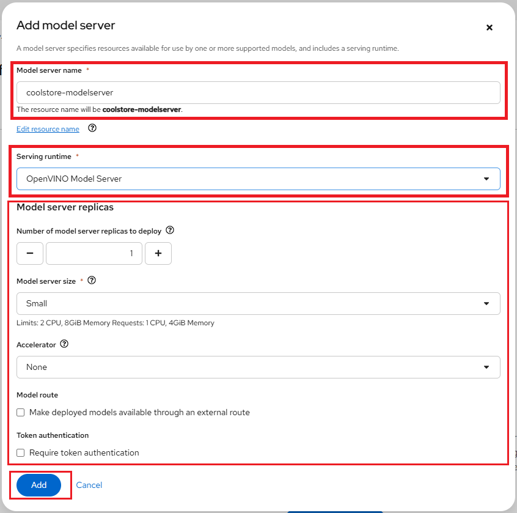
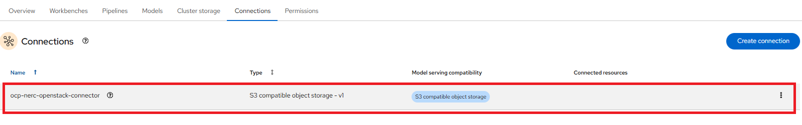

# Model Serving in the NERC RHOAI

## Model Serving Features

## Model Serving Workflow

**Prerequisites**:

To run a **model server** and **deploy a model** on it, you need to have:

-   Select the correct data science project and create workbench, see [Populate
    the data science project](using-projects-the-rhoai.md#populate-the-data-science-project-with-a-workbench)
    for more information.

## Create a model server

After creating the connection, you can add your model server. In the
OpenShift AI dashboard, navigate to the data science project details page and
click the **Models** tab. If this is the first time, then you will be able to choose
the model serving type, either a **Single-model serving platform** or a
**Multi-model serving platform** to be used when deploying from this project. The
model-serving UI is integrated into the OpenShift AI dashboard and project workspaces,
and cluster resources scale up or down with demand.

OpenShift AI offers two options for model serving:

### 1. Single-model Serving

Each model is deployed on its own dedicated model server. This approach is ideal
for:

- Large language models (LLMs)

- Generative AI

- Models that require dedicated resources

The single-model serving platform is based on the [KServe](https://github.com/kserve/kserve)
component.

!!! tip "Important Note"

    If you want to deploy each model on its own runtime server, or use a serverless
    deployment, select the **Single-model serving platform**. This option is recommended
    for **production use**.

In the "Single-model serving platform" tile, click **Select single-model**.

You will be able to deploy the model by clicking the **Deploy model** button, as
shown below:

In the pop-up window that appears, you can specify the following details:

-   **Model deployment name**: This is the name of the inference service created
    when the model is deployed.

-   **Serving runtime**: Select a model-serving runtime framework from the available
    options in your OpenShift Data Science deployment. This framework is used to
    deploy and serve machine learning models. For LLMs that need maximum scalability
    and throughput, OpenShift AI offers parallelized, multi-node serving with
    **vLLM runtimes** to handle high volumes of concurrent, real-time requests.

-   **Model framework (name - version)**: This will be auto selected based on your
    Serving runtime selection.

-   **Deployment mode**: Deployment modes define which technology stack will be
    used to deploy a model, offering different levels of management and scalability.
    The options available are:

    i. **Advanced**: Advanced deployment mode uses *Knative Serverless*. By default,
            KServe integrates with Red Hat OpenShift Serverless and Red Hat OpenShift
            Service Mesh to deploy models on the single-model serving platform.

    ii. **Standard**: Alternatively, you can use standard deployment mode, which
            uses KServe Raw Deployment mode.

-   **Number of model server replicas to deploy**: This is the number of instances
    of the model server engine that you want to deploy. You can scale it up as needed,
    depending on the number of requests you will receive.

-   **Model server size**: This is the amount of resources, CPU, and RAM that will
    be allocated to your server. Select the appropriate configuration for size and
    the complexity of your model.

-   **Accelerator**: This allows you to add a **GPU** to your model server, enabling
    it to leverage optimized hardware for faster inference and improved efficiency.

    !!! warning "Serving Runtime and Accelerator Compatibility"

        If you need to use an **Accelerator**, it is recommended to select a compatible
        **Serving runtime** for optimal performance. Also, **Number of accelerators**
        (GPUs) is based on your available quota for GPUs for your project.

-   **Model route**: Check this box if you want the serving endpoint (the model serving
    API) to be accessible outside of the OpenShift cluster through an external route.

-   **Token authorization**: Check this box if you want to secure or restrict access
    to the model by forcing requests to provide an authorization token.

-   **Source model location**: To specify the location of your model, either select
    an existing connection you previously created or create a new one.

    !!! warning "Very Important"

        If your connection type is an **S3-compatible object storage**, you must
        provide the folder path that contains your data file. The
        **OpenVINO Model Server** runtime has specific requirements for how you
        specify the model path. For more information, see known issue [RHOAIENG-3025](https://docs.redhat.com/en/documentation/red_hat_openshift_ai_cloud_service/1/html-single/release_notes/index#known-issues_RHOAIENG-3025_relnotes)
        in the OpenShift AI release notes.

-   **Optional**: Customize the runtime parameters in the Configuration parameters
    section.

After adding and selecting options within the **Deploy model** pop-up window,
click **Deploy** to create the model server.

!!! tip "Serving vLLM and Granite Models with Red Hat OpenShift AI"

    To learn more about how to use single-model serving with the **vLLM runtime**
    and **Granite** foundation models, check out [this detailed user guide](../other-projects/serving-vLLM-and-Granite-Models.md).

### 2. Multi-model Serving

!!! danger "Very Important"

    Starting with **OpenShift AI version 2.19**, the **multi-model serving platform**
    based on *ModelMesh* is deprecated. You can continue to deploy models on the
    multi-model serving platform, but it is recommended that you migrate to the
    [single-model serving platform](#1-single-model-serving).

All models within the project are deployed on a shared model server. This setup
is best suited for:

- Efficient resource sharing among models

- Lightweight models with lower resource demands

The multi-model serving platform is based on the [ModelMesh](https://github.com/kserve/modelmesh)
component.

!!! tip "Important Note"

    If you want to deploy multiple models using a single runtime server, select
    the **Multi-model serving platform**. This option is ideal when deploying more
    than 1,000 small or medium-sized models and aiming to reduce resource consumption.

In the **Multi-model serving platform** tile, click **Select multi-model**.

You will be able to create a new model server by clicking the **Add model server**
button, as shown below:

In the pop-up window that appears, you can specify the following details:

-   **Model server name**: Enables users to enter a unique name for the model server.

-   **Serving runtime**: Select a model-serving runtime framework from the available
    options in your OpenShift Data Science deployment. This framework is used to
    deploy and serve machine learning models.

-   **Number of model server replicas**: This is the number of instances of the
    model server engine that you want to deploy. You can scale it up as needed,
    depending on the number of requests you will receive.

-   **Model server size**: This is the amount of resources, CPU, and RAM that will
    be allocated to your server. Select the appropriate configuration for size and
    the complexity of your model.

-   **Accelerator**: This allows you to add a **GPU** to your model server, enabling
    it to leverage optimized hardware for faster inference and improved efficiency.

    !!! warning "Serving Runtime and Accelerator Compatibility"

        If you need to use an **Accelerator**, it is recommended to select a compatible
        **Serving runtime** for optimal performance. Also, **Number of accelerators**
        (GPUs) is based on your available quota for GPUs for your project.

-   **Model route**: Check this box if you want the serving endpoint (the model serving
    API) to be accessible outside of the OpenShift cluster through an external route.

-   **Token authorization**: Check this box if you want to secure or restrict access
    to the model by forcing requests to provide an authorization token.

After adding and selecting options within the **Add model server** pop-up
window, click **Add** to create the model server.

---

#### Setting up Multi-model Server

For our example project, we will choose "Multi-model serving platform" and then
add a new model server and let's name the **Model server** "coolstore-modelserver".
We'll select the **OpenVINO Model Server** in **Serving runtime**.

Please leave the other fields with their default settings, such as
**replicas** set to `1`, **size** set to `Small`, and **Accelerator** set to `None`.
At this point, _do not check_ **Make model available via an external route**, as
shown below:

Once you've configured your model server, you can deploy your model by clicking
on "Deploy model" located on the right side of the running model server as shown
below:

Alternatively, you can also do this from the main RHOAI dashboard's "Model Serving"
menu item as shown below:

If you wish to view details for the model server, click on the link corresponding
to the Model Server's Name. You can also modify a model server configuration by
clicking on the three dots on the right side, and selecting **Edit model server**.
This will bring back the same configuration page we used earlier. This menu also
have option for you to **delete model server**.

## Create a connection

Once we have our workbench and cluster storage set up, we can create connections.
Click the "Create connection" button to open the connection configuration
window as shown below:

Connections are configurations for remote data location. In the Add connection modal,
select a Connection type. The **OCI-compliant registry**,
**S3 compatible object storage**, and **URI** options are pre-installed connection
types. Please select "S3 compatible object storage - v1" as your *Connection type*
as shown below:

Within this window, enter the information about the S3-compatible object bucket
where the model is stored. Enter the following information:

-   **Connection name**: Enter a unique name for the connection. A resource name
    is generated based on the name of the connection. A resource name is the label
    for the underlying resource in OpenShift.

    **Optional:** Edit the default resource name. Note that you cannot change the
    resource name after you create the connection.

    **Optional:** Provide a description of the connection.

-   **Access Key**: The access key to the bucket.

-   **Secret Key**: The secret for the access key.

-   **Endpoint**: The endpoint to connect to the storage.

-   **Region**: The region to connect to the storage.

-   **Bucket**: The name of the bucket.

**NOTE**: However, you are not required to use the S3 service from **Amazon Web
Services (AWS)**. Any S3-compatible storage i.e. NERC OpenStack Container (Ceph),
Minio, AWS S3, etc. is supported.

For our example project, let's name it "ocp-nerc-container-connect", we'll select
the "us-east-1" as **Region**, choose "ocp-container" as **Bucket**.

The API Access EC2 credentials can be downloaded and accessed from the NERC OpenStack
Project as [described here](../../openstack/persistent-storage/object-storage.md#configuring-the-aws-cli).
This credential file contains information regarding **Access Key**,
**Secret Key**, and **Endpoint**.

**Very Important Note**: If you are using an _AWS S3 bucket_, the **Endpoint**
needs to be set as `https://s3.amazonaws.com/`. However, for the _NERC Object Storage_
container, which is based on the _Ceph_ backend, the **Endpoint** needs to be set
as `https://stack.nerc.mghpcc.org:13808`, and the **Region** should be set as `us-east-1`.

!!! note "How to store & connect to the model file in the object storage bucket?"

    The model file(s) should have been saved into an S3-compatible object storage
    bucket (NERC OpenStack Container [Ceph], Minio, or AWS S3) for which you must
    have the connection information, such as location and credentials. You can
    create a bucket on your active project at the NERC OpenStack Project by following
    the instructions in [this guide](../../openstack/persistent-storage/object-storage.md).

    The API Access EC2 credentials can be downloaded and accessed from the NERC
    OpenStack Project as [described here](../../openstack/persistent-storage/object-storage.md#configuring-the-aws-cli).

    For our example project, we are creating a bucket named "ocp-container" in
    one of our NERC OpenStack project's object storage. Inside this bucket, we
    have added a folder or directory called "coolstore-model", where we will
    store the model file in **ONNX** format, as shown here:

    

    **ONNX**: An open standard for machine learning interoperability.

After completing the required fields, click **Create**. You should now see the
connection displayed in the main project window as shown below:

!!! tip "Other Connection Type"

    If you selected **URI** in the preceding step, in the URI field, enter the
    Uniform Resource Identifier (URI). If you selected **OCI-compliant registry**
    in the preceding step, in the OCI storage location field, enter the URI.

## Deploy the model

To add a model to be served, click the **Deploy model** button. Doing so will
initiate the Deploy model pop-up window as shown below:

Enter the following information for your new model:

-   **Model Name**: The name you want to give to your model (e.g., "coolstore").

-   **Model framework (name-version)**: The framework used to save this model.
    At this time, OpenVINO IR or ONNX or Tensorflow are supported.

-   **Model Location**: Select the connection you created [as described here](#create-a-connection)
    to store the model. Alternatively, you can create a new connection directly
    from this menu.

-   **Folder path**: If your model is not located at the root of the bucket of your
    connection, you must enter the path to the folder it is in.

For our example project, let's name the **Model** as "coolstore", select
"onnx-1" for the framework, select the Data location you created before for the
Model location, and enter "coolstore-model" as the folder path for the model
(without leading /).

When you are ready to deploy your model, select the **Deploy** button.

When you return to the Deployed models page, you will see your newly deployed model.
You should click on the **1** on the Deployed models tab to see details. When the
model has finished deploying, the status icon will be a green checkmark indicating
the model deployment is complete as shown below:

!!! danger "Important Note"

    When you delete a model server, all models hosted on it are also removed,
    making them unavailable to applications.

### Check the Model API

The deployed model is now accessible through the API endpoint of the model server.
The information about the endpoint is different, depending on how you configured
the model server.

If you did not expose the model externally through a route, click on the
"Internal endpoint details" link in the Inference endpoint section. A popup will
display the address for the gRPC and the REST URLs for the inference endpoints
as shown below:

Your model is now deployed and ready to use!

**Notes**:

-   The REST URL displayed is only the base address of the endpoint. You must
    append `/v2/models/name-of-your-model/infer` to it to have the full address.
    Example: `http://modelmesh-serving.name-of-your-project-namespace:8008/v2/models/coolstore/infer`

-   The full documentation of the API (REST and gRPC) is [available here](https://github.com/kserve/kserve/blob/master/docs/predict-api/v2/required_api.md).

-   The gRPC proto file for the Model Server is [available here](https://github.com/kserve/kserve/blob/master/docs/predict-api/v2/grpc_predict_v2.proto).

-   If you have exposed the model through an external route, the Inference endpoint
    displays the full URL that you can copy.

!!! note "Important Note"

    Even when you expose the model through an external route, the internal ones
    are still available. They use this format:

    - **REST**: `http://modelmesh-serving.name-of-your-project:8008/v2/models/name-of-your-model/infer`

    - **gRPC**: `grpc://modelmesh-serving.name-of-your-project:8033`. *Please make
    note of the **grpcURL** value, we will need it later.*

---
