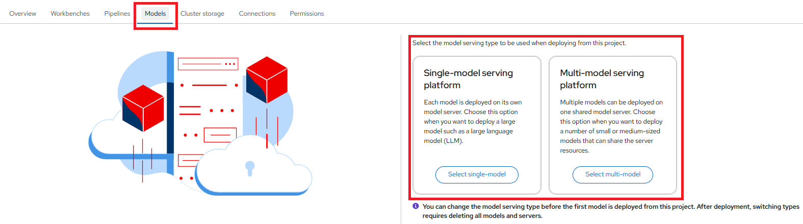
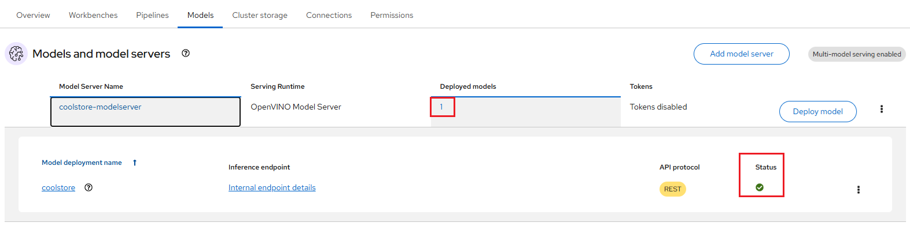
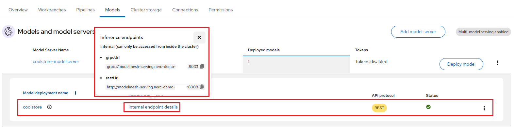

# Model Serving in the NERC RHOAI

**Prerequisites**:

To run a **model server** and **deploy a model** on it, you need to have:

-   Select the correct data science project and create workbench, see [Populate
    the data science project](using-projects-the-rhoai.md#populate-the-data-science-project-with-a-workbench)
    for more information.

## Create a connection

Once we have our workbench and cluster storage set up, we can create connections.
Click the "Create connection" button to open the connection configuration
window as shown below:

Connections are configurations for remote data location. Within this window,
enter the information about the S3-compatible object bucket where the model is stored.
Enter the following information:

-   **Name**: The name you want to give to the connection.

-   **Access Key**: The access key to the bucket.

-   **Secret Key**: The secret for the access key.

-   **Endpoint**: The endpoint to connect to the storage.

-   **Region**: The region to connect to the storage.

-   **Bucket**: The name of the bucket.

**NOTE**: However, you are not required to use the S3 service from **Amazon Web
Services (AWS)**. Any S3-compatible storage i.e. NERC OpenStack Container (Ceph),
Minio, AWS S3, etc. is supported.

For our example project, let's name it "ocp-nerc-container-connect", we'll select
the "us-east-1" as **Region**, choose "ocp-container" as **Bucket**.

The API Access EC2 credentials can be downloaded and accessed from the NERC OpenStack
Project as [described here](../../openstack/persistent-storage/object-storage.md#configuring-the-aws-cli).
This credential file contains information regarding **Access Key**,
**Secret Key**, and **Endpoint**.

**Very Important Note**: If you are using an _AWS S3 bucket_, the **Endpoint**
needs to be set as `https://s3.amazonaws.com/`. However, for the _NERC Object Storage_
container, which is based on the _Ceph_ backend, the **Endpoint** needs to be set
as `https://stack.nerc.mghpcc.org:13808`, and the **Region** should be set as `us-east-1`.

!!! note "How to store & connect to the model file in the object storage bucket?"

    The model file(s) should have been saved into an S3-compatible object storage
    bucket (NERC OpenStack Container [Ceph], Minio, or AWS S3) for which you must
    have the connection information, such as location and credentials. You can
    create a bucket on your active project at the NERC OpenStack Project by following
    the instructions in [this guide](../../openstack/persistent-storage/object-storage.md).

    The API Access EC2 credentials can be downloaded and accessed from the NERC
    OpenStack Project as [described here](../../openstack/persistent-storage/object-storage.md#configuring-the-aws-cli).

    For our example project, we are creating a bucket named "ocp-container" in
    one of our NERC OpenStack project's object storage. Inside this bucket, we
    have added a folder or directory called "coolstore-model", where we will
    store the model file in **ONNX** format, as shown here:

    

    **ONNX**: An open standard for machine learning interoperability.

After completing the required fields, click **Create connection**. You should
now see the connection displayed in the main project window as shown below:

## Create a model server

After creating the connection, you can add your model server. In the
OpenShift AI dashboard, navigate to the data science project details page and
click the **Models** tab. If this is the first time then you will be able to choose
the model serving type such as either **Single-model serving platform** or
**Multi-model serving platform** to be used when deploying from this project.

OpenShift AI offers two options for model serving:

**1. Single-Model Serving**:

Each model is deployed on its own dedicated model server. This approach is ideal
for:

- Large language models (LLMs)

- Generative AI

- Models that require dedicated resources

The single-model serving platform is based on the [KServe](https://github.com/kserve/kserve)
component.

**2. Multi-Model Serving**:

All models within the project are deployed on a shared model server. This setup
is best suited for:

- Efficient resource sharing among models

- Lightweight models with lower resource demands

The multi-model serving platform is based on the [ModelMesh](https://github.com/kserve/modelmesh)
component.

!!! note "Important Note"

    You can change the model serving type before the first model is deployed from
    this project. After deployment, switching types requires deleting all models
    and servers.

When you select "Single-model serving platform", you will be directly able to
deploy model by clicking **Deploy model** button as shown below:

Whereas, when you select "Multi-model serving platform", you will be to create
a model server by clicking **Add model server** button as shown below:

In the pop-up window that appears, you can specify the following details:

-   **Model server name**: Enables users to enter a unique name for the model server.

-   **Serving runtime**: Select a model-serving runtime framework from the available
    options in your OpenShift Data Science deployment. This framework is used to
    deploy and serve machine learning models.

-   **Number of model server replicas**: This is the number of instances of the
    model server engine that you want to deploy. You can scale it up as needed,
    depending on the number of requests you will receive.

-   **Model server size**: This is the amount of resources, CPU, and RAM that will
    be allocated to your server. Select the appropriate configuration for size and
    the complexity of your model.

-   **Accelerator**: This allows you to add a **GPU** to your model server, enabling
    it to leverage optimized hardware for faster inference and improved efficiency.

    !!! warning "Serving Runtime and Accelerator Compatibility"

        If you need to use an **Accelerator**, it is recommended to select a compatible
        **Serving runtime** for optimal performance. Also, **Number of accelerators**
        (GPUs) is based on your available quota for GPUs for your project.

-   **Model route**: Check this box if you want the serving endpoint (the model serving
    API) to be accessible outside of the OpenShift cluster through an external route.

-   **Token authorization**: Check this box if you want to secure or restrict access
    to the model by forcing requests to provide an authorization token.

After adding and selecting options within the **Add model server** pop-up
window, click **Add** to create the model server.

For our example project, we will choose "Multi-model serving platform" and then
add a new model server and let's name the **Model server** as "coolstore-modelserver".
We'll select the **OpenVINO Model Server** in **Serving runtime**.

Please leave the other fields with the default settings such as Leave **replicas**
to "1", **size** to "Small", **Accelerator** to "None". At this point, _don't check_
**Make model available via an external route** as shown below:

Once you've configured your model server, you can deploy your model by clicking
on "Deploy model" located on the right side of the running model server as shown
below:

Alternatively, you can also do this from the main RHOAI dashboard's "Model Serving"
menu item as shown below:

If you wish to view details for the model server, click on the link corresponding
to the Model Server's Name. You can also modify a model server configuration by
clicking on the three dots on the right side, and selecting **Edit model server**.
This will bring back the same configuration page we used earlier. This menu also
have option for you to **delete model server**.

## Deploy the model

To add a model to be served, click the **Deploy model** button. Doing so will
initiate the Deploy model pop-up window as shown below:

Enter the following information for your new model:

-   **Model Name**: The name you want to give to your model (e.g., "coolstore").

-   **Model framework (name-version)**: The framework used to save this model.
    At this time, OpenVINO IR or ONNX or Tensorflow are supported.

-   **Model location**: Select the connection that you created to store the
    model. Alternatively, you can create another connection directly from this
    menu.

-   **Folder path**: If your model is not located at the root of the bucket of your
    connection, you must enter the path to the folder it is in.

For our example project, let's name the **Model** as "coolstore", select
"onnx-1" for the framework, select the Data location you created before for the
Model location, and enter "coolstore-model" as the folder path for the model
(without leading /).

When you are ready to deploy your model, select the **Deploy** button.

When you return to the Deployed models page, you will see your newly deployed model.
You should click on the **1** on the Deployed models tab to see details. When the
model has finished deploying, the status icon will be a green checkmark indicating
the model deployment is complete as shown below:

!!! danger "Important Note"

    When you delete a model server, all models hosted on it are also removed,
    making them unavailable to applications.

## Check the model API

The model is now accessible through the API endpoint of the model server. The
information about the endpoint is different, depending on how you configured the
model server.

If you did not expose the model externally through a route, click on the Internal
Service link in the Inference endpoint section. A popup will display the address
for the gRPC and the REST URLs for the inference endpoints as shown below:

**Notes**:

-   The REST URL displayed is only the base address of the endpoint. You must
    append `/v2/models/name-of-your-model/infer` to it to have the full address.
    Example: `http://modelmesh-serving.model-serving:8008/v2/models/coolstore/infer`

-   The full documentation of the API (REST and gRPC) is [available here](https://github.com/kserve/kserve/blob/master/docs/predict-api/v2/required_api.md).

-   The gRPC proto file for the Model Server is [available here](https://github.com/kserve/kserve/blob/master/docs/predict-api/v2/grpc_predict_v2.proto).

-   If you have exposed the model through an external route, the Inference endpoint
    displays the full URL that you can copy.

!!! note "Important Note"

    Even when you expose the model through an external route, the internal ones
    are still available. They use this format:

    - **REST**: `http://modelmesh-serving.name-of-your-project:8008/v2/models/name-of-your-model/infer`

    - **gRPC**: `grpc://modelmesh-serving.name-of-your-project:8033`. *Please make
    note of the **grpcURL** value, we will need it later.*

Your model is now deployed and ready to use!

---
