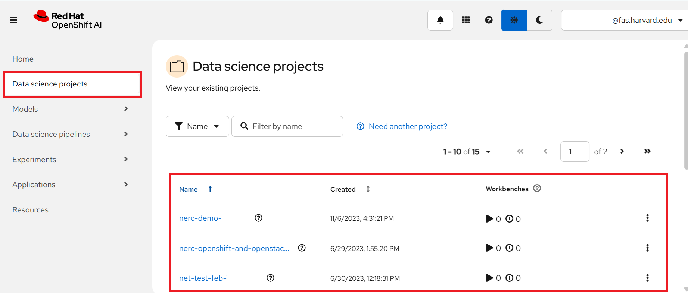
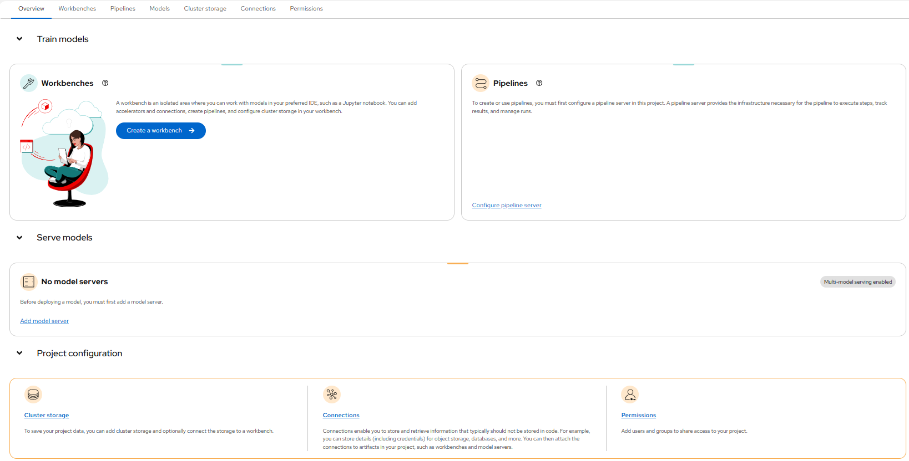
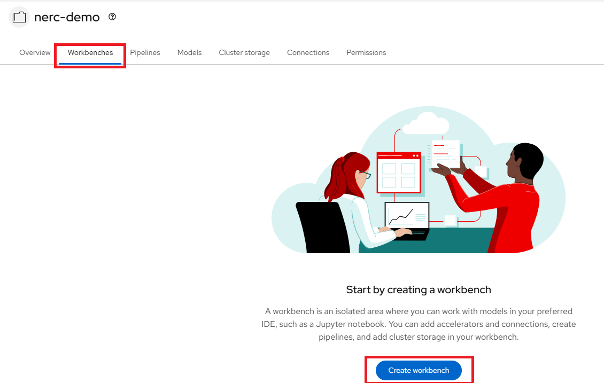
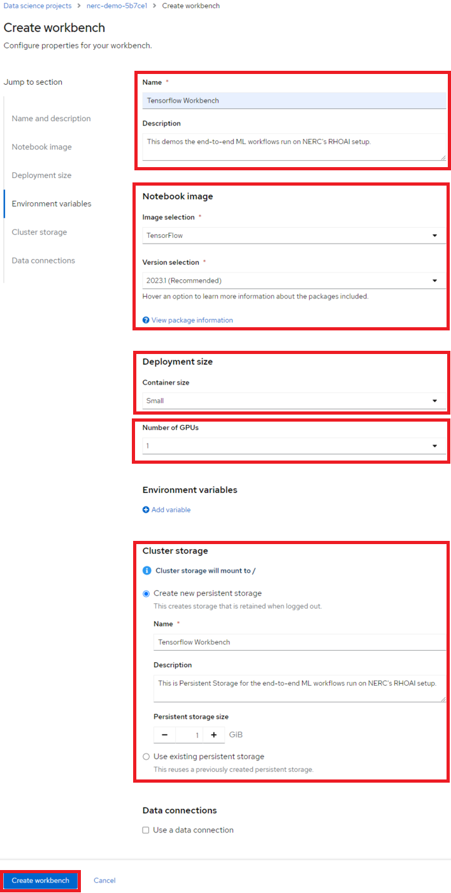
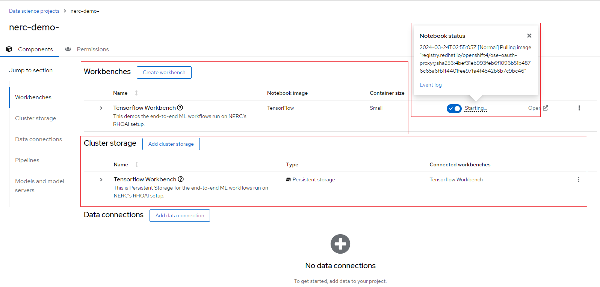
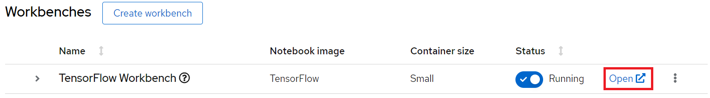

# Using Your Data Science Project (DSP)

You can access your current projects by navigating to the "Data Science Projects"
menu item on the left-hand side, as highlighted in the figure below:

If you have any existing projects, they will be displayed here. These projects
correspond to your [NERC-OCP (OpenShift) resource allocations](../../get-started/allocation/allocation-details.md#general-user-view-of-openshift-resource-allocation).

## Selecting your data science project

Here, you can click on specific projects corresponding to the appropriate allocation
where you want to work. This brings you to your selected data science project's
details page, as shown below:

Within the data science project, you can add the following configuration options:

- **Workbenches**: Development environments within your project where you can access
notebooks and generate models.

- **Cluster storage**: Storage for your project in your OpenShift cluster.

- **Data connections**: A list of data sources that your project uses.

- **Pipelines**: A list of created and configured pipeline servers.

- **Models and model servers**: A list of models and model servers that your project
uses.

As you can see in the project's details figure, our selected data science project
currently has no workbenches, storage, data connections, pipelines, or model servers.

## Populate the data science project with a Workbench

Add a workbench by clicking the Create workbench button as shown below:

!!! info "What are Workbenches?"
    Workbenches are development environments. They can be based on JupyterLab, but
    also on other types of IDEs, like VS Code or RStudio. You can create as many
    workbenches as you want, and they can run concurrently.

On the Create workbench page, complete the following information.

**Note**: Not all fields are required.

- Name

- Description

- Notebook image (Image selection)

- Deployment size (Container size and Number of GPUs)

- Environment variables

- Cluster storage name

- Cluster storage description

- Persistent storage size

- Data connections

!!! tip "How to specify CPUs, Memory, and GPUs for your JupyterLab workbench?"
    You have the option to select different container sizes to define compute
    resources, including CPUs and memory. Each container size comes with pre-configured
    CPU and memory resources.

    Optionally, you can specify the desired **Number of GPUs** depending on the
    nature of your data analysis and machine learning code requirements. However,
    this number should not exceed the GPU quota specified by the value of the
    "**OpenShift Request on GPU Quota**" attribute that has been approved for
    this "**NERC-OCP (OpenShift)**" resource allocation on NERC's ColdFront, as
    [described here](../../get-started/allocation/allocation-details.md#pi-and-manager-allocation-view-of-openshift-resource-allocation).

    If you need to increase this quota value, you can request a change as
    [explained here](../../get-started/allocation/allocation-change-request.md#request-change-resource-allocation-attributes-for-openshift-project).

Once you have entered the information for your workbench, click **Create**.

For our example project, let's name it "Tensorflow Workbench". We'll select the
**TensorFlow** image, choose a **Deployment size** of **Small**, **Number of GPUs**
as **1** and allocate a **Cluster storage** space of **1GB**.

!!! info "More About Cluster Storage"
    Cluster storage consists of Persistent Volume Claims (PVCs), which are
    persistent storage spaces available for storing your notebooks and data. You
    can create PVCs directly from here and mount them in your workbenches as
    needed. It's worth noting that a default cluster storage (PVC) is automatically
    created with the same name as your workbench to save your work.

After creating the workbench, you will return to your project page. It shows the
status of the workbench as shown below:

Notice that under the status indicator the workbench is *Running*. But if there
are any issues i.e. an "insufficient memory" error then a red exclamation appears
under the status indicator and you can hover over that icon. Looking closely at
the error message, it shows the details about the issue and you can resolve accordingly.

When your workbench is ready, the status will change to *Running* and you can select
"Open" to go to your environment:

!!! tip "How can I start or stop a Workbench?"
    You can use this "toggle switch" under the "Status" section to easily *start/stop*
    this environment later on.

---
