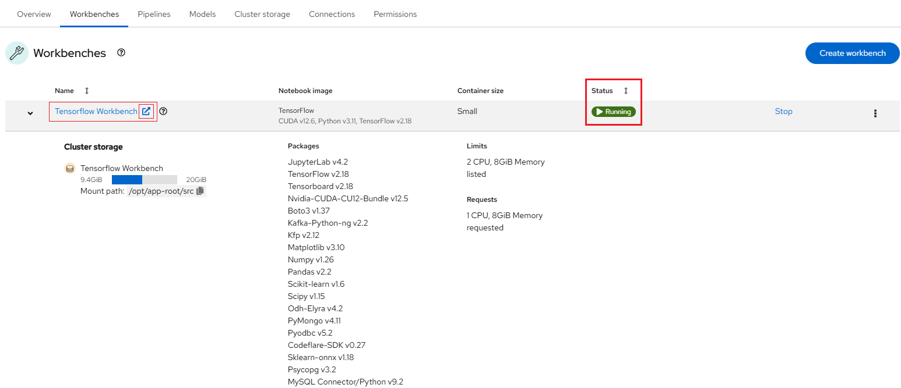

# Using Your Data Science Project (DSP)

You can access your current projects by navigating to the "Data Science Projects"
menu item on the left-hand side, as highlighted in the figure below:

If you have any existing projects, they will be displayed here. These projects
correspond to your [NERC-OCP (OpenShift) resource allocations](../../get-started/allocation/allocation-details.md#general-user-view-of-openshift-resource-allocation).

!!! note "Why we need Data Science Project (DSP)?"

    To implement a data science workflow, you must use a data science project.
    Projects allow you and your team to organize and collaborate on resources
    within separated namespaces. From a project you can create multiple workbenches,
    each with their own Jupyter notebook environment, and each with their own data
    connections and cluster storage. In addition, the workbenches can share models
    and data with pipelines and model servers.

## Selecting your data science project

Here, you can click on specific projects corresponding to the appropriate allocation
where you want to work. This brings you to your selected data science project's
details page, as shown below:

Within the data science project, you can add the following configuration options:

-   **Workbenches**: are instances of your development and experimentation environment.
    They typically contain IDEs, such as JupyterLab, RStudio, and Visual Studio Code.

-   **Pipelines**: A list of created and configured data science pipeline servers
    within the project.

-   **Models**: A list of models and model servers that your project uses. Models
    allow you to quickly serve a trained model for real-time inference. You can
    have multiple model servers per data science project. One model server can
    host multiple models.

-   **Cluster storage**: Storage for your project in your OpenShift cluster.

-   **Connections**: A list of data sources that your project uses, such as an S3
    object bucket.

-   **Permissions**: define which users and groups can access the project.

As you can see in the project's details figure, our selected data science project
currently has no workbenches, pipelines, models, storage, connections, and permissions.

## Populate the data science project with a Workbench

Add a workbench by clicking the Create workbench button, as shown below:

!!! info "What are Workbenches?"

    Workbenches are development environments. They can be based on JupyterLab, but
    also on other types of IDEs, like VS Code or RStudio. You can create as many
    workbenches as you want, and they can run concurrently.

On the Create workbench page, complete the following information.

**Note**: Not all fields are required.

-   Name

-   Description

-   Notebook image (Image selection)

-   Deployment size (Container size, Accelerator and Number of accelerators)

-   Environment variables

-   Cluster storage name

-   Cluster storage description

-   Persistent storage size

-   Connections

!!! tip "How to specify CPUs, Memory, and GPUs for your JupyterLab workbench?"

    You have the option to select different container sizes to define compute
    resources, including CPUs and memory. Each container size comes with pre-configured
    CPU and memory resources.

    Optionally, you can specify the desired **Accelerator** and **Number of accelerators** (GPUs), depending on the
    nature of your data analysis and machine learning code requirements. However,
    this number should not exceed the GPU quota specified by the value of the
    "**OpenShift Request on GPU Quota**" attribute that has been approved for
    this "**NERC-OCP (OpenShift)**" resource allocation on NERC's ColdFront, as
    [described here](../../get-started/allocation/allocation-details.md#pi-and-manager-allocation-view-of-openshift-resource-allocation).

    The different options for GPU accelerator are "None", "NVIDIA A100 GPU",
    "NVIDIA H100 GPU", and "NVIDIA V100 GPU" as shown below:

    

    If you need to increase this quota value, you can request a change as
    [explained here](../../get-started/allocation/allocation-change-request.md#request-change-resource-allocation-attributes-for-openshift-project).

Once you have entered the information for your workbench, click **Create**.

For our example project, let's name it "Tensorflow Workbench". We'll select the
**TensorFlow** image, choose a **Deployment size** of **Small**,
**Accelerator** of **NVIDIA A100 GPU**, **Number of accelerators**
as **1** and allocate a **Cluster storage** space of **20GB** (Selected By Default).

After creating the workbench, you will return to your project page. It shows the
status of the workbench as shown below:

When your workbench is ready and the status changes to _Running_, click the open
icon () next to your workbench's name, or click
the workbench name directly to access your environment.

!!! tip "How can I start or stop a Workbench?"

    If the workbench status is `Stopped`, click the **Start** button in the
    **Status** column. The status will change from `Stopped` to `Starting` while
    the workbench server is initializing, and then to `Running` once it has
    successfully started.

    

Notice that under the status indicator the workbench is _Running_. However, if any
issues arise, such as an "exceeded quota" error, a red exclamation mark will appear
under the Status indicator, as shown in the example below:

You can hover over that icon to view details. Upon closer inspection of the error
message and the "Event log", you will receive details about the issue, enabling
you to resolve it accordingly.

Any cluster storage that you associated with the workbench during the creation process
appears on the "Cluster storage" tab for the project. Also, you can review the
attached cluster storage by expanding the workbench as shown above.

!!! info "More About Cluster Storage"

    Cluster storage consists of Persistent Volume Claims (PVCs), which are
    persistent storage spaces available for storing your notebooks and data. You
    can create PVCs directly from here and mount them in your workbenches as
    needed. It's worth noting that a default cluster storage (PVC) is automatically
    created with the same name as your workbench to save your work.

    **Note**: Once persistent storage is created, you can only increase its size
    by editing it. Adjusting the storage size will restart the workbench, making
    it temporarily unavailable, with the downtime typically depending on the size
    increase.

    

### Launching a Workbench Using Your Existing Storage

If you want to use previously created persistent storage that isn’t attached to
any existing workbench cluster, first detach the storage configured for the new
workbench, as shown below:

Once detached, click the **Attach existing storage** button. A popup will appear
allowing you to select from the available storage options, as shown below:

After selecting the appropriate storage from the available options, click the
**Attach storage** button.

Once the workbench is successfully created and in _Running_ status, it will include
all previously stored data and code mapped to the newly created workbench.

!!! question "Note"

    If your data science work requires changes to your workbench image, container
    size, or identifying information, you can update your project's workbench
    settings accordingly. For workloads involving large datasets, you can enhance
    performance by assigning accelerators to your workbench.

    

    Before clicking the action menu (⋮) at the end of the selected workbench row,
    make sure to change the workbench status from *Running* to *Stopped* by
    clicking the **Stop** button. Updating the workbench will cause it to restart,
    so ensure that you save all your current work to avoid losing any unsaved data
    before stopping your workbench.

### How to Solve the Deleted Workbench Image Issue?

While navigating to your previously set up workbenches in your RHOAI project's
**Workbenches** section, you may encounter a deleted image error message, as
shown below:

The recommended approach is to **Edit Workbench**. You can select the appropriate
image and version (if available) from the available options.

Before clicking the action menu (⋮) at the end of the selected workbench row, make
sure to change the workbench status from *Running* to *Stopped* by clicking the
**Stop** button. Updating the workbench will cause it to restart, so ensure that
you save all your current work to avoid losing any unsaved data before stopping
your workbench.

Select the equivalent **image** and applicable **version** (*if available*) from
the drop-down list under the **Workbench Image** section, as shown below:

Click the **Update Workbench** button.

It may take some time for the changes to reflect and for the dashboard to return
to the **Workbenches** page. Once the update is complete, click the **Start** button
to restart the workbench.  

Once the workbench status changes from *Stopped* to *Running*, you can click on
its name link and access your workbench without any issues.

---
