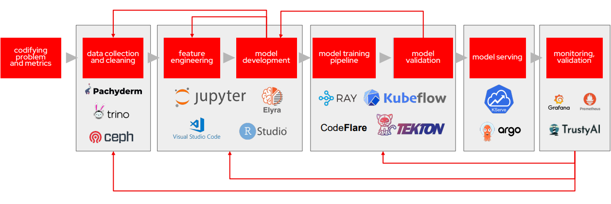

# Red Hat OpenShift AI (RHOAI) Overview

NERC's Red Hat OpenShift AI (RHOAI) offers a versatile and scalable MLOps solution
equipped with tools for rapid constructing, deploying, and overseeing AI-driven
applications. Integrating the proven features of both Red Hat OpenShift AI and Red
Hat OpenShift creates a comprehensive enterprise-grade artificial intelligence and
machine learning (AI/ML) application platform, facilitating collaboration among
data scientists, engineers, and app developers. NERC's RHOAI provides features
such as multi-tenancy support and robust security for model serving, as well as
integration with data services.

OpenShift AI streamlines workflows for data ingestion, model training, model serving,
and observability, enabling seamless collaboration between teams. This consolidated
platform promotes consistency, security, and scalability, fostering seamless teamwork
across disciplines and empowering teams to quickly explore, build, train, deploy,
test machine learning models, and scale AI-enabled intelligent applications.

Formerly known as *Red Hat OpenShift Data Science*, OpenShift AI facilitates the
complete journey of AI/ML experiments and models. OpenShift AI enables data
acquisition and preparation, model training and fine-tuning, model serving and
model monitoring, hardware acceleration, and distributed workloads using
graphics processing unit (GPU) resources.

## AI for All

### MLOps with Red Hat OpenShift AI

Machine learning operations (MLOps) are a set of practices that automate and
simplify machine learning (ML) workflows and deployments. MLOps encompasses
the tools, platforms, and processes required to build, train, deploy, monitor,
and continuously improve AI/ML models for cloud-native applications.

To learn more about the end-to-end reference design for MLOps, read the blog:
[Enterprise MLOps Reference Design](https://www.redhat.com/en/blog/enterprise-mlops-reference-design).

### What is the ML lifecycle?

The **ML lifecycle** is a multi-phase process that turns large, diverse datasets
and ample compute - together with open-source ML tools - into intelligent applications.

At a high level, it includes four stages:

1. **Gather & prepare data** – Ensure data completeness and quality (cleaning,
labeling, feature engineering).

2. **Develop the model** – Train, validate, and select the model with the best performance.

3. **Integrate & infer** – Deploy the model into applications/services and serve
predictions.

4. **Monitor & manage** – Track business/performance metrics, detect data/concept
drift, and retrain as needed.

Recent enhancements to Red Hat OpenShift AI include:

-   **Model building and fine-tuning**: Data scientists can explore and develop
    models in a [JupyterLab](https://jupyter.org/) interface using secure, prebuilt
    notebook images that include popular Python libraries (e.g. [TensorFlow](https://www.tensorflow.org/),
    [PyTorch](https://pytorch.org/)) and GPU support via CUDA. Organizations can
    also supply custom notebook images, enabling teams to create and collaborate
    on notebooks while organizing work across projects and workbenches.

-   Implementation **Deployment pipelines** for monitoring AI/ML experiments and
    automating ML workflows accelerate the iteration process for data scientists
    and developers of intelligent applications. This integration facilitates swift
    iteration on machine learning projects and embeds automation into application
    deployment and updates.

-   **Model evaluation**: During model exploration and development, the LM Evaluation
    (LM-Eval) component provides clear signals about the model quality. It benchmarks
    large language models (LLMs) across a range of tasks - such as logical and
    mathematical reasoning and adversarial natural-language challenges - using
    industry-standard benchmark suites.

-   **Model serving** now incorporates GPU assistance for inference tasks and custom
    model serving runtimes, enhancing inference performance and streamlining the
    deployment of foundational models. For generative AI workloads, OpenShift AI
    provides **vLLM-powered** model inferencing, offering industry-leading performance
    and efficiency across the most popular open source large language models (LLMs).

-   With **Model monitoring**, organizations can oversee performance and operational
    metrics through a centralized dashboard, enhancing management capabilities.
    Data scientists can use out-of-the-box visualizations for performance and operations
    metrics or integrate data with other observability services.

## Red Hat OpenShift AI ecosystem

| Name                                   | Description                                                                                                                                                                                      |
| -------------------------------------- | ------------------------------------------------------------------------------------------------------------------------------------------------------------------------------------------------ |
| AI/ML modeling and visualization tools | JupyterLab UI with prebuilt notebook images and common Python libraries and packages; TensorFlow; PyTorch, CUDA; and also support for custom notebook images                                     |
| Data engineering                       | Support for different Data Engineering third party tools (optional)                                                                                                                              |
| Data ingestion and storage             | Supports [Amazon Simple Storage Service (S3)](https://aws.amazon.com/s3/) and [NERC OpenStack Object Storage](../../openstack/persistent-storage/object-storage.md)                              |
| GPU support                            | Available NVIDIA GPU Devices (with GPU operator): [NVIDIA-A100-SXM4-40GB (A100), NVIDIA-H100-80GB-HBM3 (H100), and Tesla-V100-PCIE-32GB (V100)](../../openshift/gpus/intro-to-gpus-on-nerc-ocp.md) |
| Model serving and monitoring           | Model serving (KServe with user interface), model monitoring, OpenShift Source-to-Image (S2I), Red Hat OpenShift API Management (optional add-on), Intel Distribution of the OpenVINO toolkit    |
| Data science pipelines                 | Data science pipelines (Kubeflow Pipelines) chain together processes like data preparation, build models, and serve models                                                                       |

---
