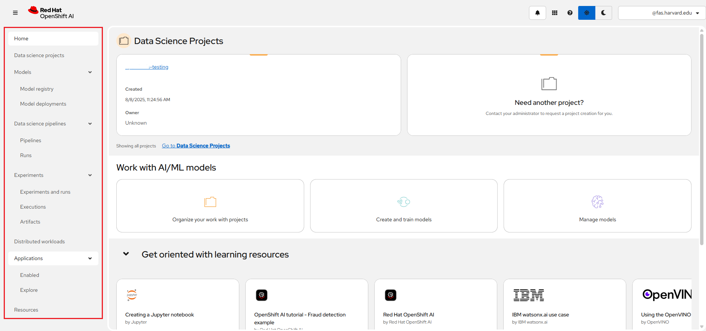

# Access the NERC's OpenShift AI dashboard

Access [the NERC's OpenShift Web Console](https://console.apps.shift.nerc.mghpcc.org)
via the web browser as [described here](../../openshift/logging-in/access-the-openshift-web-console.md).

Click "**Log In With OpenShift**" button to login using OpenShift credential:

Make sure you are selecting "**mss-keycloak**" as shown here:

Next, you will be redirected to CILogon welcome page as shown below:

Once you successfully authenticate you should see the NERC OpenShift Web Console
as shown below:

In the upper right-hand corner of the dashboard is a black-and-white icon that
resembles a grid as shown below. Click this icon.

After the NERC OpenShift AI dashboard launches, it displays all currently enabled
applications.

You can return to OpenShift Web Console by using the launcher button (the black-and-white
icon that looks like a grid), and choosing the "OpenShift Console" as shown below:

---
