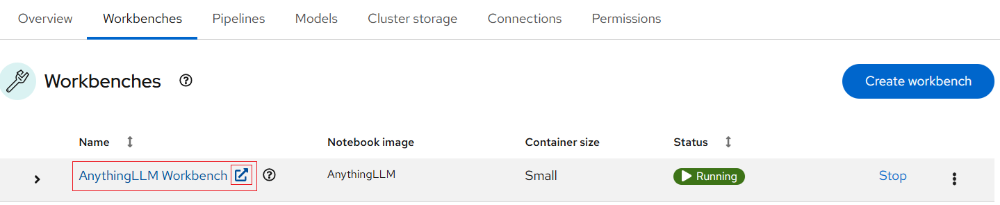

# LLM Client - AnythingLLM

LLM clients provide user-friendly interfaces for interacting with LLMs. These
clients help streamline the deployment and usage of LLMs for various applications,
such as chatbots, document processing, and AI-powered automation.

## AnythingLLM

[AnythingLLM](https://anythingllm.com/) is an open-source framework that enables
users to connect and interact with LLMs efficiently. It supports integration with
multiple AI models, providing a web-based UI for seamless communication, ensuring
you're not limited to a single provider. To integrate an LLM, simply provide the
endpoint URL and, if necessary, an authentication token.

It facilitates conversations with documents in various formats, including PDFs,
TXT, and CSVs. This tool is especially useful for creating private, localized
versions of ChatGPT, allowing users to upload files and receive context-aware
responses based on their content.

### Deploying as a Workbench Using a Data Science Project (DSP) on NERC RHOAI

Here, we'll guide you through deploying **AnythingLLM** as a workbench on
**NERC RHOAI** to create a private chatbot for internal users. **AnythingLLM**
enables teams to securely interact with documents and knowledge bases by integrating
various **LLMs** and **LLM servers** with private data in a controlled environment.

By leveraging NERC OpenShift's powerful AI platform and built-in security
features, we can deploy **AnythingLLM** as an efficient and secure internal
chatbot solution.

**Prerequisites**:

-   Before proceeding, confirm that you have a locally running **Ollama** Model
    Serving instance on your NERC OpenShift environment setup by following
    [these instructions](https://github.com/nerc-project/llm-on-nerc/blob/main/llm-servers/ollama/README.md)
    for a Standalone Deployment.

**Procedure**:

1.  Navigating to the OpenShift AI dashboard.

    Please follow [these steps](../../openshift-ai/logging-in/access-the-rhoai-dashboard.md)
    to access the NERC OpenShift AI dashboard.

2.  Please ensure that you start your AnythingLLM server with options as depicted
    in the following configuration screen. This screen provides you
    with the opportunity to select a notebook image and configure its options,
    including the Accelerator and Number of accelerators (GPUs).

    

    For our example project, let's name it "AnythingLLM Workbench". We'll select
    the **AnythingLLM** image, choose a **Deployment size** of **Small**, **Accelerator**
    as **None** (no GPU is needed for this setup), and allocate a **Cluster storage**
    space of **20GB**.

    !!! tip "Tip"

        The dashboard currently enforces a minimum storage volume size of 20GB.
        Please ensure that you modify this based on your need in **Cluster Storage**.

3.  If this procedure is successful, you have started your AnythingLLM Workbench.
    When your workbench is ready, the status will change to _Running_ and you can
    select "Open" to go to your environment:

    

4.  Once you have successfully authenticated by clicking "**mss-keycloak**" when
    prompted, as shown below:

    

    Next, you should see the **AnythingLLM** welcome splash screen, as shown below:

    

    Click on **Get started**.

5.  Configure the LLM Endpoint to Connect the Workbench to your locally deployed
    **Ollama** Model Serving instance:

    -   **Search LLM Providers**: Scroll through the list and select **Ollama**
        from the available options.

    -   **Ollama Base URL**: Enter the URL where Ollama is running. For your
        locally deployed **Ollama** Model Serving instance, you have **two main**
        options for the "Ollama Base URL," as explained below:

        -   **Internal Service Endpoint**:  

            !!! warning "Important Note"

                This option is only accessible **within the OpenShift cluster**
                and cannot be accessed externally.

            -   You can use the internal service URL for the Ollama service within
                your OpenShift environment based on the service name and exposed
                port, such as `http://ollama-service:11434`.

                

            -   Alternatively, you can click on the service name to **view details**,
                including the internal service routing **Hostname** and **Port**,
                as shown below:

                

                Thus, the internal service URL will be: `http://ollama-service.<your-namespace>.svc.cluster.local:11434`.

        -   **Public Route URL**:

            -   The Ollama service can be accessed externally using the public
                **Route** URL provided by OpenShift. The URL follows this format:
                `https://ollama-route-<your-namespace>.apps.shift.nerc.mghpcc.org`.

        Choose the appropriate URL option based on your needs and whether the Ollama
        service is intended for internal use or external access.

    -   **Ollama Model**: Choose the specific Ollama model you want to use for
        your conversations.

    -   **Max Tokens**: Specify the maximum number of tokens to be used for
        context and responses. A good starting point is 4096, but you can adjust
        this later within your workspaces.

    

6.  **Set Up User Access** by selecting `Just me` on the next screen. Since OpenShift's
    authentication ensures that only you can access your workbench, this option
    is appropriate.

    You will then be prompted to set up a secondary password. However, this step
    is generally not necessary, as access to the workbench is already secured by
    OpenShift authentication.

    

7.  Then, on the **Review Configuration** screen, you will see a summary of your
    settings. Take a moment to confirm that everything looks correct before proceeding.

    

    You may encounter a brief survey during the setup process, which you can skip
    if you prefer.

    

8.  Next, you'll set up your **First Workspace**, which serves as a project area
    within AnythingLLM. Each workspace can have its own settings and data, enabling
    you to organize different tasks or experiments independently.

    

9.  The initial view will provide you with various information, but you can go
    straight to your workspace and start interacting with the LLM immediately.

    

There's a lot you can do with AnythingLLM, so be sure to explore its features! For
more details, check out the [documentation](https://docs.anythingllm.com/).

---
