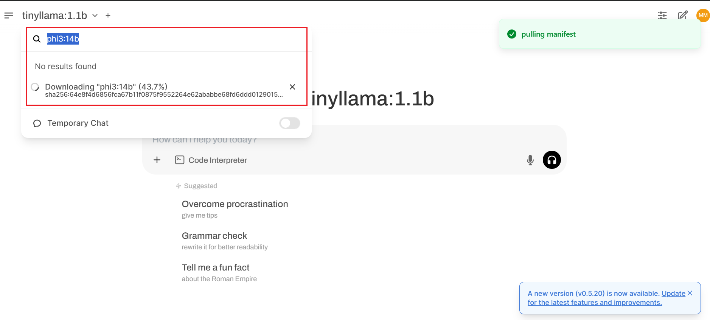
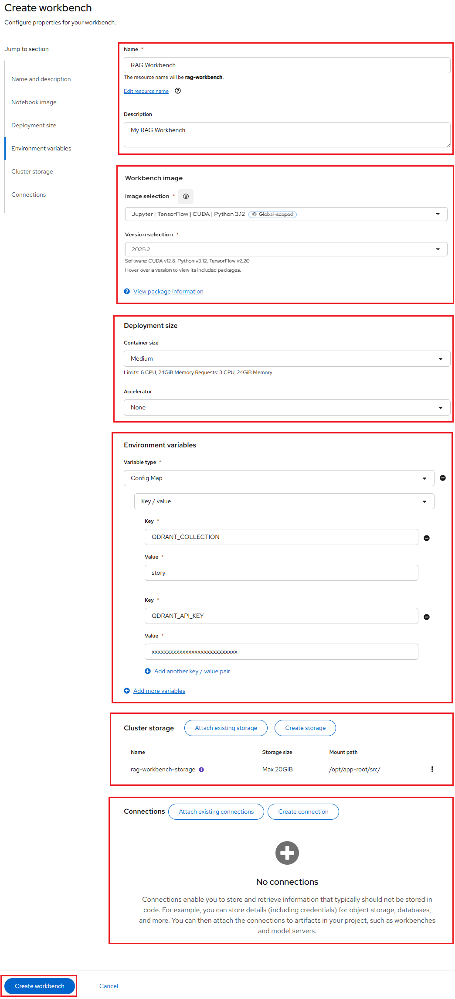
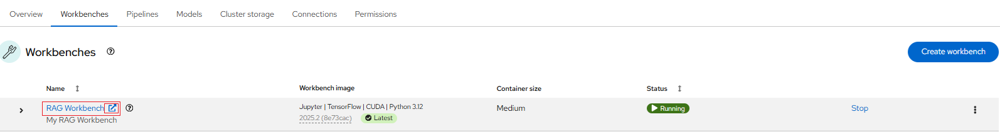
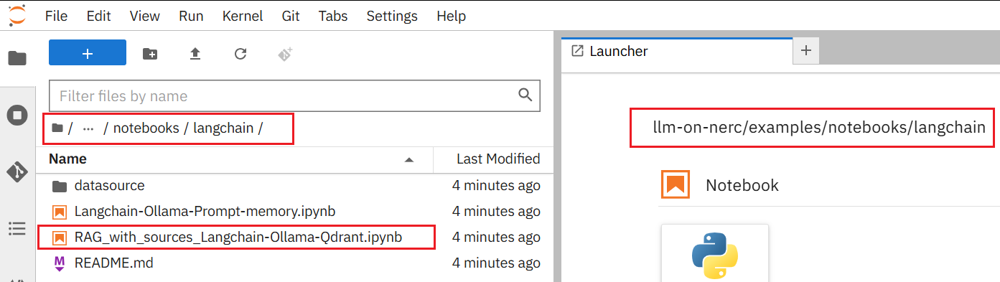
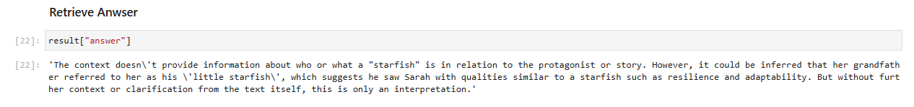

# RAG Application - Talk with your PDF

For this walkthrough, we will be using an application that is a **RAG-based Chatbot**.
It will utilize a [Qdrant](predictive-and-generative-AI.md#qdrant) vector store,
[Ollama](https://github.com/ollama/ollama) for LLM serving, [Langchain](https://www.langchain.com/)
as the "glue" between these components, and [Gradio](https://www.gradio.app/) as
the UI engine.

This setup enables efficient RAG by leveraging vector search, embedding and an
optimized inference engine.

## Model Serving

Deploy **Ollama** Model Serving instance on the NERC OpenShift environment by following
[these intructions](https://github.com/nerc-project/llm-on-nerc/blob/main/llm-servers/ollama/README.md).

### Pull the Required Model for RAG

Once the Ollama setup is successfully completed, you will be able to access the
**Open WebUI** for Ollama as [explained here](https://github.com/nerc-project/llm-on-nerc/tree/main/llm-servers/ollama#access-deployed-open-webui-for-ollama).

Using Open WebUI, you can download and manage LLM models as per your need. For our
*RAG application*, we are going to use [**Phi-3 model**](https://ollama.com/library/phi3:14b)
which is a family of lightweight 3B (Mini) and 14B (Medium) state-of-the-art open
models by Microsoft. We are going to pull the **Phi-3 model** using Open WebUI as
shown below:



Alternatively, you can [Pull the Models](https://github.com/nerc-project/llm-on-nerc/tree/main/llm-servers/ollama#pull-the-models)
using the "Terminal" connected to the Ollama pod.

## Deploying a Vector Database

For our *RAG application*, we need a **Vector Database** to store the **embeddings**
of different documents. In this case, we are using **Qdrant**.

You can deploy and run the **Qdrant** vector database directly on the NERC OpenShift
environment by following [these intructions](https://github.com/nerc-project/llm-on-nerc/blob/main/vector-databases/qdrant/README.md).

After you follow those instructions, you should have a *Qdrant instance* ready to
be populated with documents.

!!! info "Facing Rate Limits While Pulling Container Image?"

    If you encounter **Rate Limits** while pulling **Container Images**, refer to
    [this guide](../../openshift/applications/editing-applications.md#rate-limits-while-pulling-container-image)
    for detailed steps on how to resolve the issue.

## Deploying as a Workbench Using a Data Science Project (DSP) on NERC RHOAI

**Prerequisites**:

-   Before proceeding, confirm that you have an active GPU quota that has been approved
    for your current NERC OpenShift Allocation through NERC ColdFront. Read
    more about [How to Access GPU Resources](../../openshift/gpus/intro-to-gpus-on-nerc-ocp.md#accessing-gpu-resources)
    on NERC OpenShift Allocation.

**Procedure:**

1.  Navigating to the OpenShift AI dashboard.

    Please follow [these steps](../../openshift-ai/logging-in/access-the-rhoai-dashboard.md)
    to access the NERC OpenShift AI dashboard.

2.  Please ensure that you start your Jupyter notebook server with options as
    depicted in the following configuration screen. This screen provides you
    with the opportunity to select a notebook image and configure its options,
    including the Accelerator and Number of accelerators (GPUs).

    

    For our example project, let's name it "RAG Workbench". We'll select the
    **TensorFlow** image with Recommended Version (selected by default), choose
    a **Deployment size** of **Medium**, **Accelerator** as **None** (no GPU is
    needed for this setup) and allocate a **Cluster storage** space of **20GB**.

    !!! tip "Tip"

        The dashboard currently enforces a minimum storage volume size of 20GB.
        Please ensure that you modify this based on your need in **Cluster Storage**.

    Here, you will use **Environment Variables** to define the key-value pairs
    required for connecting to the Qdrant vector database, specifically:

    -   `QDRANT_COLLECTION`: The name of the collection in Qdrant.

    -   `QDRANT_API_KEY`: The authentication key for accessing the Qdrant database.

        To retrieve the value of `QDRANT__SERVICE__API_KEY` from the `qdrant-key`
        Secret using the `oc` command, run:

        ```sh
        oc get secret qdrant-key -o jsonpath='{.data.QDRANT__SERVICE__API_KEY}' | base64 --decode
        ```

    Make sure these variables are properly set to establish a secure connection.

3.  If this procedure is successful, you have started your RAG Workbench. When
    your workbench is ready, the status will change to _Running_ and you can select
    "Open" to go to your environment:

    

4.  Once you have successfully authenticated by clicking "**mss-keycloak**" when
    prompted, as shown below:

    

    Next, you should see the NERC RHOAI JupyterLab Web Interface, as shown below:

    

    The Jupyter environment is currently empty. To begin, populate it with content
    using *Git*. On the left side of the navigation pane, locate the **Name** explorer
    panel, where you can create and manage your project directories.

    !!! note "Learn More About Working with Notebooks"

        For detailed guidance on using notebooks on NERC RHOAI JupyterLab, please
        refer to [this documentation](../data-science-project/explore-the-jupyterlab-environment.md#working-with-notebooks).

### Importing the tutorial files into the Jupyter environment

Bring the content of this tutorial inside your Jupyter environment:

On the toolbar, click the Git Clone icon:


Enter the following **Git Repo URL**: [https://github.com/nerc-project/llm-on-nerc](https://github.com/nerc-project/llm-on-nerc)

Check the Include submodules option, and then click Clone.


In the file browser, double-click the newly-created **llm-on-nerc** folder.


**Verification:**

In the file browser, you should see the notebooks that you cloned from Git. Navigate
to the `llm-on-nerc/examples/notebooks/langchain` directory, where you will find
the Jupyter notebook file `RAG_with_sources_Langchain-Ollama-Qdrant.ipynb`, as
shown below:



**Double-click** on this file to open it.

!!! warning "Very Important Note"
    Update the Ollama's **BASE_URL** and Qdrant's **QDRANT_HOST** in this notebook
    to match your deployment settings.

**Integrating Qdrant with LangChain:**

Once you have Qdrant set up, the next step is to integrate it with LangChain.
The LangChain library provides various tools to interact with vector databases,
including Qdrant.

The AI model, now enriched with additional data, including *The Forgotten Lighthouse*
book pdf that is located at [`llm-on-nerc/examples/notebooks/langchain/datasource/The_Forgotten_Lighthouse_Book.pdf`](https://github.com/nerc-project/llm-on-nerc/blob/main/examples/notebooks/langchain/datasource/The_Forgotten_Lighthouse_Book.pdf),
can be queried. When asked, *"Who is the starfish, and how do you know?"*, it
processes the PDF and infers that Grandpa calls Sarah “my little starfish” in his
letter. Since the model wasn't originally trained on this book, its response
relies on RAG, demonstrating how AI can extract and infer new information without
retraining.

In real life, this means you can run a pre-trained AI model (e.g., the
**Phi-3 model** in our application) on your own data without ever sending it
outside your premises for training.

The response to our query is as shown below:



---
