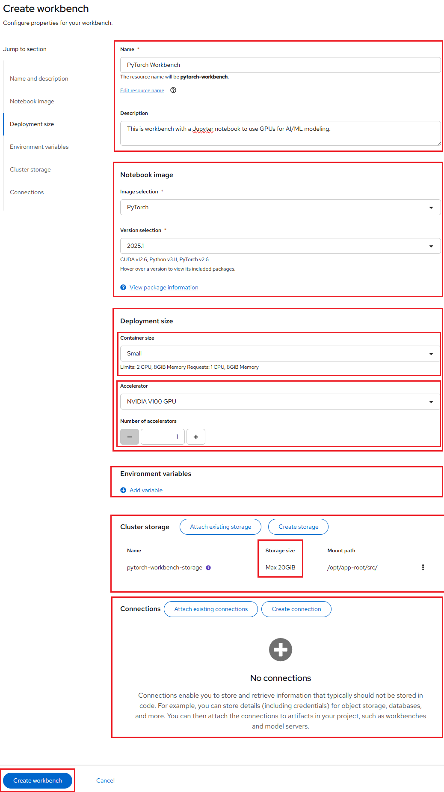

# Configure a Jupyter notebook to use GPUs for AI/ML modeling

**Prerequisites**:

Prepare your Jupyter notebook server for using a GPU, you need to have:

- Select the correct data science project and create workbench, see
[Populate the data science project](../data-science-project/using-projects-the-rhoai.md#populate-the-data-science-project)
for more information.

Please ensure that you start your Jupyter notebook server with options as depicted
in the following configuration screen. This screen provides you with the opportunity
to select a notebook image and configure its options, including the number of GPUs.



For our example project, let's name it "PyTorch Workbench". We'll select the
**PyTorch** image, choose a **Deployment size** of **Small**, **Number of GPUs**
as **1** and allocate a **Cluster storage** space of **1GB**.

If this procedure is successful, you have started your Jupyter notebook server.
When your workbench is ready, the state will change to *Running* and you can select
"Open" to go to your environment:


Once you successfully authenticate you should see the NERC RHOAI JupyterLab Web
Interface as shown below:


It's pretty empty right now, though. On the left side of the navigation pane,
locate the **Name** explorer panel. This panel is where you can create and manage
your project directories.

## Clone a GitHub Repository

You can clone a Git repository in JupyterLab through the left-hand **toolbar** or
the **Git** menu option in the main menu as shown below:


Let's clone a repository using the left-hand toolbar. Click on the **Git** icon,
shown in below:


Then click on **Clone a Repository** as shown below:


Enter the git repository URL, which points to the end-to-end ML workflows demo
project i.e. [https://github.com/rh-aiservices-bu/getting-started-with-gpus](https://github.com/rh-aiservices-bu/getting-started-with-gpus).

Then click **Clone** button as shown below:


Cloning takes a few seconds, after which you can double-click and navigate to the
newly-created folder i.e. `getting-started-with-gpus` that contains your cloned
Git repository.

You will be able to find the newly-created folder named `getting-started-with-gpus`
based on the Git repository name, as shown below:


## Exploring the `getting-started-with-gpus` repository contents

After you've cloned your repository, the `getting-started-with-gpus` repository
contents appear in a directory under the **Name** pane. The directory contains
several notebooks as `.ipnyb` files, along with a standard license and *README*
file as shown below:


Double-click the `torch-use-gpu.ipynb` file to open this notebook.

This notebook handles the following tasks:

1. Importing torch libraries (utilities).

2. Listing available GPUs.

3. Checking that GPUs are enabled.

4. Assigning a GPU device and retrieve the GPU name.

5. Loading vectors, matrices, and data onto a GPU.

6. Loading a neural network model onto a GPU.

7. Training the neural network model.

Start by importing the various `torch` and `torchvision` utilities:

```python
import torch
import torch.nn as nn
import torch.nn.functional as F
from torch.utils.data import TensorDataset
import torch.optim as optim
import torchvision
from torchvision import datasets
import torchvision.transforms as transforms
import matplotlib.pyplot as plt
from tqdm import tqdm
```

Once the utilities are loaded, determine how many GPUs are available:

```python
torch.cuda.is_available() # Do we have a GPU? Should return True.
```

```python
torch.cuda.device_count()  # How many GPUs do we have access to?
```

When you have confirmed that a GPU device is available for use, assign a GPU device
and retrieve the GPU name:

```python
device = torch.device("cuda:0" if torch.cuda.is_available() else "cpu")
print(device)  # Check which device we got
```

```python
torch.cuda.get_device_name(0)
```

Once you have assigned the first GPU device to your device variable, you are ready
to work with the GPU. Let's start working with the GPU by loading vectors, matrices,
and data:

```python
X_train = torch.IntTensor([0, 30, 50, 75, 70])  # Initialize a Tensor of Integers with no device specified
print(X_train.is_cuda, ",", X_train.device)  # Check which device Tensor is created on
```

```python
# Move the Tensor to the device we want to use
X_train = X_train.cuda()
# Alternative method: specify the device using the variable
# X_train = X_train.to(device)
# Confirm that the Tensor is on the GPU now
print(X_train.is_cuda, ",", X_train.device)
```

```python
# Alternative method: Initialize the Tensor directly on a specific device.
X_test = torch.cuda.IntTensor([30, 40, 50], device=device)
print(X_test.is_cuda, ",", X_test.device)
```

After you have loaded vectors, matrices, and data onto a GPU, load a neural network
model:

```python
# Here is a basic fully connected neural network built in Torch.
# If we want to load it / train it on our GPU, we must first put it on the GPU
# Otherwise it will remain on CPU by default.

batch_size = 100

class SimpleNet(nn.Module):
    def __init__(self):
        super(SimpleNet, self).__init__()
        self.fc1 = nn.Linear(784, 784)
        self.fc2 = nn.Linear(784, 10)

    def forward(self, x):
        x = x.view(batch_size, -1)
        x = self.fc1(x)
        x = F.relu(x)
        x = self.fc2(x)
        output = F.softmax(x, dim=1)
        return output
```

```python
model = SimpleNet().to(device)  # Load the neural network model onto the GPU
```

After the model has been loaded onto the GPU, train it on a data set. For this
example, we will use the [FashionMNIST data set](https://github.com/zalandoresearch/fashion-mnist):

```python
"""
    Data loading, train and test set via the PyTorch dataloader.
"""
# Transform our data into Tensors to normalize the data
train_transform=transforms.Compose([
        transforms.ToTensor(),
        transforms.Normalize((0.1307,), (0.3081,))
        ])

test_transform=transforms.Compose([
        transforms.ToTensor(),
        transforms.Normalize((0.1307,), (0.3081,)),
        ])

# Set up a training data set
trainset = datasets.FashionMNIST('./data', train=True, download=True,
                  transform=train_transform)
train_loader = torch.utils.data.DataLoader(trainset, batch_size=batch_size,
                                          shuffle=False, num_workers=2)

# Set up a test data set
testset = datasets.FashionMNIST('./data', train=False,
                  transform=test_transform)
test_loader = torch.utils.data.DataLoader(testset, batch_size=batch_size,
                                        shuffle=False, num_workers=2)
```

Once the FashionMNIST data set has been downloaded, you can take a look at the
dictionary and sample its content.

```python
# A dictionary to map our class numbers to their items.
labels_map = {
    0: "T-Shirt",
    1: "Trouser",
    2: "Pullover",
    3: "Dress",
    4: "Coat",
    5: "Sandal",
    6: "Shirt",
    7: "Sneaker",
    8: "Bag",
    9: "Ankle Boot",
}

# Plotting 9 random different items from the training data set, trainset.
figure = plt.figure(figsize=(8, 8))
for i in range(1, 3 * 3 + 1):
    sample_idx = torch.randint(len(trainset), size=(1,)).item()
    img, label = trainset[sample_idx]
    figure.add_subplot(3, 3, i)
    plt.title(labels_map[label])
    plt.axis("off")
    plt.imshow(img.view(28,28), cmap="gray")
plt.show()
```

The following figure shows a few of the data set's pictures:


There are ten classes of fashion items (e.g. shirt, shoes, and so on). Our goal
is to identify which class each picture falls into. Now you can train the model
and determine how well it classifies the items:

```python
def train(model, device, train_loader, optimizer, epoch):
    """Model training function"""
    model.train()
    print(device)
    for batch_idx, (data, target) in tqdm(enumerate(train_loader)):
        data, target = data.to(device), target.to(device)
        optimizer.zero_grad()
        output = model(data)
        loss = F.nll_loss(output, target)
        loss.backward()
        optimizer.step()
```

```python
def test(model, device, test_loader):
    """Model evaluating function"""
    model.eval()
    test_loss = 0
    correct = 0
    # Use the no_grad method to increase computation speed
    # since computing the gradient is not necessary in this step.
    with torch.no_grad():
        for data, target in test_loader:
            data, target = data.to(device), target.to(device)
            output = model(data)
            test_loss += F.nll_loss(output, target, reduction='sum').item()  # sum up batch loss
            pred = output.argmax(dim=1, keepdim=True)  # get the index of the max log-probability
            correct += pred.eq(target.view_as(pred)).sum().item()

    test_loss /= len(test_loader.dataset)

    print('\nTest set: Average loss: {:.4f}, Accuracy: {}/{} ({:.0f}%)\n'.format(
        test_loss, correct, len(test_loader.dataset),
        100. * correct / len(test_loader.dataset)))
```

```python
# number of  training 'epochs'
EPOCHS = 5
# our optimization strategy used in training.
optimizer = optim.Adadelta(model.parameters(), lr=0.01)
```

```python
for epoch in range(1, EPOCHS + 1):
        print( f"EPOCH: {epoch}")
        train(model, device, train_loader, optimizer, epoch)
        test(model, device, test_loader)
```

As the model is trained, you can follow along as its accuracy increases from 63
to 72 percent. (Your accuracies might differ, because accuracy can depend on the
random initialization of weights.)

Once the model is trained, save it locally:

```python
# Saving the model's weights!
torch.save(model.state_dict(), "mnist_fashion_SimpleNet.pt")
```

## Load and run a PyTorch model

Let's now determine how our simple torch model performs using GPU resources.

In the `getting-started-with-gpus` directory, double click on the
`torch-test-model.ipynb` file (highlighted as shown below) to open the notebook.


After importing the `torch` and `torchvision` utilities, assign the first GPU to
your device variable. Prepare to import your trained model, then place the model
on your GPU and load in its trained weights:

```python
import torch
import torch.nn as nn
import torch.nn.functional as F
from torchvision import datasets
import torchvision.transforms as transforms
import matplotlib.pyplot as plt
```

```python
device = torch.device("cuda:0" if torch.cuda.is_available() else "cpu")
print(device)  # let's see what device we got
```

```python
# Getting set to import our trained model.

# batch size of 1 so we can look at one image at time.
batch_size = 1


class SimpleNet(nn.Module):
    def __init__(self):
        super(SimpleNet, self).__init__()
        self.fc1 = nn.Linear(784, 784)
        self.fc2 = nn.Linear(784, 10)

    def forward(self, x):
        x = x.view(batch_size, -1)
        x = self.fc1(x)
        x = F.relu(x)
        x = self.fc2(x)
        output = F.softmax(x, dim=1)
        return output
```

```python
model = SimpleNet().to( device )
model.load_state_dict( torch.load("mnist_fashion_SimpleNet.pt") )
```

You are now ready to examine some data and determine how your model performs.
The sample run as shown below shows that the model predicted a "bag" with a
confidence of about 0.9192. Despite the % in the output, 0.9192 is very good
because a perfect confidence would be 1.0.


---
