# Connect to RHOAI Workbench Kernel from local Visual Studio Code (VS Code)

Some users prefer to work directly in their local IDE and run Jupyter notebooks
using a kernel on a remote workbench hosted on NERC's RHOAI. While most IDEs
support connecting to a remote kernel as a standard feature, this does not work
with RHOAI due to its authentication setup.

Typically, IDEs use token-based authentication to connect to remote kernels. However
workbench pods in RHOAI include an authentication layer in front of the workbench
container that manages user access. This layer relies on OpenShift's authentication
mechanism, which is not compatible with the standard remote kernel connection
features provided by most IDEs.

## Workaround: Connect to the remote kernel using Openshift port-forwarding

Use the following steps to connect your local VS Code to RHOAI Workbench kernel:

-   In your RHOAI data science project, create a workbench that you intend to use
    as your remote kernel. If you require a GPU accelerator, choose a compatible
    workbench image (i.e. PyTorch, TensorFlow based Workbench image).

    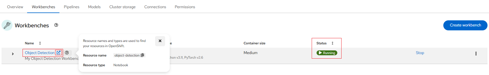

-   Open the workbench and copy the context path from the browser. You will need
    this (i.e. `notebook/<your-project-namespace>/object-detection/lab`) later
    when connecting from VS Code locally.

    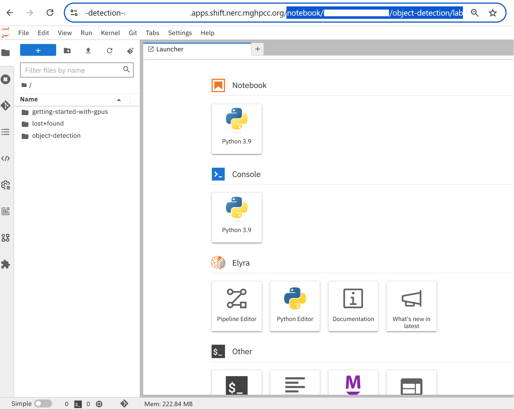

-   Make sure you have the `oc` CLI tool installed and configured on your local
    machine following [these steps](../../openshift/logging-in/setup-the-openshift-cli.md#first-time-usage).

-   From terminal on your laptop/desktop login to the NERC OpenShift cluster and
    switch to your project namespace:

    ```sh
    oc login --token=<your_token> --server=https://api.shift.nerc.mghpcc.org:6443  
    ```

    For example:

    ```sh
    oc login --token=<your_token> --server=https://api.shift.nerc.mghpcc.org:6443
    Logged into "https://api.shift.nerc.mghpcc.org:6443" as "<your_account>" using the token provided.  
    ```

    !!! info "Information"

        Some users may have access to multiple projects. Run the following command
        to switch to a specific project space: `oc project <your-project-namespace>`.

-   Switch to your data science project:

    Please confirm the correct project is being selected by running `oc project`,
    as shown below:

        oc project
        Using project "<your-project-namespace>" on server "https://api.shift.nerc.mghpcc.org:6443".

-   Start port-forwarding to your workbench pod:

    i.  List all the pods in your project. The pod running your workbench is named
        based on your workbench name in RHOAI. For example, `object-detection-0`
        corresponds to a workbench named `Object Detection`.

    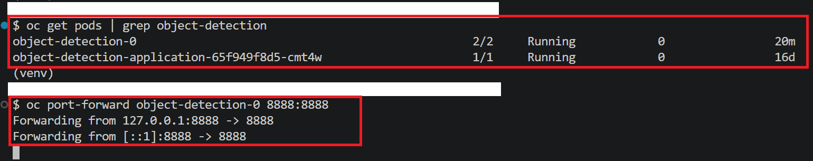

    > **Note:** Capital letters are converted to lowercase, and spaces are replaced
    with hyphens (`-`).

    ii. Enable port-forwarding to your workbench pod. You need to forward to the
        port the pod is listening on. It is usually `8888` for RHOAI workbench.
        You can find this port from the service in your project with name same
        as your workbench.

-   Open the Jupyter notebook in your local VS Code

    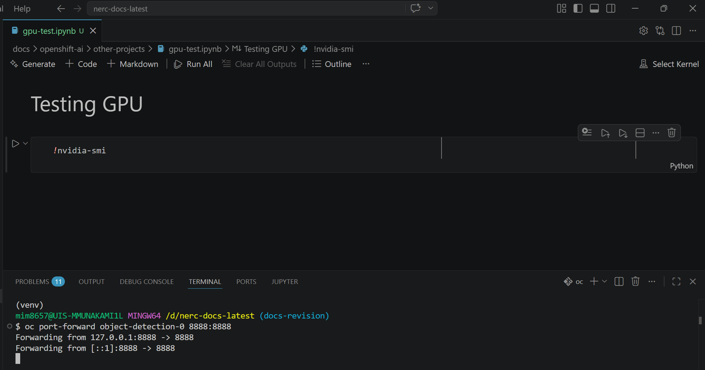

-   From the top right corner of the notebook, click on `Select Kernel`.

    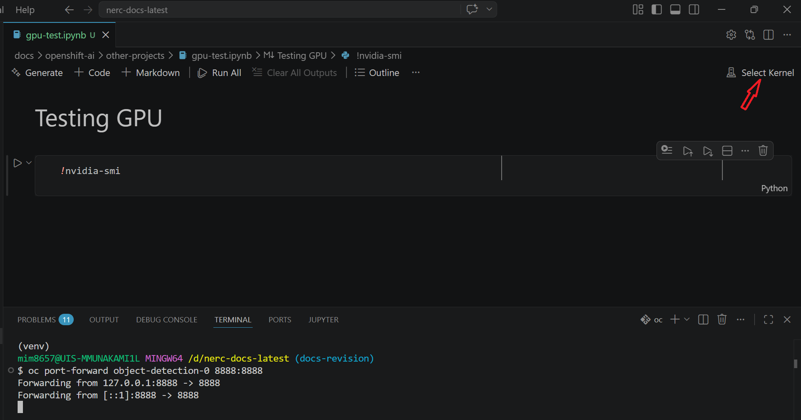

-   From the options, select `Existing Jupyter Server` and then enter the url as
    follows:

    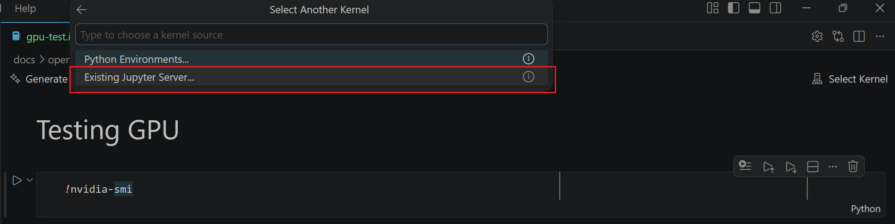

    `localhost` `[:port]` `/context-path` copied earlier that has the pattern
    `/notebook/ds-project-name/workbench-name/lab`. e.g. `http://localhost:8888/notebook/<your-project-namespace>/object-detection/lab`
    and then press `Enter` to confirm.

    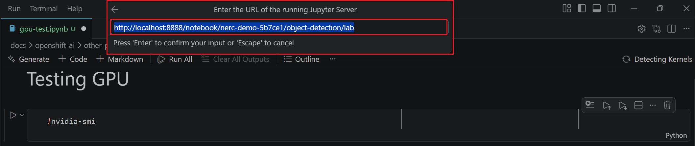

-   A prompt saying: `Connecting over HTTP without a token may be an insecure
    connection. Do you want to connect to a possibly insecure server?` is displayed.
    select `Yes`.

    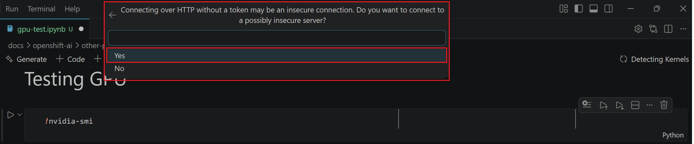

-   Select the prompted `Server display name` or enter a new one and then press
    `Enter` to confirm.

    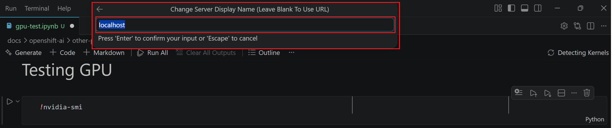

-   A list of available kernels is displayed. Choose `Python 3.9`.

    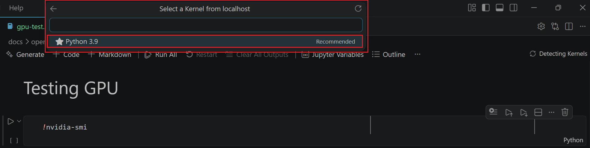

-   You should see the selected Kernel in the top right corner.

    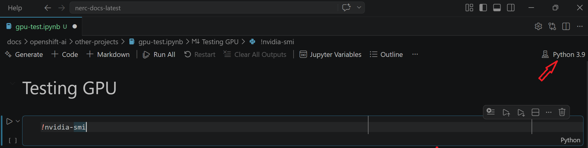

-   The code inside of your notebook will now execute using the remote kernel on
    the RHOAI workbench pod.

-   If your workbench uses a NVIDIA GPU, you can verify that it is being used in
    the execution of your notebook by adding a command `!nvidia-smi`. You should
    see output similar to the image below.

    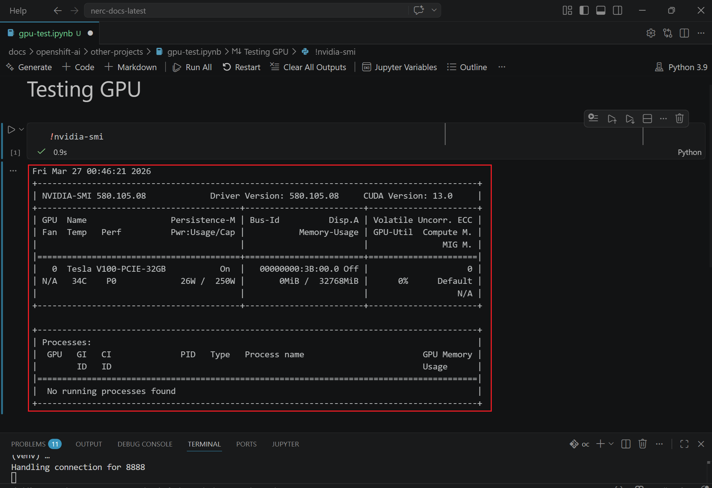

## Caveats

-   Jupyter notebooks in your local VS Code environment will not be saved to the
    workbench.

-   If your notebook uses any files (models, inputdata etc.), they should be
    present on the workbench and their path should match the path specified in
    your notebook.

---
