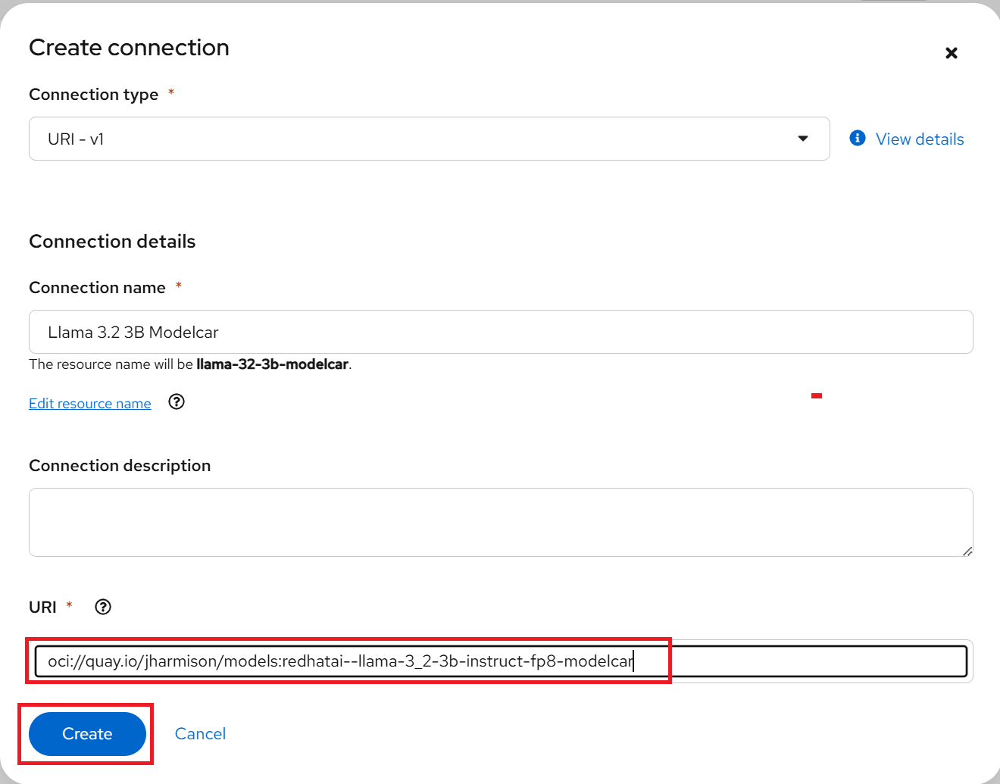
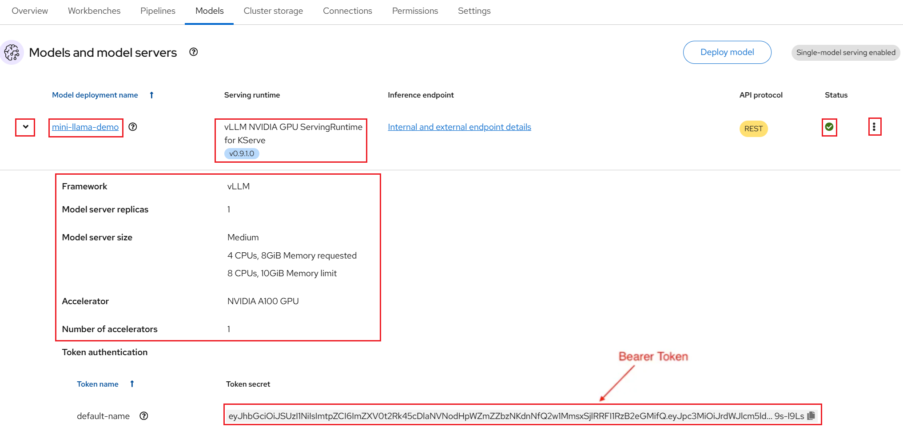
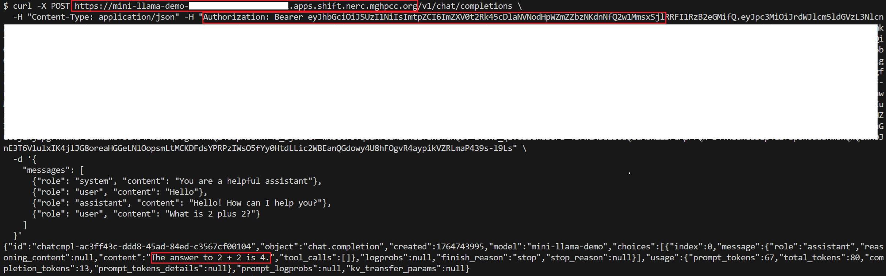
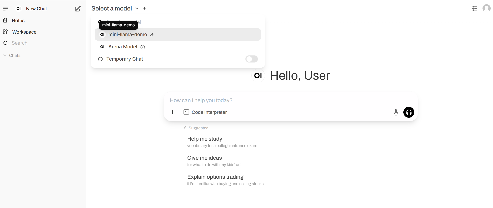

# Deploying a Llama model with KServe using Red Hat OpenShift AI

In this walkthrough, we will explore and demonstrate how to deploy a **Llama**
language model using the intuitive interface of Red Hat OpenShift AI (RHOAI) and
NERC's powerful infrastructure features, including GPU acceleration, automatic
resource scaling, and support for distributed computing.

**Prerequisites**:

-   Before proceeding, confirm that you have an active GPU quota that has been approved
    for your current NERC OpenShift Allocation through NERC ColdFront. Read
    more about [How to Access GPU Resources](../../openshift/gpus/intro-to-gpus-on-nerc-ocp.md#accessing-gpu-resources)
    on NERC OpenShift Allocation.

-   `Llama-3.2-3B-Instruct-FP8` model: [Llama-3.2-3B-Instruct-FP8](https://huggingface.co/RedHatAI/Llama-3.2-3B-Instruct-FP8)
is obtained by quantizing the weights of the [Llama-3.2-3B-Instruct](https://huggingface.co/meta-llama/Llama-3.2-3B-Instruct)
model to the FP8 data type. This optimization reduces the number of bits used to
represent weights and activations from 16 to 8, lowering GPU memory requirements
by approximately 50% and increasing matrix-multiply throughput by about 2×. Weight
quantization also reduces disk storage requirements by roughly 50%.

    For our Llama model demonstration, we are using a publicly available container
    image from the [Quay.io](https://quay.io/repository/jharmison/models?tab=tags&tag=redhatai--llama-3_2-3b-instruct-fp8-modelcar)
    registry. Specifically, we will deploy the Llama 3.2 model with 3 billion parameters,
    fine-tuned for instruction-following and optimized with 8-bit floating-point
    precision to minimize memory usage.

-   Setup the OpenShift CLI (`oc`) Tools locally and configure the OpenShift CLI
to enable `oc` commands. Refer to [this user guide](../../openshift/logging-in/setup-the-openshift-cli.md).

-   [Helm](https://helm.sh/) installed locally.

## Establishing model connections

Create a **Connection** to a ModelCar container image, which is an **OCI-compliant**
container that packages a machine learning model along with its runtime environment
and dependencies for consistent deployment.

In your OpenShift AI project, go to the **Connections** tab and click the
"Create Connection" and then choose the **URI** connection type as shown below:


!!! note "Connection Types"

    OpenShift AI supports three connection types for accessing model images:

    -   **OCI-compliant registry**: For proprietary images requiring authentication.

    -   **S3 compatible object storage**: For cloud storage solutions.

    -   **URI**: For publicly available resources, **which is the one used in this
    demonstration**.

To create this connection in your project, enter the following URI and use
`Llama 3.2 3B Modelcar` as the connection name, as shown below:



```sh
oci://quay.io/jharmison/models:redhatai--llama-3_2-3b-instruct-fp8-modelcar
```

## Setting up Single-model Server and Deploy the model

1. In the left menu, click **Data science projects**.

    The **Data science projects** page opens.

2. Click the name of the project that you want to deploy a model in.

    A project details page opens.

3. Click the **Models** tab.

4. Perform one of the following actions:

    -   If you see a **​​Single-model serving platform** tile, click **Select single-model**
        on the tile and then click the **Deploy model** button.

        

    -   If you do not see any tiles i.e. "Single-model serving platform" is already
        selected, click the **Deploy model** button.

        

5. The **Deploy model** dialog opens.

Enter the following information for your new model:

-   **Model deployment name**: Enter a unique name for the model that you are
    deploying (e.g., "mini-llama-demo").

-   **Serving runtime**: Select **vLLM NVIDIA GPU ServingRuntime for KServe** runtime.

-   **Model framework (name - version)**: This is pre-selected as `vLLM`.

-   **Deployment mode**: From the Deployment mode list, select **Advanced**
option - uses *Knative Serverless*.

-   **Number of model server replicas to deploy** has **Minimum replicas**: `1`
    and **Maximum replicas**:`1`.

-   **Model server size**: This is the amount of resources, CPU, and RAM that will
    be allocated to your server. Here, you can select `Medium` size.
-   **Accelerator**: Select `NVIDIA A100 GPU`.

-   **Number of accelerators**: `1`.

-   **Model route**: Select the checkbox for "Make deployed models available through
    an external route" this will enable us to send requests to the model endpoint
    from outside the cluster.

-   **Token authentication**: Select the checkbox for "Require token authentication"
    if you want to secure or restrict access to the model by forcing requests to
    provide an authorization token, which is important for security. While selecting
    it, you can keep the populated Service account name i.e. `default-name`.

-   **Source model location**:

    i.  Select the **Connection** option from the dropdown list that you created
        [as described here](#establishing-model-connections) to store
        the model by using the **Existing connection** option Connection dropdown
        list i.e. `Llama 3.2 3B Modelcar`.

-   **Configuration parameters**: You can customize the runtime parameters in the
    Configuration parameters section. You don't need to add any arguments here.

For our example, set the **Model deployment name** to `granite`, and select
**Serving runtime** as `vLLM NVIDIA GPU ServingRuntime for KServe`. Also, ensure
that the **Deployment mode** is set to `Advanced` - uses *Knative Serverless*.


Please leave the other fields at their default settings. For example, the
**Number of model server replicas to deploy** has **Minimum replicas** set to `1`
and **Maximum replicas** set to `1`, and the **Model server size** is set to `Medium`.

Choose `NVIDIA A100 GPU` as the **Accelerator**, with the **Number of accelerators**
set to `1`.

At this point, ensure that both
**Make deployed models available through an external route** and
**Require token authentication** are *checked*. Please leave the populated
**Service account name** i.e. `default-name` as it is. Select `Llama 3.2 3B Modelcar`
as the **Connection** from the *Existing connection*, as shown below:


When you are ready to deploy your model, select the **Deploy** button.

Confirm that the deployed model appears on the **Models** tab for your project.
After some time, once the model has finished deploying, the model deployments
page of the dashboard will display a green checkmark in the **Status** column,
indicating that the deployment is complete.

To view details for the deployed model, click the dropdown *arrow icon* to the left
of your deployed model name (e.g., `mini-llama-demo`), as shown below:



You can also modify the configure properties for your deployed model configuration
by clicking on the three dots on the right side, and selecting **Edit**. This will
bring back the same configuration pop-up window we used earlier. This menu also
has the option for you to **Delete** the deployed model.

!!! tips "Intelligent Auto-Scaling and Scale-to-Zero for Significant Cost Savings"

    Once you deploy your model and obtain the inference endpoints, you can edit
    the deployment and set the **Minimum replicas** to 0. This enables intelligent
    auto-scaling of your model's compute resources (CPU, GPU, RAM, etc.), allowing
    replicas to scale up during high traffic and scale down when idle. With
    `scale-to-zero` enabled, the system reduces pods to zero during inactivity,
    eliminating idle compute costs—especially beneficial for GPU workloads. The
    model then scales back up instantly as soon as a new request arrives.

## Testing your deployment

### Internal testing

Once deployed, navigate to **Workloads > Pods** in the left-hand menu, then locate
and click on the pod that corresponds to the model deployment name, as shown below:


Access the pod’s terminal by clicking the **Terminal** tab, then run a *curl* command
to test internal communication.

The **vLLM runtime** uses **OpenAI's API** format, making integration straightforward.
You can learn more in the [OpenAI documentation](https://platform.openai.com/docs/api-reference/introduction).

The following is an example command you can use to test the connection:

```sh
curl -X POST http://localhost:8080/v1/chat/completions \
  -H "Content-Type: application/json" \
  -d '{
    "messages": [
      {"role": "system", "content": "You are a helpful assistant"},
      {"role": "user", "content": "Hello"},
      {"role": "assistant", "content": "Hello! How can I help you?"},
      {"role": "user", "content": "What is 2 plus 2?"}
    ]
  }'
```

If your command output is successful, it should output something like this:


### Testing external access

For external testing, use the token and external endpoint in your *curl* command.

The deployed model is now accessible through the API endpoint of the model server.
The information about the endpoint is different, depending on how you configured
the model server.

As in this example, you have exposed the model externally through a route, click
on the "Internal and external endpoint details" link in the Inference endpoint
section. A popup will display the address for the *url* and the *External (can be
accessed from inside or outside the cluster)* for the inference endpoints as shown
below:


**Notes**:

-   The internal URL displayed is only the base address of the endpoint of the
    following format: `https://name-of-your-model.name-of-your-project-namespace.svc.cluster.local`
    that is accessible only within your cluster locally.

-   The External Inference endpoint displays the full URL of the following format:
    `https://name-of-your-model-name-of-your-project.apps.shift.nerc.mghpcc.org`
    that you can be easily accessed from outside the cluster.

-   Get the **Authorization Token** for your deployed model by clicking on dropdown
    *arrow icon* to the left of your deployed model name i.e. "granite". Your
    Authorization Token is located at the "Token authentication" section under
    "Token secret", you can just copy the token i.e. `YOUR_BEARER_TOKEN` directly
    from the UI.

The following are some example commands you can use to test the connection:

```sh
curl -X POST https://<url>/v1/chat/completions \
  -H "Content-Type: application/json" -H "Authorization: Bearer YOUR_BEARER_TOKEN" \
  -d '{
    "messages": [
      {"role": "system", "content": "You are a helpful assistant"},
      {"role": "user", "content": "Hello"},
      {"role": "assistant", "content": "Hello! How can I help you?"},
      {"role": "user", "content": "What is 2 plus 2?"}
    ]
  }'
```

**Output:**



```sh
curl -k -X POST https://<url>/v1/completions \
    -H "Content-Type: application/json" -H "Authorization: Bearer YOUR_BEARER_TOKEN" \
    -d '{
        "model": "name-of-your-model",
        "prompt": "San Francisco is a",
        "max_tokens": 7,
        "temperature": 0.7
    }'
```

## Web interface integration using [Open WebUI](https://docs.openwebui.com/)

For a more user-friendly experience, integrate with Open WebUI as follows:

1. **Clone** or navigate to [this repository](https://github.com/nerc-project/llm-on-nerc.git).

    To get started, clone the repository using:

    ```sh
    git clone https://github.com/nerc-project/llm-on-nerc.git
    cd llm-on-nerc/llm-clients/openwebui/charts/openwebui
    ```

2. Prepare `values.yaml` to connect the Open WebUI to the Deployed vLLM Model.

    Edit the `values.yaml` file to specify your running vLLM model and external
    endpoint and token:

    ```yaml
    vllmEndpoint: http://vllm.example.svc:8000/v1
    vllmModel: granite-3.3-2b-instruct
    vllmToken: ""
    ```

3. Install **Helm chart**.

    Deploy Open WebUI using Helm with your configuration:

    ```sh
    helm install openwebui ./ -f values.yaml
    ```

    **Output:**

    ```sh
    NAME: openwebui
    LAST DEPLOYED: Tue Dec  2 22:52:06 2025
    NAMESPACE: <your-namespace>
    STATUS: deployed
    REVISION: 1
    DESCRIPTION: Install complete
    TEST SUITE: None
    NOTES:
    1. Get the Open WebUI URL by running these commands:
    route_hostname=$(kubectl get --namespace <your-namespace> route openwebui -o jsonpath='{.status.ingress[0].host}')
    echo https://${route_hostname}
    ```

4. Access Open WebUI and Test vLLM integration.

    Ensure the clean web UI is connected to your vLLM endpoint by sending a simple
    prompt and verifying the response as shown below:

    

!!! danger "To Remove the Helm Chart"

    Run the following command to cleanly uninstall and delete a Helm release:

    ```sh
    helm uninstall openwebui
    ```

---
