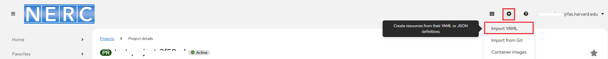
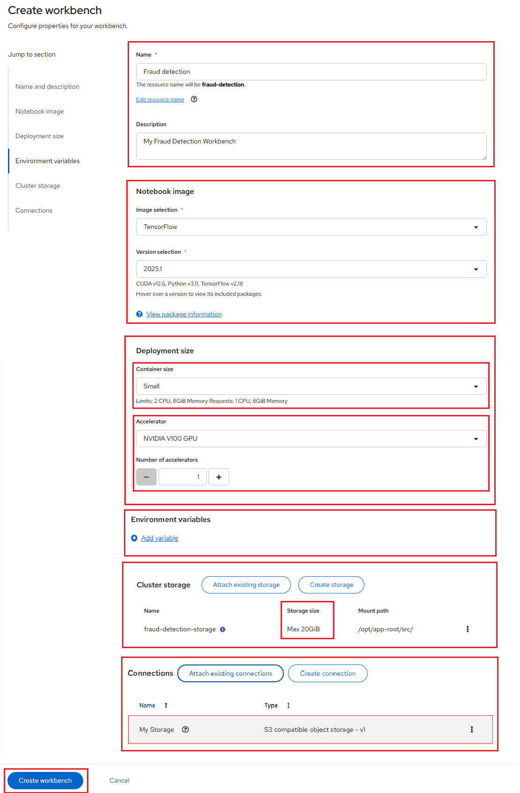
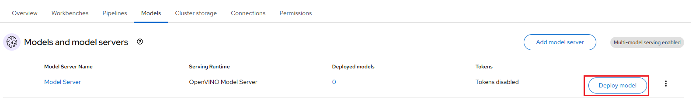
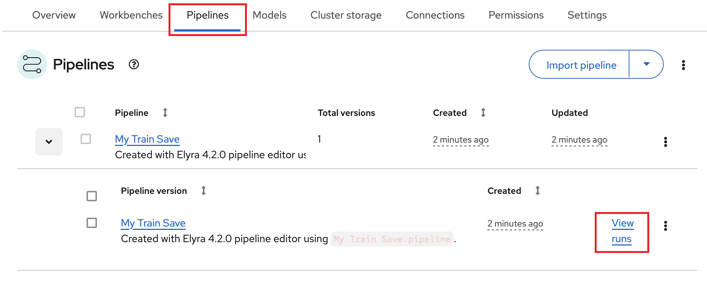
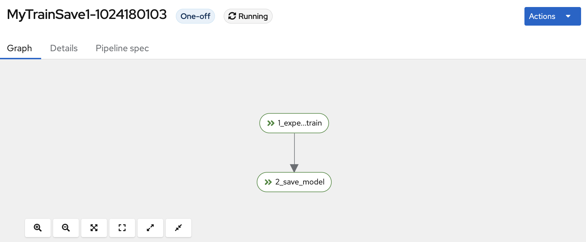

# Credit Card Fraud Detection Application

Here you will use an example fraud detection model to complete the following tasks:

-   Train your own fraud detection model.

-   Explore a pre-trained fraud detection model by using a Jupyter notebook.

-   Deploy the model by using OpenShift AI model serving.

-   Refine and train the model by using automated pipelines.

-   Deploy the "Credit Card Fraud Detection" application on NERC OpenShift, which
connects to the deployed model.

## About the example fraud detection model

The example fraud detection model monitors credit card transactions for potential
fraudulent activity by analyzing the following details:

-   **Distance** from the cardholder's home and previous transaction.

-   **Purchase amount**, compared to the user's median transaction price.

-   **Retailer history**, indicating whether the merchant has been used before.

-   **Authentication method**, such as PIN usage.

-   **Transaction type**, distinguishing between online and in-person purchases.

Based on the above mentioned factors, the model determines the likelihood of a
transaction being fraudulent.

## Navigating to the OpenShift AI dashboard.

Please follow [these steps](../logging-in/access-the-rhoai-dashboard.md) to access
the NERC OpenShift AI dashboard.

## Setting up your Data Science Project in the NERC RHOAI

**Prerequisites**:

-   Before proceeding, confirm that you have an active GPU quota that has been approved
    for your current NERC OpenShift Allocation through NERC ColdFront. Read
    more about [How to Access GPU Resources](../../openshift/gpus/intro-to-gpus-on-nerc-ocp.md#accessing-gpu-resources)
    on NERC OpenShift Allocation.

### 1. Storing data with connections

For this tutorial, you will need **two S3-compatible object storage buckets**,
such as **NERC OpenStack Container (Ceph)**, **MinIO**, or **AWS S3**. You can
either use your own storage buckets or run a provided script that automatically
creates the following **local MinIO storage buckets**:

-   **my-storage** – Use this bucket to store your models and data. You can reuse
this bucket and its connection for notebooks and model servers.

-   **pipeline-artifacts** – Use this bucket to store pipeline artifacts. A pipeline
    artifacts bucket is required when setting up a pipeline server. For clarity,
    this tutorial keeps it separate from the first storage bucket, as it is considered
    best practice to use dedicated storage buckets for different purposes.

You must also create a connection to each storage bucket. For this tutorial, you
have two options depending on whether you want to use your own storage buckets
or a script to create local MinIO storage buckets:

#### 1.1. **Using your own S3-compatible storage buckets**

**Procedure:**

Manually create two connections: **My Storage** and **Pipeline Artifacts**
by following [How to create a data connection](../data-science-project/model-serving-in-the-rhoai.md#create-a-data-connection).

**Verification:**

You should see two connections listed under your RHOAI Dashboard **My Storage**
and **Pipeline Artifacts** as shown below:


#### 1.2. **Using a script to set up local MinIO storage**

Alternatively, if you want to run a script that automates the setup by completing
the following tasks:

-   **Deploys a MinIO instance** in your project namespace.

-   **Creates two storage buckets** within the MinIO instance.

-   **Generates a random user ID and password** for the MinIO instance.

-   **Establishes two connections** in your project - one for each bucket - using
    the same generated credentials.

-   Installs all required **network policies**.

**Procedure:**

i. From the OpenShift AI dashboard, you can return to OpenShift Web Console
by using the application launcher icon (the black-and-white icon that looks
like a grid), and choosing the "OpenShift Console" as shown below:


ii. From your [NERC's OpenShift Web Console](https://console.apps.shift.nerc.mghpcc.org/),
navigate to your project corresponding to the _NERC RHOAI Data Science Project_
and select the "Import YAML" button, represented by the "+" icon in the top
navigation bar as shown below:



iii. Verify that you selected the correct project.


iv. Copy the following code and paste it into the Import YAML editor.

??? note "Local MinIO storage Creation YAML Script"

    ```yaml
    ---
    apiVersion: v1
    kind: ServiceAccount
    metadata:
      name: demo-setup
    ---
    apiVersion: rbac.authorization.k8s.io/v1
    kind: RoleBinding
    metadata:
      name: demo-setup-edit
    roleRef:
      apiGroup: rbac.authorization.k8s.io
      kind: ClusterRole
      name: edit
    subjects:
    - kind: ServiceAccount
      name: demo-setup
    ---
    apiVersion: v1
    kind: Service
    metadata:
      labels:
        app: minio
        app.kubernetes.io/component: minio
        app.kubernetes.io/instance: minio
        app.kubernetes.io/name: minio
        app.kubernetes.io/part-of: minio
        component: minio
      name: minio
    spec:
      ports:
      - name: api
        port: 9000
        targetPort: api
      - name: console
        port: 9090
        targetPort: 9090
      selector:
        app: minio
        app.kubernetes.io/component: minio
        app.kubernetes.io/instance: minio
        app.kubernetes.io/name: minio
        app.kubernetes.io/part-of: minio
        component: minio
      sessionAffinity: None
      type: ClusterIP
    ---
    apiVersion: v1
    kind: PersistentVolumeClaim
    metadata:
      labels:
        app: minio
        app.kubernetes.io/component: minio
        app.kubernetes.io/instance: minio
        app.kubernetes.io/name: minio
        app.kubernetes.io/part-of: minio
        component: minio
      name: minio
    spec:
      accessModes:
      - ReadWriteOnce
      resources:
        requests:
          storage: 10Gi
    ---
    apiVersion: apps/v1
    kind: Deployment
    metadata:
      labels:
        app: minio
        app.kubernetes.io/component: minio
        app.kubernetes.io/instance: minio
        app.kubernetes.io/name: minio
        app.kubernetes.io/part-of: minio
        component: minio
      name: minio
    spec:
      replicas: 1
      selector:
        matchLabels:
          app: minio
          app.kubernetes.io/component: minio
          app.kubernetes.io/instance: minio
          app.kubernetes.io/name: minio
          app.kubernetes.io/part-of: minio
          component: minio
      strategy:
        type: Recreate
      template:
        metadata:
          labels:
            app: minio
            app.kubernetes.io/component: minio
            app.kubernetes.io/instance: minio
            app.kubernetes.io/name: minio
            app.kubernetes.io/part-of: minio
            component: minio
        spec:
          containers:
          - args:
            - minio server /data --console-address :9090
            command:
            - /bin/bash
            - -c
            envFrom:
            - secretRef:
                name: minio-root-user
            image: quay.io/minio/minio:latest
            name: minio
            ports:
            - containerPort: 9000
              name: api
              protocol: TCP
            - containerPort: 9090
              name: console
              protocol: TCP
            resources:
              limits:
                cpu: "2"
                memory: 2Gi
              requests:
                cpu: 200m
                memory: 1Gi
            volumeMounts:
            - mountPath: /data
              name: minio
          volumes:
          - name: minio
            persistentVolumeClaim:
              claimName: minio
          - emptyDir: {}
            name: empty
    ---
    apiVersion: batch/v1
    kind: Job
    metadata:
      labels:
        app.kubernetes.io/component: minio
        app.kubernetes.io/instance: minio
        app.kubernetes.io/name: minio
        app.kubernetes.io/part-of: minio
        component: minio
      name: create-ds-connections
    spec:
      selector: {}
      template:
        spec:
          containers:
          - args:
            - -ec
            - |-
              echo -n 'Waiting for minio route'
              while ! oc get route minio-s3 2>/dev/null | grep -qF minio-s3; do
                echo -n .
                sleep 5
              done; echo

              echo -n 'Waiting for minio root user secret'
              while ! oc get secret minio-root-user 2>/dev/null | grep -qF minio-root-user; do
                echo -n .
                sleep 5
              done; echo

              MINIO_ROOT_USER=$(oc get secret minio-root-user -o template --template '{{.data.MINIO_ROOT_USER}}')
              MINIO_ROOT_PASSWORD=$(oc get secret minio-root-user -o template --template '{{.data.MINIO_ROOT_PASSWORD}}')
              MINIO_HOST=https://$(oc get route minio-s3 -o template --template '{{.spec.host}}')

              cat << EOF | oc apply -f-
              apiVersion: v1
              kind: Secret
              metadata:
                annotations:
                  opendatahub.io/connection-type: s3
                  openshift.io/display-name: My Storage
                labels:
                  opendatahub.io/dashboard: "true"
                  opendatahub.io/managed: "true"
                name: aws-connection-my-storage
              data:
                AWS_ACCESS_KEY_ID: ${MINIO_ROOT_USER}
                AWS_SECRET_ACCESS_KEY: ${MINIO_ROOT_PASSWORD}
              stringData:
                AWS_DEFAULT_REGION: us-east-1
                AWS_S3_BUCKET: my-storage
                AWS_S3_ENDPOINT: ${MINIO_HOST}
              type: Opaque
              EOF
              cat << EOF | oc apply -f-
              apiVersion: v1
              kind: Secret
              metadata:
                annotations:
                  opendatahub.io/connection-type: s3
                  openshift.io/display-name: Pipeline Artifacts
                labels:
                  opendatahub.io/dashboard: "true"
                  opendatahub.io/managed: "true"
                name: aws-connection-pipeline-artifacts
              data:
                AWS_ACCESS_KEY_ID: ${MINIO_ROOT_USER}
                AWS_SECRET_ACCESS_KEY: ${MINIO_ROOT_PASSWORD}
              stringData:
                AWS_DEFAULT_REGION: us-east-1
                AWS_S3_BUCKET: pipeline-artifacts
                AWS_S3_ENDPOINT: ${MINIO_HOST}
              type: Opaque
              EOF
            command:
            - /bin/bash
            image: image-registry.openshift-image-registry.svc:5000/openshift/tools:latest
            imagePullPolicy: IfNotPresent
            name: create-ds-connections
          restartPolicy: Never
          serviceAccount: demo-setup
          serviceAccountName: demo-setup
    ---
    apiVersion: batch/v1
    kind: Job
    metadata:
      labels:
        app.kubernetes.io/component: minio
        app.kubernetes.io/instance: minio
        app.kubernetes.io/name: minio
        app.kubernetes.io/part-of: minio
        component: minio
      name: create-minio-buckets
    spec:
      selector: {}
      template:
        metadata:
          labels:
            app.kubernetes.io/component: minio
            app.kubernetes.io/instance: minio
            app.kubernetes.io/name: minio
            app.kubernetes.io/part-of: minio
            component: minio
        spec:
          containers:
          - args:
            - -ec
            - |-
              oc get secret minio-root-user
              env | grep MINIO
              cat << 'EOF' | python3
              import boto3, os

              s3 = boto3.client("s3",
                                endpoint_url="http://minio:9000",
                                aws_access_key_id=os.getenv("MINIO_ROOT_USER"),
                                aws_secret_access_key=os.getenv("MINIO_ROOT_PASSWORD"))
              bucket = 'pipeline-artifacts'
              print('creating pipeline-artifacts bucket')
              if bucket not in [bu["Name"] for bu in s3.list_buckets()["Buckets"]]:
                s3.create_bucket(Bucket=bucket)
              bucket = 'my-storage'
              print('creating my-storage bucket')
              if bucket not in [bu["Name"] for bu in s3.list_buckets()["Buckets"]]:
                s3.create_bucket(Bucket=bucket)
              EOF
            command:
            - /bin/bash
            envFrom:
            - secretRef:
                name: minio-root-user
            image: image-registry.openshift-image-registry.svc:5000/redhat-ods-applications/s2i-generic-data-science-notebook:2023.2
            imagePullPolicy: IfNotPresent
            name: create-buckets
          initContainers:
          - args:
            - -ec
            - |-
              echo -n 'Waiting for minio root user secret'
              while ! oc get secret minio-root-user 2>/dev/null | grep -qF minio-root-user; do
              echo -n .
              sleep 5
              done; echo

              echo -n 'Waiting for minio deployment'
              while ! oc get deployment minio 2>/dev/null | grep -qF minio; do
                echo -n .
                sleep 5
              done; echo
              oc wait --for=condition=available --timeout=60s deployment/minio
              sleep 10
            command:
            - /bin/bash
            image: image-registry.openshift-image-registry.svc:5000/openshift/tools:latest
            imagePullPolicy: IfNotPresent
            name: wait-for-minio
          restartPolicy: Never
          serviceAccount: demo-setup
          serviceAccountName: demo-setup
    ---
    apiVersion: batch/v1
    kind: Job
    metadata:
      labels:
        app.kubernetes.io/component: minio
        app.kubernetes.io/instance: minio
        app.kubernetes.io/name: minio
        app.kubernetes.io/part-of: minio
        component: minio
      name: create-minio-root-user
    spec:
      backoffLimit: 4
      template:
        metadata:
          labels:
            app.kubernetes.io/component: minio
            app.kubernetes.io/instance: minio
            app.kubernetes.io/name: minio
            app.kubernetes.io/part-of: minio
            component: minio
        spec:
          containers:
          - args:
            - -ec
            - |-
              if [ -n "$(oc get secret minio-root-user -oname 2>/dev/null)" ]; then
                echo "Secret already exists. Skipping." >&2
                exit 0
              fi
              genpass() {
                  < /dev/urandom tr -dc _A-Z-a-z-0-9 | head -c"${1:-32}"
              }
              id=$(genpass 16)
              secret=$(genpass)
              cat << EOF | oc apply -f-
              apiVersion: v1
              kind: Secret
              metadata:
                name: minio-root-user
              type: Opaque
              stringData:
                MINIO_ROOT_USER: ${id}
                MINIO_ROOT_PASSWORD: ${secret}
              EOF
            command:
            - /bin/bash
            image: image-registry.openshift-image-registry.svc:5000/openshift/tools:latest
            imagePullPolicy: IfNotPresent
            name: create-minio-root-user
          restartPolicy: Never
          serviceAccount: demo-setup
          serviceAccountName: demo-setup
    ---
    apiVersion: route.openshift.io/v1
    kind: Route
    metadata:
      labels:
        app: minio
        app.kubernetes.io/component: minio
        app.kubernetes.io/instance: minio
        app.kubernetes.io/name: minio
        app.kubernetes.io/part-of: minio
        component: minio
      name: minio-console
    spec:
      port:
        targetPort: console
      tls:
        insecureEdgeTerminationPolicy: Redirect
        termination: edge
      to:
        kind: Service
        name: minio
        weight: 100
      wildcardPolicy: None
    ---
    apiVersion: route.openshift.io/v1
    kind: Route
    metadata:
      labels:
        app: minio
        app.kubernetes.io/component: minio
        app.kubernetes.io/instance: minio
        app.kubernetes.io/name: minio
        app.kubernetes.io/part-of: minio
        component: minio
      name: minio-s3
    spec:
      port:
        targetPort: api
      tls:
        insecureEdgeTerminationPolicy: Redirect
        termination: edge
      to:
        kind: Service
        name: minio
        weight: 100
      wildcardPolicy: None
    ```

v. Click **Create**.

**Verification:**

i. Once Resource is successfully created, you will see a "Resources successfully
created" message and the following resources listed:


ii. Once the deployment is successful, you will be able to see all resources
are created and grouped under "minio" application grouping on the
**Topology View** menu, as shown below:


Once successfully initiated, click on the **minio** deployment and select the
"Resources" tab to review created *Pods*, *Services*, and *Routes*.


Please note the **minio-console** route URL by navigating to the "Routes" section
under the _Location_ path. When you click on the **minio-console** route URL, it
will open the MinIO web console that looks like below:


!!! info "MinIO Web Console Login Credential"

    The Username and Password for the MinIO web console can be retrieved from
    the Data Connection's **Access key** and **Secret key**.

iii. [Navigate back to the OpenShift AI dashboard](#navigating-to-the-openshift-ai-dashboard)

a. Select Data Science Projects and then click the name of your project, i.e.
**Fraud detection**.

b. Click **Data connections**. You should see two connections listed:
*My Storage* and *Pipeline Artifacts* as shown below:


c. Verify the buckets are created on the MinIO Web Console:

-   Click on any data connection from the list that was created and then click
the action menu (⋮) at the end of the selected data connection row. Choose
"Edit data connection" from the dropdown menu. This will open a pop-up
 window as shown below:

    

-   Note both  *Secret key* (by clicking eye icon near the end of the textbox) and
*Access key*.

    !!! note "Alternatively, Run `oc` commands to get *Secret key* and *Access key*"

        Alternatively, you can run the following `oc` commands:

        i. To get *Secret key* run:

        `oc get secret minio-root-user -o template --template '{{.data.MINIO_ROOT_USER}}' | base64 --decode`

        ii. And to get *Access key* run:

        `oc get secret minio-root-user -o template --template '{{.data.MINIO_ROOT_PASSWORD}}' | base64 --decode`

-   Return to the **MinIO Web Console** using the provided URL. Enter the
**Access Key** as the **Username** and the **Secret Key** as the **Password**.
This will open the **Object Browser**, where you should verify that both
buckets: **my-storage** and **pipeline-artifacts** are visible as shown below:

    

!!! note "Alternatively, Running a script to install local MinIO object storage"

    Alternatively, you can run a script to install local object storage
    buckets and create data connections using the OpenShift CLI (`oc`).
    For that, you need to install and configure the OpenShift CLI by
    following the [setup instructions](../../openshift/logging-in/setup-the-openshift-cli.md#installing-the-openshift-cli).
    Once the OpenShift CLI is set up, execute the following command to
    install MinIO object storage along with local MinIO storage buckets
    and necessary data connections:

    `oc apply -f https://raw.githubusercontent.com/nerc-project/fraud-detection/main/setup/setup-s3.yaml`

!!! danger "Important Note"

    The script is based on a [guide for deploying MinIO](https://ai-on-openshift.io/tools-and-applications/minio/minio/).
    The MinIO-based Object Storage that the script creates is not meant for production usage.

### 2. Enabling data science pipelines

In this section, you prepare your workshop environment so that you can use data
science pipelines.

**Procedure:**

i. From the OpenShift AI dashboard, click the **Pipelines** tab.

ii. Click **Configure pipeline server**.


iii. In the **Configure pipeline server** form, in the **Access key** field
next to the key icon, click the dropdown menu and then click **Pipeline Artifacts**
to populate the **Configure pipeline server** form with credentials for the
connection.


iv. Leave the database configuration as the default.

v. Click **Configure pipeline server**.

vi. Wait until the loading spinner disappears and **Start by importing a pipeline**
is displayed.

**Verification:**

a. Navigate to the **Pipelines** tab for the project.

b. Next to **Import pipeline**, click the action menu (⋮) and then select
**View pipeline server configuration**.


An information box opens and displays the object storage connection information
for the pipeline server. as shown below:


### 3. Creating a workbench and a notebook

#### Creating a workbench and selecting a notebook image

**Procedure:**

Prepare your Jupyter notebook server for using a GPU, you need to have:

Select the correct data science project and create workbench, see
[Populate the data science project](../data-science-project/using-projects-the-rhoai.md#populate-the-data-science-project-with-a-workbench)
for more information.

Please ensure that you start your Jupyter notebook server with options as
depicted in the following configuration screen. This screen provides you
with the opportunity to select a notebook image and configure its options,
including the Accelerator and Number of accelerators (GPUs).



For our example project, let's name it "Fraud detection". We'll select the
**TensorFlow** image with Recommended Version (selected by default), choose
a **Deployment size** of **Small**, choose **Accelerator** of
**NVIDIA V100 GPU**, **Number of accelerators** as **1**, and allocate
a **Cluster storage** space of **20GB**.

Here, you will use **Environment Variables** to specify the Key/Value pairs related
to the S3-compatible object storage bucket for storing your model.

To add Environment variables please follow the following steps:

i. Click on **"Add variable"**.

ii. Select **"Config Map"** from the dropdown for the environment variable type.

iii. Choose **"Key / Value"** and enter the following keys along with their corresponding
values, which you have retrieved while "Editing data connection":


**Environment Variables**:

    Key: AWS_ACCESS_KEY_ID
    Value: <Access key>

    Key: AWS_SECRET_ACCESS_KEY
    Value: <Secret key>

    Key: AWS_S3_ENDPOINT
    Value: <Endpoint>

    Key: AWS_DEFAULT_REGION
    Value: <Region>

    Key: AWS_S3_BUCKET
    Value: <Bucket>

!!! note "Alternatively, Running `oc` commands"

    Alternatively, you can run the following `oc` commands:

    i. To get *Secret key* run:

    `oc get secret minio-root-user -o template --template '{{.data.MINIO_ROOT_USER}}' | base64 --decode`

    ii. And to get *Access key* run:

    `oc get secret minio-root-user -o template --template '{{.data.MINIO_ROOT_PASSWORD}}' | base64 --decode`

    iii. And to get *Endpoint* run:

    `oc get route minio-s3 -o template --template '{{.spec.host}}'`

    You need to add `https://` in the front of the endpoint host url.

!!! info "Running Workbench without GPU"

    If you do not require GPU resources for your task, you can leave the
    **Accelerator** field set to its default **None** selection.

    

**Verification:**

If this procedure is successful, you have started your Jupyter notebook
server. When your workbench is ready, the status will change from _Starting_
to _Running_ and you can select "Open" to go to your environment:


!!! info "Note"

    If you made a mistake, you can edit the workbench to make changes. Please
    make sure your toggle the _Running_ status of your workbench to _Stopped_
    prior clicking the action menu (⋮) at the end of the selected workbench row
    as shown below:

    

Once you successfully authenticate you should see the NERC RHOAI JupyterLab
Web Interface as shown below:


It's pretty empty right now, though. On the left side of the navigation
pane, locate the **Name** explorer panel. This panel is where you can create
and manage your project directories.

!!! note "Learn More About Working with Notebooks"

    For detailed guidance on using notebooks on NERC RHOAI JupyterLab, please
    refer to [this documentation](../data-science-project/explore-the-jupyterlab-environment.md#working-with-notebooks).

#### Importing the tutorial files into the Jupyter environment

Bring the content of this tutorial inside your Jupyter environment:

On the toolbar, click the Git Clone icon:


Enter the following tutorial **Git https URL**: [https://github.com/nerc-project/fraud-detection](https://github.com/nerc-project/fraud-detection)

Check the Include submodules option, and then click Clone.

In the file browser, double-click the newly-created **fraud-detection** folder.


**Verification:**

In the file browser, you should see the notebooks that you cloned from Git.


#### Training a model

In your Jupyter notebook environment, within the root folder path of `fraud-detection`,
find the Jupyter notebook file `1_experiment_train.ipynb` that demonstrates how
to train a model within the NERC RHOAI. Please follow the instructions directly
in the notebook environment. The instructions guide you through some simple data
exploration, experimentation, and model training tasks. To run it you need to
double click it and execute the "Run" button to run all notebook cells at once.

!!! warning "Very Important: Ensure Your Notebook is Updated"

    In the `1_experiment_train.ipynb` Jupyter notebook file, find the
    **"Monitor the Training"** section where you can use [ClearML](https://clear.ml/)
    to monitor your model training process.

    Please register your account at [https://app.clear.ml/login](https://app.clear.ml/login).
    After successfully registering your account, get **Application API Credentials**
    at: [https://app.clear.ml/settings/workspace-configuration](https://app.clear.ml/settings/workspace-configuration).

    Please update `CLEARML_API_ACCESS_KEY` and `CLEARML_API_SECRET_KEY` with your
    own ClearML **Application API credentials**.

**Verification:**

This process will take some time to complete. At the end, it will generate and
save the model `model.onnx` within the `models/fraud/1/` folder path of `fraud-detection`.

### 4. Preparing a model for deployment

**Procedure:**

In your JupyterLab environment, open the notebook file `2_save_model.ipynb`. Follow
the instructions in the notebook to store the model and save it in the portable
**ONNX** format.

**Verification:**

After completing the notebook steps, verify that the `models/fraud/1/model.onnx`
file is stored in the object storage corresponding to the **My Storage** data
connection. Once saved, the model is now ready for use by your model server.

### 5. Deploying and testing a model

#### Deploying a model

Now that the model is stored and saved in the portable **ONNX** format, you can
deploy it as an API using an OpenShift AI **Model Server**.

##### Deploying a model on a multi-model server

NERC RHOAI multi-model servers can host multiple models simultaneously. You can
create a new model server and deploy your model to it.

**Procedure:**

In the OpenShift AI dashboard, navigate to the data science project details page
and click the **Models and model servers** tab.

Select **Add server** as shown below:


In the pop-up window that appears, depicted as shown below, you can specify the
following details:

For **Model server name**, type a name, for example **Model Server**.

For **Serving runtime**, select **OpenVINO Model Server**.

Leave the other fields with the default settings.


Click **Add**.

In the **Models and model servers** list, next to the new model server, click
**Deploy** model.



In the form, provide the following values:

For **Model deployment name**, type **fraud**.

For **Model framework (name - version)**, select **onnx-1**.

For **Existing connection**, select **My Storage**.

Type the path that leads to the version folder that contains your model file: **models/fraud**

Leave the other fields with the default settings.


Click **Deploy**.

**Verification:**

When you return to the Deployed models page, you will see your newly deployed model.
You should click on the 1 on the Deployed models tab to see details. Notice the
loading symbol under the Status section. When the model has finished deploying,
the status icon will be a **green checkmark** indicating the model deployment is
complete as shown below:


#### Testing the model API

Now that you've deployed the model, you can test its API endpoints.

**Procedure:**

-   In the OpenShift AI dashboard, navigate to the project details page and click
the **Models** tab.

-   Take note of the model's Inference endpoint URL. You need this information when
you test the model API.

    

    The **Inference endpoint** field contains an **Internal Service** link, click
    the link to open a popup that shows the URL details, and then take note of
    the **grpcUrl** and **restUrl** values.

-   Return to the Jupyter notebook environment and test your new inference endpoints.

    Follow the instructions in `3_rest_requests_multi_model.ipynb` to make a REST
    API call. Be sure to update the *rest_url* with your own **restUrl** value (as
    noted above).

    To make a gRPC API call, follow the instructions in `4_grpc_requests_multi_model.ipynb`,
    updating the *grpc_host* with your own **grpcUrl** value (as noted above).

### 6. Implementing pipelines

!!! question "Important Note"

    If you create your workbench before the pipeline server is ready, your workbench
    will not be able to submit pipelines to it. If you configured the pipeline server
    after you created your workbench, you need to stop the workbench and then started
    your workbench.

#### Automating workflows with data science pipelines

In previous sections of this tutorial, you used a notebook to train and save your
model. Alternatively, you can automate these tasks using
**Red Hat OpenShift AI pipelines**.

Pipelines allow you to automate the execution of multiple notebooks and Python scripts.
By using pipelines, you can run long training jobs or schedule model retraining
without manually executing notebooks.

In this section, you will create a simple pipeline using the **GUI pipeline editor**.

This pipeline will:

-   Use the same notebook from the previous sections to train the model.

-   Save the trained model to **S3 storage** bucket.

Your completed pipeline should resemble the one in the `5_Train_Save.pipeline` file.

!!! note "Note"

    To explore the **pipeline editor**, follow the steps in the next procedure to
    create your own pipeline. Alternatively, you can **skip the procedure** and
    instead feel free to run and use the provided `5_Train_Save.pipeline` file.

##### Create a pipeline

i. Open your workbench's JupyterLab environment. If the launcher is not visible,
click + to open it.


ii. Click **Pipeline Editor**.


You've created a blank pipeline.

iii. Set the default runtime image for when you run your notebook or Python code.

a. In the pipeline editor, click **Open Panel**.


b. Select the **Pipeline Properties** tab.


c. In the **Pipeline Properties** panel, scroll down to **Generic Node Defaults**
and **Runtime Image**. Set the value to `TensorFlow with CUDA and Python 3.9 (UBI9)`.


iv. **Save** the pipeline.

##### Add nodes to your pipeline

Add some steps, or **nodes** in your pipeline. Your two nodes will use the
`1_experiment_train.ipynb` and `2_save_model.ipynb` notebooks.

i. From the file-browser panel, drag the `1_experiment_train.ipynb` and
`2_save_model.ipynb` notebooks onto the pipeline canvas.


ii. Click the output port of `1_experiment_train.ipynb` and drag a connecting
line to the input port of `2_save_model.ipynb`.


iii. **Save** the pipeline.

##### Specify the training file as a dependency

Set node properties to specify the training file as a dependency.

!!! danger "Very Important"

    If you don't set this file dependency, the file won't be included in the
    node when it runs and the training job would fail.

i. Click the `1_experiment_train.ipynb` node.


ii. In the Properties panel, click the **Node Properties** tab.

iii. Scroll down to the **File Dependencies** section and then click **Add**.


iv. Set the value to `data/*.csv` which contains the data to train your model.

v. Select the Include Subdirectories option.


vi. **Save** the pipeline.

##### Create and store the ONNX-formatted output file

In node 1, the notebook creates the `models/fraud/1/model.onnx` file. In node 2,
the notebook uploads that file to the S3 storage bucket. You must set
`models/fraud/1/model.onnx` file as the output file for both nodes.

i. Select node 1.

ii. Select the **Node Properties** tab.

iii. Scroll down to the **Output Files** section, and then click **Add**.

iv. Set the value to `models/fraud/1/model.onnx`.


v. Repeat steps 2-4 for node 2.

vi. **Save** the pipeline.

##### Configure the connection to the S3 storage bucket

In node 2, the notebook uploads the model to the S3 storage bucket.

You must set the S3 storage bucket keys by using the secret created by the
**My Storage** connection that you set up in the [Storing data with connections](#1-storing-data-with-connections)
section of this tutorial.

You can use this secret in your pipeline nodes without having to save the
information in your pipeline code. This is important, for example, if you want
to save your pipelines - without any secret keys - to source control.

The secret is named `aws-connection-my-storage`.

!!! note "Note"

    If you named your connection something other than **"My Storage"**, you can
    obtain the secret name in the OpenShift AI dashboard by hovering over the
    help (?) icon in the Connections tab.

    

The `aws-connection-my-storage` secret includes the following fields:

    AWS_ACCESS_KEY_ID

    AWS_DEFAULT_REGION

    AWS_S3_BUCKET

    AWS_S3_ENDPOINT

    AWS_SECRET_ACCESS_KEY

You must set the secret name and key for each of these fields.

**Procedure:**

i. Remove any pre-filled environment variables.

a. Select node 2, and then select the Node Properties tab.

Under **Additional Properties**, note that some environment variables have
been pre-filled. The pipeline editor inferred that you need them from the
notebook code.

Since you don't want to save the value in your pipelines, remove all of
these environment variables.

b. Click **Remove** for each of the pre-filled environment variables.


ii. Add the S3 bucket and keys by using the Kubernetes secret.

a. Under **Kubernetes Secrets**, click **Add**.


b. Enter the following values and then click **Add**.

-   **Environment Variable:** *AWS_ACCESS_KEY_ID*

-   **Secret Name:** *aws-connection-my-storage*

-   **Secret Key:** *AWS_ACCESS_KEY_ID*


iii. Repeat Step 2 for each of the following Kubernetes secrets:

-   **Environment Variable:** *AWS_SECRET_ACCESS_KEY*

-   **Secret Name:** *aws-connection-my-storage*

-   **Secret Key:** *AWS_SECRET_ACCESS_KEY*

-   **Environment Variable:** AWS_S3_ENDPOINT

-   **Secret Name:** aws-connection-my-storage

-   **Secret Key:** AWS_S3_ENDPOINT

-   **Environment Variable:** AWS_DEFAULT_REGION

-   **Secret Name:** aws-connection-my-storage

-   **Secret Key:** AWS_DEFAULT_REGION

-   **Environment Variable:** AWS_S3_BUCKET

-   **Secret Name:** aws-connection-my-storage

-   **Secret Key:** AWS_S3_BUCKET

iv.Select File → Save Pipeline As to save and rename the *.pipeline* file. For
example, rename it to **My Train Save.pipeline**.

##### Run the Pipeline

You can use your own newly created pipeline or the pipeline in the provided
`5 Train Save.pipeline` file.

**Procedure:**

i. Click the play button in the toolbar of the pipeline editor.


ii. Enter a name for your pipeline.

iii. Verify that the **Runtime Configuration**: is set to **Data Science Pipeline**.

iv. Click **OK**.

!!! failure "Troubleshooting Help"

    If you see an error message stating that "no runtime configuration for Data
    Science Pipeline is defined", you might have created your workbench before
    the pipeline server was available. If you configured the pipeline server
    after you created your workbench, you need to stop the workbench and then started
    your workbench.

v. In the OpenShift AI dashboard, open your data science project and expand the
newly created pipeline.



vi. Click **View runs**.


vii. Click your run and then view the pipeline run in progress.



The result should be a `models/fraud/1/model.onnx` file in your S3 bucket which
you can serve, just like you did manually in the [Preparing a model for deployment](#4-preparing-a-model-for-deployment)
section.

## Deploy the Model Application on NERC OpenShift

The **model application** includes a visual user interface (UI) powered by [Gradio](https://www.gradio.app/),
allowing users to interact with the [trained model](#training-a-model). This
interface enables users to input transaction data and receive predictions on
potential fraud, providing an intuitive way to test the model's performance.
Additionally, example inputs are provided within the UI to help users understand
the expected data format and interact with the model effectively.

The model application code is located in the `"application"` folder within the
root directory of `fraud-detection`. You can find this folder in the **GitHub repository**
you cloned during the step: [Importing the tutorial files into the Jupyter environment](#importing-the-tutorial-files-into-the-jupyter-environment).


If you look inside it `model_application.py`, you will see two particularly
important lines of code:

```python
# Get a few environment variables. These are so we:
# - Know what endpoint we should request
# - Set server name and port for Gradio
URL = os.getenv("INFERENCE_ENDPOINT")   <----------
...

    response = requests.post(URL, json=payload, headers=headers)    <----------
```

This is how you send a request to the NERC RHOAI Model Server with the data that
you want it to process for a prediction.

We will deploy the application on OpenShift by linking it to the [GitHub repository](https://github.com/nerc-project/fraud-detection).
OpenShift will fetch the repository, build a container image using the **Dockerfile**,
and publish it automatically.

To accomplish this, from the OpenShift AI dashboard, navigate to the OpenShift Web
Console:


Ensure you are in **Developer** view and have selected the correct data science
project. Then, click on "**+Add**" in the left menu and select "**Import from Git**".


In the "Git Repo URL" enter: `https://github.com/nerc-project/fraud-detection` (this
is the same repository you [pulled into RHOAI earlier](#importing-the-tutorial-files-into-the-jupyter-environment)).
Then press "Show advanced Git options" and set "Context dir" to "/application"
where the application **Dockerfile** is located as shown below:


At the **General** section, select "Create application" option under **Application**
and then give unique **Application name** i.e. `fraud-detection-application` and
also **Name** i.e. `fraud-detection-application` as shown below:


Finally, at the **Deploy** section, press "Show advanced Deployment option".

Set these values in the **Environment variables (runtime only)** fields:


**Name:** *INFERENCE_ENDPOINT*

**Value:** From the RHOAI projects interface ([from the previous section](#testing-the-model-api)),
copy the **restUrl** value and add `/v2/models/fraud/infer` to the end. For
example: `http://modelmesh-serving.nerc-demo-xxx:8008/v2/models/fraud/infer`.


Your full settings page should look something like this:


Press **Create** to start deploying the application.

You should now see a new object is added in your topology map for the application
that you just added. When the circle of your deployment turns dark blue it means
that it has finished deploying.

If you want more details on how the deployment is going, you can press the circle
and look at **Resources** in the right menu that opens up. There you can see how
the build is going and what's happening to the pod.


The application will be ready when the build is complete and the pod is "Running".

When the application has been deployed you can press the "Open URL" button to open
up the interface in a new tab.


Congratulations, you now have an application running your AI model!

Try entering a few values and click "Submit" to see if it predicts it as a credit
fraud or not. You can select one of the example rows at the bottom of the application
page, this will auto-populate the values to the form.


---
