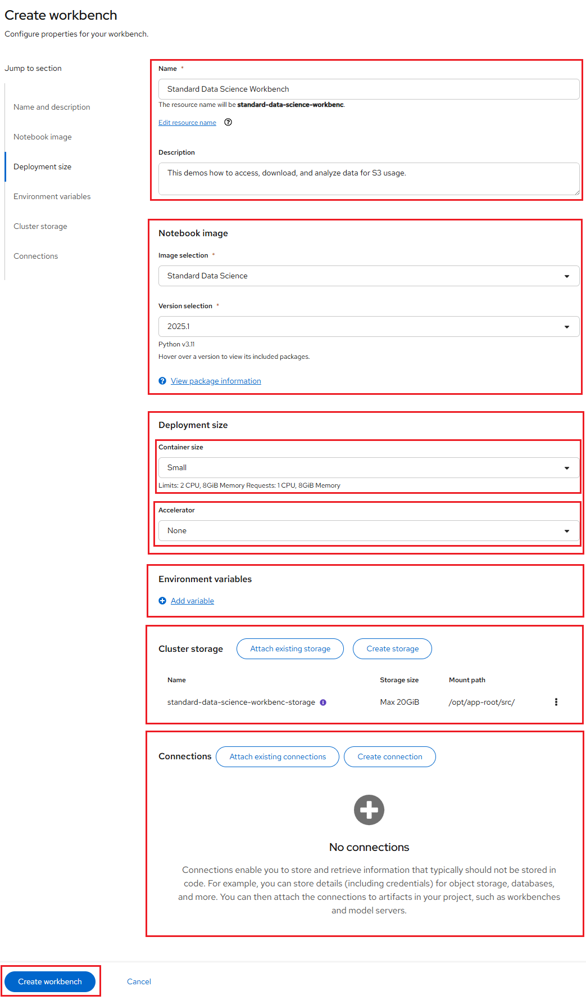
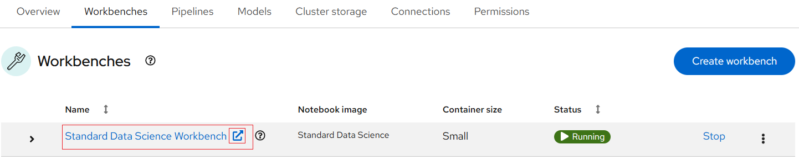

# How to access, download, and analyze data for S3 usage

**Prerequisites**:

Prepare your Jupyter notebook server for using a GPU, you need to have:

-   Select the correct data science project and create workbench, see
    [Populate the data science project](../data-science-project/using-projects-the-rhoai.md#populate-the-data-science-project-with-a-workbench)
    for more information.

Please ensure that you start your Jupyter notebook server with options as depicted
in the following configuration screen. This screen provides you with the opportunity
to select a notebook image and configure its options, including the number of GPUs.

For our example project, let's name it "Standard Data Science Workbench". We'll
select the **Standard Data Science** image, choose a **Deployment size** of **Small**,
**Number of GPUs** as **0** and allocate a **Cluster storage** space of **1GB**.

If this procedure is successful, you have started your Jupyter notebook server.
When your workbench is ready, the status will change to _Running_ and you can select
"Open" to go to your environment:

Once you successfully authenticate you should see the NERC RHOAI JupyterLab Web
Interface as shown below:

It's pretty empty right now, though. On the left side of the navigation pane,
locate the **Name** explorer panel. This panel is where you can create and manage
your project directories.

## Clone a GitHub Repository

You can clone a Git repository in JupyterLab through the left-hand **toolbar** or
the **Git** menu option in the main menu as shown below:

Let's clone a repository using the left-hand toolbar. Click on the **Git** icon,
shown in below:

Then click on **Clone a Repository** as shown below:

Enter the git repository URL, which points to the end-to-end ML workflows demo
project i.e. [https://github.com/rh-aiservices-bu/access-s3-data](https://github.com/rh-aiservices-bu/access-s3-data).

Then click **Clone** button as shown below:

Cloning takes a few seconds, after which you can double-click and navigate to the
newly-created folder i.e. `access-s3-data` that contains your cloned Git repository.

You will be able to find the newly-created folder named `access-s3-data` based on
the Git repository name, as shown below:

## Access and download S3 data

In the **Name** menu, double-click the `downloadData.ipynb` notebook in the file
explorer on the left side to launch it. This action will open another tab in the
content section of the environment, on the right.

Run each cell in the notebook, using the _Shift-Enter_ key combination, and pay
attention to the execution results. Using this notebook, we will:

-   Make a connection to an AWS S3 storage bucket

-   Download a CSV file into the "datasets" folder

-   Rename the downloaded CSV file to "newtruckdata.csv"

### View your new CSV file

Inside the "datasets" directory, double-click the "newtruckdata.csv" file. File
contents should appear as shown below:

The file contains the data you will analyze and perform some analytics.

## Getting ready to run analysis on your new CSV file

Since you now have data, you can open the next Jupyter notebook, `simpleCalc.ipynb`,
and perform the following operations:

-   Create a dataframe.

-   Perform simple total and average calculations.

-   Print the calculation results.

## Analyzing your S3 data access run results

Double-click the `simpleCalc.ipynb` Python file. When you execute the cells in the
notebook, results appear like the ones shown below:

The cells in the above figure show the mileage of four vehicles. In the next cell,
we calculate total mileage, total rows (number of vehicles) and the average mileage
for all vehicles. Execute the "Perform Calculations" cell to see basic calculations
performed on the data as shown below:

Calculations show the total mileage as 742, for four vehicles, and an average
mileage of 185.5.

Success! You have added analyzed your run results using the NERC RHOAI.

---
