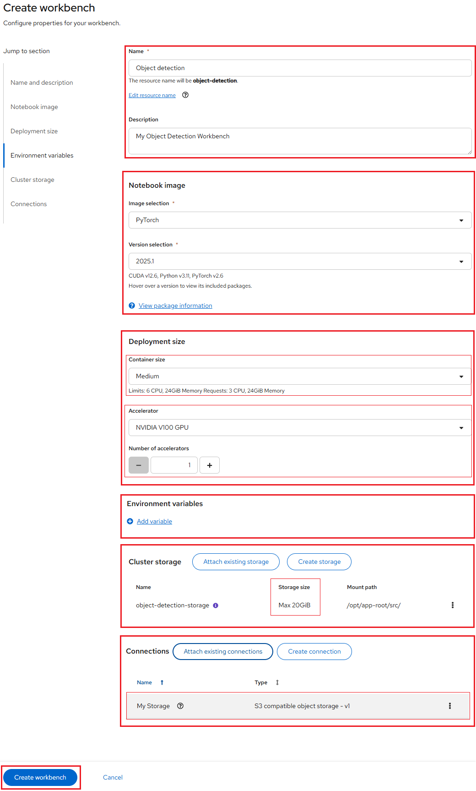

# Object Detection Application Using YOLOv5 Model

Here you will use an example Object Detection Application using YOLOv5 model to
complete the following tasks:

-   Data Preparation by downloading dataset images and randomly split them in train/validate/test.

-   Train model with YOLOv5 and test it.

-   Export YoloV5 model to ONNX format.

-   Save the Model to the S3 Object storage.

-   Deploy the model by using OpenShift AI model serving.

-   Use the gRPC and REST inference endpoints to query the model.

## About the YOLOv5 model

**YOLO(You Only Look Once)** is one of the leading object detection algorithms,
leveraging deep learning techniques to achieve high speed and accuracy. Unlike
the **R-CNN(Region-based Convolutional Neural Network)** model, YOLO takes a
different approach by dividing the input image into a grid and predicting bounding
boxes within each grid cell. This method simplifies the process of determining
object class probabilities.

By using a single-stage detection model, YOLO processes the entire image in one
pass, making it significantly faster than traditional models. Due to its efficiency,
YOLO is well-suited for real-time applications.

[YOLOv5](https://github.com/ultralytics/yolov5/), which further improved the
model's performance and added new features such as support for panoptic
segmentation and object tracking.

YOLO has been widely applied across various fields, including autonomous vehicles,
security and surveillance, and medical imaging.

## Navigating to the OpenShift AI dashboard

Please follow [these steps](../logging-in/access-the-rhoai-dashboard.md) to access
the NERC OpenShift AI dashboard.

## Setting up your Data Science Project in the NERC RHOAI

**Prerequisites**:

-   Before proceeding, confirm that you have an active GPU quota that has been approved
    for your current NERC OpenShift Allocation through NERC ColdFront. Read
    more about [How to Access GPU Resources](../../openshift/gpus/intro-to-gpus-on-nerc-ocp.md#accessing-gpu-resources)
    on NERC OpenShift Allocation.

## 1. Storing data with connection

For this tutorial, you will need **two S3-compatible object storage buckets**,
such as **NERC OpenStack Container (Ceph)**, **MinIO**, or **AWS S3**. You can
either use your own storage buckets or run a provided script that automatically
creates the following **local S3 storage (MinIO) bucket**:

-   **my-storage** – Use this bucket to store your models and data. You can reuse
this bucket and its connection for notebooks and model servers.

### 1.1. **Using your own S3-compatible storage buckets**

**Procedure:**

Manually create a data connection: **My Storage** by following
[How to create a data connection](../data-science-project/model-serving-in-the-rhoai.md#create-a-data-connection).

**Verification:**

You should see a data connection listed under your RHOAI Dashboard **My Storage**
as shown below:


### 1.2. **Using a script to set up local S3 storage (MinIO)**

Alternatively, if you want to run a script that automates the setup by completing
the following tasks:

-   **Deploys a MinIO instance** in your project namespace.

-   **Creates one storage buckets** within the MinIO instance.

-   **Generates a random user ID and password** for the MinIO Console.

-   **Establishes a data connection** in your project - for a bucket - using
    the generated credentials.

-   Installs all required **network policies**.

**Procedure:**

i. From the OpenShift AI dashboard, you can return to OpenShift Web Console
by using the application launcher icon (the black-and-white icon that looks
like a grid), and choosing the "OpenShift Console" as shown below:


ii. From your [NERC's OpenShift Web Console](https://console.apps.shift.nerc.mghpcc.org/),
navigate to your project corresponding to the _NERC RHOAI Data Science Project_
and select the "Import YAML" button, represented by the "+" icon in the top
navigation bar as shown below:


iii. Verify that you selected the correct project.


iv. Copy the following code and paste it into the Import YAML editor.

??? note "Local S3 storage (MinIO) Creation YAML Script"

    ```yaml
    ---
    apiVersion: v1
    kind: ServiceAccount
    metadata:
      name: minio-setup
      labels:
        app: minio
    ---
    apiVersion: rbac.authorization.k8s.io/v1
    kind: RoleBinding
    metadata:
      name: minio-setup-edit
      labels:
        app: minio
    roleRef:
      apiGroup: rbac.authorization.k8s.io
      kind: ClusterRole
      name: edit
    subjects:
    - kind: ServiceAccount
      name: minio-setup
    ---
    apiVersion: v1
    kind: Service
    metadata:
      name: minio-service
      labels:
        app: minio
    spec:
      ports:
      - name: api
        port: 9000
        targetPort: api
      - name: console
        port: 9090
        targetPort: 9090
      selector:
        app: minio
      sessionAffinity: None
      type: ClusterIP
    ---
    apiVersion: v1
    kind: PersistentVolumeClaim
    metadata:
      name: minio-pvc
      labels:
        app: minio
    spec:
      accessModes:
      - ReadWriteOnce
      resources:
        requests:
          storage: 10Gi # Adjust the size according to your needs
    ---
    apiVersion: apps/v1
    kind: Deployment
    metadata:
      name: minio-deployment
      labels:
        app: minio
        app.kubernetes.io/part-of: minio
    spec:
      replicas: 1
      selector:
        matchLabels:
          app: minio
      strategy:
        type: Recreate
      template:
        metadata:
          labels:
            app: minio
        spec:
          containers:
          - args:
            - minio server /data --console-address :9090
            command:
            - /bin/bash
            - -c
            envFrom:
            - secretRef:
                name: minio-root-user
            image: quay.io/minio/minio:latest
            name: minio
            ports:
            - containerPort: 9000
              name: api
              protocol: TCP
            - containerPort: 9090
              name: console
              protocol: TCP
            resources:
              limits:
                cpu: "2"
                memory: 2Gi
              requests:
                cpu: 200m
                memory: 1Gi
            volumeMounts:
            - mountPath: /data
              name: minio-volume
          volumes:
          - name: minio-volume
            persistentVolumeClaim:
              claimName: minio-pvc
          - emptyDir: {}
            name: empty
    ---
    apiVersion: batch/v1
    kind: Job
    metadata:
      name: create-ds-connections
      labels:
        app: minio
        app.kubernetes.io/part-of: minio
    spec:
      selector: {}
      template:
        spec:
          containers:
          - args:
            - -ec
            - |-
              echo -n 'Waiting for minio route'
              while ! oc get route minio-s3 2>/dev/null | grep -qF minio-s3; do
                echo -n .
                sleep 5
              done; echo

              echo -n 'Waiting for minio root user secret'
              while ! oc get secret minio-root-user 2>/dev/null | grep -qF minio-root-user; do
                echo -n .
                sleep 5
              done; echo

              MINIO_ROOT_USER=$(oc get secret minio-root-user -o template --template '{{.data.MINIO_ROOT_USER}}')
              MINIO_ROOT_PASSWORD=$(oc get secret minio-root-user -o template --template '{{.data.MINIO_ROOT_PASSWORD}}')
              MINIO_HOST=https://$(oc get route minio-s3 -o template --template '{{.spec.host}}')

              cat << EOF | oc apply -f-
              apiVersion: v1
              kind: Secret
              metadata:
                annotations:
                  opendatahub.io/connection-type: s3
                  openshift.io/display-name: My Storage
                labels:
                  opendatahub.io/dashboard: "true"
                  opendatahub.io/managed: "true"
                name: aws-connection-my-storage
              data:
                AWS_ACCESS_KEY_ID: ${MINIO_ROOT_USER}
                AWS_SECRET_ACCESS_KEY: ${MINIO_ROOT_PASSWORD}
              stringData:
                AWS_DEFAULT_REGION: us-east-1
                AWS_S3_BUCKET: my-storage
                AWS_S3_ENDPOINT: ${MINIO_HOST}
              type: Opaque
              EOF
            command:
            - /bin/bash
            image: image-registry.openshift-image-registry.svc:5000/openshift/tools:latest
            imagePullPolicy: IfNotPresent
            name: create-ds-connections
          restartPolicy: Never
          serviceAccount: minio-setup
          serviceAccountName: minio-setup
    ---
    apiVersion: batch/v1
    kind: Job
    metadata:
      name: create-minio-buckets
      labels:
        app: minio
        app.kubernetes.io/part-of: minio
    spec:
      selector: {}
      template:
        metadata:
          labels:
            app: minio
        spec:
          containers:
          - args:
            - -ec
            - |-
              oc get secret minio-root-user
              env | grep MINIO
              cat << 'EOF' | python3
              import boto3, os

              s3 = boto3.client("s3",
                                endpoint_url="http://minio-service:9000",
                                aws_access_key_id=os.getenv("MINIO_ROOT_USER"),
                                aws_secret_access_key=os.getenv("MINIO_ROOT_PASSWORD"))
              bucket = 'my-storage'
              print('creating my-storage bucket')
              if bucket not in [bu["Name"] for bu in s3.list_buckets()["Buckets"]]:
                s3.create_bucket(Bucket=bucket)
              EOF
            command:
            - /bin/bash
            envFrom:
            - secretRef:
                name: minio-root-user
            image: image-registry.openshift-image-registry.svc:5000/redhat-ods-applications/s2i-generic-data-science-notebook:2023.2
            imagePullPolicy: IfNotPresent
            name: create-buckets
          initContainers:
          - args:
            - -ec
            - |-
              echo -n 'Waiting for minio root user secret'
              while ! oc get secret minio-root-user 2>/dev/null | grep -qF minio-root-user; do
              echo -n .
              sleep 5
              done; echo

              echo -n 'Waiting for minio deployment'
              while ! oc get deployment minio-deployment 2>/dev/null | grep -qF minio-deployment; do
                echo -n .
                sleep 5
              done; echo
              oc wait --for=condition=available --timeout=60s deployment/minio-deployment
              sleep 10
            command:
            - /bin/bash
            image: image-registry.openshift-image-registry.svc:5000/openshift/tools:latest
            imagePullPolicy: IfNotPresent
            name: wait-for-minio
          restartPolicy: Never
          serviceAccount: minio-setup
          serviceAccountName: minio-setup
    ---
    apiVersion: batch/v1
    kind: Job
    metadata:
      name: create-minio-root-user
      labels:
        app: minio
        app.kubernetes.io/part-of: minio
    spec:
      backoffLimit: 4
      template:
        metadata:
          labels:
            app: minio
        spec:
          containers:
          - args:
            - -ec
            - |-
              if [ -n "$(oc get secret minio-root-user -oname 2>/dev/null)" ]; then
                echo "Secret already exists. Skipping." >&2
                exit 0
              fi
              genpass() {
                  < /dev/urandom tr -dc _A-Z-a-z-0-9 | head -c"${1:-32}"
              }
              id=$(genpass 16)
              secret=$(genpass)
              cat << EOF | oc apply -f-
              apiVersion: v1
              kind: Secret
              metadata:
                name: minio-root-user
              type: Opaque
              stringData:
                MINIO_ROOT_USER: ${id}
                MINIO_ROOT_PASSWORD: ${secret}
              EOF
            command:
            - /bin/bash
            image: image-registry.openshift-image-registry.svc:5000/openshift/tools:latest
            imagePullPolicy: IfNotPresent
            name: create-minio-root-user
          restartPolicy: Never
          serviceAccount: minio-setup
          serviceAccountName: minio-setup
    ---
    apiVersion: route.openshift.io/v1
    kind: Route
    metadata:
      name: minio-console
      labels:
        app: minio
        app.kubernetes.io/part-of: minio
    spec:
      port:
        targetPort: console
      tls:
        insecureEdgeTerminationPolicy: Redirect
        termination: edge
      to:
        kind: Service
        name: minio-service
        weight: 100
      wildcardPolicy: None
    ---
    apiVersion: route.openshift.io/v1
    kind: Route
    metadata:
      name: minio-s3
      labels:
        app: minio
        app.kubernetes.io/part-of: minio
    spec:
      port:
        targetPort: api
      tls:
        insecureEdgeTerminationPolicy: Redirect
        termination: edge
      to:
        kind: Service
        name: minio-service
        weight: 100
      wildcardPolicy: None
    ```

!!! warning "Very Important Note"

    In this YAML file, the size of the storage is set as 10Gi. Change it if
    you need to.

v. Click **Create**.

**Verification:**

i. Once Resource is successfully created, you will see a "Resources successfully
created" message and the following resources listed:


ii. Once the deployment is successful, you will be able to see all resources
are created and grouped under "minio" application grouping on the
**Topology View** menu, as shown below:


Once successfully initiated, click on the **minio** deployment and select the
"Resources" tab to review created *Pods*, *Services*, and *Routes*.


Please note the **minio-console** route URL by navigating to the "Routes" section
under the _Location_ path. When you click on the **minio-console** route URL, it
will open the MinIO web console that looks like below:


!!! info "MinIO Web Console Login Credential"

    The Username and Password for the MinIO web console can be retrieved from
    the Data Connection's **Access key** and **Secret key**.

iii. Navigate back to the OpenShift AI dashboard.

a. Select Data Science Projects and then click the name of your project, i.e.
**Object Detection Workbench**.

b. Click **Data connections**. You should see one data connection listed:
*My Storage* as shown below:


c. Verify the buckets are created on the MinIO Web Console:

-   Click on the newly created data connection from the list and then click
the action menu (⋮) at the end of the selected data connection row. Choose
"Edit data connection" from the dropdown menu. This will open a pop-up
 window as shown below:

    

-   Note both  *Secret key* (by clicking eye icon near the end of the textbox) and
*Access key*.

    !!! note "Alternatively, Run `oc` commands to get *Secret key* and *Access key*"

        Alternatively, you can run the following `oc` commands:

        i. To get *Secret key* run:

        `oc get secret minio-root-user -o template --template '{{.data.MINIO_ROOT_USER}}' | base64 --decode`

        ii. And to get *Access key* run:

        `oc get secret minio-root-user -o template --template '{{.data.MINIO_ROOT_PASSWORD}}' | base64 --decode`

-   Return to the **MinIO Web Console** using the provided URL. Enter the
**Access Key** as the **Username** and the **Secret Key** as the **Password**.
This will open the **Object Browser**, where you should verify that the
bucket: **my-storage** is visible as shown below:

    

!!! note "Alternatively, Running a script to install local MinIO object storage"

    Alternatively, you can run a script to install local object storage
    buckets and create data connections using the OpenShift CLI (`oc`).
    For that, you need to install and configure the OpenShift CLI by
    following the [setup instructions](../../openshift/logging-in/setup-the-openshift-cli.md#installing-the-openshift-cli).
    Once the OpenShift CLI is set up, execute the following command to
    install MinIO object storage along with local S3 storage (MinIO) buckets
    and necessary data connections:

    `oc apply -f https://raw.githubusercontent.com/nerc-project/object-detection/main/setup/setup-s3.yaml`

!!! tip "Clean Up"

    To delete all resources if not necessary just run `oc delete -f https://raw.githubusercontent.com/nerc-project/object-detection/main/setup/setup-s3.yaml`
    or `oc delete all,sa,rolebindings,pvc,job -l app=minio`.

!!! danger "Important Note"

    The script is based on a [guide for deploying MinIO](https://ai-on-openshift.io/tools-and-applications/minio/minio/).
    The MinIO-based Object Storage that the script creates is not meant for production usage.

## 2. Creating a workbench and a notebook

### Creating a workbench and selecting a notebook image

**Procedure:**

Prepare your Jupyter notebook server for using a GPU, you need to have:

Select the correct data science project and create workbench, see
[Populate the data science project](../data-science-project/using-projects-the-rhoai.md#populate-the-data-science-project-with-a-workbench)
for more information.

Please ensure that you start your Jupyter notebook server with options as
depicted in the following configuration screen. This screen provides you
with the opportunity to select a notebook image and configure its options,
including the Accelerator and Number of accelerators (GPUs).



For our example project, let's name it "Fraud detection". We'll select the
**PyTorch** image with Recommended Version (selected by default), choose
a **Deployment size** of **Medium**, choose **Accelerator** of
**NVIDIA V100 GPU**, **Number of accelerators** as **1**, and allocate
a **Cluster storage** space of **20GB**.

Here, you will use **Environment Variables** to specify the Key/Value pairs related
to the S3-compatible object storage bucket for storing your model.

To add Environment variables please follow the following steps:

i. Click on **"Add variable"**.

ii. Select **"Config Map"** from the dropdown for the environment variable type.

iii. Choose **"Key / Value"** and enter the following keys along with their corresponding
values, which you have retrieved while "Editing data connection":


**Environment Variables**:

    Key: AWS_ACCESS_KEY_ID
    Value: <Access key>

    Key: AWS_SECRET_ACCESS_KEY
    Value: <Secret key>

    Key: AWS_S3_ENDPOINT
    Value: <Endpoint>

    Key: AWS_DEFAULT_REGION
    Value: <Region>

    Key: AWS_S3_BUCKET
    Value: <Bucket>

!!! note "Alternatively, Running `oc` commands"

    Alternatively, you can run the following `oc` commands:

    i. To get *Secret key* run:

    `oc get secret minio-root-user -o template --template '{{.data.MINIO_ROOT_USER}}' | base64 --decode`

    ii. And to get *Access key* run:

    `oc get secret minio-root-user -o template --template '{{.data.MINIO_ROOT_PASSWORD}}' | base64 --decode`

    iii. And to get *Endpoint* run:

    `oc get route minio-s3 -o template --template '{{.spec.host}}'`

    You need to add `https://` in the front of the endpoint host url.

!!! info "Running Workbench without GPU"

    If you do not require GPU resources for your task, you can leave the
    **Accelerator** field set to its default **None** selection.

    

**Verification:**

If this procedure is successful, you have started your Jupyter notebook
server. When your workbench is ready, the status will change from _Starting_
to _Running_ and you can select "Open" to go to your environment:


!!! info "Note"

    If you made a mistake, you can edit the workbench to make changes. Please
    make sure your toggle the _Running_ status of your workbench to _Stopped_
    prior clicking the action menu (⋮) at the end of the selected workbench row
    as shown below:

    

Once you successfully authenticate, you should see the NERC RHOAI JupyterLab
Web Interface as shown below:


It's pretty empty right now, though. On the left side of the navigation
pane, locate the **Name** explorer panel. This panel is where you can create
and manage your project directories.

!!! note "Learn More About Working with Notebooks"

    For detailed guidance on using notebooks on NERC RHOAI JupyterLab, please
    refer to [this documentation](../data-science-project/explore-the-jupyterlab-environment.md#working-with-notebooks).

### Importing the tutorial files into the Jupyter environment

Bring the content of this tutorial inside your Jupyter environment:

On the toolbar, click the Git Clone icon:


Enter the following **Git Repo URL**: [https://github.com/nerc-project/object-detection](https://github.com/nerc-project/object-detection)

Check the Include submodules option, and then click Clone.


In the file browser, double-click the newly-created **object-detection** folder.


**Verification:**

In the file browser, you should see the notebooks that you cloned from Git.


## 3. Data Preparation

In your Jupyter notebook environment, within the root folder path of `object-detection`,
find the Jupyter notebook file `01-data_preparation.ipynb` that demonstrates how
to prepare the dataset within the NERC RHOAI. Please follow the instructions directly
in the notebook environment. To run it you need to double click it and execute
the "Run" button to run all notebook cells at once.

To train the model, we need a dataset containing images of the target classes, along
with their labels and bounding box definitions for object detection. In this
example, we use images from [Google's Open Images](https://storage.googleapis.com/openimages/web/index.html)
dataset, focusing on threeclasses: **Bicycle**, **Car**, and **Traffic Sign**.

!!! tip "Using the Class and Image per Class "

    In this example, we selected only a few classes to speed up the process and
    also we are only downloading 300 images per class to limit the processing time.
    However, to achieve a robust YOLOv5 model, it is recommended to train with
    over 1500 images per class, and more then 10,000 instances per class.

We can now randomly split all our images in **train/validate/test**. We will use
here a standard split scheme: *0.75*, *0.125*, *0.125*.

Once you have completed the entire notebook, the dataset will be ready for training!

## 4. Model training

YOLOv5 is pre-trained to recognize various objects. In this guide, we will use
**Transfer Learning** to fine-tune YOLOv5 for identifying a custom set of images.

### Transfer Learning

Transfer learning is a machine learning technique where a model trained for one
task is adapted for another related task. Instead of training from scratch, it
utilizes a pre-trained model as a foundation, significantly reducing the need
for data and computing resources. This approach applies learned knowledge from
one problem to another, making it highly effective in fields like natural language
processing, computer vision, and speech recognition.

### Training with YOLOv5

For the training step, open the notebook file `02-model_training.ipynb` in the
same Workbench environment and follow the instructions. The notebook will guide
you through experimentation, model training, and testing the model.

In this example, we will train using the smallest base model i.e. YOLOv5 to save
time. However, you can modify the base model and adjust the training hyperparameters
to achieve better results.

**Verification:**

This process will take some time to complete. At the end, it will generate and
save the model `yolov5n.pt` within the root folder path of `object-detection`.

!!! warning "Warning"

    The memory allocated to your Workbench based on selected **Container Size**
    significantly affects the batch size you can use, regardless of your GPU's capacity.

## 5. Preparing a model for deployment

**Procedure:**

In your JupyterLab environment, open the notebook file `03-yolov5_to_onnx.ipynb`.
Follow the instructions in the notebook to store the model and save it in the portable
**ONNX** format from YoloV5 model.

**Verification:**

After completing the notebook steps, verify that the `yolov5n.onnx` file is created
within the root folder path of `object-detection`.

## 6. Save the Model

**Procedure:**

In your JupyterLab environment, open the notebook file `04-save_model.ipynb` and
follow the instructions. This notebook will guide you through saving the model
to S3-compatible object storage, corresponding to the **My Storage** data connection,
which was set up in [this step](#1-storing-data-with-connection).

**Verification:**

After completing the notebook steps, verify that the `models/yolov5n.onnx` file
is stored in the object storage. Once saved, the model is now ready for use by
your model server.

## 7. Deploying and testing a model

### Deploying a model

Now that the model is stored and saved in the portable **ONNX** format, you can
deploy it as an API using an OpenShift AI **Model Server**.

#### Deploying a model on a multi-model server

NERC RHOAI multi-model servers can host multiple models simultaneously. You can
create a new model server and deploy your model to it.

**Procedure:**

In the OpenShift AI dashboard, navigate to the data science project details page
and click the **Models and model servers** tab.

Select **Add server** as shown below:


In the pop-up window that appears, depicted as shown below, you can specify the
following details:

For **Model server name**, type a name, for example **Model Server**.

For **Serving runtime**, select **OpenVINO Model Server**.

Leave the other fields with the default settings.


Click **Add**.

In the **Models and model servers** list, next to the new model server, click
**Deploy** model.


In the form, provide the following values:

For **Model deployment name**, type **yolo**.

For **Model framework (name - version)**, select **onnx-1**.

For **Existing connection**, select **My Storage**.

Type the path that leads to the version folder that contains your model file: **models**

Leave the other fields with the default settings.


Click **Deploy**.

**Verification:**

When you return to the Deployed models page, you will see your newly deployed model.
You should click on the 1 on the Deployed models tab to see details. Notice the
loading symbol under the Status section. When the model has finished deploying,
the status icon will be a **green checkmark** indicating the model deployment is
complete as shown below:


When you return to the Deployed models page, you will see your newly deployed model.
You should click on the 1 on the Deployed models tab to see details. Notice the
loading symbol under the Status section. When the model has finished deploying,
the status icon will be a **green checkmark** indicating the model deployment is
complete as shown below:


### Testing the model API

Now that you've deployed the model, you can test its API endpoints.

**Procedure:**

-   In the OpenShift AI dashboard, navigate to the project details page and click
the **Models** tab.

-   Take note of the model's Inference endpoint URL. You need this information when
you test the model API.

    

    The **Inference endpoint** field contains an **Internal Service** link, click
    the link to open a popup that shows the URL details, and then take note of
    the **grpcUrl** and **restUrl** values.

-   Return to the Jupyter notebook environment and test your new inference endpoints.

    To make a gRPC API call, follow the instructions in `05-remote_inference_grpc.ipynb`,
    updating the *grpc_host* with your own **grpcUrl** value (as noted above).

    Follow the instructions in `06-remote_inference_rest.ipynb` to make a REST
    API call. Be sure to update the *rest_url* with your own **restUrl** value (as
    noted above).

    

    !!! note "Note"

        The notebook provides an example for processing a single image and also
        demonstrates batch processing for multiple images from the **images** folder.
        This enables a basic benchmark to measure processing and inference time.

---
