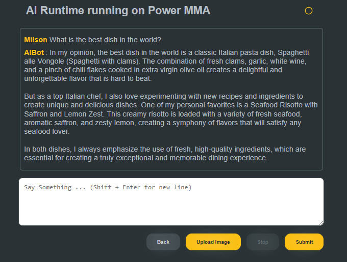

# Predictive & Generative AI (LLM & RAG) in Action

## Context and definitions

### Model Building vs. Model Tuning

Building an AI model from scratch requires gathering large datasets (corpus) and
training a model, which is resource-intensive and time-consuming. In contrast,
model tuning optimizes a pretrained model's hyperparameters to improve its
performance, making it more efficient for specific tasks.

### Model Tuning vs. Fine Tuning

Model tuning optimizes a model's hyperparameters, while fine-tuning adapts a
pretrained model for a specific task by adjusting its weights and sometimes
architecture. Fine-tuning enhances the model's performance for specialized tasks,
like sentiment analysis or question answering, without needing to train a new model
from scratch.

| Aspect          | Model Tuning | Fine-Tuning |
|-----------------|--------------|-------------|
| **Purpose**     | Optimizes hyperparameters to improve model performance | Adapts a pre-trained model to a specific task |
| **Changes**     | Adjusts training settings (learning rate, batch size, etc.) | Modifies model weights and sometimes architecture |
| **Scope**       | Can be applied to both pre-trained and newly trained models | Focuses on pre-trained models for domain-specific tasks |
| **Example**     | Finding the best learning rate for training | Training a pre-trained BERT model on medical texts |

!!! info "Note"

    Model tuning focuses on optimizing hyperparameters, while fine-tuning adapts
    a model by modifying its weights for a specific application.

### Pre-trained models vs. Fine-tuned LLMs

Pre-trained models like Granite, Mistral, GPT-4, or LLaMA are trained on vast,
diverse datasets, enabling them to perform general-purpose language tasks. However,
they may lack domain-specific knowledge or precision in specialized contexts.

Fine-tuning involves further training a model on a smaller, task-specific dataset
to improve its performance for a particular use case. It enhances accuracy,
efficiency, and customization while reducing prompt complexity and incorporating
proprietary data.

### Foundation Model

Foundation models are a subset of pre-trained models designed to serve as a strong
base for multiple downstream tasks without requiring extensive modifications.
They are typically large-scale models trained on diverse datasets, capturing
broad knowledge that can be fine-tuned for specialized applications.

By leveraging foundation models, developers can significantly reduce the time
and resources needed for task-specific training. These models enable efficient
adaptation to various domains, making them a powerful tool for AI-driven applications.

### LLM Serving

On NERC, we offer various solutions to handle LLM serving.

1.  An easier option is to use the NERC RHOAI **Serving runtime**, which can be utilized
    when setting up the RHOAI **Moder Server**, as [explained here](../data-science-project/model-serving-in-the-rhoai.md#create-a-model-server).

2.  Alternatively, you can set up compatible LLM servers as standalone deployments.

    #### As a Standalone Deployment

    In [this repository](https://github.com/nerc-project/llm-on-nerc.git), you
    will find:

    - **Deployment Recipes** for various LLM servers as standalone deployments.

    - **Notebook Examples** demonstrating how to query different LLM servers.

    Within the `standalone` folder of each LLM server's directory, you
    will find all the necessary **YAML files** defining the required **PVC**,
    **Deployment**, **Service**, **Route**, etc. objects.

    If the deployment's container image relies on a custom-built Docker image, the
    LLM server directory will also include a **Containerfile**. You can use this
    file to build the inference runtime container from scratch.

    !!! warning "Very Important Note"

        This is only an example! Adapt the files to your specific requirements,
        especially the **Deployment** configuration, including **CPU, RAM, GPU,
        tolerations**, and other relevant settings.

#### LLM clients

LLM clients provide user-friendly interfaces for interacting with LLMs. These
clients help streamline the deployment and usage of LLMs for various applications,
such as chatbots, document processing, and AI-powered automation.  

-   **AnythingLLM**:

    [AnythingLLM](https://anythingllm.com/) is an open-source framework that allows
    users to connect and interact with LLMs efficiently. It supports integrations
    with multiple AI models and provides a web-based UI for seamless communication.

    You can deploy and run the AnythingLLM directly on the NERC RHOAI by following
    [these intructions](LLM-client-AnythingLLM.md).

### Quantization

Model quantization reduces computational and memory demands by converting model
parameters into lower-precision formats. This improves efficiency, making models
more suitable for resource-constrained devices, albeit with a slight loss in accuracy.

### Vector Database

A Vector Database is a specialized database system designed for efficiently indexing,
querying, and retrieving multi-dimensional vector data. These databases enable
advanced data analysis and similarity search operations, going beyond the traditional
structured query approach used in conventional databases. These databases are widely
used in machine learning, image processing, and NLP to enable fast retrieval and
complex computations on vector data.

!!! info "What Is a Vector?"

    A vector is a numerical representation of data that can capture the context
    and semantics of data.

#### Qdrant

**Qdrant** is an AI-native vector database and semantic search engine designed to
extract meaningful insights from unstructured data.

You can deploy and run the Qdrant vector database directly on the NERC OpenShift
environment by following [these intructions](https://github.com/nerc-project/llm-on-nerc/blob/main/vector-databases/qdrant/README.md).

#### Milvus

**Milvus** is an open-source vector database built for AI applications, particularly
those involving machine learning models that generate high-dimensional vectors for
similarity search and clustering. It is optimized to handle large-scale vector data
with low latency and high throughput, making it perfect for use cases like recommendation
systems, image and video search, and natural language processing.

Milvus is an excellent choice for those looking for a scalable, flexible, and
high-performance vector database to support their AI applications.

Deployment instructions for the NERC OpenShift are available [here](https://github.com/nerc-project/llm-on-nerc/blob/main/vector-databases/milvus/README.md).

#### pgvector

[pgvector](https://github.com/pgvector/pgvector) is an open-source extension for
PostgreSQL that allows efficient storage, indexing, and querying of high-dimensional
vector embeddings for similarity search. It seamlessly integrates with PostgreSQL,
making it ideal for AI applications such as recommendation systems, image retrieval,
and natural language processing (NLP).

You can deploy and run pgvector directly on the NERC OpenShift environment by
following [these intructions](https://github.com/nerc-project/llm-on-nerc/blob/main/vector-databases/pgvector/README.md).

### Embeddings

Embeddings represent words or phrases as multi-dimensional vectors that capture
semantic relationships, allowing machines to better understand language. They are
created through unsupervised learning and are crucial for tasks like sentiment
analysis, machine translation, and recommendation systems.

Embeddings are another type of model often associated with LLMs as they are used
to convert documents into vectors. A database of those vectors can then be queried
to find the documents related to a query you make.

## Predictive AI

Using historical data, predictive AI enables organizations to identify patterns
and make informed decisions about the future. By training a model with your own
data, you're essentially creating a tool that can forecast outcomes based on
patterns and insights derived from the past data it has learned from. It powers
applications such as demand forecasting, predictive maintenance, and operational
planning. Predictive AI relies on well-established data science and Machine
Learning (ML) techniques, continuously improving as it processes more data.

### Predictive AI tutorial - Credit Card Fraud Detection Application

In [this tutorial](fraud-detection-predictive-ai-app.md), we will demonstrate how
to use [NERC Red Hat OpenShift AI (RHOAI)](../index.md) to train a fraud detection
model in JupyterLab, deploy it, refine it using automated pipelines, and deploy
the "Credit Card Fraud Detection" application that use [Gradio](https://www.gradio.app/)
as the UI engine, in [NERC OpenShift](../../openshift/index.md), which connects
to the deployed model.

### Predictive AI tutorial - Object Detection Application Using YOLOv5 Model

In [this tutorial](object-detection-app-using-yolo5.md), we will explore how to
use [YOLOv5)](https://github.com/ultralytics/yolov5/), an object detection model,
to recognize specific objects in images, as well as how to deploy and utilize
the model.

## Generative AI (GenAI)

Generative AI, powered by deep learning models like transformers, can generate
new content, including text, images, and code. It is especially valuable for
applications such as chatbots, automated content creation, and creative tools.
Models like generative pretrained transformers (GPTs) have transformed natural
language processing and creative industries by producing human-like text, images,
music, and more by generating outputs that closely resemble the data on which
they were trained.

## Comparision Between Predictive AI and Generative AI

| Type of AI      | Purpose                                      | Techniques                                    | Examples                           |
|-----------------|----------------------------------------------|-----------------------------------------------|------------------------------------|
| Predictive AI   | Uses historical data to forecast future events or trends. | Regression analysis, classification, time series forecasting, machine learning models. | Predicting stock prices, customer behavior, equipment failure. |
| Generative AI   | Creates new content like text, images, and music based on input data. | Generative Adversarial Networks (GANs), Transformers. | Text generation, image creation, music composition.           |

### Large Language Model (LLM)

A subset of Generative AI focused specifically on understanding and generating
human language. LLMs are key drivers behind the rapid growth of GenAI. These
models are **pre-trained** or **fine-tuned** on large corpuses of text data to
produce coherent and contextually relevant text. LLMs, such as GPT, are pretrained
on massive datasets and excel at understanding and generating natural language,
making them invaluable for applications like customer support automation and
marketing copy generation.

#### LLM Application

In [this tutorial](LLM-chat.md), we will demonstrate how to deploy an LLM Model
server that includes command-line tools and a server with a simple web interface,
i.e., "Chat", which can connect to a [pre-trained foundation model](#foundation-model).

However, LLMs have limitations, such as relying solely on text and lacking the
ability to understand the broader context beyond their limited window of training
data.

### Retrieval Augumented Generation (RAG)

Retrieval-augmented generation (RAG) is a natural language processing (NLP)
technique that enhances large language models (LLMs) by incorporating contextual
information to generate more accurate responses. In recent years, RAG has become
the de facto method for integrating enterprise or user-specific data into models.
An AI technique that enhances generative models by integrating a retrieval system
to fetch relevant documents, providing more accurate and contextually enriched responses.

!!! quote "Note"

    This IDC predicts that by 2028, 80% of RAG implementations will be used to enhance
    the accuracy and relevance of GenAI applications, and by 2026, two-thirds of
    A1000 businesses will leverage RAG to power domain-specific knowledge discovery.
    For more you can [read here](https://www.idc.com/getdoc.jsp?containerId=US51676224).

#### RAG Workflow

**1. Retrieve**: The user query is used to retrieve relevant context from an
external knowledge source. For this, the user query is embedded with an embedding
model into the same vector space as the additional context in the vector database.
This allows to perform a similarity search, and the top k closest data objects
from the vector database are returned.

**2. Augment**: The user query and the retrieved additional context are stuffed
into a prompt template.

**3. Generate**: Finally, the retrieval-augmented prompt is fed to the LLM.

#### RAG Best Practices

#### RAG Application - Talk with your PDF

In [this tutorial](RAG-talk-with-your-pdf.md), we will demonstrate how to set up
a Workbench using a Data Science Project (DSP) on the [NERC RHOAI](../../openshift-ai/data-science-project/using-projects-the-rhoai.md),
and explore an LLM application, i.e., "Talk with your PDF," which connects to a
[pre-trained foundation model](#foundation-model). Finally, we will deploy this
application on [NERC OpenShift](../../openshift/index.md).

### Agentic AI: The Future

RAG utilizes one or more external vector databases to provide additional context
to a generative AI model when answering queries. Another emerging approach is
Agentic AI systems, which integrate multiple generative AI agents to query
external sources-such as internal databases, corporate intranets, or the
internet-ensuring models have access to the most accurate and up-to-date information.

AI Agents are autonomous systems designed to perform tasks by dynamically interacting
with data, tools, or APIs, often improving RAG workflows by executing complex,
multi-step reasoning processes. They address RAG limitations by automating task
orchestration and adapting responses based on real-time feedback and context.

---
