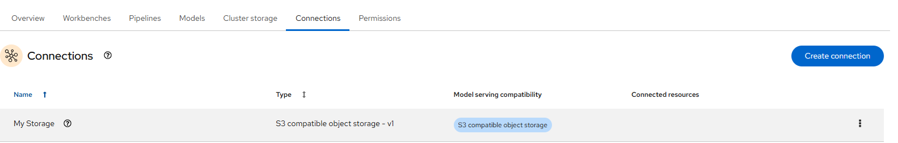
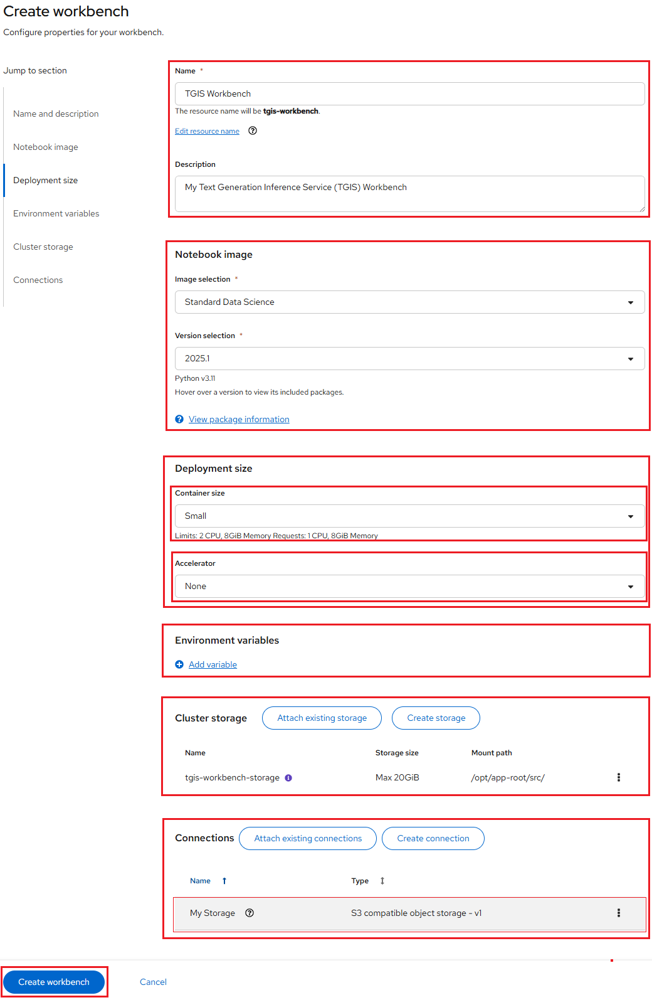
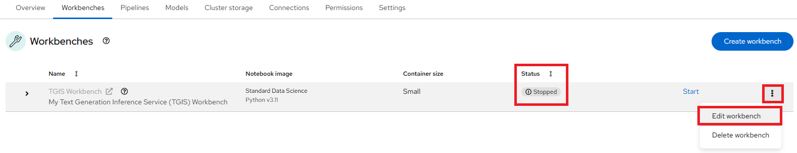
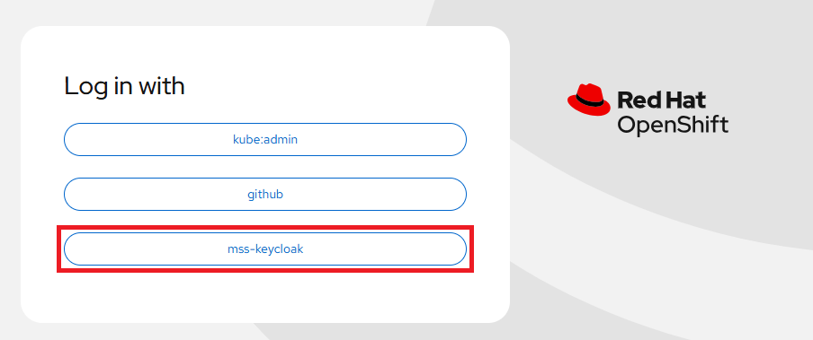
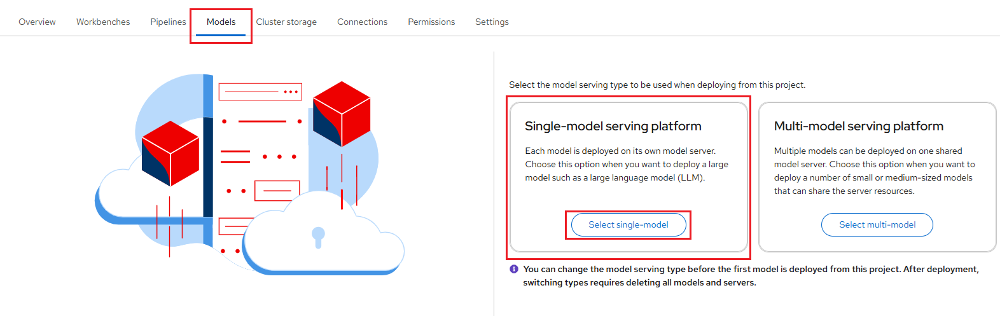
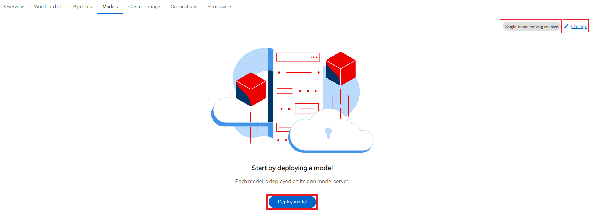

# Serving Text Generation Inference Service (TGIS) and FLAN-T5 Small Model

**Prerequisites**:

-   `FLAN-T5 small` model: [Google's FLAN-T5 Small](https://huggingface.co/google/flan-t5-small)
    is a lightweight model known for its compatibility and low resource requirements
    (**no GPU needed**). Although it's not a high-performing model, the same
    process applies to any compatible model. FLAN-T5 Small is based on the
    pretrained **T5** model and has been fine-tuned using instruction data to
    improve **zero-shot** and **few-shot** NLP tasks such as reasoning and question
    answering.

**Procedure**:

At a high level, we will:

-   Download a model from Huggingface

-   Deploy the model by using single-model serving with a serving runtime

-   Test the model API

## Set up local S3 storage (MinIO) and Connection

1.  Navigating to the OpenShift AI dashboard.

    Please follow [these steps](../../openshift-ai/logging-in/access-the-rhoai-dashboard.md)
    to access the NERC OpenShift AI dashboard.

2.  Using a script to set up local S3 storage (MinIO) on your Data Science Project
    in the NERC RHOAI as [described here](../../openshift-ai/other-projects/object-detection-app-using-yolo5.md#12-using-a-script-to-set-up-local-s3-storage-minio).

3.  Once your local S3 Object storage using MinIO is completed, you can browse to
    the **MinIO Web Console** using the provided URL. Enter the **Access Key** as
    the **Username** and the **Secret Key** as the **Password**. This will open
    the **Object Browser**, where you should verify that the bucket: **my-storage**
    is visible as shown below:

    

4.  Click **Connections**. You should see one connection listed:
*My Storage* as shown below:



## Creating a workbench and a notebook

**Procedure**:

Prepare your Jupyter notebook server for using **No GPU**, you need to have:

-   Select the correct data science project and create workbench, see
    [Populate the data science project](../data-science-project/using-projects-the-rhoai.md#populate-the-data-science-project-with-a-workbench)
    for more information.

Please ensure that you start your Jupyter notebook server with options as
depicted in the following configuration screen. This screen provides you
with the opportunity to select a notebook image and configure its options. As
we do not require any GPU resources to run `FLAN-T5 small` model, we can leave
the **Accelerator** field set to its default **None** selection.

Click **Attach existing connections** under the **Connections** section, and attach
the **"My Storage"** connection that was set up previously to the workbench:


Search and add "My Storage":


Click on "Attach" button:


The final workbench setup, before clicking the **Create workbench** button, should
look like this:



For our example project, let's name it "TGIS Workbench". We'll
select the **Standard Data Science** image with Recommended Version
(selected by default), choose a **Deployment size** of **Small**,
**Accelerator** as **None** (no GPU is needed for this setup), and allocate
a **Cluster storage** space of **20GB** (Selected By Default).

**Verification**:

If this procedure is successful, you have started your Jupyter notebook
server. When your workbench is ready and the status changes to _Running_, click
the open icon () next to your workbench's name,
or click the workbench name directly to access your environment:


!!! info "Note"

    If you made a mistake, you can edit the workbench to make changes. Please
    make sure you set the _Running_ status of your workbench to _Stopped_
    prior clicking the action menu (⋮) at the end of the selected workbench row
    as shown below:

    

Once you have successfully authenticated by clicking "**mss-keycloak**" when
prompted, as shown below:



Next, you should see the NERC RHOAI JupyterLab Web Interface, as shown below:


The Jupyter environment is currently empty. To begin, populate it with content
using *Git*. On the left side of the navigation pane, locate the **Name** explorer
panel, where you can create and manage your project directories.

!!! note "Learn More About Working with Notebooks"

    For detailed guidance on using notebooks on NERC RHOAI JupyterLab, please
    refer to [this documentation](../data-science-project/explore-the-jupyterlab-environment.md#working-with-notebooks).

## Importing the tutorial files into the Jupyter environment

Bring the content of this tutorial inside your Jupyter environment:

On the toolbar, click the Git Clone icon:


Enter the following **Git Repo URL**: [https://github.com/nerc-project/llm-on-nerc](https://github.com/nerc-project/llm-on-nerc)

Check the Include submodules option, and then click Clone.


In the file browser, double-click the newly-created **llm-on-nerc** folder.


**Verification**:

In the file browser, you should see the notebooks that you cloned from Git.


## Downloading Model

**Prerequisites**:

First, let's navigate to the relevant notebooks.

1. Navigate to `llm-on-nerc/llm/tgis`

2. In your notebook environment, open the file `1_download_save.ipynb`

3. Follow the instructions directly in the notebook.

4. The instructions will guide you through downloading the model from
**Hugging Face** and uploading it to your `models` bucket, which is located
within your main bucket mapped through the Connection.


**Verification**:

When you have completed the notebook instructions, you should see files listed in
the directory/prefix: `models/flan-t5-small`

```sh
models/flan-t5-small/README.md
models/flan-t5-small/config.json
models/flan-t5-small/flax_model.msgpack
models/flan-t5-small/generation_config.json
models/flan-t5-small/model.safetensors
models/flan-t5-small/pytorch_model.bin
models/flan-t5-small/special_tokens_map.json
models/flan-t5-small/spiece.model
models/flan-t5-small/tf_model.h5
models/flan-t5-small/tokenizer.json
models/flan-t5-small/tokenizer_config.json
```

## Setting up Single-model Server and Deploy the model

1. In the left menu, click **Data science projects**.

    The **Data science projects** page opens.

2. Click the name of the project that you want to deploy a model in.

    A project details page opens.

3. Click the **Models** tab.

4. Perform one of the following actions:

    -   If you see a **​​Single-model serving platform** tile, click **Select single-model**
        on the tile and then click the **Deploy model** button.

        

    -   If you do not see any tiles i.e. "Single-model serving platform" is already
        selected, click the **Deploy model** button.

        

5. The **Deploy model** dialog opens.

Enter the following information for your new model:

-   **Model deployment name**: Enter a unique name for the model that you are
    deploying (e.g., "flan-t5-small").

-   **Serving runtime**: Select **TGIS Standalone ServingRuntime for KServe** runtime.

-   **Model framework (name - version)**: This is pre-selected as `pytorch`.

-   **Deployment mode**: From the Deployment mode list, select **Advanced** option.

-   **Number of model server replicas to deploy**: `1`.

-   **Model server size**: This is the amount of resources, CPU, and RAM that will
    be allocated to your server. Here, you can select `Small` size.

-   **Accelerator**: Select `None`.

-   **Model route**: Select the checkbox for "Make deployed models available through
    an external route" this will enable us to send requests to the model endpoint
    from outside the cluster.

-   **Token authentication**: Select the checkbox for "Require token authentication"
    if you want to secure or restrict access to the model by forcing requests to
    provide an authorization token, which is important for security. While selecting
    it, you can keep the populated Service account name i.e. `default-name`.

-   **Source model location**:

    i.  Select the **Connection** option from the dropdown list that you created
        [as described here](#set-up-local-s3-storage-minio-and-connection) to store
        the model by using the **Existing connection** option Connection dropdown
        list i.e. `My Storage`.

    Alternatively, you can create a new connection directly from this menu by
    selecting **Create connection** option.

    ii. **Path**: If your model is not located at the root of the bucket of your
        connection, you must enter the path to the folder it is in i.e. `models/flan-t5-small`.

-   **Configuration parameters**: You can customize the runtime parameters in the
    Configuration parameters section. You don't need to add any arguments here.

For our example, set the **Model deployment name** to `flan-t5-small`, and select
**Serving runtime** as `TGIS Standalone ServingRuntime for KServe`. Also, ensure
that the **Deployment mode** is set to `Advanced`.

Please leave the other fields with their default settings, such as
**Number of model server replicas to deploy** set to `1` and **Model server size**
set to `Small`, and **Accelerator** set to `None`.


At this point, ensure that both
**Make deployed models available through an external route** and
**Require token authentication** are *unchecked*. Select `My Storage` as
the **Connection** from the *Existing connection*, and for the model **Path**
location, enter `models/flan-t5-small` as the folder path, as shown below:


When you are ready to deploy your model, select the **Deploy** button.

Confirm that the deployed model appears on the **Models** tab for your project.
After some time, once the model has finished deploying, the model deployments
page of the dashboard will display a green checkmark in the **Status** column,
indicating that the deployment is complete.

To view details for the deployed model, click the dropdown *arrow icon* to the left
of your deployed model name (e.g., `flan-t5-small`), as shown below:


You can also modify the configure properties for your deployed model configuration
by clicking on the three dots on the right side, and selecting **Edit**. This will
bring back the same configuration pop-up window we used earlier. This menu also
has the option for you to **Delete** the deployed model.

## Check the Model API

The deployed model is now accessible through the API endpoint of the model server.
The information about the endpoint is different, depending on how you configured
the model server.

As in this example, you have exposed the model externally through a route, click
on the "Internal and external endpoint details" link in the Inference endpoint
section. A popup will display the address for the *url* and the *External (can be
accessed from inside or outside the cluster)* for the inference endpoints as shown
below:


**Notes**:

-   The internal URL displayed is only the base address of the endpoint of the
    following format: `https://name-of-your-model.name-of-your-project-namespace.svc.cluster.local`
    that is accessible only within your cluster locally.

## Testing the model API

Now that you've deployed the model, you can test its API endpoints.

-   Return to the Jupyter environment.

-   Open the file called `2_grpc_request.ipynb`.

-   Read the code and follow the instructions.


## Summary

Deploying validated models from
[Red Hat AI's Hugging Face Validated Models repository](https://docs.redhat.com/en/documentation/red_hat_ai_inference_server/3.2/html/validated_models/red_hat_ai_validated_models)
in disconnected OpenShift AI environments involves the following steps:

- **Set up local S3 storage (MinIO)** and create a connection to point to the bucket.

- **Select the desired model.**

- **Download the model** and upload it to the S3 storage bucket.

- **Identify the required serving runtime.**

- **Configure a single-model server** and deploy the model using the connection.

- **Verify and test** the model's API inference endpoints.

This process ensures that AI workloads run seamlessly in restricted or disconnected
environments, allowing you to securely leverage validated and optimized AI models.

---
