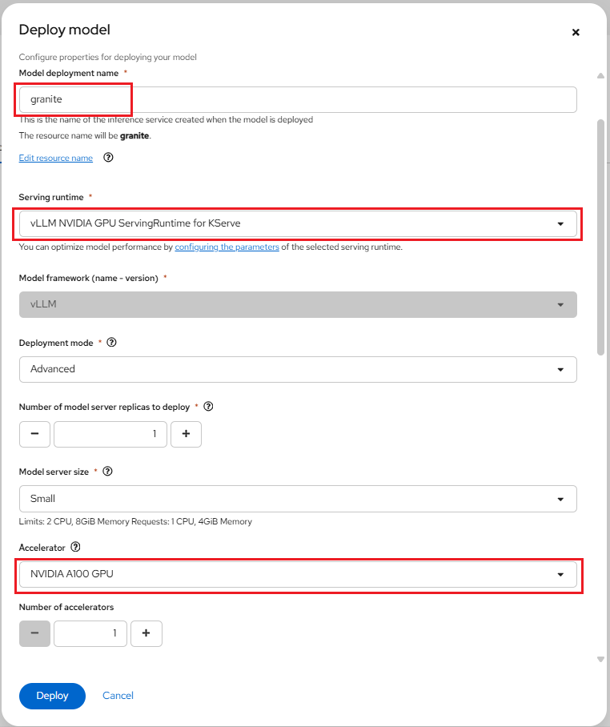

# Serving vLLM and Granite Models with Red Hat OpenShift AI

**Prerequisites**:

-   Before proceeding, confirm that you have an active GPU quota that has been approved
    for your current NERC OpenShift Allocation through NERC ColdFront. Read
    more about [How to Access GPU Resources](../../openshift/gpus/intro-to-gpus-on-nerc-ocp.md#accessing-gpu-resources)
    on NERC OpenShift Allocation.

-   `Granite-3.3-8B-Instruct` model: Granite-3.3-8B-Instruct is an 8-billion-parameter,
    128K context-length language model fine-tuned for improved reasoning and
    instruction-following capabilities. It is built on top of Granite-3.3-8B-Base.

**Procedure**:

## Set up local S3 storage (MinIO) and Connection

1.  Navigating to the OpenShift AI dashboard.

    Please follow [these steps](../../openshift-ai/logging-in/access-the-rhoai-dashboard.md)
    to access the NERC OpenShift AI dashboard.

2.  Using a script to set up local S3 storage (MinIO) on your Data Science Project
    in the NERC RHOAI as [described here](../../openshift-ai/other-projects/object-detection-app-using-yolo5.md#12-using-a-script-to-set-up-local-s3-storage-minio).

3.  Once your local S3 Object storage using MinIO is completed, you can browse to
    the **MinIO Web Console** using the provided URL. Enter the **Access Key** as
    the **Username** and the **Secret Key** as the **Password**. This will open
    the **Object Browser**, where you should verify that the bucket: **my-storage**
    is visible as shown below:

    

## Downloading Model

Navigate to [https://huggingface.co/](https://huggingface.co/) and find the model
you would like to deploy. For this example, we need to find and download the
`granite-3.3-8b-instruct` model i.e. [https://huggingface.co/ibm-granite/granite-3.3-8b-instruct/tree/main](https://huggingface.co/ibm-granite/granite-3.3-8b-instruct/tree/main).

First you need to generate an access token:

1. Go to [https://huggingface.co/settings/tokens](https://huggingface.co/settings/tokens).

2. Click on the "Create new token" button.

3. Create a "Read" access token by selecting **Read** for **Token type** and then
    give it a *Token name*.

4. Copy the generated *Access Token* i.e. `Access_Token`.

Now that you have a Access Token, you can download the model using that token by
either using **Git** or using the **Hugging Face CLI** as described below:

### Using Git with Access Token

```sh
git clone https://<your-username>:<Access_Token>@huggingface.co/<model_repo_path>
```

For example, this looks like as shown below:

```sh
git clone https://<your-username>:<Access_Token>@huggingface.co/ibm-granite/granite-3.3-8b-instruct
```

### Using the Hugging Face CLI

First, install the CLI:

```sh
pip install huggingface_hub
```

Login with your token:

```sh
huggingface-cli login
```

Then download a model:

```sh
huggingface-cli download ibm-granite/granite-3.3-8b-instruct
```

## Uploading the Model to the S3 storage (MinIO)

-   Select existing bucket named "my-storage".

-   Click on the "Create new path" button and provide a new path i.e. "models" as
    shown below:

    

-   Upload the downloaded `granite-3.3-8b-instruct` model to the the bucket path
    i.e. "my-storage/models" by selecting **Upload** -> **Upload Folder**, and
    select the folder where the model was downloaded from huggingface.

    

-   Wait for the upload to finish, this will take a while.

    

## Setting up Single-model Server and Deploy the model

1. In the left menu, click **Data science projects**.

    The **Data science projects** page opens.

2. Click the name of the project that you want to deploy a model in.

    A project details page opens.

3. Click the **Models** tab.

4. Perform one of the following actions:

    -   If you see a **​​Single-model serving platform** tile, click **Select single-model**
        on the tile and then click the **Deploy model** button.

        

    -   If you do not see any tiles i.e. "Single-model serving platform" is already
        selected, click the **Deploy model** button.

        

5. The **Deploy model** dialog opens.

Enter the following information for your new model:

-   **Model deployment name**: Enter a unique name for the model that you are
    deploying (e.g., "granite").

-   **Serving runtime**: Select **vLLM NVIDIA GPU ServingRuntime for KServe** runtime.

-   **Model framework (name - version)**: This is pre-selected as `vLLM`.

-   **Deployment mode**: From the Deployment mode list, select **Advanced** option.

-   **Number of model server replicas to deploy**: `1`.

-   **Model server size**: This is the amount of resources, CPU, and RAM that will
    be allocated to your server. Here, you can select `Small` size.

-   **Accelerator**: Select `NVIDIA A100 GPU`.

-   **Number of accelerators**: `1`.

-   **Model route**: Select the checkbox for "Make deployed models available through
    an external route" this will enable us to send requests to the model endpoint
    from outside the cluster.

-   **Token authentication**: Select the checkbox for "Require token authentication"
    if you want to secure or restrict access to the model by forcing requests to
    provide an authorization token, which is important for security. While selecting
    it, you can keep the populated Service account name i.e. `default-name`.

-   **Source model location**:

    i.  Select the **Connection** option from the dropdown list that you created
        [as described here](#set-up-local-s3-storage-minio-and-connection) to store
        the model by using the **Existing connection** option Connection dropdown
        list i.e. `My Storage`.

    Alternatively, you can create a new connection directly from this menu by
    selecting **Create connection** option.

    ii. **Path**: If your model is not located at the root of the bucket of your
        connection, you must enter the path to the folder it is in i.e. `models/granite-3.3-8b-instruct`.

-   **Configuration parameters**: You can customize the runtime parameters in the
    Configuration parameters section. You don't need to add any arguments here.

For our example, set the **Model deployment name** to `granite`, and select
**Serving runtime** as `vLLM NVIDIA GPU ServingRuntime for KServe`. Choose
`NVIDIA A100 GPU` as the **Accelerator**, with the **Number of accelerators** set
to `1`. Also, ensure that the **Deployment mode** is set to `Advanced`.

Please leave the other fields with their default settings, such as
**Number of model server replicas to deploy** set to `1` and **Model server size**
set to `Small`.



At this point, ensure that both
**Make deployed models available through an external route** and
**Require token authentication** are checked. Please leave the populated
**Service account name** i.e. `default-name` as it is. Select `My Storage` as
the **Connection** from the *Existing connection*, and for the model **Path**
location, enter `models/granite-3.3-8b-instruct` as the folder path, as shown below:


When you are ready to deploy your model, select the **Deploy** button.

Confirm that the deployed model appears on the **Models** tab for your project.
After some time, once the model has finished deploying, the model deployments
page of the dashboard will display a green checkmark in the **Status** column,
indicating that the deployment is complete.

To view details for the deployed model, click the *arrow icon* to the left of
your deployed model name (e.g., `granite`), as shown below:


You can also modify the configure properties for your deployed model configuration
by clicking on the three dots on the right side, and selecting **Edit**. This will
bring back the same configuration pop-up window we used earlier. This menu also
has the option for you to **Delete** the deployed model.

## Check the Model API

The deployed model is now accessible through the API endpoint of the model server.
The information about the endpoint is different, depending on how you configured
the model server.

As in this example, you have exposed the model externally through a route, click
on the "Internal and external endpoint details" link in the Inference endpoint
section. A popup will display the address for the *url* and the *External (can be
accessed from inside or outside the cluster)* for the inference endpoints as shown
below:


**Notes**:

-   The internal URL displayed is only the base address of the endpoint of the
    following format: `https://name-of-your-model.name-of-your-project-namespace.svc.cluster.local`
    that is accessible only within your cluster locally.

-   The External Inference endpoint displays the full URL of the following format:
    `https://name-of-your-model-name-of-your-project.apps.shift.nerc.mghpcc.org`
    that you can be easily accessed from outside the cluster.

-   Get the **Authorization Token** for your deployed model by clicking on
    *arrow icon* to the left of your deployed model name i.e. "granite". Your
    Authorization Token is located at the "Token authentication" section under
    "Token secret", you can just copy the token i.e. `YOUR_BEARER_TOKEN` directly
    from the UI.

Now that you have the URL and Authorization Token, you can try querying the model
endpoint. We will try multiple queries.

### /v1/models

Let's start with the simplest query, the `/v1/models` API endpoint. This endpoint
just returns information about the models being served, I use it to simply see if
the model can accept a request and return with some information:

```sh
curl -k -X GET https://<url>/v1/models -H "Authorization: Bearer YOUR_BEARER_TOKEN"
```

Running this command should return an output similar to the below output:

```json
{"object":"list","data":[{"id":"granite","object":"model","created":1743010793,"owned_by":"vllm","root":"/mnt/models","parent":null,"max_model_len":4096,"permission":[{"id":"modelperm-09f199065a2846ec8bbfabea78f72349","object":"model_permission","created":1743010793,"allow_create_engine":false,"allow_sampling":true,"allow_logprobs":true,"allow_search_indices":false,"allow_view":true,"allow_fine_tuning":false,"organization":"*","group":null,"is_blocking":false}]}]}
```

### v1/completions

Now that we know that works, let's test whether the `/v1/completions` API endpoint
works. This endpoint takes a text prompt and returns a completed text response.

```sh
curl -k -X POST https://<url>/v1/completions \
    -H "Content-Type: application/json" -H "Authorization: Bearer YOUR_BEARER_TOKEN" \
    -d '{
        "model": "name-of-your-model",
        "prompt": "San Francisco is a",
        "max_tokens": 7,
        "temperature": 0.7
    }'
```

Running this command should return an output similar to the following:

```json
{"id":"cmpl-40be2aa235c94f38a3b6161c6b93b59c","object":"text_completion","created":1743011184,"model":"granite","choices":[{"index":0,"text":" city known for its diverse population","logprobs":null,"finish_reason":"length","stop_reason":null,"prompt_logprobs":null}],"usage":{"prompt_tokens":4,"total_tokens":11,"completion_tokens":7}}
```

You can see within "text" the completed response "San Francisco is a... city known
for its diverse population".

!!! note "Changing API Query Parameters"

    You can change the `temperature` of the query. The temperature essentially
    controls the "randomness" of the model's response. The lower the temperature
    the more deterministic the reponse, the higher the temperature the more
    random/unpredictible the response. So if you set the temperature to 0, it
    would always return the same output since there would be no randomness.

---
