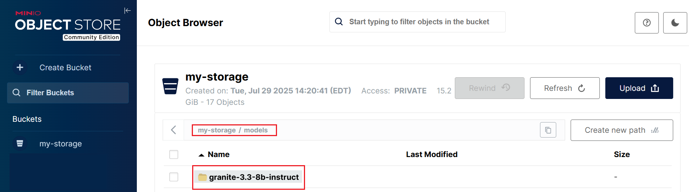
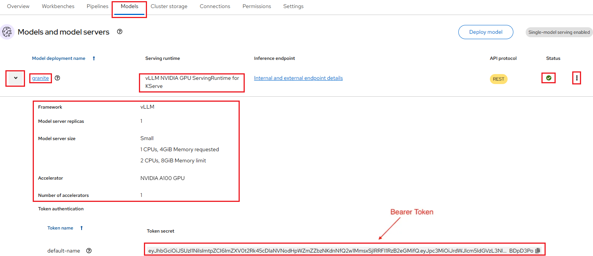

# Serving vLLM and Granite Models with Red Hat OpenShift AI

**Prerequisites**:

-   You have enabled the **Single-model Serving** platform. For more information
    about enabling the single-model serving platform, see
    [Setting up the Single-model Server platform](../data-science-project/model-serving-in-the-rhoai.md#setting-up-the-single-model-server).

-   Before proceeding, confirm that you have an active GPU quota that has been approved
    for your current NERC OpenShift Allocation through NERC ColdFront. Read
    more about [How to Access GPU Resources](../../openshift/gpus/intro-to-gpus-on-nerc-ocp.md#accessing-gpu-resources)
    on NERC OpenShift Allocation.

-   `Granite-3.3-8B-Instruct` model: [Granite-3.3-8B-Instruct](https://huggingface.co/ibm-granite/granite-3.3-8b-instruct)
    is an 8-billion-parameter, 128K context-length language model fine-tuned for
    improved reasoning and instruction-following capabilities. It is built on top
    of `Granite-3.3-8B-Base`.

**Procedure**:

## Establishing model connections

NERC's RHOAI provides flexible options for establishing model connections, allowing
you to choose the approach that best fits your deployment environment. You can
integrate with a locally hosted S3-compatible object storage system - such as
[MinIO](../../openshift/storage/minio.md) - to store and access your model artifacts
directly within your infrastructure. Alternatively, you can reference a publicly
available Uniform Resource Identifier (URI) that points to a **ModelCar container
image**. Prebuilt images from this ecosystem are also available in the
**[ModelCar Catalog registry](https://quay.io/repository/redhat-ai-services/modelcar-catalog)**
on Quay, providing convenient access to a growing collection of ready-to-use models.
This approach enables seamless retrieval of fully packaged model files without
relying on locally managed storage. Together, these options give you the flexibility
to manage model assets in a way that aligns with your operational, security, and
performance requirements.

### Set up local S3 compatible object storage (MinIO)

1.  Navigating to the OpenShift AI dashboard.

    Please follow [these steps](../../openshift-ai/logging-in/access-the-rhoai-dashboard.md)
    to access the NERC OpenShift AI dashboard.

2.  Using a script to set up local S3 storage (MinIO) on your Data Science Project
    in the NERC RHOAI as [described here](../../openshift-ai/other-projects/object-detection-app-using-yolo5.md#12-using-a-script-to-set-up-local-s3-storage-minio).

    **Verification**:

    -   This action automatically creates a **Connection** based on your local S3-compatible
        object storage (MinIO), which will then appear under the **Connections**
        tab.

        Navigate to the **Connections** tab. You should see one connection listed:
        *My Storage* as shown below:

        

    -   Click on the newly created connection from the list and then click the action
        menu (⋮) at the end of the selected connection row. Choose "Edit" from the
        dropdown menu. This will open a pop-up window as shown below:

        

    -   Note both *Access key* (by clicking eye icon near the end of the textbox)
        and *Secret key*.

    -   Once successfully initiated, click on the **minio** deployment and select
        the "Resources" tab to review created *Pods*, *Services*, and *Routes*.

        

        Please note the **minio-console** route URL by navigating to the "Routes"
        section under the _Location_ path. When you click on the **minio-console**
        route URL, it will open the MinIO web console that looks like below:

        

        !!! info "MinIO Web Console Login Credential"

            The Username and Password for the MinIO Web Console can be obtained
            from the Connection's **Access key** and **Secret key** that you noted
            earlier. Use the **Access key** as the **Username** and the
            **Secret key** as the **Password** when signing in.

3.  Once you log in to the MinIO Web Console, the **Object Browser** will open.
    From here, verify that the bucket **my-storage** is visible, as shown below:

    

#### Downloading Model

While you're not strictly required to use object storage to serve models in
OpenShift AI, doing so simplifies things in terms of scalability and flexibility.
It also provides the advantage of keeping a static local copy within the cluster
after a lengthy download, so you don't need to repeatedly fetch the model from
the internet whenever you restart it.

To download a model from Hugging Face:

1. Navigate to [https://huggingface.co/](https://huggingface.co/).

2. Search for the model you'd like to deploy.

    For this example, we'll use the **`granite-3.3-8b-instruct`** model, available
    here:
    👉 [https://huggingface.co/ibm-granite/granite-3.3-8b-instruct/tree/main](https://huggingface.co/ibm-granite/granite-3.3-8b-instruct/tree/main).

    !!! note "Important"

        Even though this example uses the `granite-3.3-8b-instruct` LLM, the same
        mechanism can be applied to any other LLMs as well. Explore the Red Hat
        AI validated models collections on [Hugging Face](https://huggingface.co/collections/RedHatAI).

3. First you need to generate an access token:

    -   Go to [https://huggingface.co/settings/tokens](https://huggingface.co/settings/tokens).

    -   Click on the "Create new token" button.

    -   Create a "Read" access token by selecting **Read** for **Token type**
        and then give it a *Token name*.

    -   Copy the generated *Access Token* i.e. `Access_Token`.

Now that you have an *Access Token*, you can download the model using that token
by either using **Git** or using the **Hugging Face CLI** as described below:

##### Using Git with Access Token

```sh
git clone https://<your-username>:<Access_Token>@huggingface.co/<model_repo_path>
```

For example, this looks like as shown below:

```sh
git clone https://<your-username>:<Access_Token>@huggingface.co/ibm-granite/granite-3.3-8b-instruct
```

##### Using the Hugging Face CLI

First, install the CLI:

```sh
pip install huggingface_hub
```

Login with your token:

```sh
huggingface-cli login
```

Then download a model:

```sh
huggingface-cli download ibm-granite/granite-3.3-8b-instruct
```

#### Uploading the Model to the S3 storage (MinIO)

-   Select existing bucket named "my-storage".

-   Click on the "Create new path" button and provide a new path i.e. "models" as
    shown below:

    

-   Upload the downloaded `granite-3.3-8b-instruct` model to the the bucket path
    i.e. "my-storage/models" by selecting **Upload** -> **Upload Folder**, and
    select the folder where the model was downloaded from huggingface.

    

-   Wait for the upload to finish, this will take a while.

    

### Set up URI

**Alternatively,** for the Granite model, you can use a publicly available container
image from the **Quay.io** registry: **[quay.io/redhat-ai-services/modelcar-catalog:granite-3.3-8b-instruct](https://quay.io/repository/redhat-ai-services/modelcar-catalog?tag=granite-3.3-8b-instruct)**.

Create a **Connection** to a ModelCar container image, which is an **OCI-compliant**
container that packages a machine learning model along with its runtime environment
and dependencies for consistent deployment.

#### Adding a Connection based on URI

In your OpenShift AI project, navigate to the **Connections** tab. and click the
"Create Connection" and then choose the **URI** connection type as shown below:


To create this connection in your project, enter the following URI:

```sh
oci://quay.io/redhat-ai-services/modelcar-catalog:granite-3.3-8b-instruct
```

and use `Granite 3.3 8B Instruct Modelcar` as the connection name, as shown below:


!!! note "Important Note: ModelCar Requirements & Guidance"

    You have several options for deploying models to your OpenShift AI cluster.
    We recommend using **[ModelCar](https://kserve.github.io/website/docs/model-serving/storage/providers/oci#using-modelcars)**
    because it removes the need to manually download models from Hugging Face,
    upload them to S3, or manage access permissions. With ModelCar, you can package
    models as OCI images and pull them at runtime or precache them. This simplifies
    versioning, improves traceability, and integrates cleanly into CI/CD workflows.
    ModelCar images also ensure reproducibility and maintain versioned model releases.

    You can deploy our own model using a ModelCar container, which packages all
    model files into an OCI container image. To learn more about ModelCar containers,
    read this article **[Build and deploy a ModelCar container in OpenShift AI](https://developers.redhat.com/articles/2025/01/30/build-and-deploy-modelcar-container-openshift-ai)**.
    It explains the benefits of ModelCar containers, how to build a ModelCar image,
    and how to deploy it with OpenShift AI.

    For additional patterns and prebuilt ModelCar images, explore the Red Hat AI
    Services **[ModelCar Catalog repository](https://github.com/redhat-ai-services/modelcar-catalog)**
    on GitHub. Prebuilt images from this catalog are also available in the
    **[ModelCar Catalog registry](https://quay.io/repository/redhat-ai-services/modelcar-catalog)**
    on Quay. However, note that all these images are compiled for the **x86 architecture**.
    If you're targeting ARM, you'll need to rebuild these images on an ARM machine,
    as demonstrated in **[this guide](https://pandeybk.medium.com/serving-vllm-and-granite-models-on-arm-with-red-hat-openshift-ai-0178adba550e)**.

    Additionally, you may find it helpful to read **[Optimize and deploy LLMs for production with OpenShift AI](https://developers.redhat.com/articles/2025/10/06/optimize-and-deploy-llms-production-openshift-ai)**.

## Setting up Single-model Server and Deploy the model

1. In the left menu, click **Data science projects**.

    The **Data science projects** page opens.

2. Click the name of the project that you want to deploy a model in.

    A project details page opens.

3. Click the **Models** tab.

4. Click the **Deploy model** button.

    

5. The **Deploy model** dialog opens.

    Enter the following information for your new model:

    -   **Model deployment name**: Enter a unique name for the model that you are
        deploying (e.g., "granite").

    -   **Serving runtime**: Select **vLLM NVIDIA GPU ServingRuntime for KServe**
        runtime.

    -   **Model framework (name - version)**: This is pre-selected as `vLLM`.

    -   **Deployment mode**: From the Deployment mode list, select **Advanced**
        option - uses *Knative Serverless*.

    -   **Number of model server replicas to deploy** has **Minimum replicas**:
        `1` and **Maximum replicas**:`1`.

    -   **Model server size**: This is the amount of resources, CPU, and RAM that
        will be allocated to your server. Here, you can select `Medium` size.

    -   **Accelerator**: Select `NVIDIA A100 GPU`.

    -   **Number of accelerators**: `1`.

    -   **Model route**: Select the checkbox for "Make deployed models available
        through an external route" this will enable us to send requests to the model
        endpoint from outside the cluster.

    -   **Token authentication**: Select the checkbox for "Require token authentication"
        if you want to secure or restrict access to the model by forcing requests
        to provide an authorization token, which is important for security. While
        selecting it, you can keep the populated Service account name i.e. `default-name`.

    -   **Source model location**:

        If you set up the **Connection** using a locally hosted S3-compatible object
        storage system (MinIO) - then configure the following:

        i.  Select the **Connection** option from the dropdown list that you
            created [as described here](#set-up-local-s3-compatible-object-storage-minio)
            to store the model by using the **Existing connection** option Connection
            dropdown list i.e. `My Storage`.

        ii. **Path**: If your model is not located at the root of the bucket of
            your connection, you must enter the path to the folder it is in i.e.
            `models/granite-3.3-8b-instruct`.

        -   **Configuration parameters**: You can customize the runtime parameters
            in the **Additional serving runtime arguments** field. **You don't
            need to add any arguments here.**

        **Alternatively**, if you set up the **Connection** using **the URI**, then
        select the **Connection** option from the dropdown list that you created
        [as described here](#set-up-uri) to store the model by using the
        **Existing connection** option Connection dropdown list i.e.
        `Granite 3.3 8B Instruct Modelcar`.

        -   **Configuration parameters**: In the **Additional serving runtime arguments**
            field, specify the following recommended arguments:

            ```yaml
            --dtype=half
            --max-model-len=20000
            --gpu-memory-utilization=0.95
            --enable-chunked-prefill
            --enable-auto-tool-choice
            --tool-call-parser=llama3_json
            --chat-template=/app/data/template/tool_chat_template_llama3.2_json.jinja
            ```

        !!! note "Creating a New Connection"

            Alternatively, you can create a new connection directly from this menu
            by selecting **Create connection** option.

For our example, set the **Model deployment name** to `granite`, and select
**Serving runtime** as `vLLM NVIDIA GPU ServingRuntime for KServe`. Also, ensure
that the **Deployment mode** is set to `Advanced` - uses *Knative Serverless*.

Please leave the other fields at their default settings. For example, the
**Number of model server replicas to deploy** has **Minimum replicas** set to `1`
and **Maximum replicas** set to `1`, and the **Model server size** is set to `Medium`.


Choose `NVIDIA A100 GPU` as the **Accelerator**, with the **Number of accelerators**
set to `1`.

At this point, ensure that both
**Make deployed models available through an external route** and
**Require token authentication** are *checked*. Please leave the populated
**Service account name** i.e. `default-name` as it is.

If you set up the **Connection** using a locally hosted S3-compatible object
storage system (MinIO), select `My Storage` as the Connection from
*Existing connections*. For the model Path location, enter `models/granite-3.3-8b-instruct`
as the folder path, as shown below:


**Alternatively**, if you set up the **Connection** using **the URI**, select
`Granite 3.3 8B Instruct Modelcar` as the Connection from *Existing connections*.
In the **Additional serving runtime arguments** field under **Configuration parameters**
section, specify the following recommended arguments:

```yaml
--dtype=half
--max-model-len=20000
--gpu-memory-utilization=0.95
--enable-chunked-prefill
--enable-auto-tool-choice
--tool-call-parser=llama3_json
--chat-template=/app/data/template/tool_chat_template_llama3.2_json.jinja
```

**Ensure it appears as follows:**


When you are ready to deploy your model, select the **Deploy** button.

Confirm that the deployed model appears on the **Models** tab for your project.
After some time, once the model has finished deploying, the model deployments
page of the dashboard will display a green checkmark in the **Status** column,
indicating that the deployment is complete.

To view details for the deployed model, click the dropdown *arrow icon* to the left
of your deployed model name (e.g., `granite`), as shown below:



You can also modify the configure properties for your deployed model configuration
by clicking on the three dots on the right side, and selecting **Edit**. This will
bring back the same configuration pop-up window we used earlier. This menu also
has the option for you to **Delete** the deployed model.

!!! tips "Intelligent Auto-Scaling and Scale-to-Zero for Significant Cost Savings"

    Once you deploy your model and obtain the inference endpoints, you can edit
    the deployment and set the **Minimum replicas** to 0. This enables intelligent
    auto-scaling of your model's compute resources (CPU, GPU, RAM, etc.), allowing
    replicas to scale up during high traffic and scale down when idle. With
    `scale-to-zero` enabled, the system reduces pods to zero during inactivity,
    eliminating idle compute costs—especially beneficial for GPU workloads. The
    model then scales back up instantly as soon as a new request arrives.

## Check the Model API

The deployed model is now accessible through the API endpoint of the model server.
The information about the endpoint is different, depending on how you configured
the model server.

As in this example, you have exposed the model externally through a route, click
on the "Internal and external endpoint details" link in the Inference endpoint
section. A popup will display the address for the *url* and the *External (can be
accessed from inside or outside the cluster)* for the inference endpoints as shown
below:


**Notes**:

-   The internal URL displayed is only the base address of the endpoint of the
    following format: `https://name-of-your-model.name-of-your-project-namespace.svc.cluster.local`
    that is accessible only within your cluster locally.

-   The External Inference endpoint displays the full URL of the following format:
    `https://name-of-your-model-name-of-your-project.apps.shift.nerc.mghpcc.org`
    that you can be easily accessed from outside the cluster.

-   Get the **Authorization Token** for your deployed model by clicking on dropdown
    *arrow icon* to the left of your deployed model name i.e. "granite". Your
    Authorization Token is located at the "Token authentication" section under
    "Token secret", you can just copy the token i.e. `YOUR_BEARER_TOKEN` directly
    from the UI.

Now that you have the URL and Authorization Token, you can try querying the model
endpoint. We will try multiple queries.

### /v1/models

Let's start with the simplest query, the `/v1/models` API endpoint. This endpoint
just returns information about the models being served, I use it to simply see if
the model can accept a request and return with some information:

```sh
curl -k -X GET https://<url>/v1/models -H "Authorization: Bearer YOUR_BEARER_TOKEN"
```

Running this command should return an output similar to the below output:

```json
{"object":"list","data":[{"id":"granite","object":"model","created":1743010793,"owned_by":"vllm","root":"/mnt/models","parent":null,"max_model_len":4096,"permission":[{"id":"modelperm-09f199065a2846ec8bbfabea78f72349","object":"model_permission","created":1743010793,"allow_create_engine":false,"allow_sampling":true,"allow_logprobs":true,"allow_search_indices":false,"allow_view":true,"allow_fine_tuning":false,"organization":"*","group":null,"is_blocking":false}]}]}
```

### v1/completions

Now that we know that works, let's test whether the `/v1/completions` API endpoint
works. This endpoint takes a text prompt and returns a completed text response.

```sh
curl -k -X POST https://<url>/v1/completions \
    -H "Content-Type: application/json" -H "Authorization: Bearer YOUR_BEARER_TOKEN" \
    -d '{
        "model": "name-of-your-model",
        "prompt": "San Francisco is a",
        "max_tokens": 7,
        "temperature": 0.7
    }'
```

Running this command should return an output similar to the following:

```json
{"id":"cmpl-40be2aa235c94f38a3b6161c6b93b59c","object":"text_completion","created":1743011184,"model":"granite","choices":[{"index":0,"text":" city known for its diverse population","logprobs":null,"finish_reason":"length","stop_reason":null,"prompt_logprobs":null}],"usage":{"prompt_tokens":4,"total_tokens":11,"completion_tokens":7}}
```

You can see within "text" the completed response "San Francisco is a... city known
for its diverse population".

!!! note "Changing API Query Parameters"

    You can change the `temperature` of the query. The temperature essentially
    controls the "randomness" of the model's response. The lower the temperature
    the more deterministic the reponse, the higher the temperature the more
    random/unpredictible the response. So if you set the temperature to 0, it
    would always return the same output since there would be no randomness.

## Summary

Deploying validated models from
[Red Hat AI's Hugging Face Validated Models repository](https://docs.redhat.com/en/documentation/red_hat_ai_inference_server/3.2/html/validated_models/red_hat_ai_validated_models)
in disconnected OpenShift AI environments involves the following steps:

- **Set up local S3 storage (MinIO)** and create a connection to point to the bucket.

- **Select the desired model.**

- **Download the model** and upload it to the S3 storage bucket.

- **Identify the required serving runtime.**

- **Configure a single-model server** and deploy the model using the connection.

- **Verify and test** the model's API inference endpoints.

This process ensures that AI workloads run seamlessly in restricted or disconnected
environments, allowing you to securely leverage validated and optimized AI models.

---
