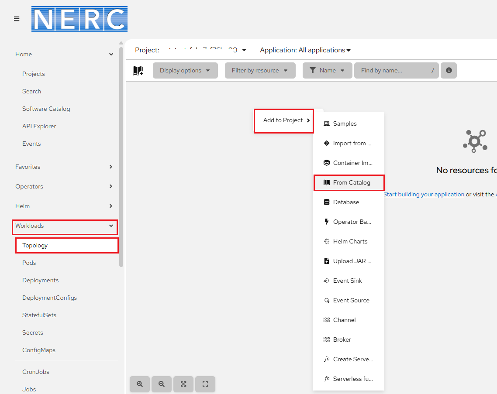
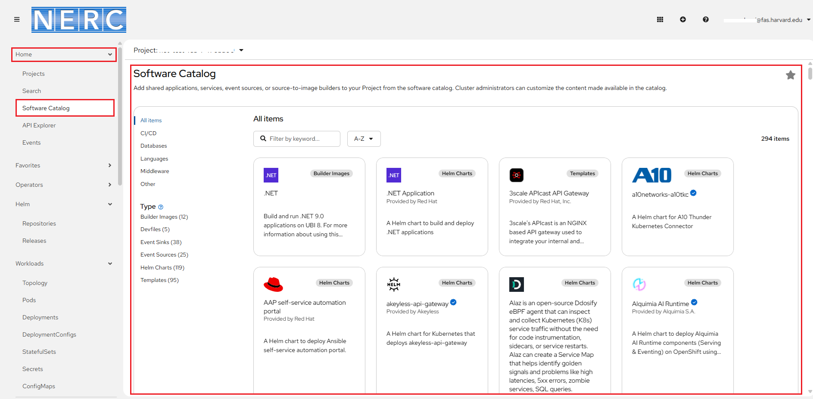
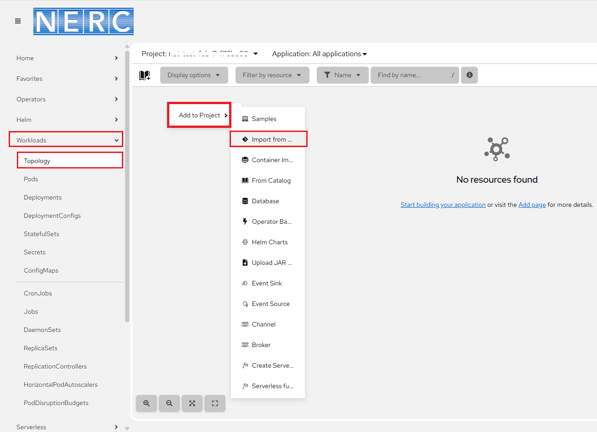
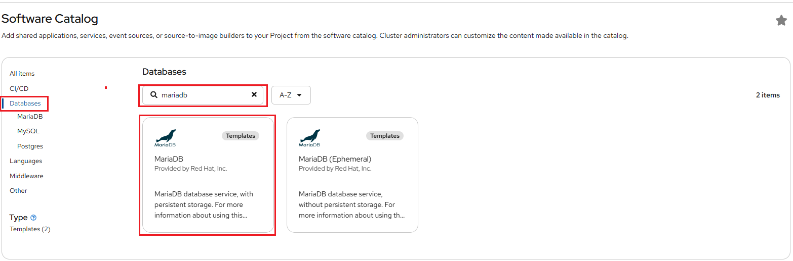
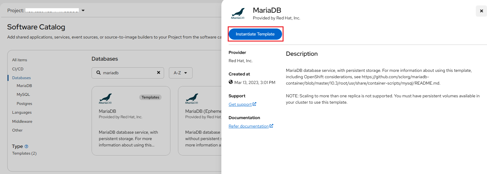
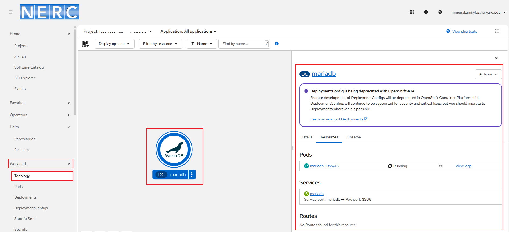

# Creating A Sample Application

NERC's OpenShift service is a platform that provides a cloud-native environment
for developing and deploying applications.

Here, we walk through the process of creating a simple web application,
deploying it. This example uses the Node.js programming language, but the process
with other programming languages will be similar. Instructions provided show the
tasks using both the web console and the command-line tool.

## Using NERC's OpenShift Web Console

1. Go to the [NERC's OpenShift Web Console](https://console.apps.shift.nerc.mghpcc.org).

2. In the **Navigation Menu**, navigate to the **Workloads** -> **Topology** menu.

3. **Creating applications using samples**: Use existing code samples to get started
    with creating applications on the OpenShift Container Platform. Here, you can
    select different type of application you want to create (e.g. Node.js, Python,
    Ruby, etc.).

    For that you can right-click on the page and select the "From Catalog"
    option from the **Add to Project** in-context menu as shown below:

    

    **Alternatively**, You can go to the **Home** -> **Software Catalog** menu as
    shown below:

    

    **Or,** if you want to create an application from your own source code located
    in a git repository then you can select **Import from Git** from the in-context
    menu in the Topology view as shown below:

    

    **Alternatively**, select the "Import from Git" button, represented by
    the "+" icon in the top navigation bar as shown below:

    

    You will be prompted to enter a URL that points to a Git repo. Red Hat OpenShift
    will copy the repo to an internal storage location, inspect it, and attempt
    to discern the import strategy to build it. OpenShift will choose one of the
    following methods to build the application:

    -   **Option 1:** Using the Builder image for the programming language used
        (i.e., the s2i option).

    -   **Option 2:** Using the Dockerfile that is found in the Git repo.

    -    **Option 3:** Using the DevFile that is found in the Git Repo.

    In the **Git Repo URL** text box, enter your git repo url. For example: `https://github.com/myuser/mypublicrepo.git`.

4. Click "Create" to create your application.

5. Once your application has been created, you can view the details by clicking
   on the application name in the **Project Overview** page.

6. On the **Topology** view page, click on your application, or the application
   circle if you are in graphical topology view. In the details panel
   that displays, scroll to the **Routes** section on the "Resources" tab and click
   on the link to go to the sample application. This will open your application
   in a new browser window. The link will look similar to `https://<your-application-name>-<your-namespace>.apps.shift.nerc.mghpcc.org`.

!!! tip "Example: Deploying a Python application"

    For a quick example on how to use the "Import from Git" option to deploy a
    sample Python application, please refer to [this guide](https://docs.redhat.com/en/documentation/openshift_container_platform/4.19/html/getting_started/openshift-web-console#getting-started-web-console-deploying-python-app_openshift-web-console).

### Additional resources

For more options and customization please [read this](https://docs.openshift.com/container-platform/4.19/applications/creating_applications/odc-creating-applications-using-developer-perspective.html).

## Using the CLI (oc command) on your local terminal

Alternatively, you can create an application on the NERC's OpenShift cluster by
using the **oc new-app** command from the command line terminal.

i. Make sure you have the `oc` CLI tool installed and configured on your local
machine following [these steps](../logging-in/setup-the-openshift-cli.md#first-time-usage).

!!! info "Information"

    Some users may have access to multiple projects. Run the following command to
    switch to a specific project space: `oc project <your-project-namespace>`.

ii. To create an application, you will need to specify the language and runtime
for your application. You can do this by using the `oc new-app` command and specifying
a language and runtime. For example, to create a Node.js application, you can run
the following command:
`oc new-app nodejs`

iii. If you want to create an application from an existing Git repository, you can
use the `--code` flag to specify the URL of the repository. For example:
`oc new-app --code https://github.com/myuser/mypublicrepo`. If you want to use a
different name, you can add the `--name=<newname>` argument to the `oc new-app` command.
For example: `oc new-app --name=mytestapp https://github.com/myuser/mypublicrepo`.
The platform will try to automatically [detect the programming language](https://docs.openshift.com/container-platform/4.19/applications/creating_applications/creating-applications-using-cli.html#language-detection)
of the application code and select the latest version of the base language image
available. If `oc new-app` can't find any suitable Source-To-Image (S2I) builder
images based on your source code in your Git repository or unable to detect the programming
language or detects the wrong one, you can always specify the image you want to use
as part of the new-app argument, with `oc new-app <image url>~<git url>`. If it is
using a test application based on Node.js, we could use the same command as before
but add `nodejs~` before the URL of the Git repository.
For example: `oc new-app nodejs~https://github.com/myuser/mypublicrepo`.

!!! note "Important Note"

    If you are using a private remote Git repository, you can use the
    `--source-secret` flag to specify an existing source clone secret that
    will get injected into your **BuildConfig** to access the repository.
    For example: `oc new-app https://github.com/myuser/yourprivaterepo --source-secret=yoursecret`.

iv. Once your application has been created, You can run `oc status` to see if your
application was successfully built and deployed. Builds and deployments can sometimes
take several minutes to complete, so you may run this several times. you can view
the details by running the `oc get pods` command. This will show you a list of all
the pods running in your project, including the pod for your new application. The
`oc rsh pod/<pod_name>` command opens a remote shell session inside the specified
OpenShift pod i.e. <pod_name>, allowing you to interact with its container.

v. When using the `oc` command-line tool to create an application, a route is not
automatically set up to make your application web accessible. Run the following
to make the test application web accessible:
`oc create route edge --service=mytestapp --insecure-policy=Redirect`.
Once the application is deployed and the route is set up, it can be accessed at
a web URL similar to `https://mytestapp-<your-namespace>.apps.shift.nerc.mghpcc.org`.

### For more additional resources

For more options and customization please [read this](https://docs.openshift.com/container-platform/4.19/applications/creating_applications/creating-applications-using-cli.html).

## Using the Developer Catalog on NERC's OpenShift Web Console

The Developer Catalog offers a streamlined process for deploying applications
and services supported by Operator-backed services like CI/CD, Databases, Builder
Images, and Helm Charts. It comprises a diverse array of application components,
services, event sources, and source-to-image builders ready for integration into
your project.

!!! note "About Quick Start Templates"

    By default, the templates build using a public source repository on GitHub that
    contains the necessary application code. For more options and customization
    please [read this](https://docs.openshift.com/container-platform/4.19/openshift_images/using-templates.html#templates-quickstart_using-templates).

### Steps

1.  Go to the [NERC's OpenShift Web Console](https://console.apps.shift.nerc.mghpcc.org).

2.  You need to go to the **Home** -> **Software Catalog** menu as shown below:

    

3.  Then, you can search for available services in the **Software Catalog** by
    entering `mariadb` in the search bar and selecting the desired service or
    component to include in your project. For this example, select **Databases**
    from the category list on the left to filter all database services, and then
    click **MariaDB** to view the service details.

    

    !!! info "To Create Your Own Developer Catalog Service"

        You also have the option to create and integrate custom services into the
        Developer Catalog using a template, as [described here](creating-your-own-developer-catalog-service.md).

4.  Once selected by clicking the template, you will see Instantiate Template web
    interface as shown below:

    

5.  Clicking "Instantiate Template" will display an automatically populated
    template containing details for the MariaDB service. Click "Create" to begin
    the creation process and enter any custom information required.

6.  View the **MariaDB** service in the Topology view as shown below:

    

### For Additional resources

For more options and customization please [read this](https://docs.redhat.com/en/documentation/openshift_container_platform/4.19/html/building_applications/creating-applications#odc-creating-applications-using-developer-perspective).

---
