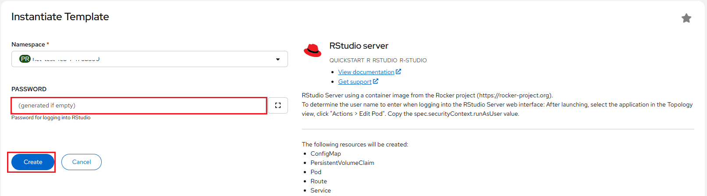

# Creating A Sample Application

NERC's OpenShift service is a platform that provides an cloud-native environment
for developing and deploying applications.

Here, we walks through the process of creating a simple web application,
deploying it. This example uses the Node.js programming language, but the process
with other programming languages will be similar. Instructions provided show the
tasks using both the web console and the command-line tool.

## Using the Developer perspective on NERC's OpenShift Web Console

1. Go to the [NERC's OpenShift Web Console](https://shift.nerc.mghpcc.org).

2. Click on the **Perspective Switcher** drop-down menu and select **Developer**.

3. In the **Navigation Menu**, click **+Add**.

4. **Creating applications using samples**: Use existing code samples to get started
with creating applications on the OpenShift Container Platform. Find the
**Create applications using samples** section and then click on "**View all samples**"
and then select the type of application you want to create (e.g. Node.js, Python,
Ruby, etc.), it will load application from **Git Repo URL** and then review or
modify the application **Name** for your application.
**Alternatively**, If you want to create an application from your own source code
located in a git repository, select **Import from Git**. In the **Git Repo URL**
text box, enter your git repo url. For example: `https://github.com/myuser/mypublicrepo.git`.
You may see a *warning* stating "**URL is valid but cannot be reached**". *You can
ignore this warning!*

5. Click "Create" to create your application.

6. Once your application has been created, you can view the details by clicking
on the application name in the **Project Overview** page.

7. On the **Topology View** menu, click on your application, or the application
circle if you are in graphical topology view. In the details panel that display,
scroll to the **Routes** section on the Resources tab and click on the link to
go to the sample application. This will open your application in a new browser
window. The link will look similar to `http://<appname>-<mynamespace>.apps.shift.nerc.mghpcc.org`.

### Additional resources

For more options and customization please [read this](https://docs.openshift.com/container-platform/4.10/applications/creating_applications/odc-creating-applications-using-developer-perspective.html).

## Using the CLI (oc command) on your local terminal

Alternatively, you can create an application on the NERC's OpenShift cluster by
using the **oc new-app** command from the command line terminal.

i. Make sure you have the `oc` CLI tool installed and configured on your local
machine following [these steps](../logging-in/install-the-openshift-cli/#first-time-usage).
!!! info "Information"
    Some users may have access to multiple projects. Run the following command to
    switch to a specific project space: `oc project <your-project-namespace>`.

ii. To create an application, you will need to specify the language and runtime
for your application. You can do this by using the oc new-app command and specifying
a language and runtime. For example, to create a Node.js application, you can run
the following command:
`oc new-app nodejs`

iii. If you want to create an application from an existing Git repository, you can
use the `--code` flag to specify the URL of the repository. For example:
`oc new-app --code https://github.com/myuser/mypublicrepo`. If you want to use a
different name, you can add the `--name=<newname>` argument to the `oc new-app` command.
For example: `oc new-app –name=mytestapp https://github.com/myuser/mypublicrepo`.
The platform will try to automatically [detect the programming language](https://docs.openshift.com/container-platform/4.10/applications/creating_applications/creating-applications-using-cli.html#language-detection)
of the application code and select the latest version of the base language image
available. If `oc new-app` can't find any suitable Source-To-Image (S2I) builder
images based on your source code in your Git repository or unable to detect the programming
language or detects the wrong one, you can always specify the image you want to use
as part of the new-app argument, with `oc new-app <image url>~<git url>`. If it is
using a test application based on Node.js, we could use the same command as before
but add `nodejs~` before the URL of the Git repository.
For example: `oc new-app nodejs~https://github.com/myuser/mypublicrepo`.
!!! note "Important Note"
    If you are using a private remote Git repository, you can use the
    `--source-secret` flag to specify an existing source clone secret that
    will get injected into your **BuildConfig** to access the repository.
    For example: `oc new-app https://github.com/myuser/yourprivaterepo --source-secret=yoursecret`.

iv. Once your application has been created, You can run `oc status` to see if your
application was successfully built and deployed. Builds and deployments can sometimes
take several minutes to complete, so you may run this several times. you can view
the details by running the `oc get pods` command. This will show you a list of all
the pods running in your project, including the pod for your new application.

v. When using the `oc` command-line tool to create an application, a route is not
automatically set up to make your application web accessible. Run the following
to make the test application web accessible:
`oc create route edge --service=mytestapp --insecure-policy=Redirect`.
Once the application is deployed and the route is set up, it can be accessed at
a web URL similar to `http://mytestapp-<mynamespace>.apps.shift.nerc.mghpcc.org`.

### For more additional resources

For more options and customization please [read this](https://docs.openshift.com/container-platform/4.10/applications/creating_applications/creating-applications-using-cli.html).

## Using the Developer Catalog on NERC's OpenShift Web Console

Here, we walks through the process of creating a simple RStudio web server template
that bundles all resources required to run the server i.e. ConfigMap, Pod, Route,
Service, etc. and then initiate and deploy application from that template.

This example template file is readily accessible from the
[Git Repository](https://github.com/nerc-project/rstudio-testapp).

1. Find the **From Local Machine** section and click on **Import YAML** as shown
below:

    

2. On opened YAML editor paste the content of template copied from the
`rstudio-server-template.yaml` file located at the provided[Git Repo](https://github.com/nerc-project/rstudio-testapp/blob/main/rstudio-server-template.yaml).

    

3. You need to find the Developer Catalog section and then select **All services**
option as shown below:

    

4. Then, you will be able to use the created Developer Catalog template by searching
for it on catalog as shown below:

    

5. Once selected by clicking the template, you will see initiate template web interface
as shown below:

    

6. Based on our template definition, we asked user to input a preferred password
for the RStudio server so the following interface will prompt for your password that
will be used during login the RStudio server.

    

7. Once successfully initiated, you can either open the application URL using the
**Open URL** icon as shown below or you can naviate to the Routes section and
click on *Location* path as shown below:

    

8. To get the Username to be used for login on RStudio server, you need to click
on running pod i.e. rstudio-server as shown below:

    

9. Then select the **YAML** section to find out the attribute value for **runAsUser**
that is used as the Username while Sign in to RStudio server as shown below:

    

10. Finally, you will be able to see the RStudio web interface!

---
