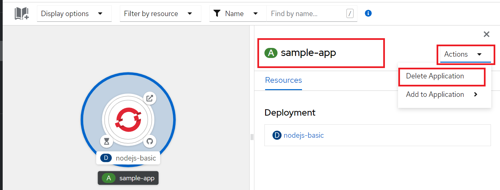
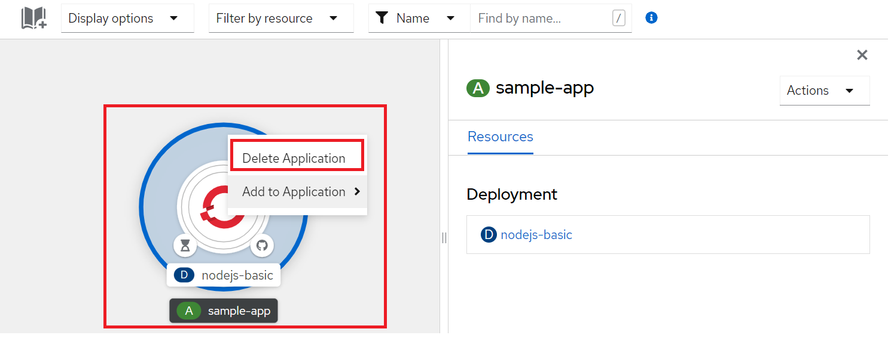

# Deleting your applications

## Deleting applications using the Developer perspective on NERC's OpenShift Web Console

You can delete applications created in your project by using the
**Developer** perspective as following:

To delete an application and all of its associated components using the
**Topology view** menu in the **Developer** perspective:

1. Go to the [NERC's OpenShift Web Console](https://console.apps.shift.nerc.mghpcc.org).

2. Click on the **Perspective Switcher** drop-down menu and select **Developer**.

3. Click the application you want to delete to see the side panel with
   the resource details of the application.

4. Click the **Actions** drop-down menu displayed on the upper right of the panel,
   and select **Delete Application** to see a confirmation dialog box as shown below:

    

5. Enter the name of the application and click **Delete** to delete it.

Or, if you are using **Graph view** then you can also right-click the application
you want to delete and click **Delete Application** to delete it as shown below:

## Deleting applications using the oc command on your local terminal

Alternatively, you can delete the resource objects by using the
**oc delete** command from the command line terminal. Make sure you have the `oc`
CLI tool installed and configured on your local machine following [these steps](../logging-in/setup-the-openshift-cli.md#first-time-usage).

!!! info "How to select resource object?"

    You can delete a single resource object by name, or delete a set of resource
    objects by specifying a label selector.

When an application is deployed, resource objects for that application will
typically have an app label applied to them with value corresponding to the name
of the application. This can be used with the label selector to delete all
resource objects for an application.

To test what resource objects would be deleted when using a label selector, use
the `oc get` command to query the set of objects which would be matched.

`oc get all --selector app=<application-name> -o name`

For example:

    oc get all --selector app=rstudio-server -o name
    pod/rstudio-server
    service/rstudio-server
    route.route.openshift.io/rstudio-server

If you are satisfied that what is shown are the resource objects for your
application, then run `oc delete`.

`oc delete all --selector app=<application-name>`

!!! note "Important Note"

    Selector all matches on a subset of all resource object types that exist.
    It targets the core resource objects that would be created for a build and deployment.
    It will not include resource objects such as **persistent volume claims (pvc)**,
    **config maps (configmap)**, **secrets (secret)**, and others.

You will either need to delete these resource objects separately, or if they also
have been labelled with the app tag, list the resource object types along with all.

`oc delete all,configmap,pvc,serviceaccount,rolebinding --selector app=<application-name>`

If you are not sure what labels have been applied to resource objects for your
application, you can run oc describe on the resource object to see the labels
applied to it. For example:

    oc describe pod/rstudio-server
    Name:         rstudio-server
    Namespace:    64b664c37f2a47c39c3cf3942ff4d0be
    Priority:     0
    Node:         wrk-11/10.30.6.21
    Start Time:   Fri, 16 Dec 2022 10:59:23 -0500
    Labels:       app=rstudio-server
                template.openshift.io/template-instance-owner=44a3fae8-4e8e-4058-a4a8-0af7bbb41f6
    ...

!!! note "Important Note"

    It is important to check what labels have been used with your application if
    you have created it using a template, as templates may not follow the convention
    of using the `app` label.

---
