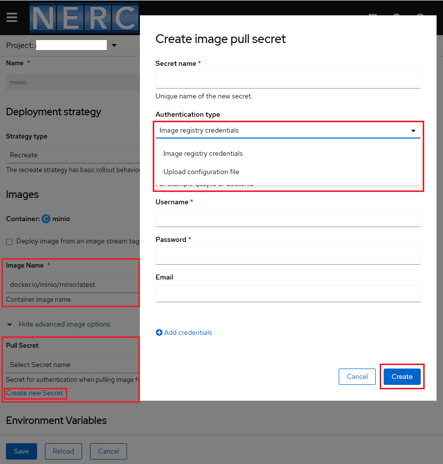

# Editing applications

You can edit the configuration and the source code of the application you create
using the **Topology** view.

## Editing the source code of an application using the Developer perspective

You can click the "Edit Source Code" icon, displayed at the bottom-right of the
deployed application, to access your source code and modify it as shown below:


!!! info "Information"

    This feature is available only when you create applications using the
    **From Git**, **Container Image**, **From Catalog**, and **From Dockerfile**
    options.

## Editing the application configuration using the Developer perspective

1. In the **Topology** view, right-click the application to see the edit options
   available as shown below:

    

    **Or,** In the **Topology** view, click the deployed application to reveal the
    right-side **Overview** panel. From the _Actions_ drop-down list, we can see
    the similar edit options available as shown below:

    

2. Click on any of the options available to edit resource used by your application,
   the pop-up form will be pre-populated with the values you had added while creating
   the applicaiton.

3. Click **Save** to restart the build and deploy a new image.

## Rate Limits While Pulling Container Image

By default, **Container Images** are pulled from **Registry** i.e. Docker Hub or
other commercial and private registries, which enforce rate limits on *anonymous
users*. If your setup involves frequent image pulls, you may face these restrictions.

To prevent disruptions, you can authenticate with Registry by creating a Secret
in your namespace and linking it to your service account.

-   **Prerequisites**:

    Setup the OpenShift CLI (`oc`) Tools locally and configure the OpenShift CLI
    to enable `oc` commands. Refer to [this user guide](../../openshift/logging-in/setup-the-openshift-cli.md).

### Using Command Line to Create Docker Image Pull Secret

-   First, generate a Kubernetes **Secret** using the following `oc` commands.

    You can have either a **Secret** storing **Image registry credentials** as
    shown below:

    ```sh
    oc create secret docker-registry <your-secret-name> \
      --docker-server=<registry i.e. docker.io or quay.io> \
      --docker-username=<your-username> \
      --docker-password=<your-secret-token> \
      --docker-email=<your-email>
    ```

    !!! warning "Use Access Token Instead of Password!"

        It is recommended to [**use an access token**](https://docs.docker.com/docker-hub/access-tokens/)
        instead of your actual **password** as `<your-secret-token>`. If you have
        two-factor authentication (2FA) enabled on your account i.e. `<your-username>`,
        using an access token is the only way to authenticate. Similarly, other
        registries also provide **access tokens** for authentication in user accounts.

    **Or**, based on the **configuration file**, create a generic Kubernetes **Secret**
    by following the followins steps:

    i. Create the `.dockerconfigjson` file manually by running:

        ```sh
        echo -n "<your-username>:<your-secret-token>" | base64
        ```

        Replace `<your-username>` and `<your-secret-token>` with your own.

    ii. Then, create a `config.json` file with the following structure. Here is
        an example for `docker.io`:

        ```sh
        {
        "auths": {
            "https://index.docker.io/v1/": {
            "auth": "<base64-encoded-credentials>"
            }
          }
        }
        ```

    iii. Now, use this JSON file to create a Kubernetes secret:

        ```sh
        oc create secret generic <your-secret-name> \
          --from-file=.dockerconfigjson=config.json \
          --type=kubernetes.io/dockerconfigjson
        ```

-   Finally, patch the **default** service account in your namespace to use this
    secret when pulling images:

    ```sh
    oc patch serviceaccount default -p '{"imagePullSecrets": [{"name": "<your-secret-name>"}]}'
    ```

    You can check if the secret is correctly applied by running:

    ```sh
    oc get serviceaccount default -o json | jq '.imagePullSecrets'
    ```

    This ensures OpenShift authenticates with the Registry to bypass anonymous
    rate limits when pulling images.

    !!! info "Another Way"

        oc secrets link default docker-hub-pull-secret —-for=pull

### Reference Image Pull Secret in YAML Deployment Files

Alternatively, instead of directly applying the *Image Pull Secret* to your
*Service Account*, once you have successfully created the **Secret** in your
working namespace, you can reference it under `spec.imagePullSecrets` in your
YAML file as shown below:

```yaml
...
spec:
...
containers:
- name: ...
    image: <Image>
    imagePullPolicy: IfNotPresent
    ...
imagePullSecrets:
    - name: <your-secret-name>
...
```

### Configuring Image Pull Secret via OpenShift Web Console

Alternatively, if you are using the OpenShift Web Console, you can add or edit a
**Secret** by creating a new one with **Image registry credentials** or by
**Uploading a configuration file** via the web form itself. If a secret is already
set up, simply select an existing **Pull Secret** from the dropdown menu:



---
