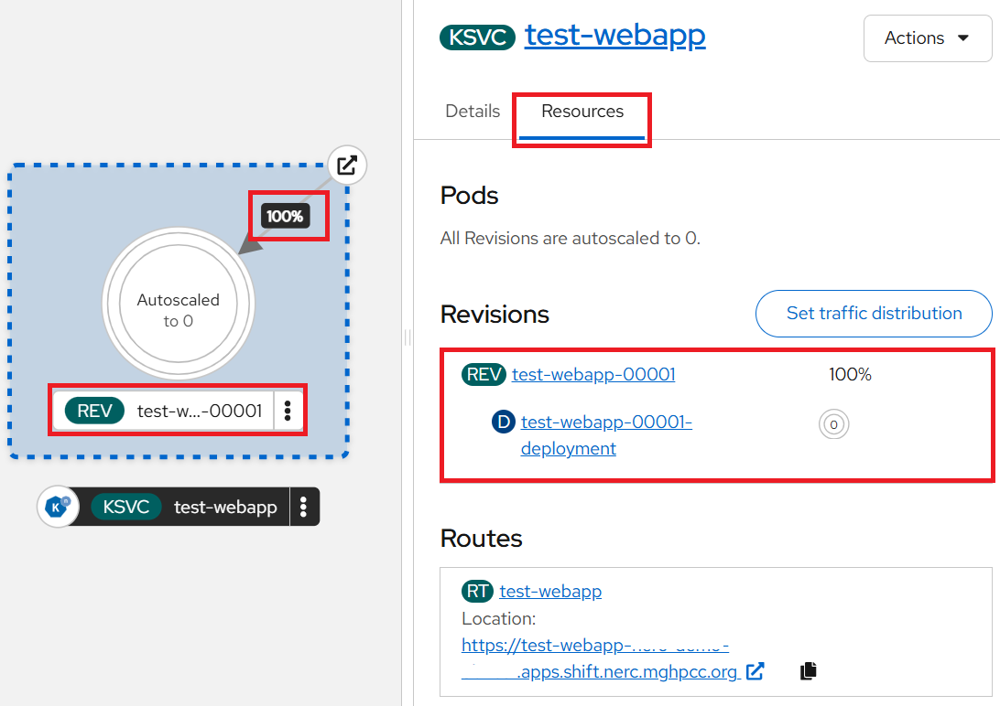
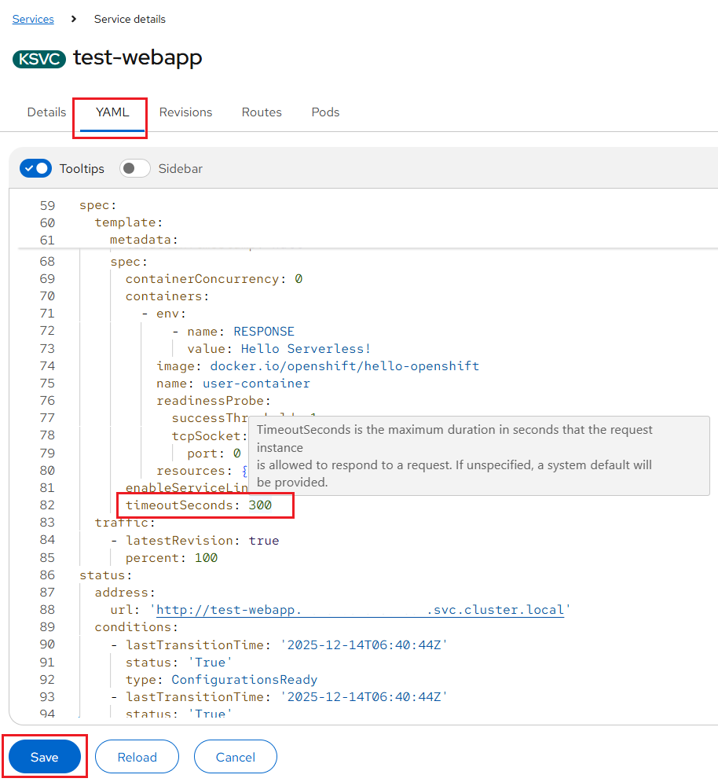
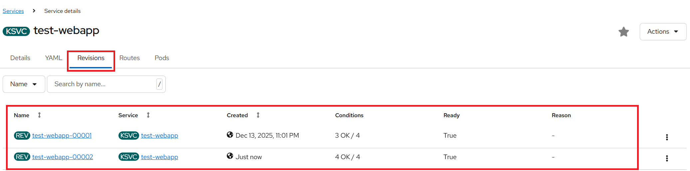

# Knative Serving User Guide: Deploying and Managing Serverless Workloads

Here, we walk through the process of deploying a **Knative Serving service**, see
its use of Configuration and Revision, and practice a **blue-green deployment**
and **canary release**.

In this tutorial, you will:

-   Deploy an OpenShift Serverless `service` utilizing the knative client (`kn`)
    or the OpenShift client (`oc`) CLI.

-   Deploy multiple `revisions` of a service.

-   Understand the `underlying components` of a serverless service.

-   Understand how Serverless is able to `scale-to-zero`.

-   Run different revisions of a service via `blue-green` deployments and `canary`
    release.

## **Prerequisites**

-   Setup the OpenShift CLI (`oc`) Tools locally and configure the OpenShift CLI
    to enable `oc` commands. Refer to [this user guide](../../openshift/logging-in/setup-the-openshift-cli.md).

-   The next step is to install the Knative CLI (`kn`) on the bootstrap machine
    used to access the NERC's OpenShift Container Platform (OCP) cluster. The Knative
    client `kn` allows you to create Knative resources from the command line or
    from within Shell scripts. Follow the [official documentation](https://docs.redhat.com/en/documentation/red_hat_openshift_serverless/1.37/html/installing_openshift_serverless/installing-kn)
    to download and install the Knative CLI.

    You can verify the Knative CLI installation by running the following command:

    ```sh
    kn version
    ```

    For more information regarding the [CLI commands](https://docs.redhat.com/en/documentation/red_hat_openshift_serverless/1.37/html/knative_cli/index)
    available for Knative Functions, Serving, and Eventing.

## Using Knative Serving

Knative Serving is ideal for running application services inside Kubernetes,
offering simplified deployment syntax with automated scale-to-zero and scale-out
based on *HTTP* load. The Knative platform manages your service's deployments, revisions,
networking, and scaling. Since Knative Serving can automatically scale down to
zero when not in use.

Knative Serving is a platform for streamlined application deployment, traffic-based
auto-scaling from zero to N, and traffic-split rollouts.

Other key features include:

- Simplified deployment of serverless containers

- Traffic-based auto-scaling, including scale-to-zero

- Routing and network programming

- Point-in-time application snapshots and their configuration

## Creating serverless applications

You can create a serverless application by using one of the following methods:

- Create a Knative Service from the OCP Web Console by navigating to the
  **Serverless** -> **Serving** menu.

- Create a Knative Service by using the Knative (`kn`) CLI.

- Create and apply a Knative Service object as a *YAML* file, by using the `oc`
  CLI.

### Deploying a Test InferenceService in Your Namespace for Istio Sidecar Validation

Create a "dummy" `InferenceService` for your namespace that needs just basic/standalone
knative serving features:

```yaml
apiVersion: serving.kserve.io/v1beta1
kind: InferenceService
metadata:
  annotations:
    security.opendatahub.io/enable-auth: 'true' # (1)!
    serving.knative.openshift.io/enablePassthrough: 'true' # (2)!
    serving.kserve.io/deploymentMode: Serverless # (3)!
    sidecar.istio.io/inject: 'true' # (4)!
    sidecar.istio.io/rewriteAppHTTPProbers: 'true' # (5)!
    serving.kserve.io/stop: 'true' # (6)!
  labels:
    opendatahub.io/dashboard: 'false'
  name: dummy-inference-service-for-knative-serving
spec:
  predictor:
    model:
      modelFormat:
        name: dummy # (7)!
      name: ""
```

1.  Ensures security/auth is enabled, typically via OpenShift/ODH integration.

2.  Crucial for TLS/HTTPS passthrough, often required when Istio is involved.

3.  Enforces the use of Knative Serving for scale-to-zero and autoscaling.

4.  Injects the Istio proxy sidecar into the resulting pod.

5.  Ensures health probes work correctly with the sidecar.

6.  A KServe instruction to pause or scale the service down immediately.

7.  Placeholder format, indicating this is likely a test/infrastructure resource.

!!! danger "Why Set Up a 'Dummy' InferenceService?"

    Deploy the provided *YAML* to create a **dummy KServe InferenceService** used
    to validate Knative Serving and Istio Service Mesh integration in an OpenShift
    Data Hub (ODH) environment. Without this, the Knative Service cannot create
    an external route.

    The issue you encountered (**Waiting for load balancer to be ready**) occurs
    when the namespace is not part of the *Service Mesh*. In this case, **Istio**
    cannot create the external routing rules required to expose the service.

    This dummy `InferenceService` uses a non-functional placeholder model but is
    configured to exercise Knative serverless behavior and Istio sidecar-based routing.

The "dummy" `InferenceService` can be deployed using the following `oc` command:

```sh
oc apply -f <filename>
```

### Deploy Knative Service in Your Namespace

**Procedure**:

**1. Deploy Knative Services:**

After successfully deploying the dummy `InferenceService` in your project namespace,
create a Knative `Service` with Istio sidecar injection enabled and configure it
to use an OpenShift pass-through route using the following example:

```yaml
apiVersion: serving.knative.dev/v1
kind: Service
metadata:
  name: <service_name> # (1)!
  namespace: <your-namespace> # (2)!
  annotations:
    serving.knative.openshift.io/enablePassthrough: 'true' # (3)!
spec:
  template:
    spec:
      containers:
      - image: <image_url>
```

1. Choose an appropriate name for the **Service**.

2. Your project's **namespace** where you want to run the serverless application.
    If this line is omitted, the namespace currently selected in the OpenShift Web
    Console will be used as the default.

3. **MANDATORY**: Instructs Knative Serving to generate an OpenShift Pass-through
    enabled route.

!!! danger "Very Important: Always Enable the OpenShift Pass-through Route"

    Please note that you **must** add the following annotation to the Service. This
    annotation is required to ensure proper routing and to prevent external access
    issues when using Knative with OpenShift and Istio. Only then will your Knative
    Service work correctly with the Service Mesh.

    ```yaml
    ...
    spec:
      template:
        metadata:
          ...
          annotations:
            serving.knative.openshift.io/enablePassthrough: 'true'
            ...  
    ...
    ```

**For example,** we are going to deploy a *Knative Serving service*, see its use
of Configuration and Revision.

=== "Using the Knative CLI"

    ```sh
    kn service create test-webapp \
      --annotation-service serving.knative.openshift.io/enablePassthrough=true \
      --env RESPONSE="Hello Serverless!" \
      --image docker.io/openshift/hello-openshift
    ```

=== "Using YAML"

    ```yaml
    apiVersion: serving.knative.dev/v1
    kind: Service
    metadata:
      name: test-webapp
      annotations:
        serving.knative.openshift.io/enablePassthrough: 'true'
    spec:
      template:
        spec:
          containers:
            - image: docker.io/openshift/hello-openshift
              env:
                - name: RESPONSE
                  value: "Hello Serverless!"
    ```

The OpenShift Web Console will display the Knative Service (`KSVC`) as shown below:


**2. Deploy a `curl` pod to test the connections:**

Run the following script on your local terminal:

```sh
cat <<EOF | oc apply -f -
apiVersion: apps/v1
kind: Deployment
metadata:
  name: curl
  labels:
    app: curl
spec:
  replicas: 1
  selector:
    matchLabels:
      app: curl
  template:
    metadata:
      labels:
        app: curl
      annotations:
        sidecar.istio.io/inject: 'true'
    spec:
      containers:
      - name: curl
        image: curlimages/curl
        command:
        - sleep
        - "3600"
EOF
```

**3. Verification:**

Applying the application service configuration from the previous step creates a
route, service, revision, and other resources managed by Knative Serving. You can
verify these components using the following command:

=== "Using the Knative CLI"

    **Service:**

    ```sh
    kn service list
    ```

    **Output:**

    ```sh
    NAME          URL                                                               LATEST              AGE     CONDITIONS   READY   REASON
    test-webapp   https://test-webapp-<your-namespace>.apps.shift.nerc.mghpcc.org   test-webapp-00001   3m16s   3 OK / 3     True
    ```

    **Revisions:**

    ```sh
    kn revision list
    ```

    **Output:**

    ```sh
    NAME                SERVICE       TRAFFIC   TAGS   GENERATION   AGE     CONDITIONS   READY   REASON
    test-webapp-00001   test-webapp   100%             1            3m17s   4 OK / 4     True
    ```

=== "Using YAML"

    **Service:**

    ```sh
    oc get serving
    ```

    **Output:**

    ```sh
    NAME                                    URL                                                               READY   REASON
    route.serving.knative.dev/test-webapp   https://test-webapp-<your-namespace>.apps.shift.nerc.mghpcc.org   True

    NAME                                            LATESTCREATED       LATESTREADY         READY   REASON
    configuration.serving.knative.dev/test-webapp   test-webapp-00001   test-webapp-00001   True

    NAME                                             CONFIG NAME   GENERATION   READY   REASON   ACTUAL REPLICAS   DESIRED REPLICAS
    revision.serving.knative.dev/test-webapp-00001   test-webapp   1            True             0                 0

    NAME                                      URL                                                               LATESTCREATED       LATESTREADY         READY   REASON
    service.serving.knative.dev/test-webapp   https://test-webapp-<your-namespace>.apps.shift.nerc.mghpcc.org   test-webapp-00001   test-webapp-00001   True
    ```

    **Revisions:**

    ```sh
    oc get rev \
      --selector=serving.knative.dev/service=test-webapp \
      --sort-by="{.metadata.creationTimestamp}"
    ```

**4. Invoke Service:**

```sh
EXTERNAL_URL=$(oc get ksvc test-webapp -o custom-columns=:.status.url --no-headers)
oc exec deployment/curl -it -- curl -ik $EXTERNAL_URL
```

**Output:**

```sh
HTTP/2 200
content-length: 17
content-type: text/plain; charset=utf-8
date: Sat, 13 Dec 2025 21:31:58 GMT
server: istio-envoy
x-envoy-upstream-service-time: 5627

Hello Serverless!
```

!!! tip "Controlling Knative Service Visibility (Internal vs External Access)"

    Use the following commands to control service visibility:

    ```sh
    kn service update test-webapp --cluster-local      # Make the service internal
    kn service update test-webapp --no-cluster-local   # Expose the service externally
    ```

    The `--cluster-local` flag makes the Knative Service accessible only within
    the cluster, preventing external access. The `--no-cluster-local` flag exposes
    the service externally, allowing it to be accessed through an external route.

**5. Cleanup:**

Delete the resources that were created after testing successful:

=== "Using the Knative CLI"

    ```sh
    kn service delete test-webapp
    ```

=== "Using YAML"

    ```sh
    oc delete deployment/curl
    oc delete ksvc/test-webapp
    ```

### Creating a service using offline mode

In offline mode, create a local Knative service descriptor file:

```sh
kn service create test-webapp-offline \
  --annotation-service serving.knative.openshift.io/enablePassthrough=true \
  --env RESPONSE="Hello Serverless!" \
  --image docker.io/openshift/hello-openshift \
  --target ./ \
  --namespace test
```

- The `--target ./` flag offline mode and specifies `./` as the directory for
  storing the new directory tree.

- The `--namespace test` option places the new service in the 'test' namespace.
  You can change it to the name of your desired namespace. If you do not use
  `--namespace`, and you are logged in to the OCP cluster, the descriptor file
  is created in the current namespace. Based on the *namespace* name a new directory
  will be created.

**Output:**

```sh
Service 'test-webapp-offline' created in namespace 'test'.
```

Examine the created directory structure:

```sh
tree ./
```

**Output:**

```sh
./
└── test
    └── ksvc
        └── test-webapp-offline.yaml

2 directories, 1 file
```

- The current `./` directory specified with `--target` contains the new `test/`
  directory that is named after the specified namespace.

- The `test/` directory contains the `ksvc` directory, named after the resource
type.

- The `ksvc` directory contains the descriptor file `test-webapp-offline.yaml`,
  named according to the specified service name i.e. `test-webapp-offline`.

Use the service descriptor file to create the service on the cluster:

```sh
kn service create -f test/ksvc/test-webapp-offline.yaml
```

## AutoScaling

You can review the autoscaler configuration by running the following command:

```sh
oc get configmap config-autoscaler -n knative-serving -o yaml
```

### Scale bounds

In the service definition above, note that no annotations are applied in the resource
spec. By default, OpenShift Serverless will scale these deployments *down to zero*
running pods and automatically scale them up as load increases. Resource limits
can be set through the Kubernetes resource definition.

In the Service resource definition, you do not need to define any compute infrastructure
or configure scaling behavior. You only specify the optional minimum and maximum
scale. The minimum scale can be set to zero, meaning no pods run until a request
arrives, at which point a pod is automatically created with minimal startup delay.
This enables compute resources to be used strictly on an **as-needed basis**.

For example, to specify a minimum of **1 pod** and a maximum of **3 pods**, add
the following syntax:

=== "Using the Knative CLI"

    ```sh
    kn service create <service_name> --image <image_uri> --scale-min 1 --scale-max 3
    ```

=== "Using YAML"

    ```yaml
    ...
    spec:
      template:
        metadata:
          ...
          annotations:
            autoscaling.Knative.dev/min-scale: "1"
            autoscaling.knative.dev/max-scale: "3"
            ...
    ...
    ```

When testing, add the annotations to set `min-scale` to `1`, so the pod **never**
shuts down. This lets you more easily access logs or open a terminal to examine
the state of your function container.

=== "Using the Knative CLI"

    ```sh
    kn service create test-webapp \
      --annotation-service serving.knative.openshift.io/enablePassthrough=true \
      --env RESPONSE="Hello Serverless!" \
      --image docker.io/openshift/hello-openshift \
      --scale-min 1 \
      --scale-max 3
    ```

=== "Using YAML"

    ```yaml
    apiVersion: serving.knative.dev/v1
    kind: Service
    metadata:
      name: test-webapp
      annotations:
        serving.knative.openshift.io/enablePassthrough: 'true'
    spec:
      template:
        metadata:
          annotations:
            autoscaling.Knative.dev/min-scale: "1"
            autoscaling.knative.dev/max-scale: "3"
        spec:
          containers:
            - image: docker.io/openshift/hello-openshift
              env:
                - name: RESPONSE
                  value: "Hello Serverless!"
    ```

### Concurrency

Concurrency defines how many simultaneous requests each application replica can
handle at a given time. It can be configured as either a soft limit or a hard limit:

-   **Soft limit**: A target number of concurrent requests that is not strictly
    enforced. During traffic spikes, this limit may be exceeded.

    You can set a **soft concurrency target** for your Knative Service by adding
    the `autoscaling.knative.dev/target` annotation to the spec, or by using the
    `kn service` command with the appropriate flags, as shown below where the
    concurrency target is set to **50 requests**.

    === "Using the Knative CLI"

        ```sh
        kn service create <service_name> --image <image_uri> --concurrency-target 50
        ```

    === "Using YAML"

        ```yaml
        ...
        spec:
          template:
            metadata:
              ...
              annotations:
                autoscaling.knative.dev/target: "50"
                ...
        ...
        ```

-   **Hard limit**: A strictly enforced maximum number of concurrent requests. Once
    the limit is reached, additional requests are queued until capacity becomes
    available.

    You can specify a hard concurrency limit for your Knative service by modifying
    the `containerConcurrency` spec, or by using the `kn service` command with the
    correct flags, as shown below where the concurrency limit is set to **50 requests**.

    === "Using the Knative CLI"

        ```sh
        kn service create <service_name> --image <image_uri> --concurrency-limit 50
        ```

    === "Using YAML"

        ```yaml
        ...
        spec:
          template:
            ...
            spec:
              containerConcurrency: 50
              ...
        ...
        ```

## Traffic splitting

In a Knative application, traffic can be managed using traffic splits. Traffic
splits are configured as part of a route, which is managed by a Knative Service.


Configuring a route allows requests to be distributed across different revisions
of a service, as defined by the traffic specification in the Knative Service object.

A traffic specification includes one or more revisions, each receiving a defined
percentage of traffic. The total traffic allocation must equal 100%, which is
validated by Knative. Revisions can reference a specific, named revision or the
**latest** revision, which automatically updates when new revisions are created.
Each revision can also be assigned a tag to generate an additional access URL.

The traffic specification can be modified by:

- Editing the Service *YAML* directly

- Using the Knative (`kn`) CLI with the `--traffic` flag

- Using the OpenShift web console

### Traffic splitting editing the Service *YAML* directly

When you create a Knative Service, it does not have any default traffic specification
settings.

**Traffic spec examples:**

The following example shows a traffic specification where 100% of traffic is routed
to the latest revision of the service. Under the `status` section, you can see
the name of the revision that `latestRevision` points to:

```yaml
apiVersion: serving.knative.dev/v1
kind: Service
metadata:
  name: example-service
  namespace: <your-namespace>
spec:
...
  traffic:
  - latestRevision: true
    percent: 100
status:
  ...
  traffic:
  - percent: 100
    revisionName: example-service
```

The following example shows a traffic specification where 100% of traffic is
routed to the revision tagged as `current`, with the revision name specified as
`example-service`. The revision tagged as `latest` remains available, even though
no traffic is directed to it:

```yaml
apiVersion: serving.knative.dev/v1
kind: Service
metadata:
  name: example-service
  namespace: <your-namespace>
spec:
...
  traffic:
  - tag: current
    revisionName: example-service
    percent: 100
  - tag: latest
    latestRevision: true
    percent: 0
```

The following example demonstrates how the traffic specification can be extended
to split traffic between multiple revisions. In this case, 50% of traffic is
routed to the revision tagged as `current` and 50% to the revision tagged as
`candidate`. The revision tagged as `latest` remains available, even though it
receives no traffic:

```yaml
apiVersion: serving.knative.dev/v1
kind: Service
metadata:
  name: example-service
  namespace: <your-namespace>
spec:
...
  traffic:
  - tag: current
    revisionName: example-service-1
    percent: 50
  - tag: candidate
    revisionName: example-service-2
    percent: 50
  - tag: latest
    latestRevision: true
    percent: 0
```

### Traffic splitting using the Knative CLI

**Procedure**:

Specify the revision of your service and what percentage of traffic you want to
route to it by using the `--traffic` tag with a standard `kn service update` command:

**Example command:**

```sh
kn service update <service_name> --traffic <revision>=<percentage>
```

**Where:**

- `<service_name>` is the name of the Knative Service for which you are configuring
  traffic routing.

- `<revision>` is the revision that will receive a portion of the traffic. This
  can be the revision name or a tag assigned using the `--tag` flag.

- `<percentage>` is the percentage of traffic routed to the specified revision.

**Optional:** The `--traffic` flag can be specified multiple times in a single
command. For example, if you have a revision tagged as `@latest` and another
revision named `stable`, you can define the traffic split between them as follows:

```sh
kn service update test-webapp --traffic @latest=20,stable=80
```

#### Splitting Traffic between Revisions

**Procedure**:

**1. Create and deploy an app as a Knative service:**

  ```sh
  kn service create test-webapp \
    --annotation-service serving.knative.openshift.io/enablePassthrough=true \
    --env RESPONSE="Hello Serverless!" \
    --image docker.io/openshift/hello-openshift
  ```

  ```sh
  kn revision list
  ```

  **Output:**

  ```sh
  NAME                SERVICE       TRAFFIC   TAGS   GENERATION   AGE   CONDITIONS   READY   REASON
  test-webapp-00001   test-webapp   100%             1            8s    4 OK / 4     True
  ```

**2. Create a new Revision:**

  ```sh
  kn service update test-webapp --scale-max 10 --annotation autoscaling.knative.dev/metric=rps --scale-target 1 --scale-window=10s
  ```

  ```sh
  kn revision list
  ```

  **Output:**

  ```sh
  NAME                SERVICE       TRAFFIC   TAGS   GENERATION   AGE    CONDITIONS   READY   REASON
  test-webapp-00002   test-webapp   100%             2            27s    3 OK / 4     True
  test-webapp-00001   test-webapp                    1            2m5s   3 OK / 4     True
  ```

**3. Set 100% traffic distribution to the second revision:**

  ```sh
  kn service update test-webapp --traffic test-webapp-00002=100
  ```

**4. Create a new Third Revision:**

  ```sh
  kn service update test-webapp --env RESPONSE="Hello NERC Serverless!" --revision-name=nerc-revision
  ```

  ```sh
  kn revision list
  ```

  **Output:**

  ```sh
  NAME                        SERVICE       TRAFFIC   TAGS   GENERATION   AGE     CONDITIONS   READY   REASON
  test-webapp-nerc-revision   test-webapp                    3            44s     3 OK / 4     True
  test-webapp-00002           test-webapp   100%             2            2m21s   3 OK / 4     True
  test-webapp-00001           test-webapp                    1            3m59s   3 OK / 4     True
  ```

**5. Tag the Third Revision:**

  ```sh
  kn service update test-webapp --tag @latest=nerc
  ```

  ```sh
  kn revision list
  ```

  **Output:**

  ```sh
  NAME                        SERVICE       TRAFFIC   TAGS   GENERATION   AGE     CONDITIONS   READY   REASON
  test-webapp-nerc-revision   test-webapp             nerc   3            108s    3 OK / 4     True
  test-webapp-00002           test-webapp   100%             2            3m25s   3 OK / 4     True
  test-webapp-00001           test-webapp                    1            5m3s    3 OK / 4     True
  ```

**6. Split Traffic Between the Second (80%) and the Third Tagged Revision (20%):**

  ```sh
  kn service update test-webapp --traffic nerc=20,test-webapp-00002=80
  ```

  ```sh
  kn revision list
  ```

  **Output:**

  ```sh
  NAME                        SERVICE       TRAFFIC   TAGS   GENERATION   AGE     CONDITIONS   READY   REASON
  test-webapp-nerc-revision   test-webapp   20%       nerc   3            3m25s   3 OK / 4     True
  test-webapp-00002           test-webapp   80%              2            5m2s    3 OK / 4     True
  test-webapp-00001           test-webapp                    1            6m40s   3 OK / 4     True
  ```

### Managing Traffic between revisions by using the OpenShift web console

To split traffic between multiple revisions of an application in the **Topology**
view:

1. Navigate to the **Serverless** -> **Serving** menu. Click the **Knative service**
    to see its overview in the side panel.

2. Click the **Resources** tab, to see a list of **Revisions** and **Routes** for
    the service.

    

3. Go to "Actions" -> "Edit Service":
    

    Then modify the service configuration in the *YAML* editor, and click **Save**.
    For example, change the `timeoutseconds` from `300` to `301`.  

    

    This change in the configuration triggers a new revision.

    In the **Topology** view, the latest revision is displayed and the **Resources**
    tab for the service now displays the two revisions as shown below:

    

4. Either, go to "Actions" -> "Set traffic distribution" Or, in the **Resources**
    tab, click **Set Traffic Distribution** button to see the traffic distribution
    dialog box:

    

    Add the split traffic percentage portion for the two revisions in the Splits
    field.

    Add **tags** to create custom URLs for the two revisions (**Optional**)

    Click **Save** to see two nodes representing the two revisions in the **Topology**
    view.

    

## Rerouting Traffic Using Blue/green and canary deployments

**Blue–green deployment** is a release strategy that maintains two identical
environments: one active (blue) and one idle (green) - allowing traffic to be
switched for seamless updates with minimal downtime and easy rollback.

Developers can then specify exactly what percentage of incoming network traffic
should be routed to the new **"canary"** version versus the existing "stable" version.
This granular control is essential for validating a new release with a small subset
of real user traffic before a full rollout.

**Procedure**:

1. Create and deploy an app as a Knative service:

    ```sh
    kn service create test-webapp \
    --annotation-service serving.knative.openshift.io/enablePassthrough=true \
    --env RESPONSE="Hello Serverless!" \
    --image docker.io/openshift/hello-openshift
    ```

2. Find the name of the first revision created when you deployed the service by
    running the following command:

    ```sh
    oc get ksvc test-webapp -o=jsonpath='{.status.latestCreatedRevisionName}'
    ```

    **Output:**

    ```sh
    test-webapp-00001
    ```

3. Add the following **YAML** to the service spec to send inbound traffic to the
    revision:

    ```yaml
    ...
    spec:
        traffic:
        - revisionName: <first_revision_name>
            percent: 100 # All traffic goes to this revision
    ...
    ```

4. Verify that you can view your app at the URL output you get from running the
    following command:

    ```sh
    oc get ksvc test-webapp
    ```

5. Deploy a second revision of your application by changing at least one field in
    the service's template spec and redeploying it. For example, you can update
    the service image or an environment variable. Redeploy the service by applying
    the updated **YAML** file or using the `kn service update` command:

    ```sh
    kn service update test-webapp --env RESPONSE="Hello NERC Serverless!" --revision-name=nerc-revision
    ```

6. Find the name of the second, latest revision that was created when you redeployed
    the service, by running the command:

    ```sh
    oc get ksvc test-webapp -o=jsonpath='{.status.latestCreatedRevisionName}'
    ```

    **Output:**

    ```sh
    test-webapp-nerc-revision
    ```

    At this point, both the **first** and **second** revisions of the service are
    deployed and running.

7. Update your existing service to create a new test endpoint for the second
    revision, while directing all other traffic to the first revision.

    **Example of updated service spec with test endpoint:**

    ```yaml
    ...
    spec:
        traffic:
        - revisionName: <first_revision_name>
            percent: 100  # All traffic is still routed to the first revision
        - revisionName: <second_revision_name>
            percent: 0    # No traffic is routed to the second revision
            tag: v2       # Named route for testing
    ...
    ```

    After redeploying the service by reapplying the YAML, the second revision is
    staged. No traffic is routed to this revision at the main URL, and Knative
    creates a new service named `v2` for testing the newly deployed revision.

8. Get the URL of the new service for the second revision, by running the
    following command:

    ```sh
    oc get ksvc test-webapp --output jsonpath="{.status.traffic[*].url}"
    ```

    You can use *this URL* i.e. `https://v2-test-webapp-<your-namespace>.apps.shift.nerc.mghpcc.org`
    to verify that the new version of the application is functioning correctly
    before routing any traffic to it.

9. Update your existing service to split traffic evenly, sending **50% of traffic**
    to the **first revision** and **50%** to the **second revision**.

    **Example of updated service spec splitting traffic 50/50 between revisions:**

    ```yaml
    ...
    spec:
        traffic:
        - revisionName: <first_revision_name>
            percent: 50
        - revisionName: <second_revision_name>
            percent: 50
            tag: v2
    ...
    ```

10. When ready to route all traffic to the new version, update the service to
    send **100% of traffic** to the second revision.

    **Example of updated service spec sending all traffic to the second revision:**

    ```yaml
    ...
    spec:
        traffic:
        - revisionName: <first_revision_name>
            percent: 0
        - revisionName: <second_revision_name>
            percent: 100
            tag: v2
    ```

    !!! note "Important Note"

        If you do not plan to roll back to the **first revision**, you can remove
        it instead of setting its traffic to 0%. Non-routable revisions are automatically
        garbage-collected.

11. Visit the **URL of the first revision** to confirm that no traffic is being
    routed to the old version of the application.

There are many other configurable options to manage the scaling of your workloads,
as outlined in the **[documentation](https://docs.redhat.com/en/documentation/red_hat_openshift_serverless/1.37/html/serving/autoscaling#serverless-autoscaling-developer-scale-bounds)**.

For more information, see the documentation on
**[Getting started with OpenShift Serverless using Knative Serving](https://docs.redhat.com/en/documentation/red_hat_openshift_serverless/1.37/html/serving/getting-started-with-knative-serving#serverless-applications)**.

---
