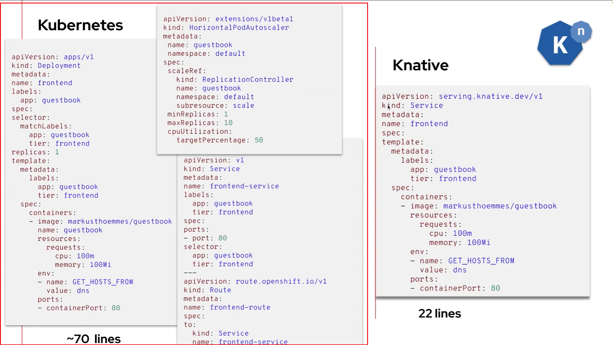
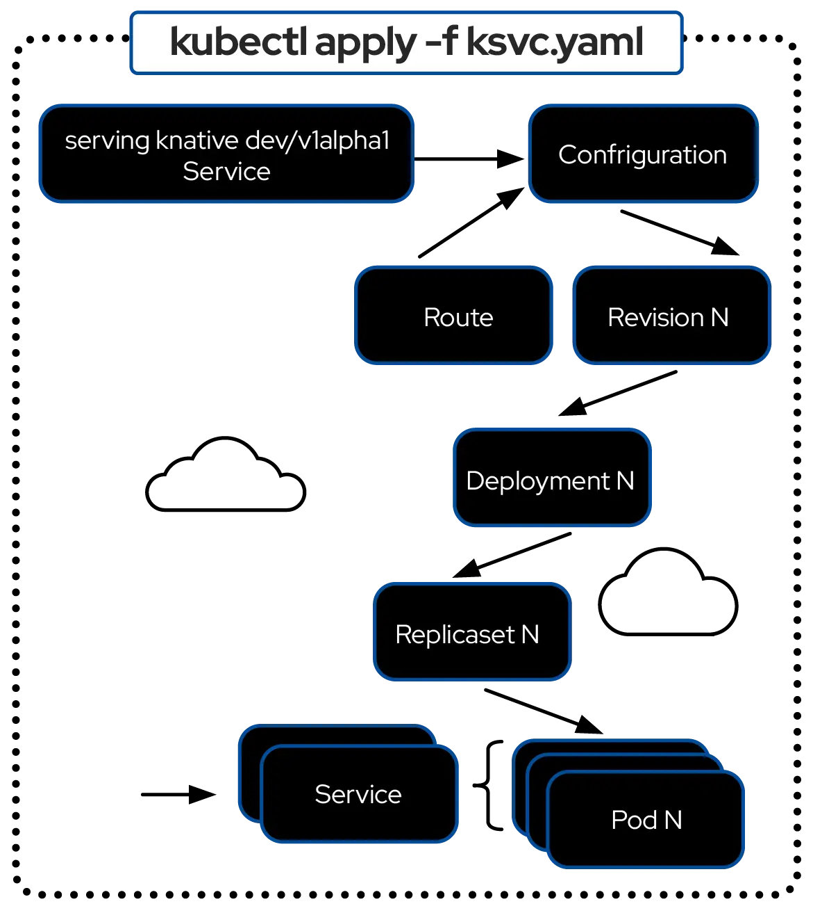
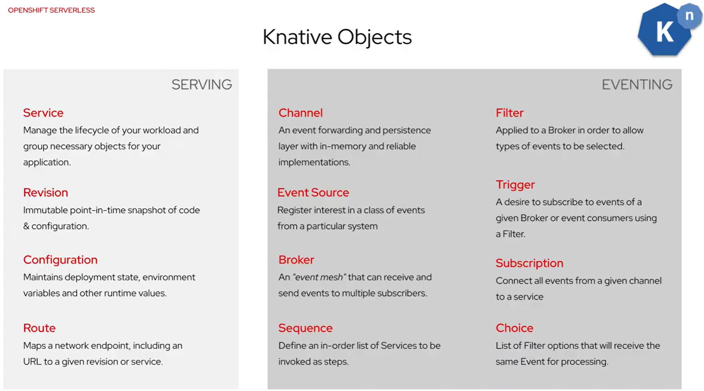

# Serverless Computing

[Serverless](https://developers.redhat.com/topics/serverless) is a
[cloud-native](https://www.redhat.com/en/topics/cloud-native-apps) development model
that enables developers to build and run applications without managing servers.
The term "serverless" does not mean that servers do not exist; rather, it means
that server management is abstracted away from application development. In simple
terms, serverless handles scaling, resource allocation, and other operational
tasks, allowing you to focus entirely on writing code.

## What is Serverless?

- A deployment model for containers and functions that allocates resources on demand.

- Enables developers to focus on delivering applications.

- Eliminates the need for server management tasks.

- Supports [event-driven architectures](https://developers.redhat.com/topics/event-driven).

## Containers vs Serverless

| Technology | Description |
|------------|-------------|
| **Containers** | Containers enable more efficient resource utilization than virtual machines because they do not include a full operating system per container. They have a smaller resource footprint, and container orchestration makes scaling up or down easier. |
| **Serverless** | Provides all the resource-utilization benefits of containers, but resources are released once the application function completes. A serverless model can scale up and down rapidly as needed. |

## Features of a Serverless Model

The following are key features of a serverless model:

| Feature | Description |
|---------|-------------|
| **Stateless Functions** | Serverless applications are ideally single-purpose and stateless. For example, a function may query a database and return the results without retaining state. |
| **Simplified Deployment** | Functions can be deployed using GitOps, a command-line interface (CLI), or Kubernetes manifests, without requiring changes to existing DevOps practices. |
| **Event-Driven** | A serverless model relies on triggers to execute code, such as API requests or events from a message queue. It processes demand alerts or user requests as they arrive, reducing idle resource costs. |
| **Scale to Zero** | Automatic scaling ensures that services run only when needed, making this model ideal for bursty traffic. The ability to scale to zero means code executes only in response to events - and resources are automatically released once execution completes. |
| **Improved Response Times** | Cold start optimizations ensure financial logic spins up quickly when a user interacts. |
| **Enhanced Resilience** | Stateless functions, autoscaling, and built-in failover mean fewer single points of failure - and more robust uptime. |

## Benefits of Serverless

Each evolution of a deployment model brings advantages over previous approaches,
most notably cost savings and more efficient use of CPU, memory, and storage resources.

| Category | Serverless |
|----------|------------|
| **Cost** | Code is executed only when needed, with no idle time. If no requests are received, there is no cost. You pay only for execution time. No more paying for idle pods - each component scales to zero when not needed. |
| **Infrastructure Management** | There are no servers to manage. Patching, security updates, and most monitoring responsibilities are handled by the platform. |
| **Scalability** | Because the underlying platform typically has ample resources, scaling is simpler. There is less need to plan or manage capacity in advance. |
| **High Availability** | High availability is handled by the platform. Code can be executed concurrently as many times as needed to meet demand. |

## Knative and OpenShift Serverless

[Red Hat OpenShift Serverless](https://www.redhat.com/en/technologies/cloud-computing/openshift/serverless)
is built on [Knative](https://knative.dev/docs/#what-is-knative), an open-source
project that provides a serverless platform for deploying and managing applications.

### Introduction to Knative

[Knative](https://knative.dev/) is an open-source project that enables the deployment
and management of modern serverless workloads on OpenShift/Kubernetes. Knative
bridges the gap between the power of Kubernetes and the simplicity of serverless,
event-driven computing. It adds a serverless application layer on top of OpenShift/Kubernetes,
allowing you to deploy any modern application workload - from monolithic applications
and microservices to small, single-purpose functions.

It has **three primary components**:

- [**Serving**](https://knative.dev/docs/serving/): Enables rapid deployment and
automatic scaling of containers through a request-driven model, serving workloads based on demand.

- [**Eventing**](https://knative.dev/docs/eventing/): Provides the infrastructure
to consume and produce events that trigger applications. Applications can be
triggered by internal event sources, cloud services, or Red Hat AMQ streams.

- [**Functions**](https://knative.dev/docs/functions/): Offers a flexible approach
to building source code into containers.

### What is OpenShift Serverless?

[Red Hat OpenShift Serverless](https://www.redhat.com/en/technologies/cloud-computing/openshift/serverless)
is an enterprise-grade serverless platform built on Knative, offering developers
a complete set of tools to build, deploy, and manage serverless applications on
OpenShift. OpenShift Serverless enables applications to scale up or down to zero
on demand. It allows developers to run Kubernetes-native, event-driven, stateless
workloads for microservices, containers, and Function-as-a-Service (FaaS)
implementations, while automatically handling infrastructure management and
resource scaling.

## OpenShift Serverless Architecture

The following illustration depicts the architecture of Red Hat OpenShift Serverless:

## Traditional Kubernetes vs Knative Deployments

**Traditional Kubernetes Deployment**:

In a traditional Kubernetes deployment, a container image is hosted in a registry,
and a **YAML** file defines the deployment. When applied to the cluster, the
deployment creates a ReplicaSet, which then launches the specified number of pods.
A service is also created to match the labels of these pods.

Additional steps may be required depending on the scenario, such as creating routes
if the service cannot access a cloud load balancer. Overall, a traditional Kubernetes
deployment involves multiple steps, lengthy *YAML* files, and several moving components.

**Knative Deployment**:

With serverless, infrastructure management is handled for you. You simply provide
a container image and run it on the cluster - everything else is automatically managed.

In Knative, deployment is even simpler: you define a small resource file called
a **[Knative Service](#knative-serving)**, which specifies the container image to
run. When applied to the cluster, the Knative Operator automatically creates all
necessary resources, including the deployment, service, route (if needed), and a
configuration resource. The configuration resource also manages revisions, making
it easy to roll back to previous versions when required.

## Examples of OpenShift Serverless Workloads

OpenShift Serverless workloads typically follow this workflow:

- A request is received.

- A pod is created to handle the request.

- The pod processes the request.

- The pod is terminated.

## Components & APIs

The following illustration shows the CRDs set up by OpenShift Serverless to enable
Knative serverless application components:

The main components of the OpenShift Serverless architecture are:

**Knative Serving**: Enables developers to create cloud-native applications using
a serverless architecture. It provides Custom Resource Definitions (CRDs) that
developers can use to deploy serverless containers, manage pod scaling, and more.

Knative Serving is responsible for:

- Deploying applications

- Updating applications

- Routing traffic to applications

- Auto-scaling applications

Knative Serving provides autoscaling, route management, and container lifecycle
management for *HTTP* based workloads. Built on Kubernetes, it allows deploying
and serving applications and functions as serverless containers, simplifying
deployment, dynamically scaling with traffic, and supporting traffic-split rollouts.

**[Watch a video about Knative Serving](https://www.youtube.com/watch?v=oKIHoDzw1RI)**

**Knative Eventing**: Provides the infrastructure for building and deploying
event-driven applications. It allows developers to define event sources and sinks
and offers mechanisms to route events to functions, applications, or other event
sinks.

Knative Eventing is an event-driven platform that uses CloudEvents with a simple
*HTTP* interface. It enables late-binding of event sources and consumers, allowing
services to be loosely coupled, independently deployed, and connected without 
modifying producers or consumers.  

**Event Mesh:** Supports responsive, scalable, and resilient architectures by
decoupling components and enabling asynchronous communication.

**[Watch a video about Knative Eventing](https://www.youtube.com/watch?v=fztahFNPpcI)**

### Knative Functions

Knative Functions lets developers focus on business logic by writing small,
executable **serverless functions** deployed as Knative Services. These functions
use Knative Serving and Eventing to provide efficient, scalable, and fast development
for stateless, event-driven workloads on OpenShift.

**[Watch a video about Knative Functions](https://www.youtube.com/watch?v=lNeieapAhnc)**

### Serverless Workflows

Simplify complex workflows with **Serverless Logic**, built on the Serverless
Workflow foundation. Define and run event-driven applications, automate tasks,
integrate services, and scale workflows without managing infrastructure.

**[Watch a video about OpenShift Serverless Logic](https://www.youtube.com/watch?v=ZmAkYj0HuUE&t=275s)**

OpenShift Serverless applications can be integrated with other OpenShift services,
such as OpenShift [Pipelines](https://www.openshift.com/learn/topics/pipelines),
and [Service Mesh](https://www.openshift.com/learn/topics/service-mesh), delivering
a complete serverless application development and deployment experience.

For more information, see the documentation on **[Red Hat OpenShift Serverless](https://www.redhat.com/en/technologies/cloud-computing/openshift/serverless)**.

---
