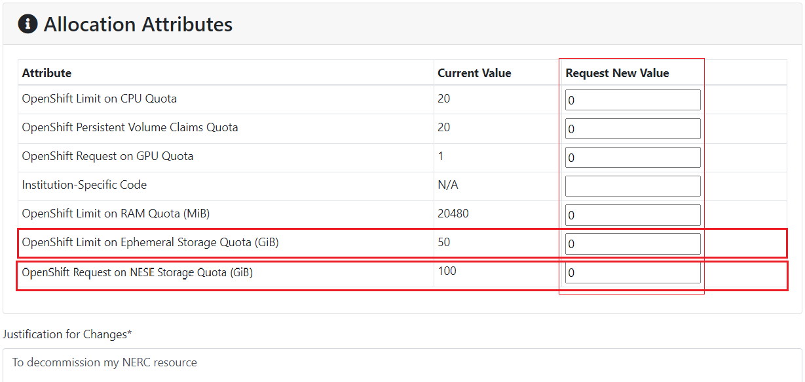
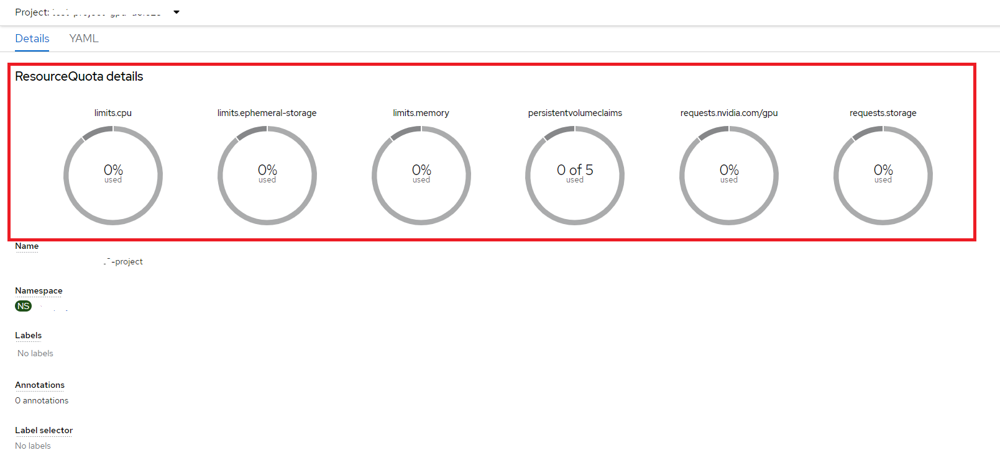
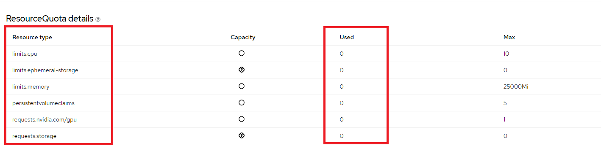

# Decommission OpenShift Resources

You can decommission all of your NERC OpenShift resources sequentially as outlined
below.

## Prerequisite

-   **Backup**: Back up any critical data or configurations stored on the resources
    that going to be decommissioned. This ensures that important information is not
    lost during the process.

-   **Kubernetes Objects (Resources)**: Please review all OpenShift Kubernetes Objects
    (Resources) to ensure they are not actively used and ready to be decommissioned.

-   Install and configure the **OpenShift CLI (oc)**, see [How to Setup the
    OpenShift CLI Tools](../logging-in/setup-the-openshift-cli.md)
    for more information.

## Delete all resources from the NERC OpenShift and OpenShift AI

Run `oc login` in your local machine's terminal using your own token to authenticate
and access all your projects on the NERC OpenShift as
[described here](../logging-in/setup-the-openshift-cli.md#first-time-usage).
Please ensure you have already selected the correct project that needs to be
decommissioned, as shown below:

    oc login --token=<your_token> --server=https://api.shift.nerc.mghpcc.org:6443
    Logged into "https://api.shift.nerc.mghpcc.org:6443" as "test1_user@fas.harvard.edu" using the token provided.

    You have access to the following projects and can switch between them with 'oc project <projectname>':

        test-project-1
    * test-project-2
        test-project-3

    Using project "test-project-2".

Switching to your project that need to be decommissioned by running
`oc project <projectname>` command:

    oc project <your_openshift_project_to_decommission>
    Using project "<your_openshift_project_to_decommission>" on server "https://api.shift.nerc.mghpcc.org:6443".

Please confirm the correct project is being selected by running `oc project`, as
shown below:

    oc project
    Using project "<your_openshift_project_to_decommission>" on server "https://api.shift.nerc.mghpcc.org:6443".

!!! tip "Important Note: Best Practice for Specifying Namespace in `oc` Commands."

    The best practice is to specify the namespace in each `oc` command using the
    `-n` option, e.g., `-n <your_openshift_project_to_decommission>`. This ensures
    that your commands are always executed in the intended project, minimizing
    the risk of affecting the wrong resources.

    For example, the `oc get all` command can also be executed by specifying the
    namespace using the `-n` option, like this: `oc get all -n <your_openshift_project_to_decommission>`.

Please review all resources currently being used by your project by running
`oc get all`, as shown below:

    oc get all

    NAME                                                                  READY   STATUS             RESTARTS       AGE
    pod/ds-pipeline-persistenceagent-pipelines-definition-868665f7z9lpm   1/1     Running            0              141m
    ...

    NAME                                       TYPE        CLUSTER-IP       EXTERNAL-IP   PORT(S)                               AGE
    service/ds-pipeline-pipelines-definition   ClusterIP   172.30.133.168   <none>        8443/TCP,8888/TCP,8887/TCP            141m
    ...

    NAME                                                                 READY   UP-TO-DATE   AVAILABLE   AGE
    deployment.apps/ds-pipeline-persistenceagent-pipelines-definition    1/1     1            1           141m
    ...

    NAME                                                                            DESIRED   CURRENT   READY   AGE
    replicaset.apps/ds-pipeline-persistenceagent-pipelines-definition-868665f748    1         1         1       141m
    ...

    NAME                                                 IMAGE REPOSITORY
                                                    TAGS   UPDATED
    imagestream.image.openshift.io/simple-node-app-git   image-registry.openshift-image-registry.svc:5000/test-project-gpu-dc1e23/simple-node-app-git

    NAME                                                        HOST/PORT
                                                    PATH   SERVICES                           PORT            TERMINATION          WILDCARD
    route.route.openshift.io/ds-pipeline-pipelines-definition   ds-pipeline-pipelines-definition-test-project-gpu-dc1e23.apps.shift.nerc.mghpcc.org          ds-pipeline-pipelines-definition   oauth           reencrypt/Redirect   None
    ...

!!! tip "To list all Resources with their Names only."

    To list all resources with their names only, you can run this command:
    `oc get all -oname`.

    Here, `-oname` flag specifies the output format. In this case, it instructs
    the command to output only the names of the resources.

Run the `oc delete` command to delete all resource objects specified as
parameters after `--all` within your selected project (namespace).

!!! danger "Danger"

    The `oc delete` operation will cause all resources specfied will be deleted.
    This command can be very powerful and should be used with caution as it will
    delete all resources in the specified project.

    Always ensure that you are targeting the correct project (namespace) when using
    this command to avoid unintentional deletion of resources. If you're unsure
    which namespace you're currently in, run the oc project command to display
    the current project. To be safe, you can also specify the namespace in all
    `oc` commands by using the `-n` option, e.g., `-n <your_openshift_project_to_decommission>`.

    Make sure to backup any important data or configurations before executing this
    command to prevent accidental data loss.

```sh
oc delete pod,deployment,deploymentconfig,pvc,route,service,build,buildconfig,
statefulset,replicaset,replicationcontroller,job,cronjob,imagestream,revision,
configuration,notebook --all
```

!!! tip "How to Delete All Allocations on a Project at Once"

    If you have multiple allocations within a ColdFront project and want to delete
    all allocations associated with that project, you can run the following script.

    ```sh
    # pattern used for the "Allocated Project Name" attribute for the Allocation
    # that is based on the ColdFront Project Title
    pattern="^<your_openshift_project_to_decommission>"
    for proj in $(oc get projects -o jsonpath='{range .items[*]}{.metadata.name}{"\n"}{end}' | grep "$pattern"); do
        echo "deleting resources"
        oc -n "$proj" delete pod,deployment,deploymentconfig,pvc,route,service,build,buildconfig,statefulset,replicaset,replicationcontroller,job,cronjob,imagestream,revision,configuration,notebook --all --ignore-not-found --wait=true || true
    done
    ```

Please check all the resources currently being used by your project by running
`oc get all`, as shown below:

    oc get all
    NAME                        TYPE        CLUSTER-IP   EXTERNAL-IP   PORT(S)                               AGE
    service/modelmesh-serving   ClusterIP   None         <none>        8033/TCP,8008/TCP,8443/TCP,2112/TCP   7m4s

!!! warning "Important Note"

    The last remaining service, i.e., `service/modelmesh-serving`, shown when running
    the `oc get all` command, is a **REQUIRED** resource, and so you don't need
    to clean it up.

## Optional: Remove User(s) from your ColdFront Project

Removing users from your ColdFront project via the [NERC's ColdFront interface](https://coldfront.mss.mghpcc.org/)
is straightforward. Simply click the "Remove Users" button for the corresponding
project. This will display the following interface:


PI or project managers can select the user(s) and then click on the "Remove Selected
Users From Project" button.

!!! note "Very Important"

    If you remove a user (or users) from a project, they will automatically be
    removed from all allocations they were previously assigned to within that project.

## Use ColdFront to reduce the Storage Quota to Zero

Each allocation, whether requested or approved, will be billed based on the
**pay-as-you-go** model. The exception is for **Storage quotas**, where the cost
is determined by [your requested and approved allocation values](../../get-started/allocation/allocation-details.md#pi-and-manager-allocation-view-of-openshift-resource-allocation)
to reserve storage from the total NESE storage pool. For **NERC-OCP (OpenShift)**
Resource Allocations, storage quotas are specified by the "OpenShift Request
on NESE Storage Quota (GiB)" and "OpenShift Limit on Ephemeral Storage Quota (GiB)"
allocation attributes.

Even if you have deleted all Persistent Volume Claims (PVC) in your OpenShift project.
It is very essential to adjust the approved values for your NERC-OCP (OpenShift)
resource allocations to zero (0) otherwise you will still be incurring a charge
for the approved storage as explained in [Billing FAQs](../../get-started/cost-billing/billing-faqs.md).

To achieve this, you must submit a final change request to reduce the
**Storage Quotas** for "OpenShift Request on NESE Storage Quota (GiB)" and "OpenShift
Limit on Ephemeral Storage Quota (GiB)" to zero (0) for your **NERC-OCP (OpenShift)**
resource type. You can review and manage these resource allocations by visiting
the [resource allocations](https://coldfront.mss.mghpcc.org/allocation/). Here,
you can filter the allocation of your interest and then proceed to request a
[change request](../../get-started/allocation/allocation-change-request.md#request-change-resource-allocation-attributes-for-openshift-project).

!!! danger "Very Important Note"

    Although other allocated resources i.e. CPU, RAM, GPU, etc. operate on a
    **pay-as-you-go** model, wherein charges are incurred solely based on usage,
    **Active (Needs Renewal)** allocations after "End Date" will remain accessible
    to the users assigned under the allocation. It is advisable to set all other
    allocation quota attributes to zero (0) during the change request. **This
    measure ensures that existing users will not accidentally use the resources
    from the project.**

    Alternatively, PIs can control access to the allocation by [removing users](../../get-started/allocation/manage-users-to-a-project.md#addremove-users-tofrom-a-project)
    assigned to their NERC-OCP (OpenShift) allocation. This ensures that even if
    the allocation ends, users will not have access to the unused resources.

Please make sure your change request looks like this:



Wait until the requested resource allocation gets approved by the NERC's admin.

After approval, kindly review and verify that the quotas are accurately
reflected in your [resource allocation](https://coldfront.mss.mghpcc.org/allocation/)
and [OpenShift project](https://console.apps.shift.nerc.mghpcc.org). Please ensure
that the approved quota values are accurately displayed as [explained here](#review-your-projects-resource-quota-from-the-openshift-web-console).

### Review your Project Usage

Run the `oc describe quota` command to obtain detailed information about the resource
quotas for all Resources defined within your selected project (namespace). Please
note the name of the resource quota in the output of this command, i.e., `<your_openshift_project_resource_quota_name>`.

    oc get quota

    NAME                              AGE   REQUEST                                                                               LIMIT
    <your_openshift_project_resource_quota_name>   105s   persistentvolumeclaims: 0/0, requests.nvidia.com/gpu: 0/0, requests.storage: 0/0   limits.cpu: 0/0, limits.ephemeral-storage: 0/0, limits.memory: 0/0

!!! danger "Very Important: Ensure No Resources that will be Billed are Used"

    Most importantly, ensure that there is no active usage for any of your
    currently allocated project resources.

To review the resource quota usage for your project, you can run
`oc describe quota <your_openshift_project_resource_quota_name>`.

Please ensure the output appears as follows, with all **Used** and **Hard** resources
having a value of zero (0) as shown below:

    oc describe quota <your_openshift_project_resource_quota_name>

    Name:                     <your_openshift_project_resource_quota_name>
    Namespace:                <your_openshift_project_to_decommission>
    Resource                  Used  Hard
    --------                  ----  ----
    limits.cpu                0     0
    limits.ephemeral-storage  0     0
    limits.memory             0     0
    persistentvolumeclaims    0     0
    requests.nvidia.com/gpu   0     0
    requests.storage          0     0

!!! warning "Important Information"

    Make sure to replace `<your_openshift_project_resource_quota_name>` with the
    actual name you find in the output, which is typically in this format: `<your_openshift_project_to_decommission>-project`.

## Review your Project's Resource Quota from the OpenShift Web Console

After removing all OpenShift resources and updating all resource quotas to set
them to zero (0), you can review and verify that these changes are reflected in
your OpenShift Web Console as well.

When you are logged-in to the NERC's OpenShift Web Console, you can also view the
resource quota for your project in the web console by navigating to
_Administration -> ResourceQuotas_.

Click on your appropriate project name, i.e., `<your_openshift_project_to_decommission>`,
to view the Resource Quota details.



!!! tip "Very Important Note"

    It should also indicate that all resources have **NO** usage, i.e., zero (0),
    and also NO maximum set, i.e., zero (0), as shown below:

    

## Finally, Archive your ColdFront Project

As a **PI**, you will now be able to **Archive** your ColdFront Project via
accessing [NERC's ColdFront interface](https://coldfront.mss.mghpcc.org/).
Please refer to [these intructions](../../get-started/allocation/archiving-a-project.md)
on how to archive your projects that need to be decommissioned.

---
