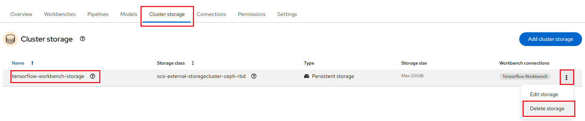
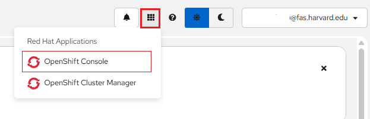

# Decommission OpenShift Resources

You can decommission all of your NERC OpenShift resources sequentially as outlined
below.

## Prerequisite

- **Backup**: Back up any critical data or configurations stored on the resources
that going to be decommissioned. This ensures that important information is not
lost during the process.

- **Kubernetes Objects (Resources)**: Please review all OpenShift Kubernetes Objects
(Resources) to ensure they are not actively used and ready to be decommissioned.

- Install and configure the **OpenShift CLI (oc)**, see [How to Setup the
OpenShift CLI Tools](../logging-in/setup-the-openshift-cli.md)
for more information.

## Delete all Data Science Project resources from the NERC's Red Hat OpenShift AI

Navigate to the NERC's Red Hat OpenShift AI (RHOAI) dashboard from [the NERC's
OpenShift Web Console](https://console.apps.shift.nerc.mghpcc.org)
via the web browser as [described here](../../openshift-ai/logging-in/access-the-rhoai-dashboard.md).

Once you gain access to the NERC's RHOAI dashboard, you can click on specific Data
Science Project (DSP) corresponding to the appropriate allocation of resources you
want to clean up, as [described here](../../openshift-ai/data-science-project/using-projects-the-rhoai.md#selecting-your-data-science-project).

The NERC RHOAI dashboard will look like the one shown below, displaying all consumed
resources:

### Delete all Workbenches

Delete all workbenches by clicking on the three dots on the right side of the
individual workbench and selecting **Delete workbench**, as shown below:

When prompted please confirm your workbench name and then click "Delete workbench"
button as shown below:

### Delete all Cluster Storage

Delete all cluster storage by clicking on the three dots on the right side of the
individual cluster storage and selecting **Delete storage**, as shown below:

When prompted please confirm your cluster storage name and then click "Delete storage"
button as shown below:

### Delete all Data connections

Delete all data connections by clicking on the three dots on the right side of the
individual data connection and selecting **Delete data connection**, as shown below:

When prompted please confirm your data connection name and then click "Delete data
connection" button as shown below:

### Delete all Pipelines

Delete all pipelines by clicking on the three dots on the right side of the
individual pipeline and selecting **Delete pipeline**, as shown below:

When prompted please confirm your pipeline name and then click "Delete pipeline"
button as shown below:

### Delete all Models and Model Servers

Delete all model servers by clicking on the three dots on the right side of the
individual pipeline and selecting **Delete model server**, as shown below:

When prompted please confirm your model server name and then click "Delete model
server" button as shown below:

!!! note "Important Note"
    Deleting Model Server will automatically delete **ALL** Models deployed on the
    model server.

Finally, the NERC RHOAI dashboard will look clean and empty without any resources,
as shown below:

Now, you can return to **"OpenShift Web Console"** by using the application launcher
icon (the black-and-white icon that looks like a grid), and choosing the "OpenShift
Console" as shown below:

## Delete all resources from the NERC OpenShift

Run `oc login` in your local machine's terminal using your own token to authenticate
and access all your projects on the NERC OpenShift as
[described here](../logging-in/setup-the-openshift-cli.md#first-time-usage).
Please ensure you have already selected the correct project that needs to be
decommissioned, as shown below:

    oc login --token=<your_token> --server=https://api.shift.nerc.mghpcc.org:6443
    Logged into "https://api.shift.nerc.mghpcc.org:6443" as "test1_user@fas.harvard.edu" using the token provided.

    You have access to the following projects and can switch between them with 'oc project <projectname>':

        test-project-1
    * test-project-2
        test-project-3

    Using project "test-project-2".

Switching to your project that need to be decommissioned by running
`oc project <projectname>` command:

    oc project <your_openshift_project_to_decommission>
    Using project "<your_openshift_project_to_decommission>" on server "https://api.shift.nerc.mghpcc.org:6443".

Please confirm the correct project is being selected by running `oc project`, as
shown below:

    oc project
    Using project "<your_openshift_project_to_decommission>" on server "https://api.shift.nerc.mghpcc.org:6443".

Please review all resources currently being used by your project by running
`oc get all`, the output looks like shown below:

    oc get all

    NAME                                                                  READY   STATUS             RESTARTS       AGE
    pod/ds-pipeline-persistenceagent-pipelines-definition-868665f7z9lpm   1/1     Running            0              141m
    ...

    NAME                                       TYPE        CLUSTER-IP       EXTERNAL-IP   PORT(S)                               AGE
    service/ds-pipeline-pipelines-definition   ClusterIP   172.30.133.168   <none>        8443/TCP,8888/TCP,8887/TCP            141m
    ...

    NAME                                                                 READY   UP-TO-DATE   AVAILABLE   AGE
    deployment.apps/ds-pipeline-persistenceagent-pipelines-definition    1/1     1            1           141m
    ...

    NAME                                                                            DESIRED   CURRENT   READY   AGE
    replicaset.apps/ds-pipeline-persistenceagent-pipelines-definition-868665f748    1         1         1       141m
    ...

    NAME                                                 IMAGE REPOSITORY
                                                    TAGS   UPDATED
    imagestream.image.openshift.io/simple-node-app-git   image-registry.openshift-image-registry.svc:5000/test-project-gpu-dc1e23/simple-node-app-git

    NAME                                                        HOST/PORT
                                                    PATH   SERVICES                           PORT            TERMINATION          WILDCARD
    route.route.openshift.io/ds-pipeline-pipelines-definition   ds-pipeline-pipelines-definition-test-project-gpu-dc1e23.apps.shift.nerc.mghpcc.org          ds-pipeline-pipelines-definition   oauth           reencrypt/Redirect   None
    ...

Run the `oc delete` command to delete all resource objects specified as
parameters after `--all` within your selected project (namespace).

    oc delete --all pod,deployment,pvc,route,service,builds,buildconfigs,statefulsets,replicasets,cronjobs,imagestream --force --grace-period=0

!!! danger "Danger"
    The `oc delete` operation will cause all resources specfied will be deleted.
    This command can be very powerful and should be used with caution as it will
    delete all resources in the specified project.

    Always ensure that you are targeting the correct project (namespace) when using
    this command to avoid unintentional deletion of resources.

    Make sure to backup any important data or configurations before executing this
    command to prevent accidental data loss.

Please check that all resources currently being used by your project by running
`oc get all`, as shown below:

    oc get all
    NAME                        TYPE        CLUSTER-IP   EXTERNAL-IP   PORT(S)                               AGE
    service/modelmesh-serving   ClusterIP   None         <none>        8033/TCP,8008/TCP,8443/TCP,2112/TCP   7m4s

!!! note "Important Note"
    The last remaining service, i.e., `service/modelmesh-serving`, shown when running
    the `oc get all` command, is a **REQUIRED** resource, and so you don't need
    to clean it up.

## Use ColdFront to reduce the Storage Quota to Zero

Each allocation, whether requested or approved, will be billed based on the
**pay-as-you-go** model. The exception is for **Storage quotas**, where the cost
is determined by [your requested and approved allocation values](../../get-started/allocation/allocation-details.md#pi-and-manager-allocation-view-of-openshift-resource-allocation)
to reserve storage from the total NESE storage pool. For **NERC-OCP (OpenShift)**
Resource Allocations, storage quotas are specified by the "OpenShift Request
on Storage Quota (GB)" and "OpenShift Limit on Ephemeral Storage Quota (GB)"
allocation attributes.

Even if you have deleted all Persistent Volume Claims (PVC) in your OpenShift project.
It is very essential to adjust the approved values for your NERC-OCP (OpenShift)
resource allocations to zero (0) otherwise you still be incurring a charge for
the approved storage as explained in [Billing FAQs](../../get-started/cost-billing/billing-faqs.md).

To achieve this, you must submit a final change request to reduce the
**Storage Quotas** for "OpenShift Request on Storage Quota (GB)" and "OpenShift
Limit on Ephemeral Storage Quota (GB)" to zero (0) for your **NERC-OCP (OpenShift)**
resource type. You can review and manage these resource allocations by visiting
the [resource allocations](https://coldfront.mss.mghpcc.org/allocation/). Here,
you can filter the allocation of your interest and then proceed to request a
[change request](../../get-started/allocation/allocation-change-request.md#request-change-resource-allocation-attributes-for-openshift-project).

Please make sure your change request looks like this:

Wait until the requested resource allocation gets approved by the NERC's admin.

After approval, kindly review and verify that the quotas are accurately
reflected in your [resource allocation](https://coldfront.mss.mghpcc.org/allocation/)
and [OpenShift project](https://console.apps.shift.nerc.mghpcc.org). Please ensure
that the approved quota values are accurately displayed as [explained here](#review-your-projects-resource-quota-from-openshift-web-dashboard).

### Review your Project Usage

Run the `oc describe quota` command to obtain detailed information about the resource
quotas for all Resources defined within your selected project (namespace). Please
note the name of the resource quota in the output of this command, i.e., `<your_openshift_project_resource_quota_name>`.

    oc get quota

    NAME                              AGE   REQUEST                                                                               LIMIT
    <your_openshift_project_resource_quota_name>   105s   persistentvolumeclaims: 0/5, requests.nvidia.com/gpu: 0/1, requests.storage: 0/0   limits.cpu: 0/10, limits.ephemeral-storage: 0/0, limits.memory: 0/25000Mi

!!! danger "Very Important: Ensure No Resources that will be Billed are Used"
    Most importantly, ensure that there is no active usage for any of your
    currently allocated project resources.

To review the resource quota usage for your project, you can run
`oc describe quota <your_openshift_project_resource_quota_name>`.

Please ensure the output appears as follows, with all used resources having a value
of zero (0).

    oc describe quota <your_openshift_project_resource_quota_name>
    Name:                     <your_openshift_project_resource_quota_name>
    Namespace:                <your_openshift_project_to_decommission>
    Resource                  Used  Hard
    --------                  ----  ----
    limits.cpu                0     10
    limits.ephemeral-storage  0     0
    limits.memory             0     25000Mi
    persistentvolumeclaims    0     5
    requests.nvidia.com/gpu   0     1
    requests.storage          0     0

!!! warning "Important Information"
    Make sure to replace `<your_openshift_project_resource_quota_name>` with the
    actual name you find in the output, which is typically in this format: `<your_openshift_project_to_decommission>-project`.

## Review your Project's Resource Quota from the OpenShift Web Console

After removing all OpenShift resources and updating the Storage Quotas to set them
to zero (0), you can review and verify that these changes are reflected in your
OpenShift Web Console.

When you logged-in to the NERC's OpenShift Web Console, you will be redirected to
the **Developer** perspective which is shown selected on the perspective switcher
located at the Left side. You need to switch to the **Administrator** perspective
to view your Project's Resource Quota as shown below:

On the left sidebar, navigate to *Administration -> ResourceQuotas*.

Click on your appropriate project name, i.e., `<your_openshift_project_to_decommission>`,
to view the Resource Quota details.

!!! tip "Very Important Note"
    It should also show that all resources have **NO** usage, i.e., zero (0), as
    shown below:

    

## Finally, Archive your ColdFront Project

As a **PI**, you will be now able to **Archive** your ColdFront Project via
accessing [NERC's ColdFront interface](https://coldfront.mss.mghpcc.org/).
Please refer to [these intructions](../../get-started/allocation/archiving-a-project.md)
on how to archive your project that needs to be decommissioned.

---
